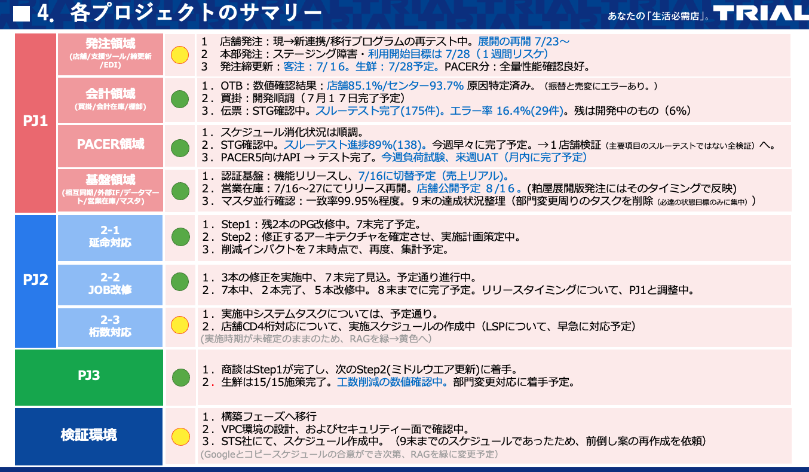

# 劉 兆慶 TOP 报告 — 2026-W29

- 组织：T.R.E.-China
- 周次：2026-W29
- 员工编号：10004397
- 提交时间：2026-07-17 09:19:41.676609
- 职位：副総経理
- 所属：T.R.E.-China グループ事業群 副総経理

---

お疲れ様です。

先週と同じく、Shiniseの状況から報告させてもらいます。

今週は、発注領域がグリーンからイエロー、会計領域がイエローからグリーンへ変更されました。

発注領域は、粕屋店での障害を受けた大規模テストの実施と、店舗展開スケジュールの見直しにより、約1.5週間の遅れが発生しています。再計画はすでに完了しており、来週から段階的に展開を再開し、9月末の完了を目指します。重大なリスクはない状態ではあります。

会計領域は、OTB検証が進み、不一致原因も特定済みです。買掛開発も完了の見通しが立ち、来週から最大規模ベンダーでの検証に進みます。更新レスポンスと買掛画面には引き続き注意が必要ですが、全体として管理可能な状態に戻ったため、今週はグリーンです。

発注は黄色信号の中国語説明になりますが、プロジェクトに関係するメンバーに対する説明になります。（日本語話者読み飛ばしください）

发注项目：不是出现了新的重大故障，而是主动放慢速度、重新规划

发注项目变为黄色，主要有两个原因。

第一，粕屋店导入时发生过故障。项目团队正在根据这次事故的反省结果，重新构建更接近实际规模的测试环境，并实施大规模测试。这个工作比原计划需要更多时间，因此整体进度大约延迟了一周半。

第二，之前制定的门店推广速度过快。包括春本本部长在内的管理层在上周末判断，原来的推广计划本身存在问题，所以本周一开始，团队进行了重新规划。

目前新的推广计划已经完成，周四也已经完成了Review。今后的安排大致是：

- 从下周到8月初，先选择少量门店进行阶段性推广；
- 通过小规模导入继续确认稳定性；
- 盆节Release封闭期之后，随着营业库存功能开放，逐步提高推广速度；
- 最终目标仍然是9月底完成全部展开。

对于参与项目的人员来说，需要理解的是：黄色信号并不代表项目已经失控，而是项目为了避免再次发生粕屋店类似问题，主动降低推广速度，增加验证环节。

目前没有发现会导致项目停止的重大风险。营业库存、自動発注系统之间还存在一些联动问题，但这些属于后续优化事项，并不是必须解决后才能继续推广的“阻断性问题”。

接下来团队的重点不是继续讨论方案，而是按照新的计划执行。只要下周的推进情况正常，项目预计会恢复为绿色。

先週の続きとして、自分が直接みている基盤領域とその主要担当の報告をしたいと思っています。

データマートのところについて、張星がメインとして見てくれています。張星も2023年に私と代春青の次に3人目でプロジェクトに入った中国メンバーです。最初はKotlinを学んでコアの部分も参画させようとしましたが、やはりSMARTに特化した人材であり、E3SAMRTの特徴を新しいShiniseの基盤の一部にも活用する場があるので、ここに集中してくれています。最初の売上データのリアルタイム集計から、現在の各業務用のデータ集計まで詳細の仕様まで把握してくれています。

プロジェクトの最初にあった技術問題（アーキテクチャー設計の思想問題）の議論と実現の突破、そしてこう設計したが、本当に実現可能かどうかの”理想と現実のぶつかり”の解決も真的に解いてきて、現在は順調に進めてきている状況ではあります。SMART関連する機能の実装が終わった時点で、Shiniseの一番重要なマスタ間連携のリリースする前のデータの検証にも担当させてもらおうとしています。

DBAのところですが、過去のトップ報告にも少し記載がありましたが、現在は石長偉が担当してくれています。Shiniseのデータベースは、なぜCloudSQLを使わないのですか？と思われると思いますが、答えはシンプルです。一つはコストです、もう一つはGoogleのマネージドサービスに依存したくないです。特に現在はすでに大規模なGKE基盤が存在するし、開発・検証環境を大量に作ることと、DBを短期間だけ起動するケースもある中で開発・テスト環境でも使っているので、GKEのメリットが大きいです。その代わり、DBAに強い技術力を求めます。

DBの運用には、CloudSQLであれGKEDBであれ、やらないといけないのは正しく運用する部分です。基盤システムなら、過去のデータをいらない時にちゃんと退避させなければいけないし、そのために業務設計上に「いらない時にちゃんと分れる状態」にしておかなければなりません。また、クエリの書き方ですが、スロークエリになっているかどうかは非常に大事であって、スロークエリを解決しなければ、いくらすぐれたDBハードウェアであっても耐えられません。

石長偉が入社する前にはHBLabさんがリードで進めてくれていましたが、現在石長偉がリーダーとして課題を握って進めていく体制にしています。今後のオペレーション体制の構築や、次世代DBAの育成も同時並行で日々の仕事の中でやっていますが、良い期待をしています。

話を少し変わりますが、Shiniseはどんなに立派なアーキテクチャを採用しても現場が変わらなければ意味はありません。現場に何かが変わりましたか？を常に考えなければなりません。石橋社長が言われるカスタマサクセスを目的から外れると大きなブレになってしまいますので、しっかり目的を握って進めたいと思います。

価値基準

今週会長のトップ報告にはAIとデータを活用し、トライアルグループを世界で戦えるリテールテック企業へ進化させる構想が示されています。中心となるのは、経営思想や経験を継承する「HisaoGPT」と、e3smartに蓄積されたデータを分析して現場課題を自動発見・改善提案する「リテールエージェント」です。

HisaoGPTは、現在の経営思想中心の仕組みから、各事業の戦略情報、業界知識、会議内容、数値データなどを取り込んだ事業別GPTへ発展させます。これにより、「思いの丈」の継承だけでなく、数値経営を支援し、意思決定の質と速度を高めることを目指します。

一方、リテールエージェントは、AIが組織や店舗の数値を常時分析し、問題が大きくなる前に課題を発見し、関係者へ改善策を提示する仕組みです。将来的には、メーカー・卸・小売がデータと知見を共有し、市場を共創するプラットフォームへ発展させます。

その実現に向け、宮若に1,000人規模の開発拠点を整備し、チームジャパンとして企業や専門人材を巻き込みます。また、箱根ではe3smartの開発体制を強化し、AI・データサイエンスを活用した世界水準の流通データ基盤を構築していくとのことです。

Group ITの共通課題

今週のリリースする段階で、既存システムJob Managerリリース作業中6時間のサービスダウンという障害が発生しております。今回の障害から抽出できる主な課題は、開発環境と本番環境の構成差異を事前に把握し、管理する仕組みが十分でなかったことです。特に、OS、ミドルウェア、データベースなどのバージョン情報が一覧化・共有されておらず、中国側の開発環境と日本側の本番環境の差異が、リリース前に確認されていませんでした。

また、環境構築時にOSバージョンの差異が生じた原因や、その差異が長期間見過ごされていた理由も明確になっていません。さらに、開発側と管理側の双方で確認する体制、確認項目、承認者、責任範囲、リリース可否の判断基準が曖昧であり、チェックや承認のプロセスにも不備があった可能性があります。本番相当の検証環境が未整備であることも大きな課題ですが、環境整備までの暫定対応として、構成情報の一元管理、事前チェックリストの標準化、日中双方によるダブルチェック、変更時の承認記録、リリース前レビューを徹底する必要があります。

環境不一致による障害は初めてではないし、基礎的な環境により問題だと思うので、プロセス、組織の対策を業務改革部リードでしっかり進めていきたいと思います。
