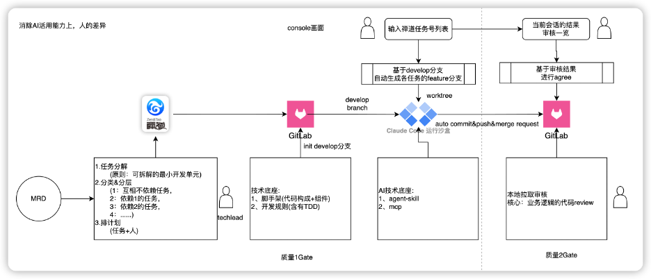

# 張 震 TOP 报告 — 2026-W29

- 组织：T.R.E.-China
- 周次：2026-W29
- 员工编号：10015132
- 提交时间：2026-07-17 07:19:47.981236
- 职位：部長
- 所属：T.R.E.-China 技術改革部 部長

---

お疲れ様です、張震です。

2026年29週のトップ報告をさせていただきます。

--- 価値基準 ------------------------------

「AI活用での世界的事業展開への挑戦」に基づき、うち会社が目指すべき戦略的方向性とその基盤となる組織変革について、今週は会長よりテーマとして解説しています。

トライアルグループは、組織を3つの部門に再編し、その中でも「流通・小売事業」と「DXの推進及び技術開発」を経営戦略上の主たる成長の柱として位置付けました。単なる個別店舗のAI化（スーパーの進化）にとどまりません。グループ内に蓄積される「データという無形資産」を最大限に活用し、メーカー、卸、物流、小売を一本の線でつなぐ「流通基盤そのものの変革」を断行することにあります。これは、新たな産業インフラを世界市場へ展開していくための、極めて挑戦的なグローバル戦略です。

この流通基盤の変革を推し進め、直近の目標である時価総額1兆円、さらには数兆円規模への事業拡大を現実のものとするためには、従来の経験や勘に依存した経営から脱却し、データに基づく意思決定の質と速度を向上させる必要があります。その中核を担うのが、データ活用における二つの「大きな乗り物（プラットフォーム）」です。

データとAI技術を活用し、世界で戦える企業へと成長するためのエンジンとして、「トライアルGPT」と「リテールエージェント」という二つの部門を定義しました。

これらは、日々の営業活動や店舗運営、商品戦略の現場で蓄積されるデータを吸い上げ、AIによって即座に経営判断や現場の改善アクションへ繋げる役割を果たします。従来の業務効率化の枠を超え、データが組織の知恵となり、自動的に競争優位性を生み出し続ける仕組みがここから始まります。

約1年前から運用してきた「HisaoGPT（NotebookLM活用）」は、会長の思想や組織の価値基準である「思いの丈」を継承するシステムとして成果を上げてきましたが、独自のRAG開発や他システムとの連携、そして現場の具体的な戦略質問（例：アパレル部門の戦略）に対応できないという課題が浮き彫りになりました。未来のイノベーションには「思いの丈」に加え、「数値経営」の環境構築が不可欠です。そのため、各部門の会議内容や業界知識を学習させた「部門別GPT」を構築するようになります。

このように、GPTを用いて社内の「数値経営」環境を最適化する一方で、もう一つの「大きな乗り物」である「リテールエージェント」は、社内を越えて流通業界全体を巻き込む能動的なシステムとして機能します。

「リテールエージェント」は、e3smartで蓄積した膨大なデータを分析し、AIが自ら組織の状況や数値を常時監視して課題を発見・提示するシステムです。これにより、問題が顕在化する前に先手を打つ継続的改善の組織を実現します。

これら二つの強力なAIシステムを真に機能させ、世界事業への挑戦を加速させるためには、システムを扱う私たち社員自身の「時間の使い方」や役割、そして行動様式を根本から見直さなければなりません。

このように現場主導で自律的に課題を解決する組織へ転換するにあたり、メンバー全員の能動的な行動と成長を促すための最終的な土台となるのが「環境の整備」と「教育体制」です。

どれほど優れた構想や技術があっても、それを実践し挑戦できる「場（環境）」がなければ成果には結びつきません。だからこそ、沖縄、箱根、宮若といった拠点の整備は、未来の変革を実現するための重要な要素です。

環境が変わることで人の行動が変わり、行動が変わることで「リテール×AI×DX」を体現する組織文化が醸成され、世界市場に通用する人材が育成していきます。

--- OKR/MBO ------------------------------

一、データ基盤

1、グループ向け　Inunaki

各分析用のデータ活用基盤構築

2、中国向け　データプラットフォーム

掌柜智囊、群客多のデータ基盤

二、業務基盤

グループ向け

１棚割（Shelfpower）

２マーケティング

3リゾート＆ゴルフ

三、技術＆コア技術人材

現実と未来を両方向けるTRECHINAの技術基盤の構築

グループ向け

１技術能力底上げ

２モダン開発

３コア人材の育成

国内事業向け

1中台構築

※人材のヘッドハンティングと外部コンサルタントの採用

2効率化するための技術ベース実力基盤

※効率化PFと新技術研究

3３年後の組織向け

自分の後継者

TRIALCHINAの技術改革部

--- 業務報告 ------------------------------

[技術]

■技術共通

1、AI推進について

→AI活用

Q2の完了課題に対して、今週からAI活用の振り返りがPMずつに始めています。

Q1の振り返り経験によって、Q2に対して、重要な振り返り要素が以下に考えています。

それぞれの課題の工数消化率の裏側として、

誰が入っているか、Tokenが持つか、ROIがどうなっている、AIをどういうやり方で使っているか

について、まとめてもらっています。

この大事の前提がすべて把握し、言える状態が必要となります。

今の時点に３個のPM単位が推進しました。すべて言える状態ではなく、それぞれの状況によって、足りない部分の宿題を出しています。

改めて、伝えてきたのが悪いこと、良いことは振り返りとして、皆さんに責任負担することではなく、はっきり問題と良い事例のまとめをしたうえで、組織能力への進化が必要なことは再認識してもらいました。

→Techleadレポート発表

16人のレポート発表会を開催しました。目的として、資料の裏側として、皆さんが業務に対する理解、技術現状に対する理解、将来向けの考えなど、言い換えれば、Whyの分として、まとめてもらって、発表してもらいました。

金曜日まで、すべての発表は完了して、スコア点数をまとめて、合格の判断が行っていきます。

→SmartAI開発ツールの展開

金曜日にPM、Smart開発関連にSmart環境の整備、SmartAIツールの説明が行う予定です。

■プロダクトセンター

1、Q3の推進

APP開発について、先週にも報告したように、盲目的に開発を進めるのではなく、AI駆動開発を組み合わせ、APP開発のルール、スキャフォールド（雛形）、および共通コンポーネントを、本格的な開発に入る前に事前に構築しておく必要があります。

今週は具体的にどう進めていくか、認識が合わせました。

事前構築準備

①タスクの分解

MRDによる最小開発ユニット

タスクの分類＆相互依頼関係による分層

計画(タスク＋担当者指定)

②APP開発の技術基盤

Uniappのコード構造＋共通ライブラリ＋共通コンポーネント

開発ロール(何を守れなければならない)

③APP開発のAI技術基盤

Agent-Skill群

Mcpなど

④AI開発環境

ツールについて

タスク管理：Zen&Tao

コード管理：Gitlab

実際に開発するとき、人間として

タスクの明確

タスク番号の選定

MRDによって、コードのレビュー　※一番負荷が高いところ

Developブランチにマッチすること

2、技術振り返り準備

→Bug振り返り

→技術自己評価＆リカバリー

→各自開発プロセスの中に、KPT視点の振り返りサマリ

→規則の振り返り

→下半期の技術計画

既存の業務計画による技術推進＋上の4つの振り返りから洗い出していく技術推進内容

今週は上記向け、各自からの準備をしてもらって、来週のプロダクトセンター合宿で報告＆ディスカッションがおこなっていきます。

一回目の認識合わせが行いました。

Bug振り返り：

一覧、分類など行いました。すべてが必要なのですが、開発が重点に見ていくのが開発のBugと手戻りのBug

技術自己評価＆リカバリー

各自技術要素の原理、シーン及び落としているコードに対して、どのぐらいなっているか、ちゃんと客観評価して、不足分を洗い出して、リカバリーが行います。

今週は分散式のロックを例として、皆さんに伝えていました。

来週に目指していくのが自分が分掌している分の状況を各自からまとめてもらって、評定していきます。

規則の振り返り

プラダクト→設計→開発→テスト→リリース、一連として、独自のロールと連携のロールなど、現状の状況と合わせて、足りない分を洗い出して、計画に落としていきます。

3、SelectDBでのZGZN3.0BigdataPF構築進捗

環境構築　済み

2.0IDCにあるデータ移行　完了

3.0データPipeline構築　進行中

※一部分のデータ型が合わないので、業務TMと合意して、業務側に修正してもらいます。

[グループ課題]

課題進捗について

1、AIによる業務改革進捗

「縦」AILLM

→店長週間PDCR‐ZIPPY

開発が対応中の分：

作戦書ロス率タイプの追加

部門変更対応

追加ニーズの整理＆対応

→E3Smart＊AI（MCP開発）盧化ビン

サーバに対して、Kubernetes環境の構築が終わりました。

今週はメインにチューニングをしています。

ユーザー権限、データネームスペースなど

チーム内に使い方の共有

計画として、いろいろチューニングして、安定してから、月末ぐらい切り替えていく予定になります。

2、INUNAKI

やる内容はいっぱいありますが、次の計画向け、優先順位の方向性は松尾さんと認識合わせました。

Shiniseは年末からInunakiにデータを投げる計画があるので、これ向け、Inunakiの事前準備と設計が優先順位として、上げています。

データ一覧のヒアリング(半構造化のデータなので、クレジングの考慮もいる)

既存との重複分を消す

アウトプット向けの加工(Bigquery＋DWH)

3、マーケティング推進

→毎日チラシ：By韓国偉

環境構築　済み

※Unerryさんが環境を疎通中、必要な権限対応を依頼受けています。

売価API作成

「人気上昇」商品API

※クラウドからIDCまでのネット疎通がまだなので、PoCリリースが一ヶ月間遅延になります。

→支社制ダッシュボード

Maketingdbについて、今週は何回のレビューが行いました。

設計要素として、

1、 汎用性：ダッシュボードの形と合わせることではなく、ユーザー向け、自由に使える汎用データになります。

2、 無駄しないように：今回のデータ範囲を限定します。

3、 軸の考慮：時間と店舗

4、 データ種類：IDPOS系、施策(費用、効果)、マスタ

※軸とデータ種類をマトリックスして、どっちがいるか、判断しやすくなります。

4、西友課題（AIコールセンター）

実装は最終のスプリントになりますが、

今ボトルネットになっているのがナビダイヤルの疎通になっています。この辺は今NTTさんとのやりとりをしている最中です。

そこまで、アプリケーションについて、疎通していくのが環境とセッティングの完備性になります。なので、来週まで、この辺について、環境を確認しながら、必要、かつ未設定の分を洗い出せていきます。

今週は以上になります、お疲れ様でした。

よろしくお願いいたします。
