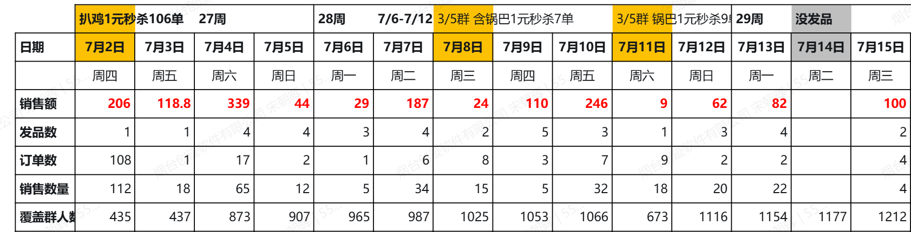
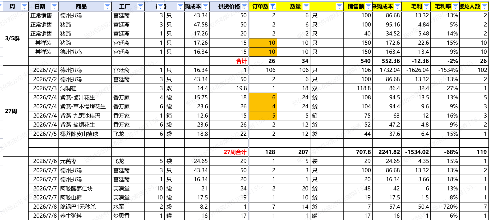
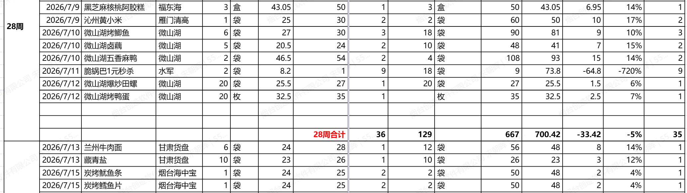
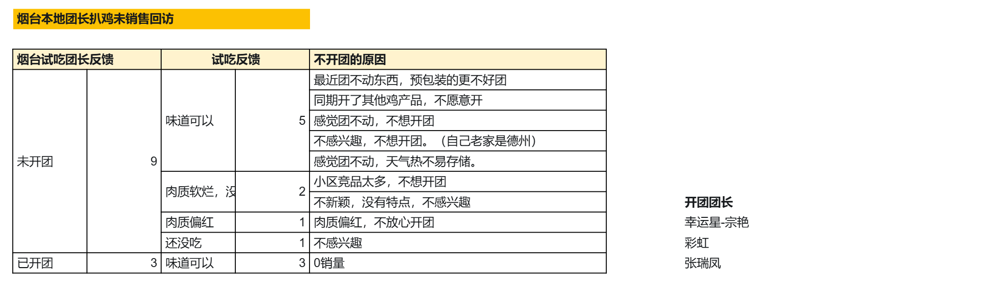
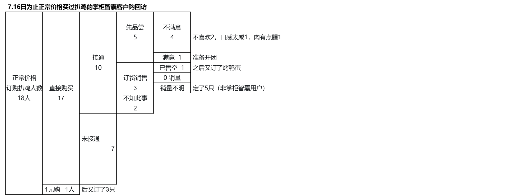

# 宋 朝暉 TOP 报告 — 2026-W29

- 组织：T.R.E.-China
- 周次：2026-W29
- 员工编号：10152938
- 提交时间：2026-07-16 22:18:51.517957
- 职位：部長
- 所属：T.R.E.-China 中国国内事業群 第一営業部 部長

---

价值基准--------------------------------------------

本周会长的top中主要讲解了集团将依托人工智能技术，推进集团全球化业务扩张。集团已完成组织架构三轮重构，确立两大中长期核心增长支柱：流通零售主业、数字化转型与技术研发板块，未来将深度融合 AI、数字化技术，盘活集团全域数据资产，打通业务协同壁垒，打造独有竞争优势，走出一条源自日本、面向全球的零售科技发展路径。

传统依靠管理者经验、直觉开展经营的模式已触及增长天花板，集团中长期目标是实现万亿日元市值、持续拉升企业估值，想要突破发展瓶颈，必须依托门店运营、商品企划、一线销售沉淀的海量数据，以 AI 提升经营决策的效率与精准度。本次会议围绕两大核心 AI 落地工具、组织变革配套举措、软硬件基地建设、人才与组织文化重塑四大板块展开部署，全面落地数据驱动、数字赋能的全新经营模式。

第一，分层搭建专属 GPT 体系，落地 “思想传承 + 数字经营” 双主线战略。集团前期上线基于 NotebookLM 开发的 HisaoGPT，主要承载创始人经营理念、高层汇报、面谈记录等内容，用于传承顶层战略思想，但落地过程中暴露两大短板：一是底层工具存在技术局限，无法深度对接集团现有系统，需自主研发 RAG 框架完成系统打通；二是数据库仅收录高层战略资料，无法针对服装等细分业务输出落地化经营方案，难以支撑集团 “理念传承、数字量化” 两大经营核心。

针对现存短板，集团规划搭建各事业板块专属细分 GPT，形成分层 AI 知识库。各业务 GPT 将录入板块专属行业情报、竞品战略、专业技术、日常经营会议纪要、一线实操经验，把各事业部实操经验转化为集团可复用的数据资产，借助 AI 缩短决策周期、提升判断质量。落地运营层面，由以绪方桑为核心的秘书室、漆原桑牵头的未来战略室联合统筹，统一完成信息归集、数据训练、系统迭代，持续在经营场景中验证优化 AI 工具，完成从系统搭建到常态化运营迭代的过渡，真正落地量化经营体系。

第二，打造零售智能代理系统（Retail Agent），重构全产业链流通基础设施。该系统以集团自有数据平台 e3smart 为底层底座，可自动抓取、解析全渠道经营数据，主动识别门店运营、供应链环节潜在问题并推送优化方案，实现从事后补救到事前预警的管理模式升级，让 AI 主动参与企业运营、驱动持续改善，而非仅作为员工辅助工具。该项目不局限于集团内部降本增效，核心目标是完成流通全链路数字化变革，打通厂商、批发商、物流、零售终端，构建全新行业产业基础设施，打造日本原创流通产业数字化底座，形成难以复制的行业壁垒，未来可向全球零售行业输出整套解决方案。

为落地零售智能代理系统，集团搭建多方协同落地体系。一是组建 “日本联合团队”，联动外部合作企业共建项目生态，规划在宫若市现有研修基地旁新建大型研发研修中心，远期打造千人规模研发团队，夯实出海技术底座；二是打通上下游产业链，依托现有 “宫若周” 行业交流活动，持续吸纳制造商、批发商加入生态，从单一数据分析工具升级为全产业链价值共创平台，实现产销数据互通、联合开发市场；三是强化底层数据平台 e3smart 建设，在箱根打造 “e3smart 研发村”，汇聚人工智能、数据科学、系统开发专业人才，打磨世界级零售科技底层平台，持续完善数据解析、智能决策功能，支撑零售智能代理系统长期迭代。

第三，配套组织机制、办公环境、人才培育全方位变革，适配数字化转型需求。时代变革下原有工作模式、时间分配方式无法支撑 AI 转型落地，全体员工需摒弃过往成功经验思维，主动迭代岗位职能、转变工作行为逻辑。在汇报机制层面，改革原有高层单向输出的 TOP 汇报模式，改为分部门常态化汇报机制，各板块自主挖掘经营问题、落地改善方案，同步沉淀成功与失败案例，实现全集团经验共享、规避重复踩坑，让汇报成为数据与经验沉淀载体。

在硬件环境建设层面，集团持续布局多地研发交流基地，宫若、箱根、冲绳三大场地作为创新研讨、技术研发核心载体，同步规划宫若别墅区型会议空间，方便管理层深度研讨战略；在东京麻布台山丘设立一对一沟通中心，由创始人出资搭建，配套一对一面谈、在岗实操培训、专题授课等多元化人才培育体系，通过常态化交流传递经营思维、提升全员问题解决能力。集团认为物理空间是数字化变革的基础土壤，环境改变能够带动员工行为、组织文化同步革新，是落地 AI 全球化战略不可缺少的配套支撑。

本次top阐释了集团 “零售 + AI + 数字化” 的长期发展蓝图，集团对 AI 的定位不局限于提升业务效率，而是以技术重塑整个零售行业价值体系。数字化转型的落地不能仅依靠技术工具，人才成长、组织环境、协同机制缺一不可。未来全体员工需跳出固有工作思维，主动学习创新、承担全新岗位职能，依托现有多基地研发平台与人才培育体系，稳步推进分层 GPT、零售智能代理两大核心 AI 项目落地，打造日本原创、具备全球竞争力的零售科技企业。下周将围绕数字化转型背景下的时间分配策略，讲解如何高效分配工作资源、创造核心经营价值。

OKR/MBO----------------------------------------

愿景：用IT改变零售业

在中国互联网高度发达的背景下，数字化转型已渗透到各行各业，成为时代大势，发展数字经济是中国的战略选择。零售行业也必将迎来一场大的数字化变革。顺应时代的趋势，TRE深耕零售行业20年，我们利用在POS和购物车系统开发、商品开发、数值分析方面的经验，为商户提供OMO零售数字化解决方案，帮助店主解决痛点，为客户增加销售额和利润。 展望下一个10年，我们的目标是引领数字化转型时代，扩大市场份额，成为国内顶尖企业。

企业使命：成为全球掌柜的“智囊团”

战略目标：基于好用易上手的收银软件，为小b商户提供多样化的服务。

Pos定位：获得ID，为国内事业的展开提供种子用户。

●事业推进路线

1、店铺管理系统：提供高效的店铺管理系统，支持店铺销售、线上下单、订单核销、产地工厂端的仓储物流系统。助力b商户数字化转型和店铺增收。

2、品牌店铺：优秀店铺品牌化，特来购品牌店铺招商，全面托管店铺管理、店铺运营、货源选购、品牌建设，形成以b商户为基础的品牌加盟连锁。

3、掌柜智囊用户差异化商品供应，对接全国各地厂商开发地标性特产类商品，供应商品B-b-c，通过小b商户覆盖数亿c端客户。

4、提升用户数量，不断扩大供应链覆盖范围。

业务进展---------------------------------------------------

2026年掌柜智囊销售额：158万元（截止15日数据）

2026年社区团购销售额：61.8万元（截止14日数据）

2026年掌柜智囊用户开团：订单数206单、销售数量396（含秒杀）

掌柜智囊客户供货

周期销售情况

- 27 周（7.2-7.5） 总订单 128 单，总销量 207 件，总销售额 707.8 元，参与接龙人数 119 人。
- 28 周（7.6-7.12） 总订单 36 单，总销量 129 件，总销售额 667 元，参与接龙人数 35 人。

德州扒鸡销售情况和客户反馈

- 引流数据：106 单、106 只，带动当日覆盖群人数 435 人，是本周社群触达增长核心来源。
- 团长反馈（烟台本地）：共回访 12 位团长，9 位未开团、3 位已开团； 未开团团长中 5 人认可味道，但因社群整体动销疲软、同期同类禽品竞争、夏季储存难、竞品过多不愿开团；3 人反馈肉质软烂无特色、肉质偏红存在食品安全顾虑；3 位开团团长全部 0 销量。
- 掌柜智囊购买扒鸡客户回访（18 位正常价购买客户）：17 人接通回访，1 试吃后人满意并计划开团；4 人反馈口感过咸、肉质发腥、不喜欢；3人直接购买，并有一人已受控所购买的3只，有 1 人顺带复购烤鸭蛋；1 元秒杀 1 位客户复购 3 只。

目前问题/卡点

物流不配送到店（非核心问题）

价格比对拼多多、淘宝等平台

保质期售后（少量订货）

非品牌商品相对转化低，品牌商品价格操作空间少。

目前日均订单数少，长此以往工厂合作意愿会降低商品很多，但单品销量不大，复购差。新品信任度低。

针对以上问题，接下来要解决

①调整思路：集中某些品类优化固定供应商品，如甜零食、卤味零食、肉类零食等品类/20-50款稳定供应商品

最好是集中某个品类的商品，让商户们形成某个品类来集中采购的意识

例如，芦苇零食类： 卤汁花生、卤蛋、小鱼、辣条、牛肉干等等。

②爆品考虑优先满足以下条件

口味√

价格√（对标拼多多、淘宝、本地供货商）

爆品潜质√

非季节品，可常年供货√

目前每日发品，测试新品，留下好的商品进行持续供货。

③销售

群： 图文宣传商品口感、价格、厂家。

直播开课： 社区店经营课程，设计课程，听课送试吃。电话邀约听课，单次送多少，持续上够多久课程送多少。（7月份之前注册的客户享受）直播期间穿插介绍商品和试吃，促进订货。直播时间发布到掌柜智囊banner。线下烟台20-50个单品超市持续供货，复购。

试吃: 优先过往采购商品的客户，听取客户选品意见。

撑起销量，稳定供应方合作： 考虑当地团长、商贸公司、超市供货

价格设定： 批发商<超市<实体零售价<拼多多

本周就是这些，感谢阅读。
