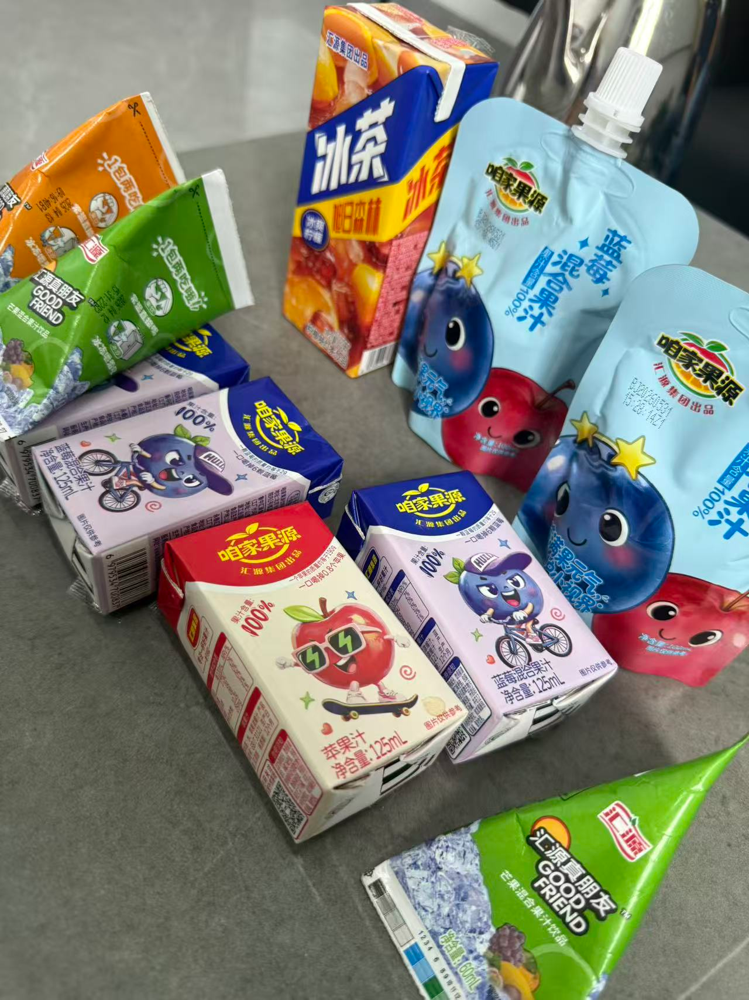
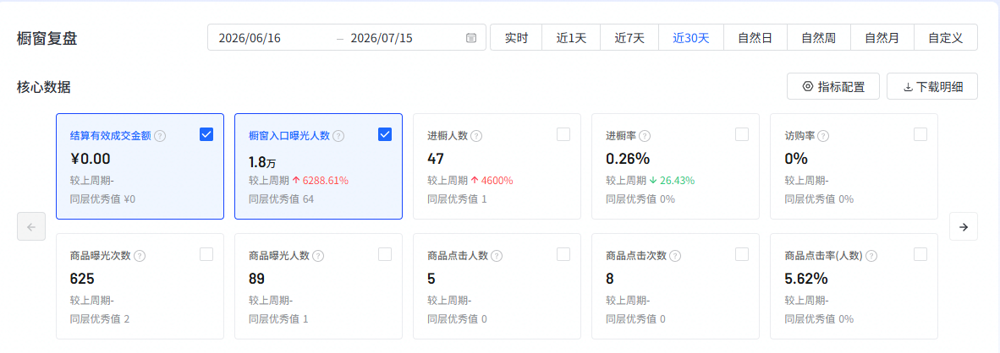
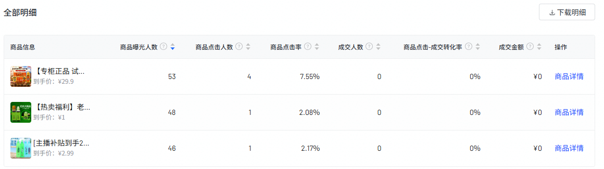
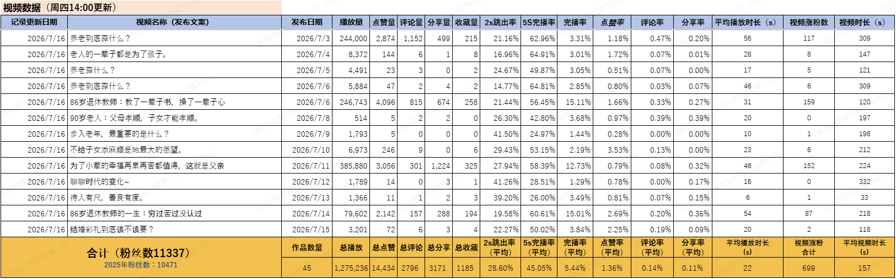
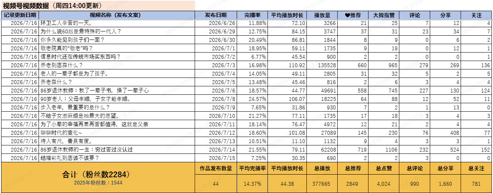
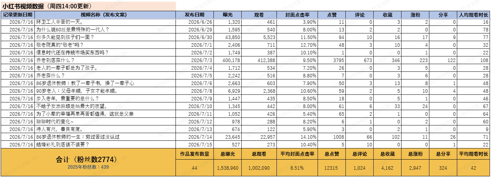

# 高 シン TOP 报告 — 2026-W29

- 组织：T.R.E.-China
- 周次：2026-W29
- 员工编号：10254313
- 提交时间：2026-07-17 01:32:05.923631
- 职位：部長
- 所属：T.R.E.-China 新メディア事業部 部長

---

本周工作：

一、1.洞洞鞋相关，本周周一至周三成交订单350单，目前店铺因为店铺分不够开始限单（100/天），临时开了另一个店铺，胡总给到了保温杯的货盘，价格从12-21不等一共有11个款式，暂时只有4个款式有样品，先寄到青岛公司到了之后再看一下样品，之前稻壳杯样品收到了，是2019年的世博会的杯子，可能不是很合适销售，暂时先不考虑，

2.供应链相关，这周跟李昌鹤去了淄博去了金蝉的养殖基地，收货成本大概是0.95元/只，潍坊大概是0.9/只，物流费用大概在11-12左右/单（顺丰），油蟠桃3两，1.8-3元/斤，但是近期因为雨水较多口感不是很好，需要等3天反糖后再看口感，另外有白玉桃正在上市，口感适中，在青岛、烟台、上海分别邮寄了样品，供应链、物流等已经对应好了，具体等反馈，考虑是否要尝试，

3.掌柜智囊小店供货相关，1元购活动后，目前订货量反馈也不是很大，一方面除了需要时间慢慢建立信任之外，是不是可以考虑引入品牌商品，例如在云仓对接了汇源果汁系列产品，可以拿到独家授权，价格从0.8元到1元左右，如果需要具体价格可以进行详细商谈，甚至拿到线上的品牌授权，可以用品牌名字在线上线下同步进行，同时，也有其它品牌商品例如，旺旺、蒙牛、杜康等等，在临沂有价格极地的供应链货盘，是不是可以考虑用品牌商品先破冰，快速取得信任，后续再进行其它利润品销售。

4.银发ip在精选联盟筛选了20款商品放在橱窗，商品主要针对银发群体，跟目前小店类似商品，佣金从5%-50%，客单价从2.99元-29.9元，

银发IP商品橱窗数据：

橱窗入口曝光人数：1.8万，商品曝光人数：89，商品曝光次数：625，进橱窗人数：47，商品点击人数：5，商品点击次数：8，暂时还没有人下单。

同步准备了一个店铺，把现在我们自己的商品有照片的，按照青岛小店的to-c价格做参考，做好链接放在精选联盟，设定佣金30%，持续推进中。

二：短视频相关进度报告：

1. 账号数据（自2026年1月1日起计算）

1-1@老郭和他的小店（抖音/快手/视频号）【暂停更新中】

截止到7.16日，全网粉丝数 7757 ，2026年新增粉丝数 2846 ，

已发布视频 114 期，点赞量 841 ，总播放量 24 万。

1-2@静姐聊直播小店（抖音/快手/视频号）【暂停更新中】

截止到7.16日，全网累计粉丝 19252 （2025年底开始运营），

已发布视频 319 期，点赞量 3115 ，总播放量 40 万。

1-3@宋少爷团购（抖音/快手/视频号）【暂停更新中】

截止到7.16日，全网粉丝数 35253 ，2026年新增粉丝数 3167 ，

已发布视频 239 期，点赞量 5181 ，总播放量 109 万。

1-4@许多朋友（抖音/小红书/视频号）【旧帐号重启】

截止到7.16日，全网粉丝数 16395 （帐号原始粉丝数： 12454 ），2026.5.25~新增粉丝数 3941 ，已发布视频 133 期，点赞量 30773 ，总播放量 265 万。

抖音短视频数据相关：截止到7.16日，目前已发布视频45期，总播放量127万，点赞量为14434，粉丝数11337。

视频号短视频数据相关：截止到7.16日，目前已发布视频44期，总播放量37万，点赞量为4024，粉丝数2284。

小红书短视频数据相关：截止到7.16日，目前已发布视频44期，总播放量100万，点赞量为12315，粉丝数2774。
