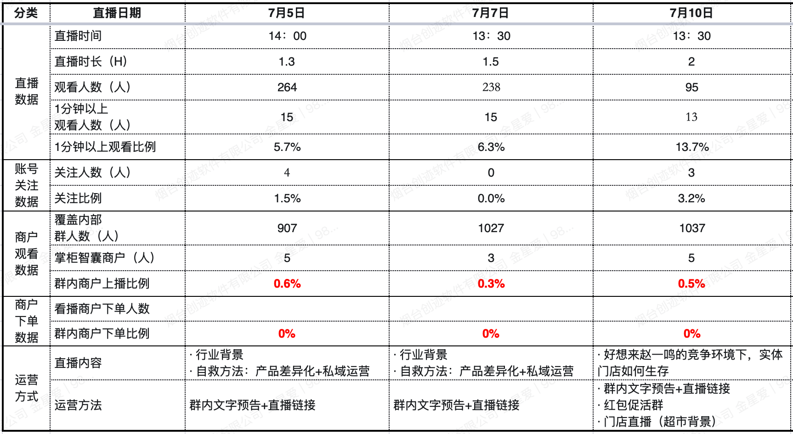

# 金 星愛 TOP 报告 — 2026-W29

- 组织：T.R.E.-China
- 周次：2026-W29
- 员工编号：2200107
- 提交时间：2026-07-17 09:01:06.60169
- 职位：部長
- 所属：T.R.E.-China 中国国内事業群 第二営業部 部長

---

お疲れ様です。　金星愛です。

第1126週目のTOP報告をさせていただきます。

●価値基準

今週の会長のテーマは「AI活用での世界的事業展開へ」です。

1. 経営戦略の全体像

トライアルグループは、組織を3つの部門に再編し、その中でも「流通・小売事業」 と 「DXの推進及び技術開発」 を経営戦略上の主な成長の柱と位置付けています。グループ全体で蓄積されるデータという無形資産にAI技術を組み合わせることで、事業間のシナジーを創出し、単独では実現できない新たな価値の創出と競争優位性の確立を目指しています。

直近で時価総額1兆円、さらに数兆円規模への事業拡大を目標としており、福岡を拠点とするディスカウントスーパーとして知られる我々は、2024年のIPOを経て、2025年には西友を約3,800億円で買収し、全国に600店舗以上を展開するまでに成長しました。

2. AI活用の二本柱

（1）各事業GPT（ナレッジ継承システム）

HisaoGPTの運用と課題

約1年前からNotebookLMを活用したHisaoGPTの運用を進めてきました。その中で2つの課題が浮き彫りになっています。

システム面の課題：NotebookLMの形では限界があり、継承の基幹システムにするには独自のRAG開発や他システムとの連携が必要

戦略的質問への対応力不足：読み込ませているデータがTOP報告や面談資料に限られるため、各事業固有の戦略的質問に答えられない

細分化GPTの必要性

現在の経営の二大柱は 「思いの丈」 と 「数値経営」 です。HisaoGPTは「思いの丈」の継承に主眼を置いていますが、それだけでは未来のイノベーションには向かえません。そこで、各事業専用のGPTを構築し、「数値経営」の環境整備を進めます。

各事業GPTには以下の情報を読み込ませる計画です。

各事業に関連するTOP報告

その事業に関係する企業の戦略情報や業界知識

一般的な専門知識

日々の営業会議や戦略会議の内容

事業ごとの知識やノウハウ

運用体制

緒方さんを中心とする秘書室と、漆原さんを中心とする未来戦略室が連携し、情報の収集・整理・AIへの読み込みを進めます。構築した仕組みを実際の事業運営や意思決定に活用しながら、検証と改善を繰り返し、実践的な経営基盤へと発展させていきます。

（2）リテールエージェント（流通特化OS）

リテールエージェントは、e3smartで蓄積したデータを分析し、現場運営における様々な問題を自動的に解決・アシストするシステムです。AIが自らデータを分析し、問題点や改善課題を発見し、関係者へ提示することで、迅速な改善活動につなげます。

目指す姿は問題が発生してから対応するのではなく、問題が大きくなる前に発見し、継続的な改善を実現

組織全体で継続的な改善ができる体制を構築し、他社に真似できない競争優位性を獲得

組織そのものが学習し、成長し続ける仕組みの実現

推進体制

リテールエージェントの実現には、「チームジャパン」として多くの企業やパートナーの参画を得ながら推進します。

中核拠点：宮若市の脇田研修所前に、さらに大規模な研修・開発拠点を構想

将来体制：1,000名超の体制を構築し、日本発のリテールテクノロジーを世界展開

エコシステム：メーカーや卸売業者も巻き込み、「宮若ウィーク」のような活動を核に拡大

e3smart強化：箱根・西川邸を中心に「e3smart村」と呼べる開発拠点を構想

3. データ活用と流通基盤の変革

AIを流通という社会インフラに組み込むことで、需要予測、在庫最適化、物流効率化、販促最適化などが実現可能になります。目指すのは単なる「AIを活用したスーパーの進化」ではなく、メーカー、卸、物流、小売をつなぐ流通基盤そのものの変革です。

これは日本発の新たな産業インフラを創り出す挑戦であり、我々は既に2018年からRetail AI部門を設立し、スマートショッピングカートやAIカメラなどの製品開発を進めてきました。e3smartという自社開発のデータエンジンは、リアルタイムで販売データ・在庫データ・顧客行動データを分析し、実行可能な意思決定に変換する仕組みを持っています。

4. 組織変革と環境整備

TOP報告の在り方改革

従来のTOP報告は、会長の話した内容を整理・要約するだけでは不十分です。今後は部門ごとにTOP報告を運営し、営業施策や業務改善へとつなげ、成功事例・失敗事例ともに組織全体で共有できる仕組みを構築します。

環境整備（「場づくり」）

変革を実現するための土台として、以下の拠点整備を進めています。

沖縄 新たな発想を生み出す場

箱根（西川邸） e3smart開発拠点（「e3smart村」）

宮若 流通DX開発拠点、大規模研修・開発拠点（構想中）

東京（麻布台ヒルズ） 1on1センター（会長私費で整備）

5. 成功の鍵：「時間の使い方」と「役割の進化」

変化の時代において重要なのは、過去の成功体験に依存せず、自ら役割を進化させ、未来に向けた行動へと転換することです。従来と同じ時間の使い方や仕事の進め方では対応できず、新しい視点と新しい取り組みに挑戦することが求められます。一人ひとりが新しい役割を担い、未来に向けて成長していくこと——これが「リテール×AI×DX」という大きな可能性を実現するための鍵です。

「朱さんのTOPから」

今週は半期の各事業の段階的のまとめての時期です。国内事業の部分はまだ収益を出してない問題で、ちょうど日本の坂本さんの「キャズム理論」授業内容に合わせて整理を行っています。今週のMonthly Review会議でも8月末まで最新版の事業計画書を提出するようになっています。POSについては、どの市場に向けてターゲットカスタマを明確し、競合は誰で各自の強みと弱みがどこで、ターゲットカスタマの需要を理論と現地調査を合わせて行っていきます。

「業務報告」

ZGZNユーザー向けのライブ

先週の続き、水曜日と木曜日は青島に出張して、成功事例の紹介内容と産地から加工工場、店舗までの流れの中でショットビデオとライブ内容を作ることについて検討を行いました。

ライブ配信のバージョンアップ

配信テーマの変更：無形文化遺産や地理的表示産品（観光色が強い）から、健康食品（必需性が高い）へとテーマを切り替える。

配信背景の調整：煙台の小店での配信に合わせ、産地商品の配置を見直し、配信用の背景を新たに設営する。

青島の販売データを基にしたストーリーテリングと売上貢献度の織り込み：青島の小店で１日あたりの売上を400元増加させた実績（青島小店の生データを提示）を紹介。店内の全体データ（たばこ・食品・団体購入・配信商品の構成比）を示し、特に健康食品が店舗売上高に占める割合と貢献金額を強調する。

成功事例の実演：青島店舗との中継を午後13時～15時に行い、現場の陳列棚を映しながら、好調な商品とその販売方法（ノウハウ）を青島側店員が紹介する。

ショート動画とライブ配信：トレーサビリティ（原産地追跡）の撮影や配信にも取り組む。

今週は以上です。

お疲れ様でした。
