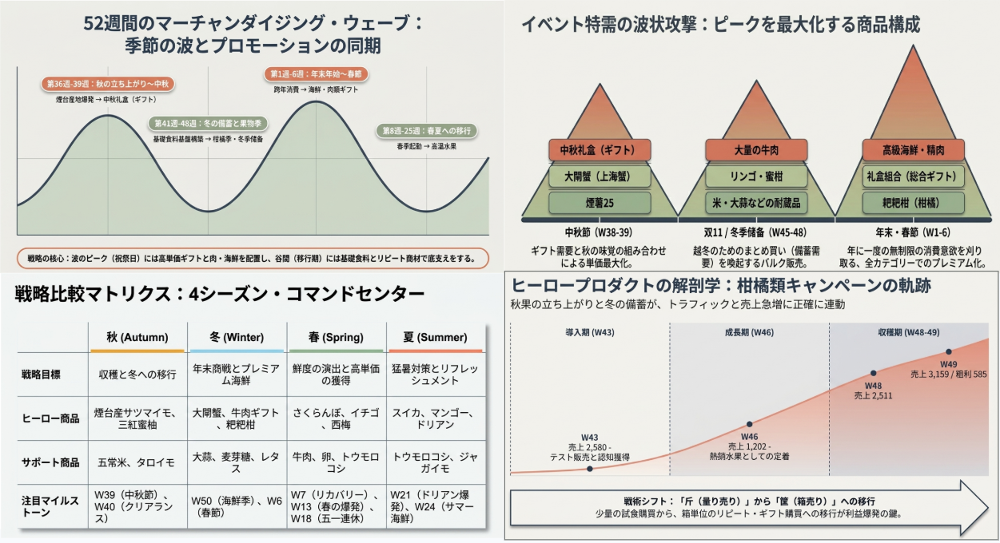
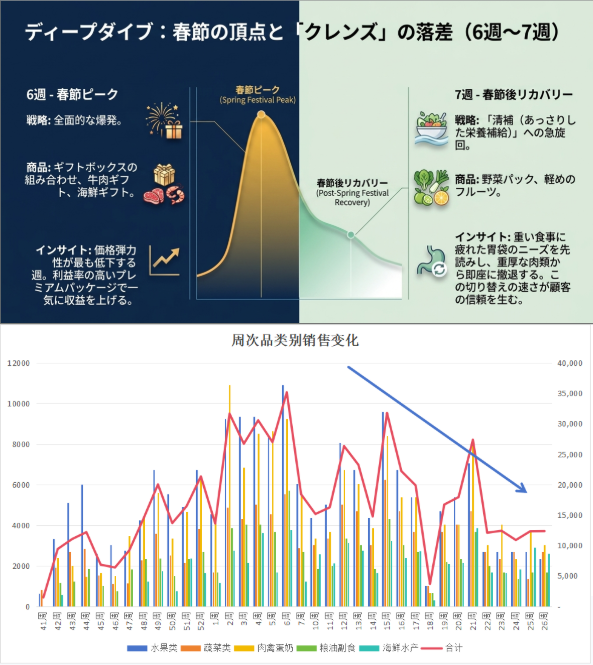
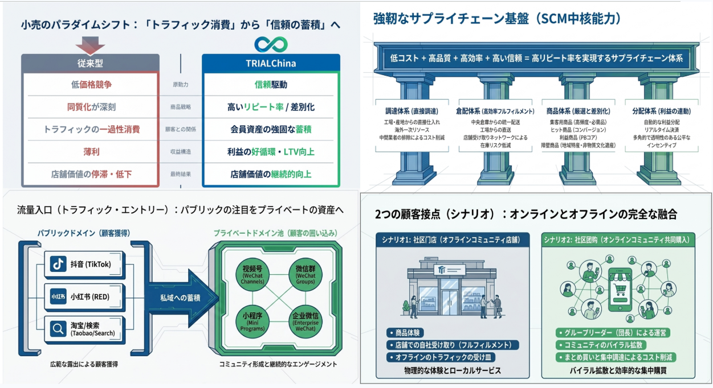

# 李 昌鶴 TOP 报告 — 2026-W29

- 组织：T.R.E.-China
- 周次：2026-W29
- 员工编号：2200188
- 提交时间：2026-07-17 01:44:49.108846
- 职位：部長
- 所属：T.R.E.-China 部長

---

今週のTOP報告を提出いたします。

今週会長よりAI活用での世界的事業展開について解説がありました。

トライアルグループはAIとDXを活用した世界的事業展開を成長戦略の柱と位置付けています。特に流通・小売事業とDX推進・技術開発の連携により、データという無形資産とAIを組み合わせたシナジー創出を目指しています。AIを流通インフラに組み込むことで需要予測、在庫最適化、物流効率化を実現し、メーカー・卸・小売をつなぐ日本発の新産業基盤を創造する挑戦となります。

現在の経営二大柱である思いの丈と数値経営を両輪とし、前者を担うHisaoGPTに加え、各事業専用のGPTを構築します。各部門の戦略情報や業界知識を読み込ませ、意思決定の質と速度向上を図ります。また、e3smartのデータを活用したリテールエージェントにより、AIが自律的に課題発見・改善提案を行う組織を目指します。

実現にはチームジャパンとして多様な企業と連携し、宮若市に大規模な研修開発拠点、箱根にe3smart開発拠点を構想しており、将来的には1,000名超の体制で世界展開を計画します。

変革には時間の使い方の転換が不可欠であり、TOP報告も部門ごとに運用し、成功・失敗事例を共有する組織学習の仕組みへ進化させていく計画です。環境整備にも注力し、沖縄・箱根・宮若の拠点や麻布台の1on1センターなどを通じ、人材育成と知識共有の場を提供していきます。単なる効率化ではなく、人が成長し続けることでリテール業界の新たな価値創造と世界競争優位性の確立を目指します。

朱さんより第二四半期の振り返りについて解説がありました。

特に国内事業についでは、技術開発から新規事業開拓、拠点横断的な推進まで幅広い前進が見られました。技術面では営業技術部門との連携による設計・合意形成の確実化や、API抽象化・共通部品構築といった実践的な取り組みが評価できます。

新規事業でもゼロからの挑戦により一定の成果を生み出しました。しかし、多くの課題も顕在化しています。成果を組織全体へ波及させ持続可能なビジネスモデルとして確立する点が不十分であり、技術領域では専門家視点に偏ったコミュニケーションにより、非技術系メンバーへの意図伝達や経営視点への翻訳が不足し、外部ナレッジの組織内定着も未完了です。

事業運営ではプロジェクトごとの黒字化が達成できず、目標と実績の乖離に対するリカバリー策が場当たり的で構造的な課題整理や事前リスク想定、チーム編成設計が不足しています。ビジネスモデルが現場で十分機能しておらず、継続的支持を得られる数字も限定的です。多地域展開などの拡張構想も言語化・モデル化できておらず、個別課題の深掘りや効果検証が不足し、新連携展開も検討段階に留まっており、得られた運用ノウハウは個人範囲に止まっています。

次期に向けては、各プロジェクトの収益性を厳密に精査し、経験を事業効果最大化や組織的価値創出へ繋げることが求められます。構造的課題整理やリスク事前想定を徹底し、計画的なリカバリー策に基づく確固たる経営モデルの構築を目指します。収益性と販売力向上に直結する施策を即座に実行し、赤字垂れ流しは禁物です。やめる勇気と能力を持ち、目標と効果を具体的に設計・可視化し、仕組みが完全定着するまで責任を持って追跡する体制を整えます。経営層間の役割分担を再定義し、目標に対する評価と責任を明確化するとともに既存仕組みに頼らない自分起点の成功事例を新たに創出することが必要であると強調しています。

国内事業推進

昨年11月末の青島月次合宿でコミュニティ共同購入へ合流するように決めて、次週12月3日から青島市即墨区の果物卸市場に入り、煙台側の宋さんチームと一緒に商品の選定と発送及び販売に関わる業務をやらせてもらいました。（中国小店の特徴と需要に合わせて、生鮮/果物関連商品に集中した中国独特な団購という販売モデルの実験）

過去の振り返りと今後の考えを少し書かせてもらいます。

過去データの基に週次季節ごとの波を経験しながら、波のピークには高単価ギフトや精肉/海鮮などの商品を用意し、移行期は基礎食料とリピート商材の準備などバタバタ行って来ており、どの時期にどんな商品がお客様にとって欲しがっているのかが大体把握できるようになり、ある程度自分たちの経験として残すことができております。

一方、春節のピークが終わり、春と夏に入ることで売上の急減、継続的に購入してくれている団長の規模も縮小しています。

いろいろ対策を企画しながら、週次検証結果基に議論を行っているのですが、数字経営の部分でいうとただ検証の維持だけでいつ黒字化ができるのかという部分について説明と考えが不足している状況でした。

鶴川さんのTOP報告にてフードパークの失敗経験の基に下記のような内容を拝読させてもらいました。

「この業態が面白そうだ」「この料理をやってみたい」「この場所が空いている」。こうした発想が先行し、その後から店舗や厨房、設備をつくる。しかし、誰が市場規模や商圏を分析したのか。誰が必要客数・必要売上・生産性を算定したのか。誰がマネタイズの構造と投資回収期間を設計し、結果に責任を持ったのか。この点が極めて曖昧でした。

同じく現在行っているコミュニティ共同購入課題にとって、0→1だから赤字無視はできません。朱さんからもただの赤字垂れ流しは禁物であることを明確に提示しています。

入り（売上）の部分を最大限に上げる方法はあるのか、過去経験の基に日々購入してくれている団長人数は何人で、季節に合わせた販売すべき商品はどんなものであるのか、客単価・購入点数などを設定しながら、荒利目標を試算し、出の部分ではなるべく固定費用（倉庫費、減価償却など）を最小限に抑えつつ、一番コストを占めている人員費用を変動費（一部固定社員以外の人員は時給人員の投入など）として売上の変化により柔軟に増減できる方法はないのかを考えながら、やるならやる方法と黒字化ができる期限を再明確させていき、やらないならやらない理由とやめる勇気の基に正確に判断していくべきです。

来週瀋陽での月次合宿中で関係者と結論を出していきます。

ただ、本来目指すべき不変な部分は継続的に考え続けていくべきです。

中国市場の特徴上トラフィック消費から信頼の蓄積へ変わっていること自体は明確だし、流量入口はパブリックの注目をプライベートの資産にしていく事も決まったことであり、如何に2つ接点であるコミュニティ共同購入とコミュニティ店舗を活用していくのかがポイントになっていきます。また、今まで蓄積できたサプライチェーンの基盤を十分活用しながら、一番の核であるPOSユーザー向け価値創造を実現するためにどうすべきかを考えていく必要があると思います。

当然ながらPOSユーザーの拡大（継続的な流入）と他に流出の防止（維持）対策も考えていく必要があります。（商品供給以外現在のユーザーが維持できる方法）

その他：

今週沂源県と蒙阴地域に出張し、POSユーザー向け提供できる商品（山東省限定でこの季節に供給可能な商品）探しを行っております。

四種類の商品を確認しており、桃関連の商品を中心に選定していく予定ですが、まずはサンプルを関係者へ郵送じ、品質と宅配効率を確認したうえで、まずは小範囲で販売実験（青島に本日20ケース配送）しながら販売拡大を行っていきます。

今週は以上でした。
