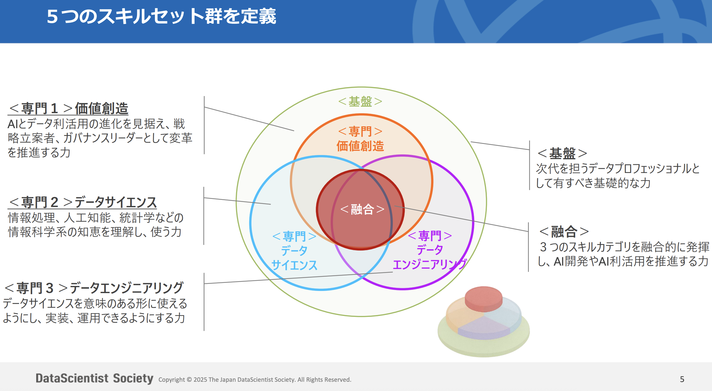
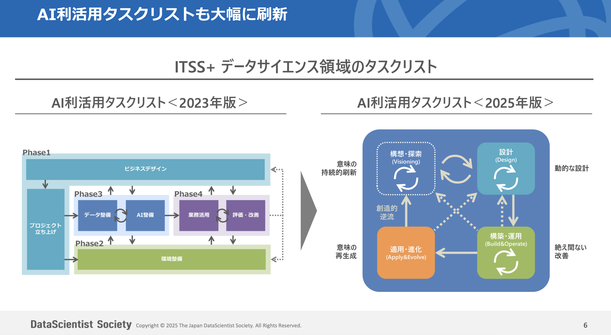

# 馮 龍傑 TOP 报告 — 2026-W29

- 组织：T.R.E.-China
- 周次：2026-W29
- 员工编号：2200266
- 提交时间：2026-07-17 07:08:15.947917
- 职位：副総経理
- 所属：T.R.E.-China グループ事業群 副総経理

---

お疲れ様です。馮龍傑です。

今週のTOP報告を行います。

トライアルの経常利益が速報ペースで$4.08%に達し、目標である4%を突破したというお話がありました。台風や天候不良といったいくつかの影響がありながらも、数字達成の執念でこの数字を作ってきました。3%台の壁を越えられたことは、競争戦略の皆さんをはじめ全員の実行力が実を結んだ結果だと洋幸社長のコメントがありました。ここで良い数字が出たからと安心してはいけません。4.08%という数字はあくまで一つの結果であり、重要なのはこれを維持しさらに5%を目指すための仕組みに落とし込んでいくことです。

数字目標だけにしてしまうと、現場との間には急激な利益追求への温度感のズレや、実務リソースの限界といった葛藤が常に存在しているということで、ただ本部から目標を押し付けるのではなく、現場が納得して動ける環境を整えていく必要があります。

利益向上を支えた価格設定や商品展開の運用を含め具体的な改善策までの仕組みが必要です。現場を動かすための判断ルールやまたロジックの整理をしていくことで、実行した施策がどれだけ利益に直結したかを、週次のPDCRサイクルで確認していく必要だと考えています。

具体的な事例でいくと、Zippy課題は施策がどれだけ利益に直結したか、貢献したか、成功事例を集めて、AIによって他店展開の仕組みも考えている所、AIで自動的に効果貢献の計算、展開目標探し、推奨する手順までのSkill化をどれだけ完成できるかは中心のロジックであります。

横展開する時点では店長をはじめ、担当のカテゴリMgrを含めどれほど納得性を持って協力できるか、役割、プロセス設計までしっかりと考えてやっていく必要がありますから、今回も王世艶、山林、徐欣3人が出張に行って現場をどれほど巻き込めれるか、運用をしっかりと見て仕組みまで作っていくことにしています。

こういうことはカスタマサクセスにもつながっている部分でありますから、ナレッジの蓄積を含め周りへの横展開もやっていける環境にします。

これまで組織変化、AI生産性のレポート、AIシフトするための実験、AIで生産性向上の効果測定などチームで進んできました。

データエンジニア、プランナー、カスタマサクセスの三つ方向性に向けてのリスキリングもすくめて構造的な変化を進めているところです。

内部的な構造変化は世の中にどう変化しているかとも一緒に確認して認識合わせをしています。

データサイエンティスト協会より昨年12月にDSのスキル定義が大幅に刷新されまして、データサイエンティストの役割を分析実務者から価値創造リーダーへ再定義する内容です。

---

DS の役割は「分析」から「価値創造」へ拡大

生成AIの普及で「分析」はコモディティ化

• モデル選択・特徴量作成・可視化などの従来の“分析行為”はAIが自動化できる領域に。「分析ができるだけ」は十分な価値にならなくなった

• 鍵になるのは “実際に価値が出るまでの一連のプロセス” のリード

価値創造こそがAI活用の核心に

• AI活用が「PoCで終わる」ことへの強い反省

• 企業が求める成果は “モデル精度” ではなく “業務・経営インパクト” に移行

• Old EconomyのDXではとくに変革推進・課題再定義・ガバナンス・スケール展開をできる人材が圧倒的に不足

LLM / エージェントによって「価値の源泉」が構造化・意味設計側へ

• モデル構築よりも “何をどう解くか（課題再定義・意味構造設計）” の方が成果に直結

• エージェントはタスクを実行するが、「戦略・意味・ガバナンス」は人が設計しなければ機能しない

• DSの強みはまさに構造理解 × データ × 技術 × 組織知の接続

実際のAI案件では“価値創造の方”が圧倒的にボトルネック

• 「モデルはできたが使われない」「部署に展開できない」

• ボトルネックは、分析ではなく “課題設定・現場変革・スケール展開” にある

• つまり、価値創造プロセスを牽引できる人材が成功の90%を占める

---

スキルセットの見直しがされている中、努力する方向も見えてくると思います。

最大の変更点は、従来のビジネス力・データサイエンス・データエンジニアリングの3領域に加え、

価値創造スキルを独立した専門領域として新設したことです。

さらにAIエージェントやマルチモーダルAI、ナレッジ活用などの融合スキル群と、全データプロフェッショナルの共通土台となる基盤スキルも定義され、5層構造に再編されました。

AI利活用のタスクリストも構想・探索、設計、構築・運用、適用・進化の4フェーズに全面刷新されています。生成AIの普及により従来の分析行為がコモディティ化し、モデル精度よりも価値創造と組織変革を主導できる人材が成果の9割を決めるという現場実態があります。

このスキル定義刷新の方向性は、私たちが進めている意思決定設計者への転換や、logic.json、skill.md、soul.mdによる暗黙知の構造化とは同じ方向性にあります。特に価値創造スキルの中で定義された意味翻訳・統合、課題再定義、ナレッジマネジメント、AI-Readyデータ整備といった項目は、今やろうとしていることであります。

一方で、提示する新しいDS像と私たちのチームの現状にはまだ開きがあります。非開発者の再配置をデータエンジニアリング、プランナー、カスタマーサクセスの3領域に整理したことは一歩前進ですが、価値創造のリーダーとしての役割、特に未充足ニーズの洞察や意味翻訳・統合といった上流のスキルは、まだ体系的な育成の仕組みになっていません。

また強調されているPoCで終わらないという指摘は、自分自身の反省そのものにもなります。日本アクセスの補充発注でも惣菜DXでも、モデルはできたが使われない、部署に展開できないという課題に直面してきました。ここはシステムを作って終わりではなく、価値創造プロセス全体をリードできる人材がいかに育つかという、構造的な課題です。

経営層のビジョンを理解し現場のロジックとAIのプロンプトに実装する、思想翻訳型PMとしての機能が業界全体の標準として定義されつつあります。それを個人の属人的な能力で終わらせず、チーム全体のスキルセットとして体系化していくことはこれからの段階になります。

チームのAI利用成熟度を引き上げている中、新スキル定義は良い参考にもなります。基盤スキル項目をベースラインとし、価値創造スキルのフェーズ別チェックリストを使って各自のレベルを可視化することが必要です。具体的なアクションとして、チーム定例でこのスキルチェックリストを共有し、自己評価とギャップ分析の場を設けます。これにより、単なる感覚的なAIリテラシー向上ではなく、業界標準に照らした成長の道を描けるようにしていきます。

日本アクセス課題を例にClaudeCodeでの利用で補充発注課題のドキュメント整理またコードの精査をしました。今のPoC設計における問題、発注数計算における欠品問題のこともAIと壁打ちしながら可能のようにしました。定例数字報告用の資料作成にしては完全系までは多少問題がありますが、本意を伝えてスライドの箇条書きや伝わりやすいようなロジカル的な設計、日本語の見直しなども孫樹亮の時間の短縮にはすごくなります。AIの利用は前提であることにして課題ずつやれるようにしていきます。

ZIppyの3人もCodeを使ってやってきましたし、ノウハウの蓄積は今からですから、いきなり全部できるわけではないですので、まず使って残ることで徹底します。

今週これで以上です。
