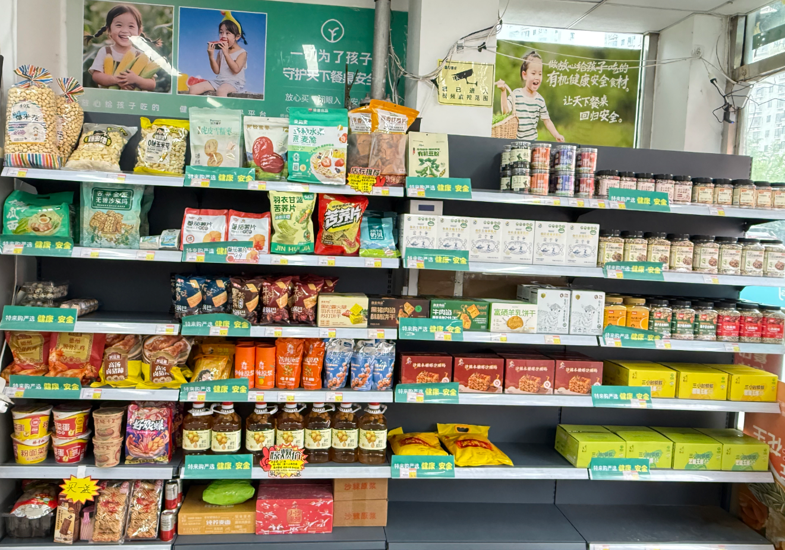

# 郭 忠磊 TOP 报告 — 2026-W29

- 组织：T.R.E.-China
- 周次：2026-W29
- 员工编号：2200400
- 提交时间：2026-07-17 08:17:52.710521
- 职位：拠点長
- 所属：T.R.E.-China 青島創迹 拠点長

---

■価値基準

経営陣TOP報告とケヴィン・ケリーが著書『失控（アウト・オブ・コントロール）』

現代世界は、技術パラダイムが急激に変容する分岐点に立っています。トライアルグループは、流通・小売業界の先駆者として、今まさに「AI活用での世界的事業展開挑戦」という新たなスタートラインに立っています。目まぐるしく変化する市場と技術革新の激流を前に、グループは「流通・小売事業」と「DXの推進及び技術開発」を二大成長の柱として明確に位置づけました。これは単なる技術的なアップグレードに留まらず、AIを社会インフラに深く埋め込む「産業変革」への大きな挑戦です。テクノロジー思想家ケヴィン・ケリーが著書『失控（アウト・オブ・コントロール）』で明かした自然界の進化の法則と結びつけることで、トライアルグループが描く未来の小売地図が、「分散型」「ボトムアップ」「境界イノベーション」に合致する「無限ゲーム」の絵巻物であることが見えてきます。

1.HisaoGPTから部門別GPTへ：「分散」と「数値経営」の加速

トライアルグループは、過去1年間にわたり、創業者の思想や組織の価値基準を継承・システム化するための「HisaoGPT」の運用を積極的に推進してきました。しかし、実践という「最良の教師」は、速やかに二つの核心的な課題を浮き彫りにした。

第一に、NotebookLMのような汎用ツールの現状の形式には限界があり、継承の基幹システムとするためには、独自のRAG開発や他のシステムとの連携が不可欠であること。

第二に、アパレル部門などの現場からの個別具体的・戦術的な質問に対して、大局的な思想戦略を中心としたコーパスでは十分な回答を返せないことです。この気づきが、各事業部門に最適化された「細分化GPT」の必然性を導き出す契機となりました。

これはまさに、『失控』における「分散型」および「モジュール式成長」の法則と合致しています。複雑な生命体や強力なAIシステムは決して単一の結晶ではなく、数多くの自律的なモジュールやネットワークユニットが入れ子構造になった階層から成り立っています。トライアルグループが掲げる経営の二大柱である「思いの丈」と「数値経営」を両立させるためには、単一のジェネラルな脳（GPT）に頼るのではなく、アパレル、食品、物流といった具体的な事業ごとに、業界知識、競合情報、日々の戦略会議などのドキュメントを学習させた「事業専用GPT」を分散型で構築しなければなりません。このボトムアップな知識の自組織化プロセスを通じて、データという無形資産が最大限に活用され、組織全体の意思決定の質と速度にドラスティックな飛躍がもたらされるのです。

2.リテールエージェント（Retail Agent）：不均衡を維持するインテリジェントコア

部門別GPTが神経細胞であるとするならば、e3smartプラットフォームに蓄積された膨大なデータを解析して生まれる「リテールエージェント」は、トライアルグループがグローバル市場に打って出るためのコアとなる母艦です。リテールエージェントは単なる分析レポートツールではなく、自らデータを分析し、問題点や改善すべき課題を発見して関係者へ提示する、高い能動性と自己進化能力を備えた自律的なシステムです。問題が拡大する前に迅速に対応を促すことで、人機共生による継続的な組織変革を実現することが可能でしょう。

ケヴィン・ケリーは、健全な生態系は「永続的に不均衡状態を模索する」と指摘しています。完璧なバランスは生態系において死を意味し、生命力に満ちたシステムは、常に「カオスの縁」で優雅にステップを踏むことで、機敏な適応力とイノベーションへの優位性を維持することです。リテールエージェントはまさに、このような「不均衡状態」を絶えず維持するための触媒です。

トライアルグループは、真のテクノロジーブレイクスルーが権力の絶対的中心ではなく、常にサブカルチャーや辺境といった「境界（エッジ）」から生み出されることを深く理解しています。そのため、自社単独での開発に閉じこもるのではなく、「チームジャパン」として多様なパートナー企業を巻き込み、バリューチェーン全体でデータと知見を共創するエコシステムプラットフォームを提唱しています。

この構想を具現化する物理的拠点として、宮若の脇田研修所の拡建や、箱根の「e3smart村」、沖縄などが配置されています。

これらの物理的拠点は単なる設備ではなく、トライアルグループが「変化を生み出すための環境（ルール）を変化させる」ために用意した、システム再起動の方程式です。快適でインスピレーションに満ちた境界環境において、1on1、OJT、パンダ講義などを通じて人材育成と知の共有を進め、個々の能力の限界を「最大化」させます。この無限ゲームにおいて、交わされるのは商品単体ではなく、データと最先端の集合知であり、真の意味で「変化が変化を生む」スパイラルが駆動されるのです。

■OKR/MBO

2026年重点施策内容：

1−1.売上確保

・週次稼働率の確認

・月次売上予算達成のPDCR実施

・業績重視組評価の活用

1−2.若者登用

・PM単位のNextmeの教育実施

・若者の自己競育環境の構築

・定期面談の実施

1−3.効率向上

・スーパーパーソナル事例作成

・技術TOP人員の技術力発揮

・一人当たり売上1.3倍へ

2-1.店舗運営：

・日商4000元のモデル店舗の構築

・30㎡で日3000元のモデル店舗の構築

・モデルまとめ＆アウトプット

2-2.知識有料化：

・開店準備に関する内容

・店舗運営方法に関する内容

・コミュニティ店舗ライブ配信に関する内容

2-3.コミュニティ店舗ライブ配信の招商：

・コミュニティ店舗ライブ配信で青島に加盟店100店舗を展開

・人員体制の強化

・自社ブランドに加盟する10店舗を募集

今週、中途採用の張さん、およびGOチームより帰国された趙一婷さん、来晋强さんの3名から専門的な知見に基づく貴重なアドバイスをいただき、店舗の棚替えおよび店内の大幅な環境整備を実施いたしました。以下にその詳細と初期効果、および今後の展望を報告いたします。

1. 入口棚のレイアウト刷新とコンセプトの明確化

従来の課題：

これまで入口付近に設置していた4本の棚は、陳列されている商品の分類やターゲットが曖昧であり、お客様が来店された際に「何に強みがある売り場なのか」が一目で伝わりにくいという課題を抱えていました。

改善策（健康食品へのシフト）：

アドバイスに基づき、ターゲットを「シニア・健康志向層」に明確化しました。入口の棚4本を年長のお客様向けの健康食品中心の構成へと全面的に入れ替えました。また、売場の信頼性とブランド価値を高めるため、「特来购严选 健康・安全」の共通ラベルを貼付し、視認性を高めるための「健康食品」専用POPを新たに設置しました。

導入初期の効果（即効性の確認）：

偶然の要素もあるかと思いますが、午前中にこの棚替えを完了したところ、同日午後に早くも「木糖醇沙琪玛」2箱、および「小米2.5kg」1袋が即座に動くという、極めてポジティブな反応が得られました。コンセプトの明確化がお客様の購買行動に直結した好例と言えます。

2. 店舗全体の魅力向上に向けた整備内容

入口の棚替えに加え、店舗全体の回遊性と客単価アップを目指し、以下の4つの整備を同時並行で実施いたしました。

入口看板の追加： 通行客へのアイキャッチを強化し、入店率の向上を図ります。

子ども向け商品棚の追加（1本）： ファミリー層の獲得に向け、子連れのお客様が足を止めやすいコーナーを新設しました。

パンのアイテム数増加： 日常的な来店頻度（来店サイクル）を高めるため、主食商品の選択肢を広げました。

果物コーナーの強化： 新鮮さと季節感を演出し、店舗全体の活気と安心感をアピールします。

3. 今後の決意：数字で結果を出します。

今回の棚替えと整備は、メンバーのアドバイスをスピーディーに実行に移したことで、非常に手応えのあるスタートを切ることができました。

今後は、このレイアウト変更が単なる「見た目の改善」にとどまらず、客単価、買い上げ率、そして最終的な売上総額にどう寄与したかをデータで厳しく検証していきます。「数字で結果を出す」という強い覚悟を持ち、日々の売上動向を注視しながら、さらなる微調整とPDCAサイクルを回してまいります。
