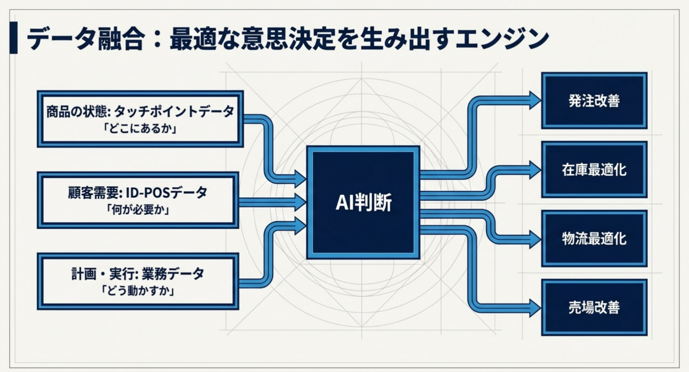
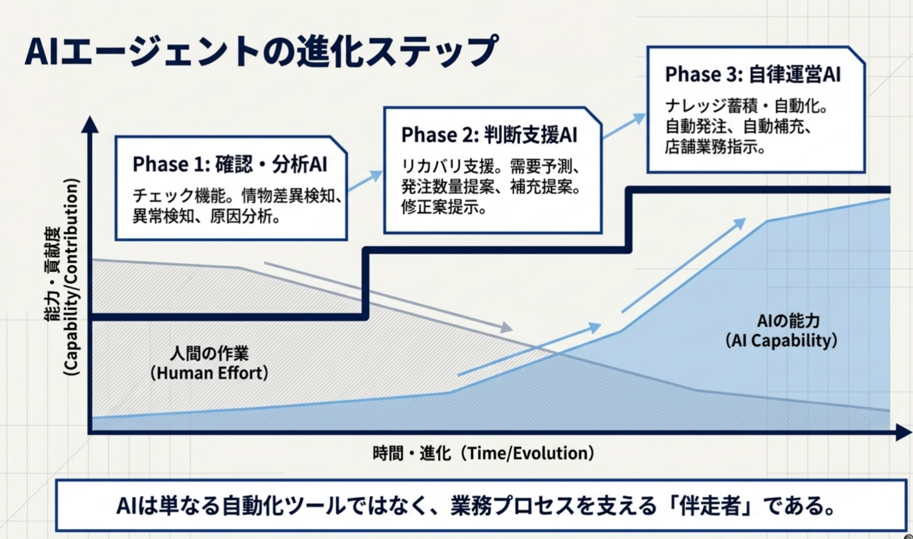
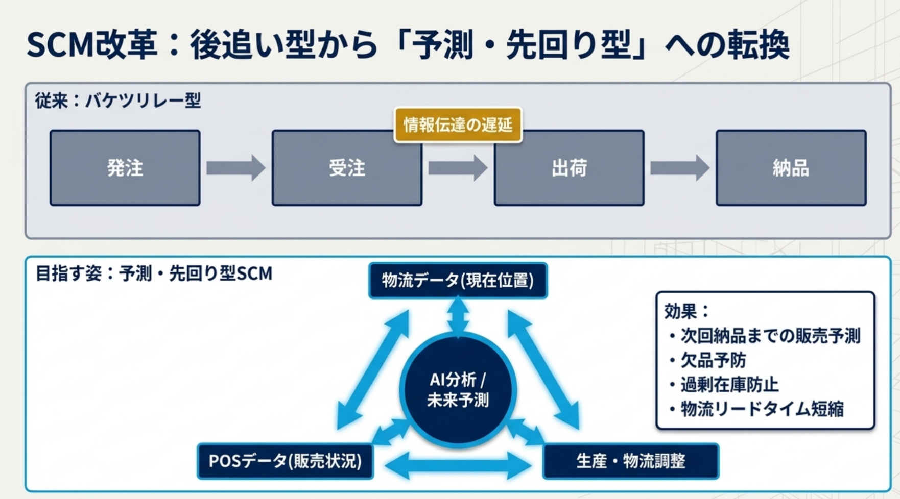
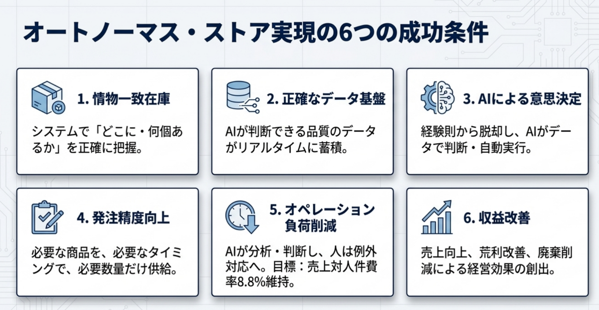

# 李 想 TOP 报告 — 2026-W29

- 组织：T.R.E.-China
- 周次：2026-W29
- 员工编号：2200508
- 提交时间：2026-07-17 00:20:50.592623
- 职位：部長
- 所属：T.R.E.-China 中国国内事業群 AI工業事業部 部長

---

お疲れ様です。李想です。

28週のTOP報告です。

■価値基準

今週のテーマは「AI活用での世界的事業展開へ」という内容です。今週は、「流通・小売事業」と「DXの推進」という二大柱をデータとAIで融合させ、世界市場へ挑戦する具体的なロードマップが示されました。「TrialGPT」による知の資産化と、「リテールエージェント」によるプロアクティブ（先回り型）な課題解決。この2つの「大きな乗り物」を構築していくプロセスは、私たちが日々直面しているAIプラットフォーム開発の最前線の課題と完全にリンクしています。

■基幹システムの構築

1：データの活用

トライアルGPT（TOP報告・面談・関連知識）

リテールエージェント（e3smart活用）

■各部門のGPT

・HisaoGPT運用での気付き

・細分化GPTの必要性

・運用体制

■リテールエージェント

・体制

→巻き込み力をチームジャパンで形成

→メーカーや問屋も

→e3smart強化体制

2：変化のために必要な事

■TOP報告の在り方

■環境

・私の教育体制

まとめ

■基幹システムの構築 1：データの活用 従来の経験や勘に依存した属人的な経営から、データとAIによる意思決定の質と速度の向上へ。流通という社会インフラにAIを組み込むことは、単なるツールの導入ではなく、組織のOSを根底から書き換える作業です。ここでは「トライアルGPT」と「リテールエージェント」という、役割の異なる2つの高度なAIシステムがその両輪となります。

■各部門のGPT ・HisaoGPT運用での気付き / ・細分化GPTの必要性 NotebookLMを活用した運用から1年が経過し、「独自のRAG開発の必要性」や「戦略レベルの回答精度の限界」という壁に気づかれた点は、極めて本質的な技術的見地だと深く共感しました。AI開発プラットフォームを統括する立場として痛感するのは、LLMは単にテキストデータを流し込むだけでは、抽象的な一般論しか返してこないという残酷な事実です。 アパレルならアパレルの、物流なら物流の「専門知識・業界動向・日々の会議録」を構造化して読み込ませる「細分化GPT」の構築は不可避です。思想の継承（思いの丈）だけでなく、現場が数値を改善するための戦術をAIにアシストさせるためには、この「ドメイン特化型のデータ整理」こそが最大の鍵になります。 ・運用体制 これらを単なるシステム構築で終わらせず、秘書室や未来戦略室が連携して情報を継続的に整理し、「使いながら育てていく」運用体制が明言されたことは、AIを組織の血肉にするための極めて現実的かつ強力なアプローチです。

■リテールエージェント ・体制 / →巻き込み力をチームジャパンで形成 / →メーカーや問屋も / →e3smart強化体制 「人がAIを使う」段階から、「AIが自らデータを分析し、問題が大きくなる前に課題を発見して改善を促す」というエージェント型AIへの進化。これは、工業用AIやマシンビジョンにおける「異常の早期検知と自動フィードバック」の概念を、流通のサプライチェーン全体に適用する究極の形です。 そして、これを自社だけで完結させず、ここ宮若をハブとして、メーカー、卸売業者、ITベンダーを巻き込んだ「チームジャパン」の巨大なエコシステムを形成する。箱根の「e3smart村」にデータサイエンスの頭脳を集結させ、宮若で実証と開発を回していく。この壮大なプラットフォーム構想は、日本発のリテールテックとして世界と戦うための最も強力な武器になると確信します。

2：変化のために必要な事 ■TOP報告の在り方 こうした高度なAIシステムが実装されていく中で、人間の役割も劇的に変化しなければなりません。AIが数値を分析し課題を提示してくれるようになる以上、私たちが書くTOP報告は「過去の要約」ではなく、「AIが提示した課題に対して、現場で自らどう考え、どのような改善策を実行し、どういう結果（成功・失敗）を得たか」という「実践のデータ」を共有する場へと進化する必要があります。失敗すらも正確に記録し、他の部門のGPTの学習データとして還元していく。これこそが「組織そのものが学習する」仕組みです。

■環境 ・私の教育体制 これらの変革を絵に描いた餅にしないためには、人が新しい発想を生み出すための「環境」が不可欠です。麻布台ヒルズの1on1センターや、ここ宮若の別荘型ミーティング環境など、トップ自らが「人が集い、議論し、化学反応を起こす場」に投資されている意味の大きさを感じます。 「環境が変われば行動が変わり、行動が変われば組織文化が変わる」。私自身も技術チームを率いるマネジメントとして、ただ目標数値を与えるだけでなく、エンジニアたちがAIの限界を突破し、新たなアーキテクチャに挑戦したくなるような「心理的・物理的な開発環境」をしっかりと整えていかなければならないと痛感しました。

まとめ 今週は「リテール×AI×DX」によって世界的なインフラを創り上げるという、極めてエキサイティングな未来図が示されました。この巨大な構想を実現するためには、私たち一人ひとりが過去の延長線上の仕事を捨て、AIを使いこなしながら「新しい価値を創造する役割」へと自らをアップデートさせ続ける必要があります。 次週予告されている「時間の使い方」は、まさにこの変化を個人の日常レベルにどう落とし込むかという最も実践的なテーマだと推察します。私自身、AIが代替できる業務に時間を奪われていないか、真に付加価値を生む「思考と挑戦」に時間を投資できているかを自問自答しながら、来週の報告を待ちたいと思います。

■オートノーマスストア関連

今週は情報収集と限られている情報を本に、情報のマイニング、記載内容の理解と方法を考えながら頭の整理をしている週です。

石橋社長からいただいた資料と説明をもとに、キーワードを使って関係者のTOP報告や資料を読んでいて、ミッションとして上げられている「オートノマスストア」はどんな状態を目指すのか、どんな条件を達成したら、オートノマスストアとして「できた」と言えるでしょうか？など、考えて頭整理と書いてみたところです。

＞①本質：オートノーマス・ストア実現の成功条件

情物一致 ＞ 正確なデータ ＞ AI判断 ＞ 自律店舗

AIモデルの性能だけでは自律運営は実現できない。

AIが信頼できる判断材料（正確なマスタ、リアルタイム在庫、正しい業務履歴など）を持つことが必須条件。

つまり、「情物一致」は前提として整理しておくべきです。

＞②現在の課題：機能する業務プロセスが欠如している

２．１．商品情報精度不足

原因：マスタ不備（サイズ未登録、ケース入数誤り）、JAN変更管理不足。

その影響するもの：

AIが過去実績を正しく利用できず、正しい販売計画・発注判断ができない。

２．２．計画と供給の不一致

原因：売場計画と配荷計画の分離。発注変更履歴の欠如。

その影響するもの：

計画商品未納品、計画外商品到着、過剰在庫、欠品。

２．３．店舗オペレーション標準化不足

原因：販促終了商品の判断（定番戻し、値下げ、処分）が属人的。

その影響するもの：

人時不足。作業量の可視化ができず、店舗改善が属人的になる。

＞③成功に向けた3つの重要論点

3.1　AI精度より先に「データ品質」を作る

正確な商品マスタ、リアルタイム在庫、正しい業務履歴の徹底。

タッチポイントの考え方を活用すること。

3.2　AI導入より先に「業務プロセス」を標準化する

経験依存から脱却。標準プロセスと標準判断基準を設け、AIが再現可能な業務構造へ変更する。

トライアルの今までのよく言われている問題は標準化の欠如、またはSOPがあるとしても徹底力の欠如。

だから、プロセスを正しく行われることがなければ、AI導入しても、効果は明らかな状態へ至らない。

3.3　単店改善ではなく「流通OS化」を前提に設計する

1店舗の成功に留めず、店舗・物流・メーカー・卸のデータを連携できる構造へ。

ちょうど7月からトライアルテクノロジーという組織は発足していて、

その中に流通OSというコンセプトも上げられて、その構造とあわせて、未来の自律型店舗を実現していけたらと思っています。

それに、LLMを活用して質疑応答でリクエストをしながら、フレームワーク的な構造やポイントを洗い出して生成してくれたスライドは以下に書いてくれています：

＊データ元材料は過去数週間の関係者のTOP、パワポ資料、ワード資料など

これらを実現していくことは、キーワードとしてよく取り上げられているのはAIです。これは単にデータマイニングのAIや、マシンラーニングのAIとかではなく、広義的AIを言われています。

または、AIはスマート的な自動化や半自動化を行うアシスタントと思ってもらったら結構です。

もちろん、IoTデータ、カメラなどのビジョンデータ、またはPOSデータ、さらに天気予報やコーザル情報など、たくさんの情報を構造的に整理されて、AIの推論エンジンによって動くわけです。

今の問題は、AIの精度は肝ではなく、データの実態を把握できることです。または、オペレーションは最初にサークルを回せるために、ビジネスロジック検証を行う必要と思ってて、人の手でも、人の目でも、人の足でも、運用をやってみる、結果を確認しておくことは最初に思ったらよいでしょう。

結構範囲は広いものの、どこから最初の掴むポイントになるか、いろいろ悩んで考えています。来週日本に着いたら情報のヒヤリングや打ち合わせは石橋社長のもととご指導に、速やかに進んでいきたいと考えております。
