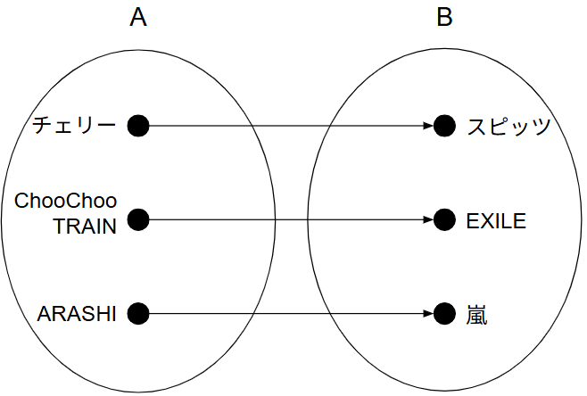
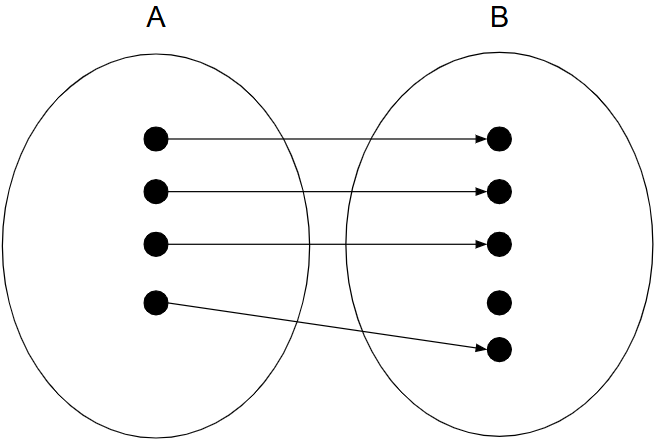
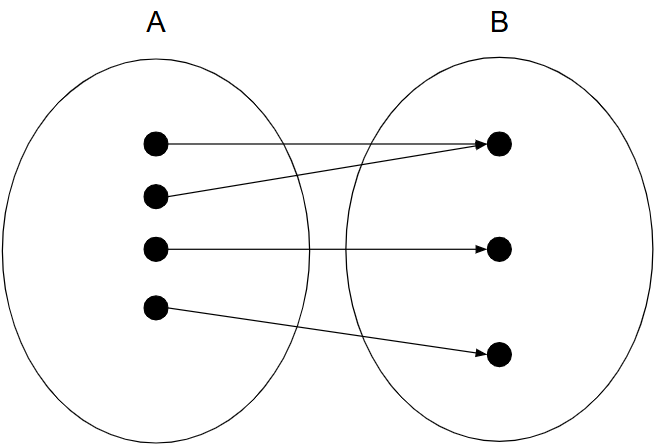
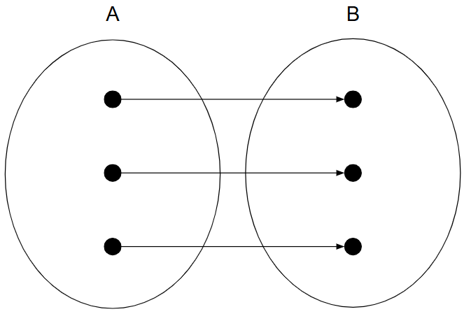
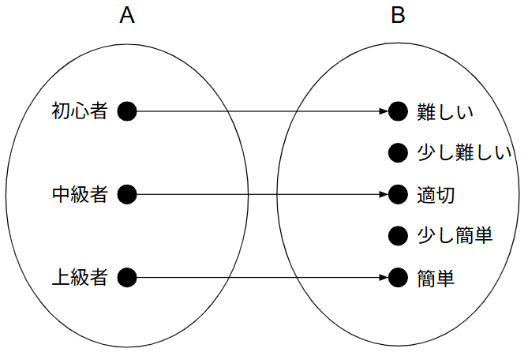
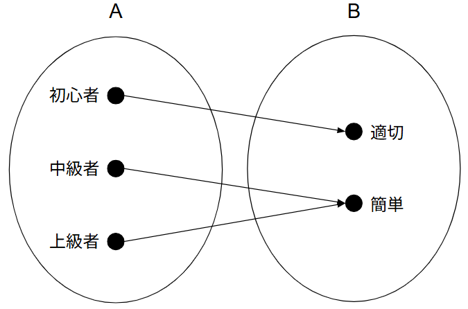
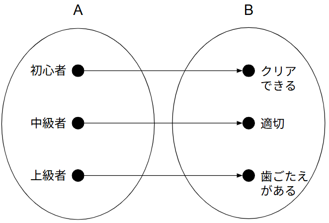

# 山口 椋太郎 TOP 报告 — 2025-W36

- 周次：2025-W36
- 报告类型：TOP
- 提交时间：2025-09-04 03:08:12
- 职位：Engineer

---

【価値基準】

今週のテーマは「整理する能力」です。

会長は視点を変える事で様々な「整理」が存在すると言われています。今回は数学的観点で整理について記載していきます。

数学は式として論理的に物事を表現することができるため、整理するにはうってつけの学問です。今回は数学の写像という考え方について整理にどう活用できるか考えていきます。

〈写像〉　※難しければ飛ばしてAIの回答のあたりから読んでみてください

集合Aのそれぞれの要素に対して、集合Bの要素を1つずつ定める規則のことをAからBへの写像と呼びます。

文字だとわかりづらいため具体例で図を用いつつ記載します。下記図のように集合AとBがあり、集合Aは曲、集合Bは歌手を含む集合です。この時AとBは曲とその歌手を結びつけるという関係性において写像といえます。ちなみに、集合AとBが写像であることをf:A→Bと表現します。そして、集合Aのチェリーの歌手は集合Bのスピッツであることをf(チェリー)=スピッツと記載します。

これだけでは写像って何に使えるのとなってしまうため、ここからは写像の種類について説明していきます。

写像には主に下記の3種類があります。

①単射

②全射

③全単射

それぞれの意味を図とともに解説していきます。

①単射：矢印の先が重複しない

②全射：矢印の先が集合Bを網羅している

③全単射：単射かつ全射(矢印の先が重複しないかつ網羅している)

この3つの視点を持って整理を行うことで重複や抜け漏れ防止につなげることができます。例えば、単射を意識することで異なるものが重複した同じ結果になってしまうことがないか、全射を考えることでアウトプット先の漏れがないか考えられます。

次にこの3種を具体的な事例に当てはめていきます。事例としては、最近私が個人的に思うことのある「ゲームの難易度」について取り上げます(思うことについては後述します)。まずはAIにゲームの難易度について写像をもとに回答をもらった結果が下記です。

〈AIの回答〉

単射：プレイヤーの実力ごとに 違う難易度体験が得られる。

例：初心者 → 難しい、中級者 → ちょうどいい、上級者 → 簡単。

メリット：プレイヤー間の体験が差別化される。

デメリット：中級者と上級者が「同じように退屈」と感じるなど、かぶりが出たら単射性が崩れる。

単射な設計は「実力に応じて体験がきちんと分かれている」こと。

全射：すべてのプレイヤーが遊べる難易度。

例：初心者には適切、中級者には簡単、上級者にも簡単。

メリット：いろんなプレイヤー層がクリアできる。

デメリット：難易度が低すぎると満足度できない層が増える。

全射な設計は「初心者でも楽しめる」こと。

全単射：プレイヤーの実力ごとに「唯一無二の適切な難易度」が存在する。

初心者 → EASY、中級者 → NORMAL、上級者 → HARD。

メリット：全員に最適な体験を提供できる理想的な状態。

デメリット：現実のゲームでは、全員にピッタリ合う難易度設計は難しい。

全単射な設計は「すべてのプレイヤーに最適な難易度が1つずつ対応している」理想形。

続いて、AIの回答について言及していきます。

〈山口の記載〉

AIの回答をよりかみ砕いて解説してみます。

AIは集合Aがプレイヤーのレベル、集合Bがプレイヤーの難易度に対する感情を示すものとして回答されています。

単射では、難易度が固定化されたゲームにおいて、中級者には適切なレベルに感じられるが、初心者や上級者には難易度が合わない状態を表現しています。プレイヤーの実力により得られる感情が異なり、実力を感じられるというメリットはありますが、難易度は固定のため、適切な実力を持ったプレイヤー以外は楽しめません。また、中級者が少し難しいレベルを体験したいとしても実現できません。

次に全射は、初心者に難易度を合わせたゲームです。初心者でもゲームクリアを目指して楽しめるものになります。誰でも楽しめることがメリットではありますが、上級者になればなるほどあっさりとクリアでき、物足りなくなる可能性があります。

最後に全単射は、難易度選択のあるゲームで、誰でも楽しめるようなゲームを指しています。初心者であればEASYモードで緩く遊ぶ、上級者であればHARDモードで難しさを楽しむなどプレイヤーの実力や求めるプレイ感によって難易度を調整し、楽しむことができます。

これを見ると全単射な設計をしたゲームが最も優れているように見えます。実際、AIも全単射な設計は理想であると言っています。しかし、私は全単射で難易度調整の効くゲームが必ずしも良いとは思っていません。ここで冒頭で述べた「ゲームの難易度」について思うことに立ち返ります。最近ゲームをやっていて達成感を感じづらくなったと思うことがあります。難易度もちょうどいいのになぜだろうと考えたところ、幅広い層に楽しんでもらうために難易度の調整や救済要素(無敵アイテムや協力NPCなど)があるからだという結論に至りました。もちろん全単射な設計のメリットで述べたように、難易度選択をすることでちょうどいい難易度で遊べています。しかし、難易度を簡単にしたり、救済要素を使うことでもっと簡単にクリアできるのになという考えが頭の片隅にあるからだと思います。そのため、自分の実力を上げなくても簡単にクリアできる術があるのに、敢えてそれを使わずに縛りプレイ(自ら制限を設け難易度を挙げる行為)をしている感覚があります。また、難易度を下げれば誰でもクリアできることから、ゲームをクリアしたという結果に対する貴重性も失われます。時間をかけて実力を磨いた自分だからクリアできたという優越感を得ることができません。最近のゲームはユーザーフレンドリーになる一方で、コアなユーザーへの満足度は下がっているのではないかと感じています。むしろ単射な設計思想で難しいゲームの方が、クリアできた時の達成感は大きいです。なぜなら、実力を上げるしかクリアする術がないからです。このことからAIの回答である全単射の設計が理想だといいきることはゲームにおいてできないのではないかと思います。そのため、ペルソナを考えて特定のユーザーにぶっ刺さるものを作った方がユーザー1人1人の感情の高ぶりが大きいゲームになります。もちろん利益の上がるユーザー数が獲得できるペルソナにする必要はあります。

じゃあ、私が携わっているPOSについてはどうでしょうか。POSはそもそも全てのお客さんが利用するものであるため、ペルソナ設定が困難だと考えています。ペルソナを設定し、そのお客さん以外は使えなくていいようなものにすると店舗として成り立たなくなります。そのため、極力間口を広げることが重要で、ゲームの例であげた難易度を初心者に合わせる全射な設計思想が合っていると考えています。ちなみにトライアルのPOSは全単射に近いと考えています。なぜなら、ポイントを利用しようとしてやっぱやめるなど戻る操作が可能だったり、電子マネー残高が不足している時に現金と併用できるなどマニアックな分岐が存在し、自由度が高いからです。操作に慣れている人にとっては便利に感じられるかもしれませんが、慣れていない人にはいつもと違うケースに遭遇するパターンが増えて混乱します。そのため、もっと操作パターンを減らし、全射的な設計にする方針の方が良いのではないかと考えています。

今回は数学の写像を用いて整理を試してみました。写像には他にも紹介しきれていない要素があるため、整理の視点を増やすという意味でも機会があれば紹介したいと思います。

【アウトプット】

〈CDA新人教育委員会〉

ゾーンマネジメントの講義を進めてもらっています。ゾーンマネジメント自体難しい内容であるため、新人の方は気軽に質問してもらえればと思います。委員会の運営については、他委員会との連携が課題となっています。新人とメインに接し、課題などを与える役割が新人教育委員会にはありますが、他ルートで新人にいった課題を検知できず、新人の総合的な負荷を考慮できていない部分があります。業務負荷など新人の個人的な話は新人教育委員会のサポートチームが運営する面談から情報収集していきます。CDAの他委員会からの新人への依頼ごとについては、新人委員会で把握できるように、新人委員会に情報が通るルートになるよう他委員会へ相談を進めています。

【業務報告】

AzureのTLS1.0,1.1提供終了の対応として、マスタディスク更新作業をTECさんに共有し、実施してもらえる環境ができていることの確認がとれました。TLS1.0,1.1提供終了後の初回実施時は、私も裏で待機してトラブル時は対応できるように事前連絡いただく手筈を整えています。物理的にマスタディスクを交換するとなると、70拠点ほどあるTECさんの事業所全てでマスタディスクの入れ替えが発生し、約400万円のコストがかかりますが、適宜TECさんにリモートで更新作業対応を行ってもらうことで、費用を0円に抑えることができました。

AzureのTLS1.0,1.1提供終了告知ページ：

https://learn.microsoft.com/ja-jp/azure/application-gateway/application-gateway-tls-version-retirement

特殊対応を行っているタイヨウさんへのリリースのため夜間対応を実施しています。夜間のNWが遅く対応に時間がかかりました。特に21～22時半頃が遅く、恐らくですがみんながスマホを使っているなどNW利用者が多い時間帯だからという可能性が考えられます。今後の夜間対応はもっと時間を後ろ倒しして対応した方がスムーズかもしれないため、時間の変更も検討していきます。
