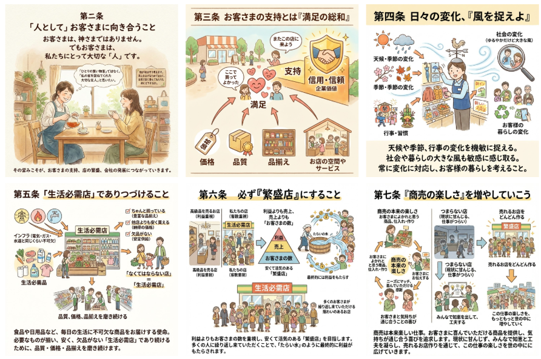

# 山口 椋太郎 TOP 报告 — 2026-W05

- 周次：2026-W05
- 报告类型：TOP
- 提交时间：2026-01-31 11:17:15
- 职位：Engineer

---

【価値基準】

トライアル商道哲学七か条についての話題がありました。まだまだ覚えられていないというお話しがあったため、AIを活用して頭に入れていただく機会にしていきます。最近はみなさんご存知かもしれませんが、AIによる画像生成の発展には目を見張るものがあります。特にGoogleの画像生成能力は飛躍的に向上しているためその実力を見ていただくという意味も兼ねて、商道哲学七か条をGoogleのNanoBananaにイラスト化してもらいました。第一条商売の大原則は「たらいの水」に関しては既にイラストがあるため今回は対象外としています。ぜひAIのイラストイメージを活用して頭に入れていただければ幸いです。

Nano Bananaより生成

トライアル商道哲学七か条を改めて見返し、直近で特に大切だなと感じているのは第七条の「商売の楽しさ」を増やしていこうです。

第七条の説明にもある通り、商売とは楽しいものです。しかし、小売業界に従事しながら、その楽しさに気づけていない人は多いのではないでしょうか。少なくとも過去の私はそうでした。プログラマー職としてシステムに関わる部門に入社した私は、ITばかりに興味を示していました。とにかくプログラマーとしてIT知識をつけたり、バリバリコーディングをしていきたいという考え一辺倒で、学生時代カッコイイプログラマーに憧れて入社したと言っても過言ではありません。しかし、実際に入社すると、プログラムを書くことだけが仕事ではありませんでした。なんならプログラムを書くことはほとんどなく、お店という現場で立ち合いやヒアリングを行ったり、他部署との会議に参加することのほうが多かったです。そこにギャップを抱くことはありましたが、上司やチームメンバー、CDAによる多くの部署との関わりなどもあり、それはそれでやりがいを持って取り組むことができました。寧ろ、この経験や周囲の教えがなければ、プログラマーとしてプログラムを書くことだけが仕事となり、現場や運用を知らずにプログラムのかっこよさだけを求める自己満なプログラマーになっていたかもしれないと考えると恐ろしいです。どうしてもバックオフィス業務の場合、商売や小売という視点から遠ざかってしまい、そこに楽しさや興味深さを抱くことは難しいかもしれません。しかし、せっかく小売業界に従事しているからにはその楽しさを知らないのは勿体ないことですし、小売業界の理解を深めることで、より有意義な仕事に取り組めると感じています。そのため、小売の楽しさについてももっと発信していきたいと考えています。まずは、今後入社してくるCDAの新入社員に対しての教育アプローチから工夫していく想定です。ここについては事項のアウトプットで詳細を後述します。

【アウトプット】

〈ルーキー教育〉

青本合宿

青本合宿の準備に向けた会話を進めています。青本合宿で重要視したいことの1つとして小売の楽しさを知ってもらうことを掲げようと考えています。なぜなら、青本合宿に参加するCDAのメンバーは、合宿後に現場研修が始まりますが、小売の知識がなければ、学べることや気づきは減少してしまいます。そこで、合宿中に少しでも小売に興味を抱いてもらい、現場研修で積極的に学びを得られる足掛かりを作ってもらいたいと思っています。特にバックオフィス系のメンバーは、早く本社で自分がやりたかった職種について取り組みたいという気持ちを抱いたり、現場で研修に参加していて後れを取っているのではないかとご認識してしまい、現場研修への参加が消極的になる可能性があります。そうならないように、各部署の先輩方からその部署において現場研修で学べることを事前にインプットしてもらう時間も設けられるように進めています。そして、現場研修で各自が学ぶことを見つけてもらい、研修後にその内容に関してレポートでアウトプットしてもらう流れで構成を考えています。

KPI

ルーキー教育委員会のKPIについて認識合わせを未来戦略室と実施しています。CDA全体のKPIと各委員会のKPIが繋がらなそうな部分があったため、そこについて会話しています。委員会のKPIは教育に関する行動目標重視で委員会のKPIは昇級人数など結果重視なのですが、委員会の行動KPIが達成されると全体KPIの結果も達成されるとは限らないものでした。厳しく教育をすればするほど全体KPIの達成から遠ざかってしまいます。特にルーキーに関しては全員を昇級させることが全体KPIとなっていたため、それでは昇級させることが目的となってしまい、教育に対して変な甘さが生まれてしまう可能性を伝えています。結論として、全体KPIは適切な難易度調整のための役割を果たす必要があり、考査の合格率などもそのKPIを指標として、調整をかけていく形がいいのではないかという内容で終話しています。この方針で問題なければ、具体的にどの程度の数値にすべきなのかや難易度調整をかける場合のプロセスについて詰めていきます。

【業務報告】

〈リリース〉

マスタの設定不備により一部店舗の一部レジでボタン表示が崩れてしまうトラブルが発生しました。

設定修正の対応と対象店舗に架電し、設定を反映させるための対応を行い、問題は収束している状況です。本日は問題の解決にリソースを割いたため、なぜ問題が起きてしまったのかは別途対応したメンバーと会話し、原因追究と対策を講じます。

該当する店舗および関係各所、ヘルプデスクの方にはご迷惑をおかけしたことをこの場で謝罪させていただきます。店舗の方は、怒りもせず寧ろ気づく前に説明してもらえたことに感謝を述べられました。親切な方がお店には多く、それがお客様の指示に繋がっていると感じられるやりとりでした。今後はご迷惑をおかけしないようにしますので、これからもよろしくお願いいたします。

〈レーンセルフレジ〉

客面ディスプレイを撤去した構成が可能か回答待ちです。来週に正式回答をTEC社からもらえる予定となっています。

〈トライアルプラスクーポン対応〉

アプリ側でトラブルが起きているため待ちの状態です。POS側とのインターフェース接続に問題はなく、POS側のテストは完了しています。そのため、次回作成するモジュールにはクーポン機能を組み込んでおく流れで進めていく予定で合意をもらっています。ただし展開スケジュールはまだ決まっていません。1ヶ月以上前に連絡いただかなければスムーズな導入は難しい旨をチームメンバーより伝えてもらっています。そのため、リリーススケジュールの要調整事項として把握し、スケジューリングを行っていきます。

〈POS電源運用〉

担当の後輩が別件対応を優先しているため一時停止状態となっています。再開次第、フォローを行っていきます。

〈展開チームMT〉

議事録の作成が惰性となってしまっており、特に決定事項に関する合意の経緯や発言のログ記録が疎かになっていました。この機会に議事録のフォーマット含め、議事録の取り方に改善をかけています。議事録のとり方が定まってきたら、他の会議帯でも活用していきます。参画してきた後輩に悪い手本をみせないように全ての物事に気を払って取り組んでいきます。
