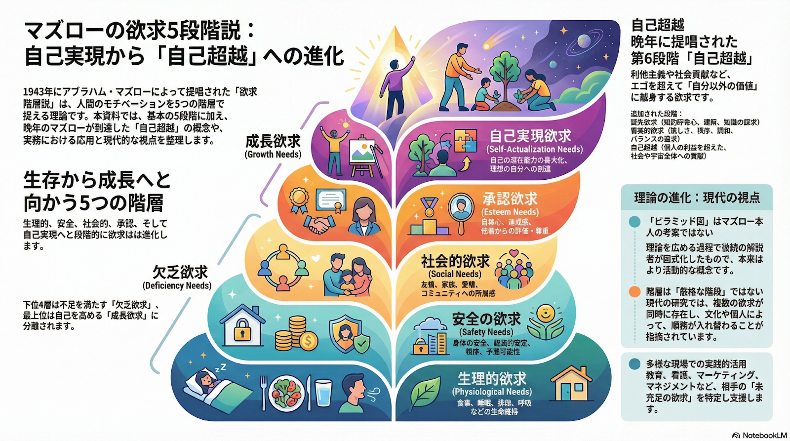

# 山口 椋太郎 TOP 报告 — 2026-W08

- 周次：2026-W08
- 报告类型：TOP
- 提交时间：2026-02-19 08:32:53
- 职位：Engineer

---

【価値基準】

今週はシヌキーズとオワリーズという強烈なワードがあったため、それらについて考えてみます。

まずはシヌキーズとオワリーズについてAIに生成してもらったインフォグラフィックより振り返ります。

> 图片 1：原图源地址返回 HTTP 404，无法本地保存。

オワリーズは経営陣クラスの人達が安定した資産が得られたことにより情熱を失った人と理解しています。そこで、元々経営陣としてシヌキーズだった人がなぜオワリーズになってしまうのかにフォーカスして考えてみます。

〈AI記載〉

前提

「シヌキーズ」から「オワリーズ」への変質という現象を、心理学の古典的フレームワークである「マズローの欲求5段階説」に当てはめて考えると、「下位の欲求が満たされれば、自然と上位の欲求へ向かう」というマズローの定説に対する「矛盾（反例）」が見えてきます。

立てた問い

マズローの矛盾：なぜ『資産形成（安全・承認）』の充足は、『自己実現（シヌキーズ）』へのステップアップではなく、情熱の鎮火（オワリーズ）を招くのか？

〈山口記載〉

AIが記載するように、シヌキーズからオワリーズへの転換は、マズローの欲求5段階説とは一見矛盾しているように見えます。それが本当に矛盾しているのかまずはマズローの欲求5段階説についてAIによるインフォグラフィックで確認します。

オワリーズはこの5段階の欲求の内どこまで満たしていたのかがポイントになります。資産は形跡されていたことから、生理的欲求と安全の欲求は確実に満たされています。経営陣まで上り詰めていることから社会的欲求や承認欲求も満たされている可能性が高いです。ここまでの欲求は欠乏欲求と呼ばれ、満たされると動機づけが低下すると言われています。一方、自己実現欲求は成長欲求であり、満たされるほど強まるものです。ここで重要なのがオワリーズは「指示通りに行動していた」ということです。指示通りとは言われたことをやっている状態で主体が自分ではありません。欠乏欲求を求めているフェーズではそれでも問題がなかったのかもしれませんが、それが満たされてしまうと死ぬ気でやる動機が失われてしまいます。

会長はシヌキーズに対し、「私利私欲ではない思いの丈」「ビジョン実現のために自身の人生をかける意識」という、自己実現のさらに上を行く自己超越的なマインドを求めています。一方で、オワリーズにとっての自己実現は「資産を得て安楽に暮らすこと」であり、会長が期待するシヌキーズとは求めるゴールがズレていた可能性があります。この自己実現の定義の不一致から情熱を失ったと考えられます。そのため、自己実現欲求と自己超越の違いを理解し、上手く橋渡ししてあげることが重要だと考えています。自己実現欲求と自己超越の詳細については次週記載します。

【アウトプット】

〈ルーキー教育〉

新委員会での活動が本格的に始まっていくため、上級メンバーとの定例の場を設けています。これにより上位レイヤでの意見にブレが生まれないようにこまめにすり合わせしていきます。後々は、新規参画した上級メンバーも加えて会話していける状態にするために情報を整理していきます。また、現在の残課題のタスクについての振り分けも進めています。

今週は委員会の定例会に参加できないため、ファシリを運営上級メンバーにお願いしています。今週は未来戦略室とMTして確認したルールやセミナー活用に関する情報について説明をする時間とします。併せて、セミナーの活用について、社内リソースの活用も検討しつつ、調査する時間を設けてもらう予定です。

未来戦略室とのMT

前述の未来戦略室とのMTでは、主にCDAルールについて改めて認識合わせを行っています。目的は、4月に実施する青本合宿の場でCDAのルール説明を我々の委員会が行う必要があり、そのための情報収集および未来戦略室との認識齟齬防止のためです。先週、委員会メンバーの方々がCDAのルールに関して、疑問や漏れがありそうな部分について沢山意見を出してくれたため、それらの意見を未来戦略室と会話しました。明文化されていないルールに関して明文化のお願いと、曖昧な部分に関しては明確化していく旨を伺っています。ただし、4月までに明確化できないものに関しての説明はこちらでは責任が負えないため、その部分に関しては未来戦略室から説明してもらうことで合意していただきました。

合宿委員会と人事とのMT

合宿委員会と青本合宿の準備についてMTを行っています。合宿委員会が懸念していた、配車問題は解決できそうな落としどころが見つかりました。ルーキーへの入社前説明会も合宿委員会と人事の担当で実施してもらう旨の最終確認をとっています。念のため、ルーキー委員会も立ち合いは行います。

こちらに新規で発生しているタスクはありませんが、合宿で田村くん主催の店舗見学においてフォローできる点はあると思うので、積極的に意見は渡していくつもりです。合宿委員会側の引継ぎ体制に多少の不安はあるためリスクとして認識し、相手側のタスクについても見落としがないよう気をつけておきます。

残タスク

・青本合宿に向けた各講義準備

・各講義資料作成のデッドライン設定

・セミナー選定

【業務報告】

〈タイヨウ殿外税対応〉

タイヨウ殿の外税対応のため、夜間POSリリースをチームメンバーと実施しています。NW環境が優れているわけではないため、対応時間を今までより遅い時間にしたことで前回よりスムーズにリリース作業が行えました。恐らく、今まで対応していた時間は、NW回線が混雑する時間だったと思われます。POS側の対応は万端のため、あとは、外税になった商品マスターを受けた際に問題ないかチェックする体制としています。

〈武蔵新城入店〉

レジ周りの電源NWでトラブルが発生していたため、状況確認を行っています。チャット上のやりとりでは情報が錯綜していたため、現地で原因追究を行い、現在はレジ利用できる環境となっています。

展開チームの認識がなくレジが動かされている状況が散見されています。最終元の位置に戻される想定ですが、折角TEC殿と確認してお客様や従業員さんが適切に利用できる配置としているため、無許可で移動されている現状に驚いています。オープン前日に入店し、最終配置のチェックを行うため今回は問題ない想定ですが、今後の新店でも同様の状態が続くと問題となる可能性があるため、展開チームに状況を伝えるようにします。

部分返品機能の差分導入と動作確認を完了しています。レジ台数が多いため、チェックシートを用いて対応漏れがないようにしています。

〈新サービスカウンターレジ〉

別件対応優先によりマスタディスク作成を止めています。来週作成してもらいダブルチェックを行います。

〈AI開発〉

セミナーに向けたAI開発の環境構築を実施しています。セミナー自体にはスケジュールの都合で参加できないため、参加したメンバーから後程教えてもらいます。コーディングはメイン業務ではありませんが、今後の開発動向の変化を知ることは管理する側としても重要ですし、単純に興味もあるため積極的に情報をキャッチアップしていきます。

〈ツールメンテナンス〉

後輩が作成したツールメンテナンス後、週次で自動実行されるタスクについても問題ないことが確認できています。メンテナンスは完了になります。
