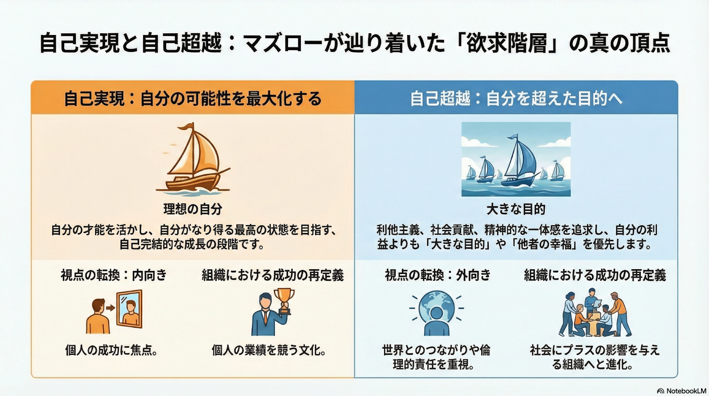
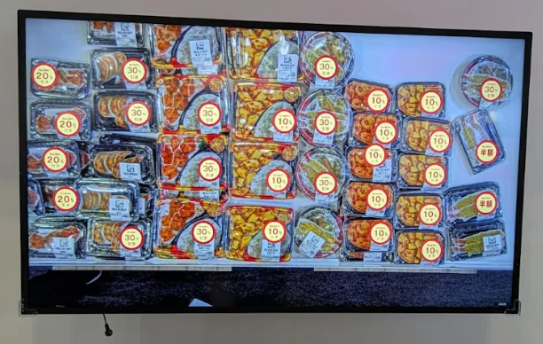
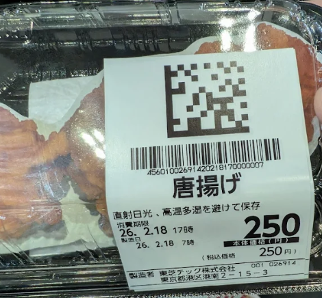

# 山口 椋太郎 TOP 报告 — 2026-W09

- 周次：2026-W09
- 报告类型：TOP
- 提交时间：2026-02-25 11:05:53
- 职位：Engineer

---

【価値基準】

今週の会長の記載に「将来に向けた生き様を持ってほしい」と記載がありますが、この言葉が前回触れた、自己超越について表しているのではないかと思いました。今週は、前回の延長として自己実現欲求と自己超越の違いについて考えていきます。

前回の前提

「シヌキーズ」から「オワリーズ」への変質という現象を、心理学の古典的フレームワークである「マズローの欲求5段階説」に当てはめて考えると、「下位の欲求が満たされれば、自然と上位の欲求へ向かう」というマズローの定説に対する「矛盾（反例）」が見えてきます。

先週は自己超越に踏み込んでいるか、自己実現で留まっているのかがシヌキーズとオワリーズの違いではないかと考えました。そもそも、自己実現欲求と自己超越の違いの理解が曖昧であるため、その理解からAIと学習していきます。

〈AI記載〉

自己実現と自己超越の最大の違いは「関心のベクトル（方向性）」と「自我（エゴ）の在り方」にあります。自己実現が「個人の可能性の最大化」を目指すのに対し、自己超越は「自分自身を超えた目的（他者、社会、宇宙など）への献身」を目指します。

立てた問い

自己実現（個人の成功・資産形成）のその先へ — 会長がシヌキーズに求める「将来に向けた生き様」を体現するために、リーダーはいかにして「自己超越」の領域へ踏み出すべきか？

〈山口記載〉

自己超越とは自己実現を達成した先にあると思っていましたがそうではないと改めました。自己実現の中に自己超越が含まれているのではないかと考えています（自己超越⊊自己超越）。

つまり、自己実現が自己超越となる場合があり、それは自己実現にプラスアルファで一定の条件を満たしたものです。そしてその条件は「自分ではなく他者」に向かっているのかです。それは利己を捨てて自己犠牲に他己で生きる（利己≠他己）のではなく、他己になることが自分にとっても嬉しく利己である（利己=他己）状態です。

自己超越を実現するには、利己と他己の重複する部分（利己∩他己）に気づけることが大切です。そのためにはまず、利己が何かを知っておく必要があります。当たり前のことにも見えますが、いざ自分がどういったことが嬉しいのか言語化しろといわれると難しいと思う方もいるのではないでしょうか。利己に対する解像度が低いと、お金を稼ぐとかわかりやすいみんなが目指すことを自己実現の軸としてしまうのではないかと考えています。つまり、利己の解像度を上げるためには自己分析が必要ということです。

そのきっかけとなるのが生き様だと思います。自分がどういった生き様をしたいのかが利己理解につながりそうな気がしています。少なくとも、金を稼ぎ豪遊するのが生き様だという結論にはならなそうなので…私も利己の理解は弱いため理解を深めていく時間をとっていきます。この進捗についてはまた場を改めて共有します。

【アウトプット】

〈ルーキー教育〉

セミナー活用について

先週はセミナー活用について各メンバーから調査した情報をもらい、上級メンバーで方針を検討しました。結果として、有料セミナーへの参加は現時点では不要な段取りとなりそうです。しかし、セミナーを調査したことで教育研修を生業としている企業のアプローチやコンテンツ概要が参考になることに気づくことができました。委員会メンバーが調べていただいたセミナー情報も参考になったため、今後もセミナーの調査研究はコンテンツ作成のステップとして含めていきます。

運営定例

今週は次回青本合宿で実施予定のジグソーゲームを委員会メンバーで実施する想定です。実施する目的は青本合宿で実施するコンテンツ検証とイメージ理解、そして委員会内のコミュニケーション促進です。合宿ではアイスブレイクとして用意している内容であるため、委員会のアイスブレイクとして効果を発揮できるか確認してみます。

今週でオンボーディングに重きを置いた内容は終わりとする予定です。来週からの定例ではコンテンツ準備のための調査を各チームに別れて実施する時間にしていきます。

【業務報告】

〈スーパーマーケットトレードショー〉

スーパーマーケットトレードショー（SMTS）に参加しました。

この場では一番印象に残った展示の紹介をさせていただきます。

東芝テック社のAR値引きシールシステム

AR技術を活用し、ディスプレイに移っている商品に値引きシールを表示するというものです。

イメージ画像

ディスプレイに表示される売場の映像にARで値引きシールが表示されます。

これの何が便利かというと、売り場でこの映像を表示することで値引きシールを張らずとも値下げを視覚的に表現することができます。

このシステムはうちの自動値下げとの相性が良いと考えられます。自動値下げもシールを張らずとも値下げされますが、値下げされているかぱっと見では分かり辛く、値下げによる購買訴求効果は物理的な値下げシールより弱いです。しかし、AR値引きではほぼリアルタイムで値下げシールの情報が映像内にプロットされるため、値下げされている商品がぱっと見でわかります。

技術としては計量器で印字されるラベルにARマーカーが印字されており、そこに値引きシールのイメージがプロットされます。導入には計量器側での対応も必要にはなりそうですが、個人的に気持ちがそそられるシステムでした。

ARマーカー

〈武蔵新城入店〉

無事にプレオープンしました。レジ周りはオープン前に立ち合いを行い、問題を全て解消したことでオープン後にトラブルは発生しませんでした。

しかし、レジ設置時やオープン前には多数トラブルが起きていたため、問題点を整理し、改善の要望を上げていきます。情報の錯綜により起きているトラブルが大多数であり、情報を統率する重要性について改めて実感させられる立ち合いとなりました。現場に迷惑がかかっていることを目の当たりにし、やはり改善が必要な部分であると感じました。今までも、問題を起こしているチームや部署に対して何度もお伝えしてきましたが、過去と同じような原因から発生している問題が解決されない状況で、温度感や問題の根本的な原因が伝わっていないのではないかと感じる状況です。

特に問題だと考えている点は現場からの要望だからということで本当の原因を棚に上げている点です。現場からの要望だからというきっかけで急遽対応してくれというスケジュールを乱す話があり、その影響でトラブルが発生することがあります。もちろん現場からの要望を受け止め対応可能なことは実施します。しかし、そもそも「現場からの要望や不満が上がらないような計画や対応」を最初からしておけばいいのではないでしょうか。急遽依頼されることも計画段階で想定し、対応しておけるようなことが大半です。その計画性の甘さを棚に上げて、現場からの要望だから対応してあげるというスタンスで、プラスの対応をしているような雰囲気ですが、マイナスを後からゼロにしているだけで、問題の根本が見えておらず他責になっているように感じます。

じゃあ自分は自責で考えられているのかというとそうではない部分もあるため、改めてそんな自分はできているのか振り返るきっかけとさせていただきます。

〈タイヨウ殿外税対応〉

一部商品マスタが外税反映され、問題が起きていないことを確認できています。

タイヨウ殿の店舗は特殊モジュール状態であり、リリースおよびバージョン管理で別途対応が必要な状態であるため、特殊モジュールを解消させる対応を進めていきたいと思います。

〈新サービスカウンターレジ〉

マスタディスクの作成およびダブルチェックを進めていきます。

どの店舗から導入するか定まっていないようなので、確定してもらうようお願いしています。

〈レーンセルフ〉

サービスカウンターレジと同様対応マスタディスク作成とダブルチェックを進めていきます。

チェック時にTEC殿が利用するCEセッティングツールやアプリ挙動の確認も行います。

効率よく進めるために、サービスカウンターと併せて同時対応していこうと考えています。

導入店舗は4月にオープンする浜北店からと伺っています。
