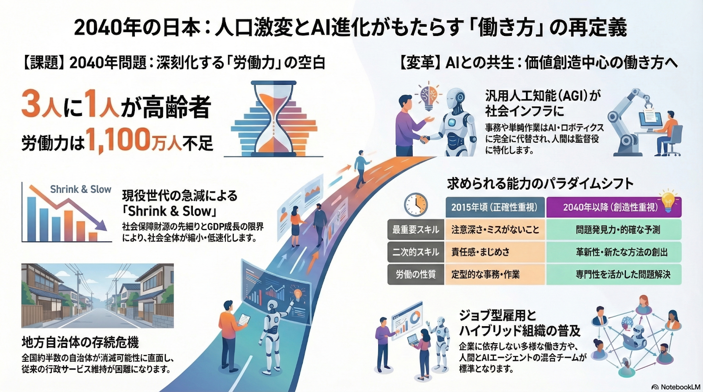

# 山口 椋太郎 TOP 报告 — 2026-W10

- 周次：2026-W10
- 报告类型：TOP
- 提交时间：2026-03-05 06:23:45
- 职位：Engineer

---

価値基準

洋幸さんのTOP報告より2040年について考えてみます。

昨今の進化が凄まじいAIが2040年には更にどう発展し、生活や働き方を変えていくのかが重要なポイントだと考えています。まずはAIによる予測を画像生成してみました。

やはり人口減少とその解決策としてAIとの共生について記載があります。そこで今回はAIとの共生について考えていきます。

【AI記載】

〈問い〉

AIが全ての「面倒くさいこと」を肩代わりする2040年、私たち人間の「生きがい」はどうなるのか？

〈背景〉

2040年に向けて、人間レベルの知能を持つ汎用人工知能（AGI）や自律型AIエージェント、ロボティクスが社会のあらゆる場面に実装されると予測されています。これにより、仕事における事務作業や単純労働はもちろん、買い物や家事、移動といった日常生活のあらゆる「面倒くさいこと」はAIやロボットが最適化・代替してくれるようになります。 この究極の利便性がもたらす「超自動化社会」において、私たちはAIとどう共生していくべきなのか問われます。

【山口記載】

人口減少につき、AIとの共生による生産性向上は必要不可欠と思われます。AIとの共生のメリットは労働力不足の解消、時間やゆとりの創出など多々あります。一方で、AI活用によるデメリットはあまり語られていないような気がするためデメリットについて主に記載していきます。

AIによる効率化で「面倒くさい」ことを代替してくれている実感があります。しかし、その時間で新たな面倒くさいことをやる必要はあるため、現時点で面倒くさいことから解放された感覚はありません。ですが、更にAIが進化すればいずれ全ての面倒くさいことから解放されるかもしれません。そうなった時、人間がやることは以下の2択だと考えています。

1．楽しいこと

2．楽なこと（面倒くさくないこと）

当たり前ですが、面倒くさいことから解放されたら、自分がやりたい楽しいことをやります。いわゆる趣味ですね。一方で、SNSをダラダラ見るなどが楽なことに当てはまるでしょう。

僕はゲームが趣味の1つですが、面倒くさいと思ってやらないこともあります。代わりにYouTubeをダラダラ見たりします。そして、時間を無駄にしてしまったと後悔します。

逆のパターンもあり、飲み会などの予定がいざ当日になると面倒くさくなったが、行くとやっぱり楽しくて、行ってよかったと思うこともあります。

このことから、楽しいと楽の違いは「面倒くさい」を伴うかと言えるのではないかと考えました。つまり、面倒くさいことは大事なことだと言うことです。10年くらい前の話ですが、宮崎駿さんがプロフェッショナル仕事の流儀というTV番組に出ていた時に面倒くさいを連呼しながらジブリ映画の作成に励んでいた強烈なシーンを思い出しました。改めて発言内容を調べると、「世の中の大事なことってたいてい面倒くさいんだよ」という名言が残されているようです。宮崎駿さんが本当に考えていることは分かりませんが、面倒くさいを乗り越えた先に楽しさがあるのではないかと思っています。山本由伸さんも洋幸さんとの対談（ST通信）で「失敗や回り道から本当にいいものができる」と言われていました。この失敗や回り道は一般的に面倒くさいとされることではないでしょうか。その面倒くさいを経たことが糧となり、本当にいいものができると言われているのではないかと捉えました。

しかし、AIとの共生により面倒くさいことを避けられるようになり、面倒くささがどんどん失われていくと、その分楽しさも失われていくのではないかと危惧しています。そして、面倒くさくない楽なことだけやる生活になっていくのではないでしょうか。既に、SNSにより近しいことは起きているかもしれませんが、AIによりその状況が加速するようにも思えます。それが一概に悪いこととは言えませんが、少なくとも最初の問いにある「生きがい」は失われていくのではないでしょうか。そして生きがいを持つには敢えて面倒くさいこと（AIに任せられるようになったこと）を自力でやることが求められるのかもしれません。そんな時代に必要なのは面倒くさいことに立ち向かえるハングリー精神のようなものだと考えます。今はまだAI進化の過渡期であり、面倒くさいことも多々あります。そこから逃げないように癖づけていくことが、将来生きがいを保つには重要なのではないかという結論に今回は至りました。

CDA

【ルーキー教育】

〈青本合宿準備〉

青本合宿にむけて、それぞれが準備する講義資料の作成期日について認識合わせを行いました。こちら側で骨子がすでにできているものについては未来戦略室に簡易的なレビューを行い問題ないとの回答をもらっています。採用チームと連携が必要な資料については来週すり合わせを行う場を設けてもらっています。

合宿の方針やコンテンツは固まっているため粛々と対応を進めていきます。

〈運営定例〉

青本合宿で実施予定のアイスブレイクを委員会メンバーでやってみました。想定以上に盛り上がりました。よりブラッシュアップして、今後も使い続けていけるものにしていきます。

今後の定例会はチームメンバー単位での活動をメインとしていく予定です。ただし、委員会メンバーに対する全体教育や動機づけ強化のアプローチも必要なため、引き続き全体で集まる場も設けていきます。教育や講義のコツや面白さ、教育に関するアウェアネスの発信などを考えています。まだまだ私の教育に関する知識も不足しているため、教育論や組織論の学習も並行して進めています。その他にもこんなことやったらいいんじゃないかという案や要望があればコメントお願いします。

【CDA合宿】

CDAの合宿に参加しています。まだ合宿途中のためアウトプットは来週行います。

業務報告

【レーンセルフ】

マスタディスクのダブルチェックを行っています。作成してもらったディスクのコピーでPOSのキッティングを行い、アプリ起動まで問題がないことの確認が取れました。

現在はアプリケーションレベル動作確認を進めてもらっています。アプリの更新はマスタディスクをTEC殿に引き渡した後でも実施できます。そのため、マスタディスクの作成は完了で、金曜日に引き渡し予定です。

せっかくキッティング作業を行うので、やり方を後輩に見せ、キッティングやPOS設置の流れなどTEC殿の作業イメージを伝えています。

レーンセルフ導入店舗は4月オープンの浜北店で確定となります。関係各所への周知は展開チームにお願いしています。

【新サービスカウンターレジ】

マスタディスクの作成を進めてもらっています。作成完了次第ダブルチェックを行います。

導入店舗は未定ですが、レーンセルフを導入する浜北からいれてもらえれば店舗も操作感がつかみやすい(レーンセルフと新しいサービスカウンターの本体は同様の機種であるため)かつ、新機材立ち会いも一度で済むため、その要望を展開チームへ伝えています。浜北もしくはそれ以降で調整を進める旨の回答をもらっています。

【エスカレーション対応引継ぎ】

ヘルプデスクからのエスカレーション対応の後輩への引継ぎ教育を開始しています。今回はエスカレーション対応におけるルールとマインドセット、必要なツールの説明をメインに行いました。また、よく来る定型問合せの種類を説明し、定型問合せの対応に参加できるようになることを第一目標としています。まずは過去の問合せを調査する練習に着手してもらっています。

【AI開発】

来週以降でセミナーに参加したチームメンバーからAI開発のやり方について教えていただきます。

その準備としてAI開発の環境作成を行っています。開発環境作成の段階から利用したことのないツールが多々あり、便利なツールを知るよい機会となっています。まずは自分なりに触ってみてから教えてもらおうと思います。
