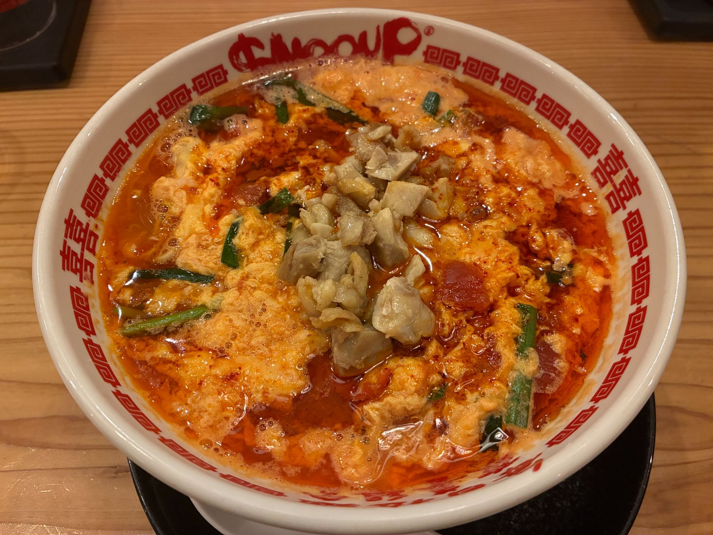

# 山口 椋太郎 TOP 报告 — 2026-W22

- 周次：2026-W22
- 报告类型：TOP
- 提交时间：2026-05-28 08:51:37
- 职位：Engineer

---

価値基準

今週はマネジメントに関して、人の錯覚や誤解に関する話題に触れられていました。

【問い】

判断において人の「誤解や錯覚」を発生させないためにどう向き合うべきでしょうか。

【回答】

前提

以下の書籍で学んだ内容をもとに回答します。

『BIG THINGS　どデカいことを成し遂げたヤツらはなにをしたのか？』

結論

誤解や錯覚は、ルールで完全に排除することはできません。識学のようにルールと役割で解釈余地をなくすアプローチはありますが、人のバイアスの問題は、自分では気づけないところにあります。トライアルが目指す方向性を考慮すると、必要なのは誤解を消すルールではなく、自分の中で誤解や錯覚が起きていることに気づくための仕組みだと考えます。具体的には、ベストケース想定、最初に浮かんだ案への固定化、サンクコスト、失敗の外部帰属の4つを、意思決定の節目ごとに自己点検する機会を設けることが考えられます。

理由

人間の判断は専門家であっても感覚的に行われ、しかも本人はそれを論理的だと感じています。人の誤解錯覚において、いくつかのバイアスが連鎖していた可能性があります。

一つ目はベストケース想定です。業績がいいから株価も安定だろうと考えたことはこれに該当します。人は計画段階で常にベストケースを基準に置きがちで、テールリスクを過小評価します。今回の株価反応は、テール側にあった事象が顕在化したと捉えることもできます。

二つ目は最初に浮かんだ案への固定化です。経営計画で掲げた大きな目標は強い推進力になる一方で、いったん掲げると代替シナリオ、たとえば達成手段の見直しなどを、検討しにくくする可能性をはらみます。

三つ目はサンクコストです。これまで投じてきた成長戦略、組織体制への投資が大きいほど、軌道修正の心理的コストは大きくなります。

最後は失敗の外部帰属です。信頼喪失を一部の対応や市場側の感情として整理しすぎると、自分たちの中にある誤解や錯覚を見落とします。一方で、会長は洋幸さんはどんな問題に対しても我々の問題だと捉え、外部帰属に流れていない点がやはりすごいと感じました。

識学との比較

識学の誤解や錯覚の排除は、ルールと役割を明確化し、解釈の余地をゼロにすることで誤解を防ぐ考え方です。これは私の読んだ書籍の対策とは方向性が異なります。本書の対策は、複数選択肢を保持するなど解釈余地を消すのではなく、固定化を遅らせて選択肢を増やす方向でした。識学が有効に効くのは、解釈ブレが現場の生産性を直接損なう領域と考えます。一方で、経営判断のように不確実性が高く、誤解の所在が自分自身の頭の中にある領域では、ルール化だけではなく気づきの仕組化も必要だと思われます。両者を使い分け、それぞれ補完し合うアプローチが必要だと考えました。

実務的において

実務における計画決定段階において、これはベストケース想定になっていないかを問うチェックを入れる必要があります。

・提供する資料に情報の歪みがないかを、第三者がレビューする工程を組み込む

・達成手段について少なくとも二つの選択肢を並列で持ち、定期見直しをかける

・うまくいかなかった理由を考えるとき、外部要因と内部要因の比率を意識的に内部寄りに置く

このどれも記載すると当たり前のことですがいざ業務に追われている中でやろうとすると難しいことです。そこでこれらに気づきくことができる仕組化をするべきだと考えます。

結論

トライアルが目指すイノベーション組織には、誤解を単純に消すというアプローチだけではなく、誤解を適切に扱える組織（誤解や錯覚が起きていることに気づける）が適切なのではないかという結論に至りました。

CDA

【ルーキー教育】

〈青本講義〉

青本講義の第一回を実施しています。今回は青本の第1章と2章の内容である、トライアルの歴史とビジョンについての講義を実施しました。本では詳しく触れらていない歴史の話についても、私の知っている範囲で追加説明をしました。今では上場企業となり規模も大きくなったトライアルの創業時の小さな時代について少しでも知っていただくことができたらと思います。その時代からここまで成長してきたことと、それにはビジョンが必要不可欠だったことについて理解してもらうことを主目的として講義しました。講義で実施したワークについて今週アウトプットしてもらう予定のため、ぜひルーキーの週報も読んでいただければと思います。

業務報告

【タイヨウ対応】

タイヨウさんのレシートロゴとレジ袋の変更対応を実施し、問題なく完了しています。タイヨウさんはトライアルに展開しているモジュールとは異なるため適宜個別対応が必要な状態です。毎回毎回対応時には夜間対応が発生するため、トライアルモジュールを組み込んでバージョンアップできるように調査対応を別途進めてもらっています。今回の夜間対応にはチームの後輩の白石くんにも参加してもらいました。IoTLabの検証環境で模擬作業もしてもらったため、トラブルなくスムーズに対応いただけました。今後もリリース周りでどんどん力を発揮してもらうことを期待しています。

【日工殿定例】

月次のヘルプデスクとの定例を実施しています。釣銭機の清掃マニュアルの告知効果により、店舗対応の清掃で解決する問合せは減少しているとの回答をもらっています。

新規導入したレースセルフについては提供されているデータのラベルがセミセルフになっていたため、レーンセルフとしてセミセルフとは独立したラベルで管理してもらうように変えてもらいます。

レジ開設後に画面操作が効かなくなる問題が直近で発生しているため原因調査を進めていきます。

【TEC定例】

西友の引き上げ釣銭機をSTリテールの店舗で流用すると伺っています。釣銭機は現在のトライアルでも利用しているグローリー社のRAD380です。しかし、色が黒でトライアルで使っている青色とは異なるため混雑しないようにSTリテールや西友の店舗でのみ使う流れとなっています。色以外は一緒だと聞いていますが、検証確認は実施します。今週検証機をTECさんが提供してくれる予定です。

【自動値下げ】

脇田CKから配送を受けている筑豊店舗にリリース済みです。

【5月リリース】

UI変更のリリースをかけています。UIが変わったことによる問合せの増加はありませんでした。

【レーンセルフ】

再起動時にスタートアップに登録されているLancherが起動しないという事象が発生しています。レジストリにスタートアップの無効設定が残っていたため、設定を削除しています。今週、動作確認を実施します。

【課題棚卸】

過去課題について現状発生していないことをヘルプデスクと確認とっているため、クローズしていきます。現状も発生している問題については原因の調査やプログラム修正を進めています。

余談

複数の方から辛活をおすすめしていただいたので、辛活をしてきました。

近所にあるトマトラーメン屋さんのSnooupというお店に行って、辛麺を食べました。

頭皮まで汗をかいてスッキリした気持ちになれました。辛さはビビッて中辛にしましたがそこまで辛くなかったため次回は激辛にしたいと思います。

辛麺以外も美味しいため、辛い物が苦手な方にもおすすめです。
