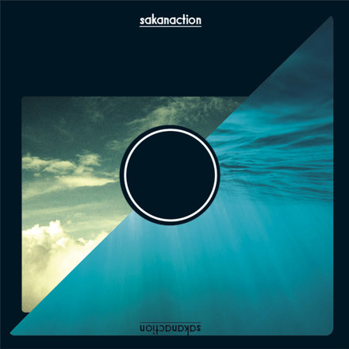

# 山口 椋太郎 TOP 报告 — 2026-W23

- 周次：2026-W23
- 报告类型：TOP
- 提交时间：2026-06-08 11:54:05
- 职位：Engineer

---

価値基準

「これまでと同じ商品を、これまでと同じ売り方で届けるという発想こそ、もっとも危ういかもしれない。」というドラッカーの言葉について考えます。

【問い】

ドラッカーは「これまでと同じ商品を、これまでと同じ売り方で届けるという発想こそ、もっとも危ういかもしれない」と説きました。では、私たちが日々当たり前に使っている「POS」を、これまでと同じ「会計を済ませるための装置」と捉え続けることは、危ういことなのでしょうか。

【回答】

結論

POSを「会計を済ませるための装置」と捉え続けることは危ういと考えます。POSは会計を済ませるという販売の終点の役割だけではなく、顧客理解の起点となる役割も持つからです。そして、POS開発に携わる私たちの仕事は、会計する装置を作ることだと狭義に定義しないことです。ドラッカーは「われわれの事業は何か」という問いが重要だと述べています。この考えを参考にすると、私たちの事業は会計する装置を作ることではなく、顧客理解の起点を提供することだと捉え直すことができます。それがドラッカーの警鐘を踏まえた、この問いへの回答です。

POSとは

念のため言葉を整理しておきます。会計そのものを担ってきたのはレジスター(会計する機械)で、お金を扱う装置です。そしてPOSは販売時点という意味であり、レジスターの機能に加え、何がいつ売れたかを記録する目的を持って生まれた、データを記録する装置です。今回は後者のPOSを議論の対象とします。

POSは会計を済ませた際に会計に関する情報(何を・いつ・いくらでなど)を記録します。つまりアンケートや予測などの不確かな情報ではなく、お客様が会計した事実に基づく確かな情報です。そのためPOSは、販売を締めくくる終点であると同時に、顧客を理解する起点でもあります。この視点をもとに開発者としての立場を整理します。

POSを開発する立場として

POS開発者は会計をスムーズにするレジスターを作る人に見えますがそれは上辺だけの理解です。

ドラッカーは、企業は自社を「何を売っているか(商品)」で定義しがちだが、本来は「顧客にとっての価値」で定義すべきだと説いています。これをPOSに当てはめると、POSをレジスターという手段で定義してしまうと、価値が広がりません。POSを使う店舗や会社にとっての価値は、レジスターとしての機能だけではなく、その先にある顧客を理解し、次につなげることです。そこで私たちの仕事はレジスターを作ることではなく、顧客理解の起点を提供することだと捉える視点が必要です。

そもそも、安定して稼働するレジスターだけでは、差別化にはなりません。レジが正確に動き、止まらないことは、どの小売でも満たして当然の前提です。前提を高い品質で満たすことは重要ですが、それだけでは他社との差別化になる価値にはなりません。差がつくのは、会計で生まれる記録を、必要とされる形でどれだけ早く正確に渡せるのかです。つまりPOSを顧客理解の起点としてどこまで高められるかという部分になります。

まとめ

自分たちの仕事をレジスターを作ると定義するのか、顧客理解の起点を作ると定義するのかで、業務において、何に力を入れるのかが大きく変わります。自分たちの役割は何かを問い直し、お客様に求められている価値を見出していく、それが「同じ商品を同じ売り方で」という最も危うい思考から抜け出す一歩だと考えます。

CDA

【ルーキー教育】

〈青本講義〉

第3回講義を有本さんに実施してもらっています。資料作成から講義まで問題なく実施してくれたため、第4回講義も引き続き行ってもらいます。今後も講義にどんどん携わってもらい教育者としての経験を積んでもらう想定です。ルーキーとのコミュニケーションについてもより積極的にとっていただければ理想的です。ルーキーのみなさんもこの場をただの講義として終わらせるのではなく、先輩とのコミュニケーション機会としても捉え、先輩の知恵を引き出すつもりで積極的にコミュニケーションをとってみてください。

【アウトプットチェック】

ルーティン教育が実施していた週報やTOP報告へのCDAアウトプットチェックのフォーマットを新体制で使うために再作成しています。未来戦略室とルーティン教育に共有し、OKをもらえたためルーキーのチェックへの活用から導入していきます。

業務報告

【西友釣銭機流用】

西友の引き上げ釣銭機のSTリテール店舗への流用に際して、検証をチームメンバーに行ってもらいました。付属ケーブルの雄雌が異なり接続ができませんでしたが、既存のケーブルでは動作確認をすることができました。次のSTリテール店舗に関してはケーブルのみ購入してPOSの組み上げ対応がされているようです。展開チーム側でコントロールできていない様子でしたので情報連携を行っています。

【富士通レジ保守対応】

富士通チャージ機のSSDが故障したため復旧対応で唐津中原店に入店しています。富士通チャージ機のSSD故障は富士通での保守対応外であるため、展開チームと入店対応し、復旧方法を共有しました。原本となるマスターディスクがないため、店舗にある別の富士通チャージ機からSSDをコピーし、設定を初期化して対応完了させています。次回以降同様の問題が発生した場合、展開チームで対応完了できるように引き継いでいきます。富士通レジのように一部店舗のみにしかない特殊な構成はトラブル発生時などに大きく工数がとられてしまいます。新しいレジ機材へのリプレイスの計画もされているためそちらの状況も追っていきます。

【定型業務】

月曜日に行っている定型業務の引継ぎを進めています。定型業務のうち引継ぎ対象は店舗一覧資料のメンテナンスと全店のPOSの容量不足チェックです。それぞれやり方をチームメンバーの白石さんへ共有したため、来週実際にやってもらう予定です。

【アプリハング】

スキャナ周りの処理でハングする事象があるため、原因調査をチームメンバーの中川さんにお願いしています。調査にあたり情報が不足しているため、まずはログ強化の改修が必要になりそうとのことです。ログ強化したものをリリースし、その強化したログで同事象の調査を進めていくことになると思います。

【レーンセルフ】

再起動時にスタートアップに登録されているLancherが起動しないという事象が発生していました。マスターディスクのレジストリ修正を行い、新店導入で問題が解消されていることまで確認済みです。

余談

ミュージシャンのサカナクションがアナログレコードを再販することになりました。レコードプレーヤーを持っていないのに衝動買いしてしまいました。レコードプレーヤーの知識は全くないため、入門用に安価でおすすめなプレーヤーをご存知であれば教えていただきたいです。

https://sakanaction.jp/news/detail/3233

