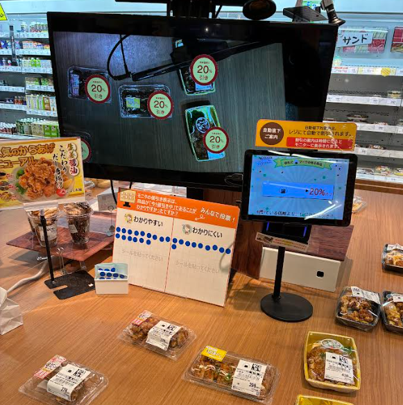
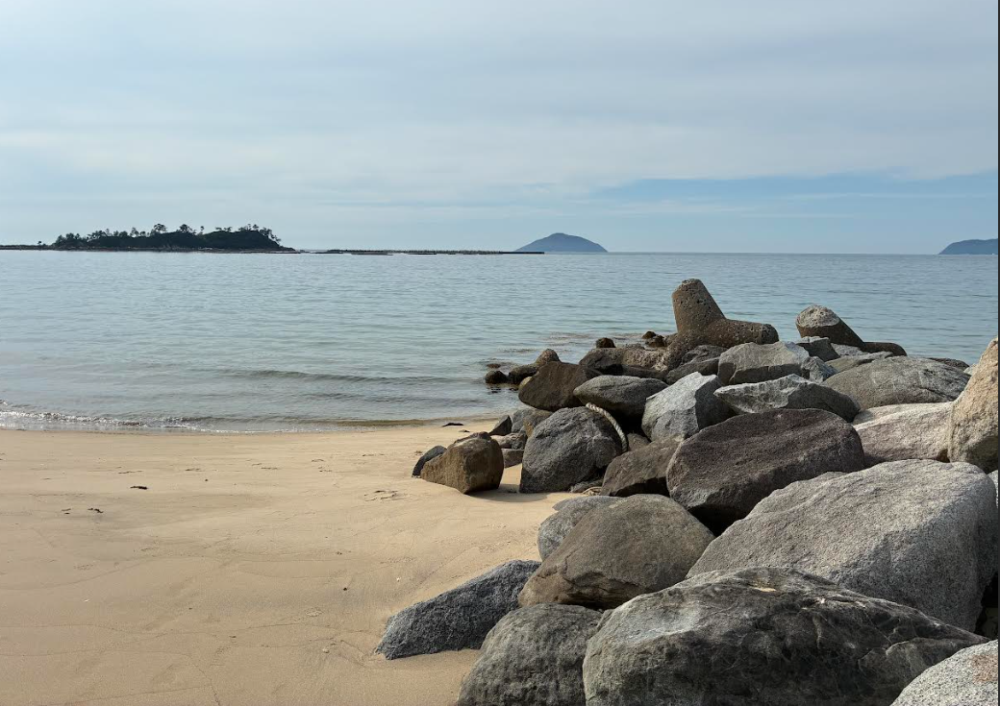

# 山口 椋太郎 TOP 报告 — 2026-W25

- 周次：2026-W25
- 报告类型：TOP
- 提交时间：2026-06-18 08:52:57
- 职位：Engineer

---

価値基準

今週は支社制に関するお話で視座を上げるというワードが印象に残りました。

【問い】

視座を上げられた瞬間はいつで、何がきっかけでしたか。また今後視座を上げていくには何が必要ですか。

【回答】

前提

最近、視座を上げなければ今後やっていけないなと感じる場面が多々あり、今回このテーマを選ばせていただきました。

結論

直近で視座を上げられたきっかけは、先輩の退職という環境の変化でした。そして今後さらに視座を上げていくために必要なのは、常に変化する環境を察知し、そこで求められる能力を身に着けることです。現時点の自分に必要なのは経験や意見を目上の相手にも通じる言葉にする言語化力を身につけていくこと、そして必要であれば自ら環境を変えにいくことだと考えています。

本論

視座を上げられた一つのきっかけは、先輩の退職です。先輩が抜けることで、これまで先輩の存在で回っていた仕事が、より鮮明に見えるようになりました。特に大きかったのは、社内外を問わないステークホルダーとの調整を先輩が担っており、その調整の予想以上の重要性に気づけた点です。

先輩がいなくなった直後は、調整不足によるバタバタを感じる場面が増えました。そしていざ調整くらいはできるだろうと自分でやってみると、思うように進まないことも多々ありました。この経験から、現在は調整を軽視せず、担当として責任を持って遂行するようになり、コツも掴めてきました。

一方で、まだ不足していると感じる点があります。それは自分がやってきたことに対する言語化能力です。実際、調整の重要性をうまく語れないと感じる場面がありました。言語化については、新人や後輩への教育、面接官の経験を通じて上達している自信がありました。しかしそれは、自分と同等かそれ以下の経験、知識の相手に対して言語化できるようになっただけでした。最近は業務の範囲も広がり、目上の方々へ報告する機会が増え、そこで言語化力の不足を強く感じています。なぜ目上の方にだけうまく説明できないのかを考えたところ、今回のテーマである視座を上げるという言葉が刺さりました。現在は目上の方と同じ視座に立てていないため、うまく言葉にできていないのだと感じます。

ではどう解決するかというと、やはり冒頭で触れたようなきっかけが必要だと感じています。そしてきっかけを生むには、環境の変化が必要だと考えています。一度視座を上げられたのも、先輩の退職という環境の変化があったからです。同じように、自分が身を置く環境を変える必要があります。ただし、環境は自分の好きなように変えられるものではありません。そこで重要になるのが、何かに飛び込んで挑戦することです。新しいことに取り組めば、その環境に適した能力を求められ、食らいついていく過程で成長できると感じています。そう考えると、今すでに環境は変わりつつあるのだと気づくことができました。

先輩の退職から一定期間が経ち、状況が安定してきたと感じていたため、環境の変化はもう起きていないと思い込んでいました。しかし、実際はそうではなく、より視座を上げなければならない環境へと変わってきています。先ほど環境の変化が大事だと述べましたが、正確には、環境は常に変わり続けるもので、その変化を察知し、自分に必要な能力を身につけていくことがまずは重要だと感じました。ただし、この考え方だけでより大きな成長ができるかは、現時点では分かりません。CDAとして経営陣を目指すにあたり、いずれ大きな環境変化は確実に訪れます。そのためにも、今できる限りの成長をしておかねばならないと考えており、場合によっては、自ら環境を変えていく姿勢も求められていくと感じました。

結論

視座を上げられたきっかけは先輩の退職という環境の変化であり、今後視座を上げ続けるために必要なのは、絶えず変化する環境を察知して必要な能力を身につけること、そして大きな環境変化に備えて今のうちに成長を重ね、必要なら自ら環境を変えにいく姿勢だと考えています。

CDA

【ルーキー教育】

〈洋幸さん報告〉

洋幸さんにルーキー教育の状況について報告しています。去年の反省を活かし、対面実施にしている件などのお話しをしました。未来戦略室およびルーキーのみなさん、そしてルーキーの上司やチームメンバーも含めご協力いただいているおかげで対面での実施が可能になっています。去年と比較して、確実にコミュニケーションが取りやすくなっていると感じているためこの機会を無駄にしないよう取り組んでいきます。委員会メンバーも講義担当じゃない回についてもちょくちょく顔出ししていただきありがとうございます。みんなでより良い場としていきましょう。

業務報告

【定型業務引き継ぎ】

定型業務のレジ端末容量確保と店舗一覧資料のメンテナンス引継ぎを行っています。方法は既に教えて一緒にやってもらったことはあるため、今回は対応している様子を眺める形で私は手出しをせずに確認をおこなっています。問題なく実施できているため来週以降は実施後に報告を受ける流れで運用していく想定です。

【エスカレーション対応教育】

ヘルプデスクからのエスカレーションの調査を行っています。特殊な操作がされているエスカレーションについてはまだまだ調査に不足する部分があるためフィードバックを行っています。まずはよく来るエスカレーションせから確実にこなせるようになってもらう段取りで考えていますがエスカレーションが過去と比較して落ち着いていることもあり、嬉しいことですが、一方で調査機会も減少しているためまずは色んなエスカレーションに取り組んでもらっています。ヘルプデスクへの回答文章の作成については気を付けなければならない点も多々あるため、私の方で手本を見せる形で今は進めています。いずれはこちらにも取り組んでいってもらう予定です。

【リリース対応】

6月リリースの対応準備を進めており、リリース申請を行っています。今週は代表店舗での検証リリースを予定しています。

【自動値下げ】

脇田店の自動値下げでARマーカーを活用した取り組みを見に行きました。リテールテックでも気になっていたARマーカーの展示が導入されており興奮しました。

自動値下げは商品に値下げシールが貼られているわけではないため、どの商品が何パーセント下がっているのかが分かりづらいという課題がありますが、売り場を映しているモニター上に値下げ状態が可視化されているため一目でわかるようになっていました。

しかし、アンケート上ではわかりにくいという回答もちょくちょく見られました。モニターと売り場を比較してみなければならずシームレスではない点などまだ技術的に克服できない課題もあるようです。AR含むXR技術の進化に期待したいと思います。一方で新しい技術を使うことが目的ではなく、お客様や従業員さんを楽にすることが目的なため技術思考に陥りすぎないように気をつける必要もあると感じました。

余談

以前リフレッシュとして自然を感じることをおすすめされていたため、地元糸島の海に行きました。自然にも癒されましたが、それだけでなくもう海に入って泳いでいる少年の活気に力をもらいました。もっと活力をつけなければと、鼓舞されました。

