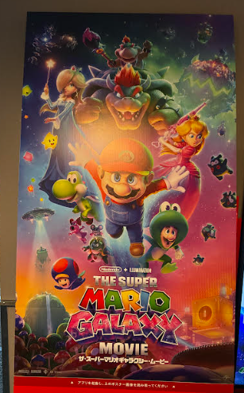

# 山口 椋太郎 TOP 报告 — 2026-W26

- 周次：2026-W26
- 报告类型：TOP
- 提交时间：2026-07-04 10:42:19
- 职位：Engineer

---

価値基準

【問い】

野球型組織とサッカー型組織の違いを考察してください。さらに両者を組み合わせたハイブリッド型の組織についても考察してください。

【回答】

結論

野球型とサッカー型の根本的な違いはプレーが止まるかどうかという「ターン制」の有無にあると考えます。ターン制とは、互いの攻守が交互に区切られ、常にリアルタイムに動く時間があるかどうかを指します。ターン制は熟考と統制を可能にする代わりに速度を犠牲にします。一方でリアルタイム制は速度と適応力を得る代わりに判断が現場に委ねられます。優れた組織はどちらかを選ぶのではなく、どこにターンの区切りとなる同期点を置くかを設計したハイブリッドであるべきということが結論になります。

野球型かサッカー型かはしばしば組織文化や好みの問題として語られますが、実際には業務ごとの時間構造について考えることが重要だと考えられます。

野球とサッカー

野球は極めてターン制的な競技です。

一球ごとにプレーが止まり、攻守が明確に交代し、打順という手番が決まっています。プレーの間に必ず止まった時間があるからこそ、動かずに考える時間が多くあります。そして監督という中央の意思決定者が毎ターン大きく介入できる状況であり、結果も打率などの個人成績に分解しやすく、役割はかなり固定的です。

一方、サッカーにはターンがありません。

攻守は連続的に入れ替わり、プレーは止まらないため、監督が適宜指示を出すことは難しく、判断の主体はコート上の選手です。役割は流動的で、成果は個人に分解しにくいです。そのため自律分散型の意思決定を前提とした競技です。

組織への当てはめ

組織に当てはめると、野球型組織とは工程が区切られ、節目ごとに上層が介入、承認できる組織です。稟議や承認フロー、ウォーターフォール開発、製造ラインが典型で、個々人は自分の手番で決められた役割を果たし、判断の質は上層で担保されます。統制・再現性・個人評価に優れる一方、判断を共有する同期点があり遅く、想定外に弱くなります。

サッカー型組織は状況が止まらないため現場が権限を持って判断する組織で、店舗運営やアジャイル開発が該当します。速く適応できますが、現場の判断力に依存し、品質のばらつきが課題になります。

他事例への当てはめ

これをゲームに当てはめると、コマンドRPG(ドラゴンクエストなど)のようなターン制ゲームでは思考時間が保証され、最善手を探索する判断の質が成果を決めます。これは会議、稟議、計画策定と同じ構造です。一方、アクションゲーム(マリオ)などでは、考えている間も敵が動き続けるため、完璧な一手より60点でも素早い判断と状況認識が求められます。アクションゲームの特徴として、何度も繰り返し練習し、定石を暗記することで、判断を行わず記憶通りに処理することで思考時間を削減する方法があります。これは組織におけるルールやマニュアルの役割と一致します。リアルタイム環境で判断の質を上げる方法は、判断の一部を事前の仕込みに変換しておくことです。また、最近はコマンドRPGにアクション要素が追加され(ファイナルファンタジーなど)ています。これよりターン制とリアルタイムは重複の発生しないものではなく、グラデーションだと捉えることもできます。

ターン制とリアルタイム制の組合せ

両者を組み合わせたハイブリッドなスポーツもあります。前述のサッカーのセットプレー(スローインなど)も、流れの中に埋め込まれたターン制の瞬間だといえます。組織に置き換えると平時はサッカー型で走り、意図的な同期点でだけ野球型に切り替わる組織だと言えます。スクラム開発で表現すると、スプリント計画で方向を合わせ、期間中は自律的に走ることが該当します。

現場と上層どちらが判断するかの基準は可逆性です。失敗しても引き返せる判断はリアルタイム側に置いて現場へ委譲し、大型投資など不可逆な判断はターン側に置いて上層で時間をかけた判断と承認を挟みます。可逆な判断にまで稟議を求めるのは、サッカーの試合中に毎回タイムを取るようなものでテンポが落ちます。失敗パターンとして、同期点を増やさないために会議が現場の走る時間を侵食するターン過多、速さだけを求めて権限を渡さないリアルタイム化、議論してよい時間か走り切る時間かが共有されず方針が揺れる切り替えが曖昧という3つのパターンに注意が必要です。委譲とは、任せる範囲、使える資源、失敗時の扱いをあらかじめ明示することであり、それ自体はターンの中でしっかり考えて決めるべき仕事です。

小売への当てはめ

小売で考えると、売場はリアルタイムです。欠品も混雑も競合の値付けも待ってはくれません。一方で、棚割や発注計画は週次や日次のターン制で回っており、ハイブリッドだと捉えることができます。これから求められていくのは、AIによる需要予測や自動発注がターンの高速化を進める中で、人間の役割を毎ターンの采配から、方針提示と現場が走り切れる型の整備へ移せるかどうかです。止まった時間に知恵を集中させ、動いている時間は現場を信じ、任せる。その境界線の設計が、これからのマネジメントの課題になると考えました。

CDA

【ルーキー教育】

全5回の青本講義が終了したため、アンケートの収集確認を進めています。今週より別チームの新たな単元の講義が始まるため、見守りつつも問題点がないか確認していきます。

【CDAアウトプットチェック】

アウトプットチェックを各級委員会へ移管するためのレクチャーを実施しました。受講しました。移管後も運用が滞らないように序盤は経過観察を行います。

業務報告

【リリース】

6月リリースについて、代表店舗で現地検証を実施しました。行ったことは、モジュール配信設定と動作確認になります。リリース日には早朝からのリリース監視を経て、リリース完了確認まで終えました。緊急で対応したリリースになりますが、問題は発生しませんでした。

【開発環境改善】

開発環境改善の資料を作成し、レビューを実施しました。指摘を踏まえた資料修正を行い、来週も継続して報告していく予定です。

【引き継ぎ】

資料管理の引き継ぎMTを実施しました。あわせてカートと同じようにPCからAzureAPIを実行し、カートに関連する動作確認が実施できるツールの確認と利用方法の引継ぎを実施しています。

ルーティンのメンテナンス業務についても問題なく引継ぎ実施されていることを確認しています。

余談

マリオの映画を見に行きました。懐かしいキャラの登場やゲームの場面がシーンとして活用されていることなどワクワクする映画でした。家族連れでワイワイした子供もたくさんいて自分も楽しい気分になりました。

