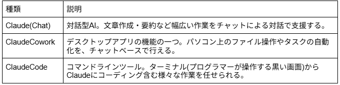

# 山口 椋太郎 TOP 报告 — 2026-W27

- 周次：2026-W27
- 报告类型：TOP
- 提交时间：2026-07-02 01:20:32
- 职位：Engineer

---

価値基準

HisaoGPTなどAIの活用が話題になっています。我々CDAはAIをTOP報告や週報に活用するという取り組みがあり、AIを身近なものとして使ってきたため、その際の気づきを僭越ながら紹介させていただければと思います。

【問い】

AIを使うようになって、自分の考え方に何か変化はありましたか？

【回答】

結論

AIを使うようになって、今まで以上に教育の重要性について考えるようになりました。

詳細は後述します。

前提

最も活用しているAIがCladeのためCladeをベースに記載させていただきます。

Claudeは、Anthropic社が開発している対話型AIです。文章の作成や要約、資料の読み込みと分析、アイデア出しなど、幅広い作業を支援してくれます。特徴としては、プロンプトに対して認識ズレが起きないように、指示に対して選択式で質問を投げかけてくれることです。

Claudeの種類

Claudeには大きく3種類の機能があります。

多くの方はClaudeをブラウザ(GoogleChrome)やスマホで利用されており、前述一番目のただのClaude(ややこしいため以後ClaudeChat)を使われているのではないでしょうか。しかし、後者のCoworkやClaudeCodeの方が機能が豊富で優れている点が多々あります。そこでこの2つについて紹介します。

注意：CoworkとClaudeCodeは有料プランのPro(月額20ドル)に加入しなければ利用できません。

有料プランに入っている人は利用しない手はありません。

ClaudeCowork

ClaudeCoworkの特徴はなんといってもパソコンの操作ができることです。これにより、パソコン上のデータを簡単に読みこませ、資料ファイルの作成や修正、フォルダ整理もさせることができます。ClaudeChatだと毎回資料を追加するにはチャットへのアップロードが必要になります。逆に資料を作ってもらったらダウンロードが必要です。しかし、ClaudeCowrokでは、パソコン上で作業するフォルダを指定することができ、その中のファイルであれば容易に読み書きが行えます。基本的に指定したフォルダの外にあるファイルが操作されることもないため安心です。作業フォルダにAIに守ってほしいルールなどを記載しておけば毎回指示せずともその内容に従って行動してくれます。例えば、AIの応答方針に関するルールを記載したファイルを置いておくなどです。

例）

応答方針

・不確実性への言及

断定できない場合は「可能性が高い」「推測」など不確実性を明示する。

・誤った場合の対応

間違えた場合は「間違えました」と明確に認めて修正する。曖昧な誤魔化しは禁止。

・提案方法

こちらの指示にただ従う提案ではなく、目的／制約／優先順位を整理したうえで提案する。

他にも、スライドを作る際のテンプレートを作成して配置しておけば、そのテンプレートを活用し、統一感のあるものを毎回作成してくれます。このように、AIを強化させるためのナレッジをファイルとして蓄えていくことができる点がClaudeCowrokの優れている点で、ナレッジファイルをブラッシュアップさせていくこともAI利用の醍醐味です。ナレッジファイルのブラッシュアップがAIを教育することに該当し、AIの成長を実感することも楽しみの一つになります。

その他にもタスクの定期実行やマイクロソフトオフィスとの連携、MCPサーバーへの接続などやれることは多々ありますが長くなるためここでは割愛します。

ClaudeCode

ClaudeCodeはコマンドラインの利用が必要で、主にプログラマーがコーディングをするために利用されることが一般的で、環境準備の敷居も高かったです。しかし、Claudeのデスクトップアプリのアップデートにより、ClaudeCodeも簡単に利用を始めることができるようになりました。そのため、プログラマー以外の方もより複雑な作業をAIに期待するのであれば敷居が下がった今が挑戦どきと思われます。

ClaudeCodeはCoworkよりさらにカスタマイズ性が高くなっています。特にエージェント機能のカスタマイズ性が強みだと認識しています。複雑のエージェントというAIを組み合わせることで、効率的かつ精度の高いアウトプットを求めることができます。例えば、情報収集エージェント、内容精査エージェント、文章作成エージェントなどそれぞれの作業に特化したAIが分担をして作業を進めてくれます。設定の難しさやブラッシュアップの必要性など敷居の高さはありますが、やってみる価値のあるものだと感じています。難しいこともあるため、わからないことや気になる点があれば気軽に聞いてください。

Claudeデザインという新機能もありますが、まだ使いこなせていないため、紹介は別の機会にさせていただきます。

今回は主にClaudeについて述べましたが、その活用にあたり、表現力の重要性が鍵になると感じたため、最後にそのことについて記載します。

AI活用での教育の重要性

AIの活用において、今まではプロンプトの改善がメイントピックだったと思います。しかし、今後より効率的にAIを活用するには、AIを教育し、自分用にカスタマイズしていくことが求められると考えています。なぜなら、毎回丁寧なプロンプトを実施することは非効率だからです。

これはAIではなく人で考えると当たり前のことです。部下には慣れないうちは事細かに指示を出す必要があります。しかし、部下を教育し、成長や前提知識が揃ってきたら、以前ほど細かい指示を出さなくても正確に指示を汲み取ることが可能になり、コミュニケーションのスピードがアップします。直近では、後輩の知識が増えてきたため、あえて細かい指示をせず、一部の情報を欠落させた状態で指示することがあります。その指示に対する後輩の反応で、知識の理解度やアプローチの適切さを確認しています。例えば、指示直後に質問をしてきた場合は、欠落を察知できていると判断することができたり、実際に作業に取り掛かった際に情報の欠落に気づいた場合は、まだまだ知識や想定が足りていないと気づくことができます。また、この気づきから次回からは質問しないといけないな、などの学びに繋げてほしいという思惑もあります。最近指示が雑になってきたと感じた場合は、寧ろ成長を期待されているかもと考え、相手の意図を想像してみてください。

少し話が逸れてしまいましたが、AIにおいても、開発者だけでなく、ユーザーが簡単に教育をできるような環境が整いつつあります。そのため、プロンプトを工夫するだけでなく、AIを教育するということにも重きを置いてみるべきだと考えます。

CDA

【ルーキー教育】

〈講義〉

先週、青本講義が終了し、我々チーム山口の講義回は終了しました。今週からはチーム川上による講義運営が始まります。チーム毎に講義の質に大きなバラツキが発生しないように状況のキャッチアップも進めていきますが、川上くんとは一昨年からずっと一緒にCDA新入社員の教育をやってきたため、大きな不安はありません。チーム川上に続く別チームに関しては、経験が不足している部分もあるかもしれないため、適宜フォローしていきます。

担当チームの講義が終了したため、評価チェックを進めています。後述のCDAアウトプットチェックと並行して実行できる体制としています。

【CDAアウトプットチェック】

各委員会にチェックするためのスプレッドシートの共有と説明を実施しました。先行してルーキー教育委員会で利用している分には問題はおきていませんが、7月より各委員会も利用していくため、並行利用による問題が発生しないかは注意しておきます。

業務報告

【定型業務引き継ぎ】

チームメンバーの白石くんに定型業務を引き継いでいます。一緒に実施するフェーズは終了し、実施結果を報告する流れで問題なく周っているため、この運用を続けていきます。

【エスカレーション対応教育】

定型では対応できない珍しいエスカレーションがきたため、後輩に定型で対応できないものに関しても経験を積んでもらうために一緒にエスカレーション対応を実施しています。原因不明な場合の調査の流れや当たりのつけ方などアプローチのやり方を見せる形で一緒に進めました。

【リリース】

先週無事にリリースが完了しました。リリースによる改善で、問い合わせが落ち着いたこともヘルプデスクと認識合わせできています。

余談

キングダムの実写、映画全4作を見ました。迫力あるアクションや熱い展開、歴史や戦略を知るきっかけにもなりました。学生時代、歴史は退屈と感じて苦手でしたが、社会人になって振り返ると歴史から学べることも多々あったのではないかと感じています。これをきっかけに歴史についても学び直そうと思いました。

キングダムの最新作が7/17から公開されます。是非この機会に見てみてはいかがでしょうか！

