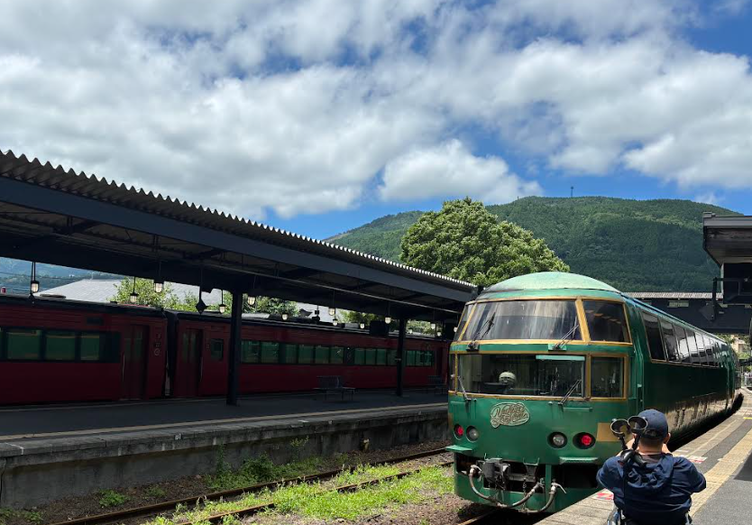

# 山口 椋太郎 TOP 报告 — 2026-W29

- 周次：2026-W29
- 报告类型：TOP
- 提交时间：2026-07-16 08:33:35
- 职位：Engineer

---

価値基準

今週はマニュアルに関する話題がありました。そこで仕組み化に関する問いに回答します。

【問い】

なぜ人に仕事がつき、仕組み化が進まないのでしょうか。

【回答】

結論

仕組み化が進まないのは、仕組み化そのものが仕事として定義されておらず、評価もされないことが関係していると考えます。今週の洋幸さんTOP報告にあった「人に仕事がつき、仕組み化にならない」という指摘は、自分の周囲を振り返っても心当たりが多く、他人事ではありません。以降よりなぜそうなってしまうのか3つの要因に分けて整理します。

最初の要因は、属人化が短期的には合理的であるからです。ある業務を最もよく知っている人がそのままやり続けるのは、目先の効率だけを考えれば最速です。本人にとっても自分にしかできない仕事は存在価値の担保になり、周囲にとってもあの人にやってもらえば済むという状態は楽です。一方で、手順を文書化し、誰でもできる形に落とし込む作業は、時間がかかるうえに即効性がなく、短期的にはコストだけがかかります。つまり、組織は自然に属人化へ流れるものになっており、仕組み化は意識的に力をかけない限り進まないと考えられます。したがって、なぜ進まないのかではなく、進まないのが自然な状態だと認識を改めることが第一に必要だと思います。さらに厄介なのは、属人化のコストが普段は見えにくいことです。担当者がいる間は何の問題もなく回っているように見えますが、異動や退職が起きて初めて、引き継げない、再現できない、教育に何倍も時間がかかる、という形で遅れて、露呈します。目先の効率をトレードオフに、将来の再現性を捨てていることが属人化だと捉えられます。

二つ目の要因は、仕組み化が「業務」ではなく「善意の追加作業」になっていることです。報告にあったトヨタの話が象徴的でした。トヨタでは生産性向上が社内で高く評価され、エースが投入される重要部署とされています。対して我々は、マニュアル作成や標準化を、日常業務の合間に余力でやるもの、と位置づけてきたのではないでしょうか。評価されない仕事に人は本気になれません。フォードが三度学んでもカイゼンを真似できなかった逸話の本質は、手法の問題ではなく、「仕組み化に本気で報いる文化があるか」の差だと私は受け取りました。マニュアルを書いた人、業務を誰でもできる形にした人が、成果を出した人と同じように評価される。この裏づけがない限り、今回のマニュアル提出も一過性の宿題で終わるリスクがあると感じます。報告の中に「仕組みで儲かる、評価される、を構築する」という言葉がありましたが、順番としてはむしろ「評価される」が先ではないかとすら思います。自分の仕事を手放して誰でもできるようにすることは、本人にとっては自分の希少価値を下げる行為に見えます。その不安を上回る評価がなければ、人は自分の知見を文書に書き出しません。属人化とは、個人の性格の問題ではなく、評価制度への合理的な適応の結果なのだと思います。

2つ目の要因は、作って終わりで、維持する責任者がいないことです。トラベースが弱いままである理由はここにあると思います。プロトタイプとして立ち上がったものが、オーナー不在のまま放置され、業務が変わっても更新されない。すると現場はどうせ最新ではないと閲覧しなくなり、閲覧されないから更新する動機もさらに失われるという悪循環になります。そうならないためには、マニュアルという文書そのものではなく、更新の仕組みが必要です。我々が過去に作ったものは、マニュアルを作ることが目的で、トヨタのカイゼンのような運用を真似ることができなかったのではないでしょうか。マニュアルの目的は作成ではなく維持です。作るだけでは陳腐化していく以上、更新され続ける仕組みがなければ、どれだけ立派なものを作ってもいずれ使われなくなります。プロトタイプとプロダクトの違いは、機能の完成度ではなく、維持する体制があるかどうかだと思わされました。

レジに関しても、特に展開においても思い当たることがあります。特定の担当者しか手順を知らない業務があり、その人が休むと電話がつながるまで確認が止まります。引き継ぎは徹底されず、次の人がまた自分なりのやり方を作っています。結果、同じ業務なのに人によって手順がばらつき、結果としてミスが発生します。これは人に仕事がついている状態です。この状態では人を増やして展開することが容易ではありません。たとえうまくいったやり方があったとしても、それが個人の頭の中にしかなければ、他へ移すには人ごと動かすしかありません。今後利益を4.5%、5%と上げていくには、一部の優秀な個人の頑張りではなく、良いやり方を素早く全社に展開できる力にかかっているはずです。その複製の媒体になるものがマニュアルであると理解しました。

では、今月中のマニュアル提出という指示も、一回のイベントで終わらないようにしなければなりません。そのためには3つの条件が必要だと考えました。まずは、マニュアルごとにオーナーを決めることです。部署単位ではなく文書単位でこの手順書の更新責任者は誰かを明記します。次に、更新をルール化することです。作成日と改訂履歴を必ず入れ、業務変更時の更新をセットにします。完成度の高いマニュアル一つより、更新頻度の高い一枚のほうが価値があると考えます。最後に使われる場所に置くことです。現場の作業動線の中で自然に参照される形になっていなければ、読まれることはありません。ここは本来トラベースが担うべき役割であり、マニュアル整備とトラベースの活性化はセットの課題です。各部署がバラバラの形式でファイルを作って提出し、階層構造もぐちゃぐちゃになるという形を避けなければなりません。提出をゴールにするのではなく、集まったマニュアルを一つのシステム上で検索、改訂でき、誰が見ても最新版が分かる状態にすることが必要です。そこまでを含めて仕組み化になると考えます。

最後に、今回の4%達成との関係を考えます。4%の達成が偶然か必然かという問いに必然だったと答えるためには、同じ成果を、同じ人がいなくても再現できる状態が求められます。つまり、仕組みで稼げる状態を作らなければなりません。台風や天候不良という逆風の中で達成できたことは間違いなく現場の方々の力があると思います。しかし、裏を返せば、その力の多くがまだ個人の頑張りに支えられているとも言えるかもしれません。個人の頑張りはいずれ途切れますが、仕組みが維持されれば途切れません。今後の目標を達成しつづけるためにも、頑張りを仕組みに変換して継続することが必要です。AIが自然と解決してくれるのではなく、まず自分たちの業務を書き出し、標準化することが必要です。標準がなければ、AIに任せるべき仕事と人がやるべき仕事の切り分けすらできません。まずは自分の担当業務のうち属人化している部分を洗い出し、自分以外もやれる状態にしていきます。

CDA

【ルーキー教育委員会】

合宿で提供された評価指標とメンター制度について委員会の一部メンバーで読み合わせ、疑問点整理を行い、未来戦略室に回答をいただきました。疑問点の解消がおおよそできたため、評価指標を活動に有効活用できるように動いていきます。ルーキーのみなさんへは別途説明の場を用意しています。

業務報告

【リリース】

7月リリースに向けた対応を進めています。検証環境でのリリースモジュールダウンロードテストを完了させました。併せて、代表店舗でのリリース検証で問題がないことも確認できています。リリース検証に関しては、店舗との調整から入店対応まで後輩に全て任せています。念のため立ち会いは行いましたが、必読な対応は行えていることを確認できました。

【チケット管理】

開発中案件の状況明確化のために、課題管理しているチケットの整理をチームで行いました。私からはチケット管理を行うシステムであるRedmineの運用説明を実施しました。

【機材動作確認】

廃棄予定だったレジ機材の動作確認のためレジを保管している倉庫に伺っています。廃棄対象の一部を西友大森オフィスでトライアルレジの動きを知ってもらうための検証機として流用するために、デバイスが接続できているかなどハード的に問題がないことの確認を実施しました。

余談

ゆふいんの森に乗りました。九州内の旅行は車で行きがちなので電車での旅は初めてでした。座席もゆったり座れ、こだわりある内装も感じながら移動でき、車よりも快適でした。何より出先でお酒が飲めることが最高でした。

