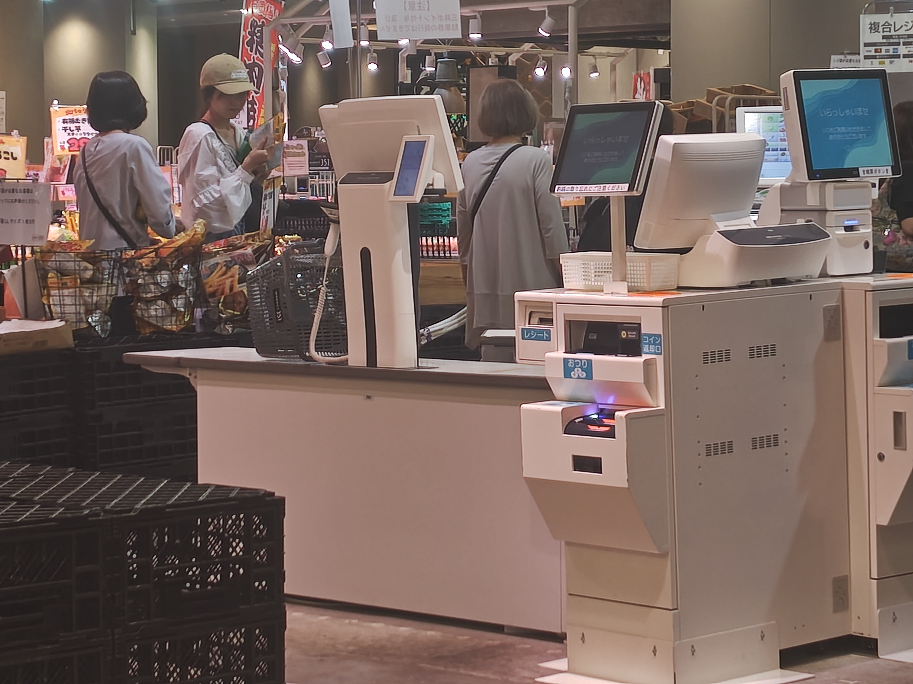

# 石室 智也 周报 — 2025-W39

- 周次：2025-W39
- 提交时间：2025-09-26 09:02:49
- 职位：Engineer

---

お疲れ様です。

トライアルカンパニーの石室です。

週報を提出します。

【当週の業務報告、業務予定】

・インバウンド、免税

免税フラグの追加、およびジャーナルの記録は問題ありません。

あとは、マスタを整備して単品までのフラグが来るようになれば運用できる状態になります。

・マージ作業

マージ作業のルールや実行の仕方を中川さんに説明して、テストで実行してもらうかと思います。

その際気づいた問題点を記録してもらってますので、改善法帆を検討していきたいと思います。

・レーンセルフ

本日登録機が届く予定。動作確認進めていきます。

・トライアル西友

UI、ロゴ変更を進めます。まだ正規のロゴデータは届いていませんが、来たらすぐ差し替えられるよう準備を進めます。

・自動値下げ

現在26桁の仕様変更の話を少し聞きました。

QRの件もあるので情報取りたいと思います。

・運用監視ツール

進捗無し

・ドロア在高入力仕様変更

修正完了。11月に組み込めるよう準備を進めます。

・保守系

CESettingToolのロゴ設定部分の修正開始。

・10月モジュール

モジュールテスト完了。リリースに向けた準備を進めます。

・9月モジュール

商品マスタのデータファイルがネットワーク遅延で時間がかかり、正しくインサートされない問題が発生しました。一旦再配信で解決はしています。今までほぼノータッチでしたが、アップデートの処理に改善した方が良い処理が無いか検討したいと思います。

・1on1

雑談部分を少しカット。プログラム、およびテストの仕方。そこに対する問題点に関してメンバーと会話するようにしています。日本語理解の問題も無いとは言えませんが、そもそも考え方、実行の仕方で改善できるポイントがあるので、実践させてみようと思います。

・その他

ららぽーと1階にレーンセルフが実装されているので見てきました。

混雑したときのみ開放されていたので、あまり長時間操作を見ることはできませんでしたし、QT300に関してはそもそも操作されていなかったので残念でしたが、スキャンした商品が表示されているように見えたので登録機と同じような画面が表示されている、もしくは従業員操作が必要な場面で使うのかな？と想像。お客様からの目線で見るとほぼセミセルフと同じ動きで買い物ができるようでした。

