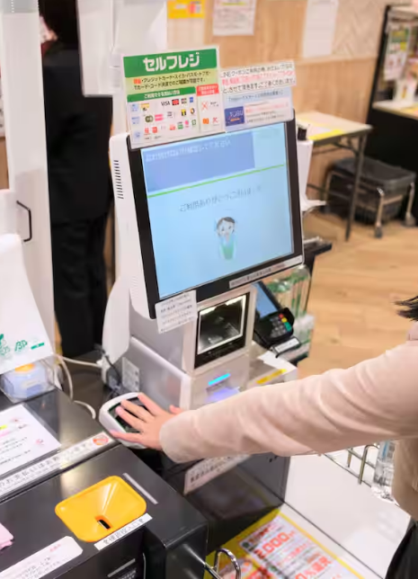

# 石室 智也 周报 — 2025-W41

- 周次：2025-W41
- 提交时间：2025-10-10 03:44:11
- 职位：Engineer

---

お疲れ様です。

トライアルカンパニーの石室です。

週報を提出します。

【当週の業務報告、業務予定】

・インバウンド、免税

福岡空港でアリペイ/wechatpayがPOSから直接支払いできる状態になりました。

直接入店して対応したので、先週行った別府よりは早く正常動作確認できたと思います。このまま問題なければ来週りんくう・大津も同様に対応予定です。

別途、免税レシートがBOで印字できてしまうという話がありましたので、次回モジュールで対応予定。QR→バーコードに文言も変更する予定。

・レーンセルフ

QT300では各会計機の状態が可視化してほしいということで合意しましたので、登録機・会計機はセミのような動きと画面、QT300は状態の可視化を行うことで対応していきます。

実験機はまだ組み立てされていないので、試せていませんがラそこは来週対応される予定。

・トライアル西友

UI側のロゴが来たので埋め込んでいます、あとはレシート用のロゴ。

・セルフクレジット

中川さんが対応中。来週目途にマージしていきたい。

・自動値下げ

進捗無し

・運用監視ツール

進捗無し

・ドロア在高入力仕様変更

画面微調整。

・10月モジュール

大きな問題は発生しませんでしたが、先月と同じ店と端末でモジュールのダウンロードに時間かかる現象あり。インフラに調査委依頼。

・マスタ更新、モジュール更新のダウンロード、展開処理

タイムアウト時間の延長をまず行います。

・1on1

各メンバーのスキルを点数化させてみました。

その変化を追うことで成長していっているかが可視化できないか試してみます。

・その他

指静脈認証で決済を行うレジがあるというニュースを見ました。数年前からあるようですが、知りませんでした・・・精度高く個別判断できるという意味では使えそうです。しかしトライアルでも打刻器やドアの開閉で使用していますが、高齢者など静脈が読みにくい人もおり、不便さを感じている意見も聞きます。レジでそうなってしまうと使っている本人も、並んでいる人もストレスになる可能性があります。それでは本末転倒ではないかとは思いますが、運用してみた結果どうなったのか情報取ってみようと思います。

