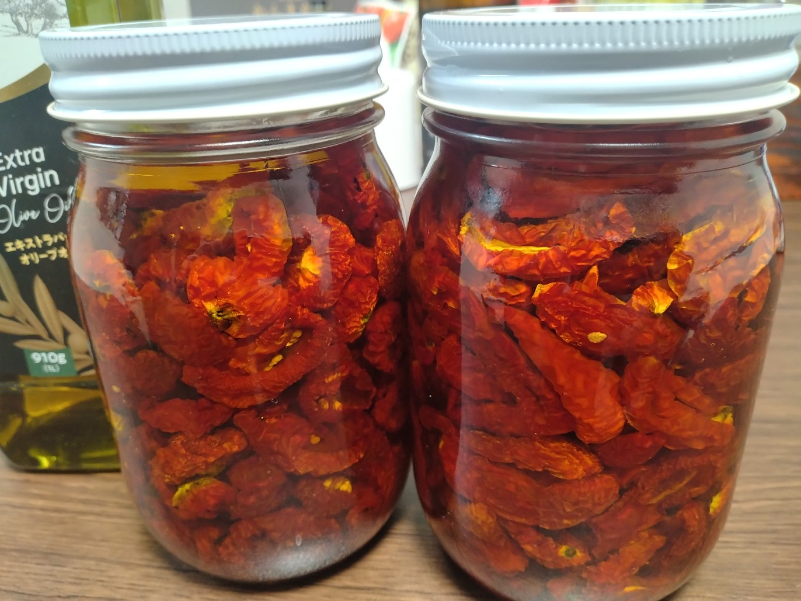
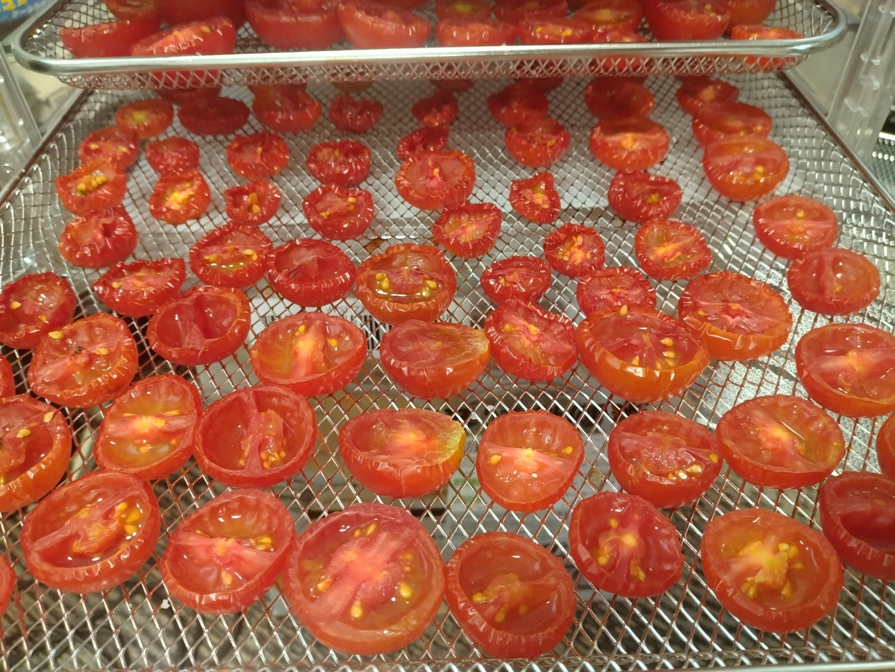

# 菊池 寿人 周报 — 2025-W29

- 周次：2025-W29
- 提交时间：2025-07-17 11:53:44
- 职位：Engineering　Manager

---

◆作業内容

①開発課題整理

＝＝＝筋の悪い案件＝＝＝＝＝＝＝＝＝＝＝＝

正しい情報を、正しく上に伝える事。

ここ忖度したり日和ると簡単にチームが全滅します。

攻めるも守るも、正しい情報の中で行いたい。

飛び越えて話進められると、フォローアップできません。

ご確認ください。

＝＝＝＝＝＝＝＝＝＝＝＝＝＝＝＝＝＝＝＝＝

■自己研鑽と教える文化

島田伸介と言う芸人がとても分かりやすく自己研鑽の意義を伝えています

端的に努力の重要性を表した有名な話ですが、紹介しておきます

【人は２５段階のランク分けが出来る】

残念ながら人は平等ではなく、根本的な能力差は抗い様の無い現実です

才能と言うものを１～５のレベルがあると仮定します

また、努力が結果に繋がるかは運の要素に左右されますが自力はつきます

努力による伸び幅を１～５のレベルがあると仮定します

つまり、その人の能力値は才能×努力の結果の為、１～２５のレベル差が

存在すると仮定する所から説明が始まります

ここから展開される努力の方法論が非常に為になるので、知らない人は

調べてみれば良いと思いますが、、

多分、自身で努力をして成長を実感した人ほど、単純ながら要点を抑えた

話に流石なやぁと思う反面、そらせや、当然やな、と思う事でしょう

出来ていない奴は、興味も惹かれず調べもしないか、見た所で得るものは

薄いのは想像に難くありません

世の中の重要な事は大体考えて答えに行きついていると噂の古代ギリシア人も

面白い事を話していますが、自慢じゃないですが、私も同じ事を思っていました

単純に嬉しいです

これも軽く紹介しておきます

【教えられたものは役に立たない】

「才能」「教育」「訓練」の関係性を伝える内容ですが、この考え方がないと

上の人間は見誤り、下の人間は成長のきっかけを与えられているにも関わらず

機会を逃しがちになります

「機会喪失」か、俗にいう「馬鹿の山」に登るか、「絶望の谷」に落ちても這い上がる

力が足りずに「こんなはずじゃない」「言ってくれたら出来た」「次は出来る」と

今、出来ていない自分を棚に上げてしまいます

この自己を客観評価出来ない、したくない、という成長を永久に止めてしまう

最悪の選択に飛びつくのは、生きてきた中で弱い自分と向き合う経験も、

その時どうしたらいいかの教育も、経験を通した鍛錬が出来ていない、

私の言葉で言えば、「人生をサボっていただけ」なのですが、ダニングクルーガー

まっしぐらになってしまうのです

話を戻しましょう

賢いギリシア人は、次の様な答えを出していました、特例はあれど一般的には、

訓練＞才能＞＞教育

という方程式です、もっと積極的に意訳すると、教育は無駄であり、才能を超える事はなく

訓練は才能を超える唯一の手段である、と言う内容と考えて問題ないと思います

島田紳助の言う人間のランクを才能と努力の２５ランクに分けた話と併せて考えると

古代ギリシア人と同じ事を言ってる事に気が付きますよね

流石です、古代ギリシア人

教育をやった事のない、された事もない人程、教育と言う言葉を軽んじ、その苦労も

想像出来ず、浅いカテゴライズが出来たとしても、本質人は全員違うという事実も

忘れがちです

この話を考えていくと、論語の為政編第2の10にある言葉や、何故か日本では

ゼークト組織論（イゼルローン要塞駐留宇宙艦隊司令ではない）と誤って認識されている

無能な働き者で言う名なクルトの組織論も、楽しくなってきますが、知ってる限りでいうと

触りだけなぞって言葉遊びをする姿を沢山見てきました

インチキ講師ビジネスの絶好の鴨ですよね

結局、教育はきっかけであり、きっかけを与えた後に適切な指導を繰り返す事で、

本人が自立して思考を組み立てられる所まで導いてあげるのが教育の限界、かつ

ゴールだと私は考えています

さて、教育を受けたつもりの人間がもし才能５だったらどうなるでしょうか

もし、教育を受けたつもりの人間がもし才能１だったらどうなるでしょうか

分析するに、デスマーチが発生する原因や、組織が腐っていく原因は、

この辺りの趣が多分にあるので分析がとても捗ります

こう考えた事はありますか？

社会人としてパフォーマンスを発揮する場合の最低ランクは？

自分は今どのレベル？今の業務の最低参画レベルは？求められてる期待レベルは？

島田紳助理論において、若くしてダウンタウンの舞台をみて、一生勝てないと悟り

当時の吉本の社長にもう劇場に立たないと言った話は有名ですが、

ダウンタウンが２５とした場合、５の人間がお金を貰って劇場に立てるでしょうか？

ダウンタウンはフォーマットとして革命的であり、圧倒的だったのは事実ですが、

仕事において自分のランクは何処にあるのか、どう改善していくのか、を考えるのは

日々の話であり、訓練の域に達した瞬間から、「啓蒙の坂」を越えて

「継続の大地」に立てるのですけれども、客観評価から全力で目を背けるのは

自由だが、何時まで目を背けるつもりなのか、、

まったくやってる事も言ってる事も入社当時と変わっていない人を沢山知っていますが

馬鹿の山、絶望の谷、長く苦しい啓蒙の坂の何処にいるんでしょうね

毎年、評価の時期は、色々考えさせられますね

■業務に特筆するべきものだけコメント多めにします

本当にマルチタスク過ぎですね

下流の調整なんて出来る事知れてるから上流で仕切って欲しい心

ほぼブレーンワーク次第なのでシレっと仕事出来ますけれども、

開発動き出すと最適化しまくってるので、ラフな割り込みは、

そこそこ脳みそ焼けます

・決済／ポイント

らららら～

・新店／改装展開時の毎度のトラブル

適切な指導した後、見守るのは判ります、んが、

見守ると言うのは、見てるだけ、ではありません

・インバウンド

案件が五月雨ていますが、やっぱり現場が楽になるものを急ぎたい

ですね

・レーンセルフ

来月には開発スタートしないと厳しい状況です

7/15までにご依頼をお願いしていた各案件については、

優先２段下げ、３段蔑んだテンションになってしまいます事、

お許し下さい

・7月色々マージ版

リリース終わりました

ローカルブレイクアウトが途中から止まっている問題と、

今回のサーバディスク障害が絡んでネットワーク遅延が

散逸してしまっていますので、然るべき筋に話を通します

・西の友

この手の案件はやった事ないと厳しいんですよね

やった事あると【簡単か難しい】ではなく、取り組む順番は

対してパターン無いから、粛々お願いしたいですね

・他一覧に乗っけるか検討中の案件複数

細々やりたい事が届いています

・各種要望

重たい課題が複数動いている為、そもそものロードマップの組み換え

を行いながらブレーンワークをしている状況です。

ブレーンワークなので真顔で仕事していますが、中々にカオスです。

それはそれで、いつもの事なので気にせず相談してください。

・その他、業務関連

割り込みマルチタスクが楽しい世界です。

③各種問合せ業務

・案件相談／概算見積もり

・店舗／コールセンター対応

④各種定例Ｍ

整理中

⑤割込作業

TEC協業取り組み

◆来週作業予定【7/21～7/25】

〇社内

今期要望整理

PoC各種

コール状況の棚卸

〇課題・要望の推進

棚卸

〇展開フォロー

ミスが連発してる展開チームの、この状況下では

フォローではなく、監視

〇其の他

なし

■本物は高いし、偽物も巧妙で高い

高いなら自分で作ればいいじゃない

大量のドライトマトを作りました

以上です

私信への返信

>お手数

虚無です

>👍

👍

全体的に

・フロントエンド内の業務応援やフォローなども突発的に発生し、

各自の業務が増加している傾向にあるが、全体で共有して

進めて行く。

・相談が増える中で、やりたい事が出来るかどうかだけ聞かれる、

段取りも無く突然依頼が来る、等、進め方がおかしい部分の改善図りたい。

以上
