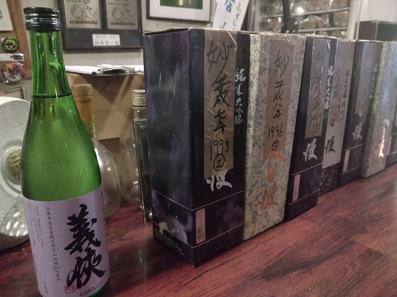
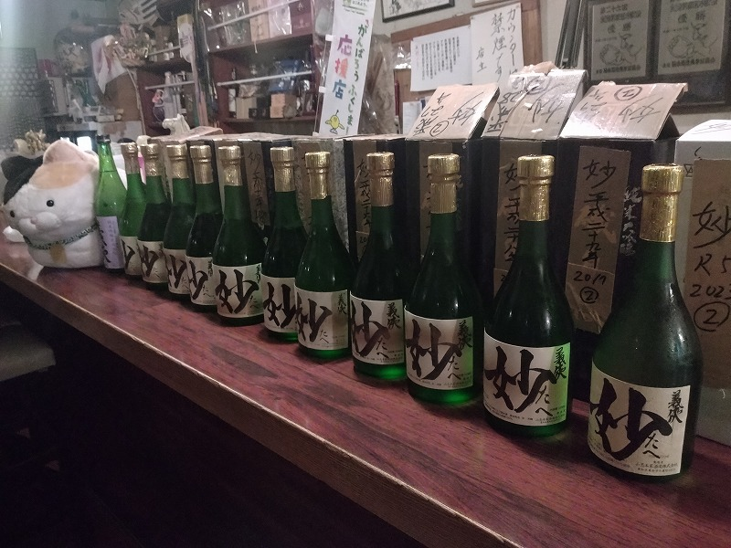

# 菊池 寿人 周报 — 2025-W32

- 周次：2025-W32
- 提交时间：2025-08-07 09:56:04
- 职位：Engineering　Manager

---

◆作業内容

①開発課題整理

＝＝＝筋の悪い案件＝＝＝＝＝＝＝＝＝＝＝＝

正しい情報を、正しく上に伝える事。

ここ忖度したり日和ると簡単にチームが全滅します。

攻めるも守るも、正しい情報の中で行いたい。

飛び越えて話進められると、フォローアップできません。

ご確認ください。

＝＝＝＝＝＝＝＝＝＝＝＝＝＝＝＝＝＝＝＝＝

■日本語の教育やります！

　｜日本語が不自由な日本人が山ほどいる中で、　　　　 ｜

　｜日本語の勉強をして欲しいなんて一度も言っていない｜

長くPOSチームに関わってくれている彼が言いました

でも、私は言いました

日本語なんていいから報告の中身のレベルを上げてくれ

各チームで窓口だったり、部下を持つ多くの人の圧倒的共感を

得られているであろう事は想像に難くないですが、

日本人で日本語が下手な奴に枚挙に暇がない現代で、

聞く気があるこっちサイドからすれば、文法発音として

上手くない日本語であっても、報告する内容が業務のソレなら

全然頭に入ってくるんです

昔、某メーカー系の仕事で台湾人と仕事してましたが、

業務と言う限られた空間で出てくるシチュエーションであれば

何が言いたいかは、伝わるもんです、つまり、仕事の技量問題

文化背景の異なる言い回しのすれ違い、てにをは違いの混乱、

未然、現在、未来の間違いによる大混乱、これも結局、業務報告

の上であれば、事故らないんですよね

それが、本当に伝わらないと感じる2019年以降、、台湾案件当時は

「俺は凄いんだ」しか言わない使えない高級プログラマー以外は、

そんな事はなかったぞ？

因みに、その時にやった一番効率の良いやり方は、相手が日本人より

日本語が巧い、なんなら日本語で冗談を返してくるレベルだった事を

良い事に、

台湾からのメールや資料は全部繁体字

私が送るメールや資料は、全部日本語

これ、滅茶苦茶捗ったんだけれども、何故か、TRECは日本語で書いても

中国語で書いても時間は変らないと、日本語で変な資料を送ってくる

誤字脱字はどうでもいいけど、資料や調査の観点が見るに堪えない

つまり、そういう所

■業務に特筆するべきものだけコメント多めにします

本当にマルチタスク過ぎですね

下流の調整なんて出来る事知れてるから上流で仕切って欲しい心

ほぼブレーンワーク次第なのでシレっと仕事出来ますけれども、

開発動き出すと最適化しまくってるので、ラフな割り込みは、

そこそこ脳みそ焼けます

・防犯Iot

プランナーが言われた通り作業のみしてたら何も産まれんですよ

次週はここを掘り下げようかな

・決済／ポイント

らららら～ら～ら～らっらら～ら～ら～ららら・・・×２

・新店／改装展開時の毎度のトラブル

日本人がもうそうなってしまったのだろうと、教育の敗北を感じる

・インバウンド

今週中に支払連動の報告準備が終わりそうです

・免税クーポン

メディアIDの扱い方が雑

とりあえずこれでいいやの適当な判断を、意地張って

つっぱってやせ我慢しながら積み上げていく先にしか

まともなシステムはないんだが、、いつものやっつけ感

・生鮮要望全般

今週はここを掘り下げよう

私の知っている村の掟では禁忌ばかり

振り返って先輩達は、ソレを「タタリ神」と称しており

我が一族（チーム）からタタリ神が顕現する事を、

非常な恥として、それはそれは厳しい村の掟を科していました

、、その中で村八分というより、村から追放された半端モノが集まった

姥捨て山見たいな集落（フロア）がどこも１箇所以上あったのは、

当時、至る所で見られた現実の話であり、別の村へ出稼ぎに

行った際、入った集落がソレだと、到底考えられないムダと怠惰を

体験させられ、逃げ帰るの様にオラが村の人間に外界の恐ろしさを伝え、

長老達に心の底から感謝をしたものです

村の掟とは、業務での慣習や歴史、口伝などの伝承や民俗信仰にまで

踏み込んだ柳田国男先生の「遠野物語」に代表される民俗学の体系を

口伝で伝えてくれてた文化風俗（社風）だったのだと思います

とは言え、口伝は時代と共に肉付けされ歪みを伴いながら、また

本質への集約を繰り返す類のものですが、変質しやすく失伝しやすく、

また、時代背景に沿ったブラッシュアップが無いと、簡単に誤った

解釈になる所も怖い所です

柳田国男先生の事を思い出したら、書く手が止まらなくなって

しまいました

遠野、この時期は特に良い所ですよ

・レーンセルフ

本来は安全に出来る予定だったのだが、、

来週から本気だします

・セルフタッチ決済

乱打戦での生存論という本が書ける程度には乱打戦してきたので

どっちかと言うと、案件が３本以上走っている方が割込みってやり様が

あるんだが、持ち出しも多いのでお勧めはしない

で、テクニック使ってもこれを入れたら今動いていない案件は、

ストップよろしくな感じで、よろしくお願いしたい

・ローカルブレイクアウト

途中から止まっている問題の原因はいずこ？

インフラチームが動いてくれて解消

・西の友

上の方針がどうであれ、変わらないものってあるんだなぁ

それがとっとと欲しいんだなぁ

みつを

・他一覧に乗っけるか検討中の案件複数

細々やりたい事が届いています

・各種要望

重たい課題が複数動いている為、そもそものロードマップの組み換え

を行いながらブレーンワークをしている状況です。

ブレーンワークなので真顔で仕事していますが、中々にカオスです。

それはそれで、いつもの事なので気にせず相談してください。

・その他、業務関連

割り込みマルチタスクが楽しい世界です。

③各種問合せ業務

・案件相談／概算見積もり

・店舗／コールセンター対応

④各種定例Ｍ

整理中

⑤割込作業

TEC協業取り組み

◆来週作業予定【8/4～8/8】

〇社内

今期要望整理

PoC各種

コール状況の棚卸

POSの未来を考える

〇課題・要望の推進

棚卸

〇展開フォロー

ミスが連発してる展開チームの、この状況下では

フォローではなく、監視

〇其の他

なし

■３５年前のブレンデット古酒垂直の会

世界唯一だろうイベントに参加してきました

当初は平成6年から令和7年までの30年垂直予定でしたが、

最終的に好事家が集まり、蔵元さん入れて自分で好きな酒を

選んでの7本垂直呑みを卓呑みでわちゃわちゃとやりました

ピックアップしたのは下記の通り

H7  1995

H8  1996

H9  1997

H11 1999

H12 2000

H27 2015

R5   2023

当初の30年垂直ではないですが、時間差で言えば28年の差がある

飲み比べです、使われているのも古酒の3年ブレンデッドなので、

尤も古いのは実年齢、昭和61年～63年と言うえぐい事になります

昔、古時計と言う37～39年前の古酒のブレンデッドを、仙台の居酒屋で

頂いた事がありますが、それと同い年と考えたら、トンデモなくクリアで

経年による風化もヒネもなく、妙らしさを残した素晴らしいお酒でした

まぁ、（いつもの）面子の博識博学の凄い事凄い事、ガチ勢過ぎて

非常に謙虚な自分が磨かれていくのも袖振り合う自称一杯飲み屋の

良い所だと思います

先代社長が平成6年から手掛けた山忠本家酒造さんの義侠 妙

願わくば、、本来出す予定だった平成6年のワーストビンテージ

（知ってる範囲で現存数１）を飲みたかったですね

私信への返信

>スパイス沼

初めは知らない世界で自炊も上手く行かず踠いてましたが、

もう今となっては、沼で肩まで浸かって癒しを得ています

>👍

👍

全体的に

・フロントエンド内の業務応援やフォローなども突発的に発生し、

各自の業務が増加している傾向にあるが、全体で共有して

進めて行く。

・相談が増える中で、やりたい事が出来るかどうかだけ聞かれる、

段取りも無く突然依頼が来る、等、進め方がおかしい部分の改善図りたい。

以上
