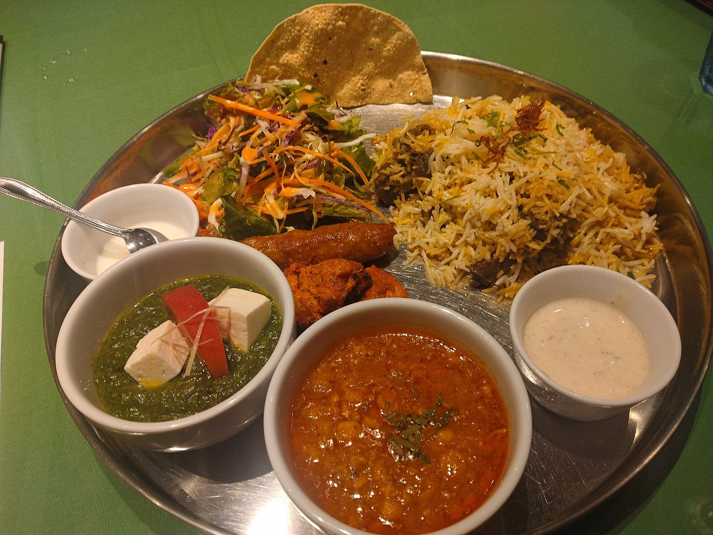

# 菊池 寿人 周报 — 2025-W33

- 周次：2025-W33
- 提交时间：2025-08-14 04:51:57
- 职位：Engineering　Manager

---

◆作業内容

①開発課題整理

＝＝＝筋の悪い案件＝＝＝＝＝＝＝＝＝＝＝＝

正しい情報を、正しく上に伝える事。

ここ忖度したり日和ると簡単にチームが全滅します。

攻めるも守るも、正しい情報の中で行いたい。

飛び越えて話進められると、フォローアップできません。

ご確認ください。

＝＝＝＝＝＝＝＝＝＝＝＝＝＝＝＝＝＝＝＝＝

■「遅ぇっちゃ！！」

どういう方向に向かうにしても、足回りで確認すべき事、段取り、

情報収集なんて、どんな案件だってそんな変わらんわ。

糞上司の代名詞ウエムラ時代の私が、数年久しぶりに鎌首を

持ち上げている今日この頃、沸々とどす黒い怒りゲージが溜まっている

何やってんのか判ってないなら、周りに相談しんさいや！

真に出来る人、、どこまで人の優しさ漬け込み甘えるつもりなんか、

そんな事を言わせるなよ！さんざ世話になっとんちゃうんか！と、

昭和の脳みそを持つ私的には、別に恩恵受けた訳でもないけど、

なんかそこはちゃんとしろよ、と変な義憤を感じてしまっている

「遅ぇっちゃ！！」と併せて、封印のタガが緩んできているのが感じるが、

あの怒りをエネルギーに転換していた20代の「やったらぁ」的

ガルガル戦闘脳は、案件推進カロリー高いので嫌なんですよね

■業務に特筆するべきものだけコメント多めにします

本当にマルチタスク過ぎですね

下流の調整なんて出来る事知れてるから上流で仕切って欲しい心

ほぼブレーンワーク次第なのでシレっと仕事出来ますけれども、

開発動き出すと最適化しまくってるので、ラフな割り込みは、

そこそこ脳みそ焼けます

・防犯Iot

ここを掘り下げようと思ったら、手が止まらず長文

何故、世の中に存在するのか、という当たり前に対して

疑問に思う事が一度でもあれば、人は大きく成長します

しかし、その当たり前に目と止めるまでには、結構な

我武者羅に数と量をこなしたと言う実績がないと、

「当たり前に疑問を持つ」という能力解除が行われない

とは、私と私が育てたり、見てきた人達の事実です

言われた事をただやるだけの、作業に溺れているだけでは

実は実績値はたまらないのです

特に酷い会議の準備や発言、議事録の使い方、タイミング、

合意形成、等々、誰でも調べたらさも簡単に教えてくれる

字面だけを見ても、実績開放されてないと使えないんですよね

言われたら簡単な事は、言われないと出来ない事であり、

今の自分だけでは出来ない難しい事、というコレに如何に早く

気が付けるか、がとてもとても大事になります

やらないのが当たり前ではないのです、やらなくてもいい、

もしくは、やりたくてもやれない状況を十二分に理解し、

世が世なら、自分がTOPに立てば、せめて自分だけでも、

と、どこまで妥協するか、と、その妥協に、悔しさや恥らいを

持っていれば、どんな環境にいても、腐らず成長は可能なのです

そういう教育をされていないのであれば、運が無かっただけで、

そういう教育をされているのに出来ないのは努力不足であって

そういう教育をされたかどうかも判らないのであれば、

数も量もこなしていない、もしくは無碍に過ごしてしまった

自分を悔やむしか出来ない残酷な事実が残ります

何時でも始められます、と人は言いますが、何時でも始められる

人は限られていて、有意義な数と量をこなした人にしか、

または、別の何かで突き詰めた人でなければ、ただの困難な

道のりになります

若さゆえの無尽蔵の体力、無知故の馬鹿集中、理不尽を許さない心、

なんかを、おっさんになっても持ってる訳がなく、いまだに持ってる人は

克己心の固まりみたいな自律のバケモノか、脳も体力も低下する事を

察して、理論化出来ているおっさんじゃないと、きついですよね

担当ではないので、いつも道化っぽくフォローいれてますけれど、

現場担当同士で普通にちゃんとやればいいだけです

TEC殿営業も若いんだから、上手く導いてうちも気持ちいい

落としどころを作ってあげるのは、おっさんの余裕だと思います

・決済／ポイント

らららら～ら～ら～らっらら～ら～ら～ららら・・・×３

・電子マネー上限UP

筋が悪い、理に適ってない、自分都合

を感じる

・新店／改装展開時の毎度のトラブル

日本人がもうそうなってしまったのだろうと、教育の敗北を感じる

・インバウンド

これだけやっていれば、どんなに楽しいでしょう

業務効率があがる、利用しやすくなる、という単純明快なものは

作りて側も癒し（と思ってるプログラマーがいるかどうかは別）です

ただ、現実とバーターなので、すみませんが、極力全力善処しますが

細かな所は相談させていただければと思います

・免税クーポン

メディアIDの扱い方が雑

どうやら担当者が割り当たったそうなので、嬉しいかぎり

・生鮮要望全般

各レイヤーには色々な視点や観点があります

業務という共通言語がないと、コミュニケーションすら厳しいのです

・レーンセルフ

今週から本気だしてます

・セルフタッチ決済

これは本当に酷い

誰が回してるのかしらないけれども、POSしか考えない

でいいなら、本当にどうでもいいんだけれども、そんなわけ

に行かないし、そんな事だったら今まで全部失敗してるから

本当に、ご担当者様にご登場いただきたい

どっかで「私がプロジェクトの責任者です」というタスキ買って

早く表れて欲しいです

偉い人みてます？、滅茶苦茶雑ですよ、この案件

・ローカルブレイクアウト

インフラチームが動いてくれて解消

天草のネットワーク遅すぎ問題

・西の友

上の方針がどうであれ、変わらないものってあるんだなぁ

それがとっとと欲しいんだなぁ、まじで

みつを×２

・POSの未来を考える

自分のスキルセットをちゃんと言えない人はダメだと思います

得手不得手も、自信と見つめ合ってはっきりと輪郭を掴んでおく

必要があります

と、言う意味では、発注者目線は沢山あっても、0→1を作りたい気持ちは

全然ないのです

だって、実現できるならそれでいいし、それをどう使うかの方が

ワクワクするもんね、と言う私と、プログラム作りたくて仕方ない

某管理者君が一緒にやりましょうと熱いのだが、

温度差が妙に面白い

・他一覧に乗っけるか検討中の案件複数

細々やりたい事が届いています

・各種要望

重たい課題が複数動いている為、そもそものロードマップの組み換え

を行いながらブレーンワークをしている状況です。

ブレーンワークなので真顔で仕事していますが、中々にカオスです。

それはそれで、いつもの事なので気にせず相談してください。

・その他、業務関連

割り込みマルチタスクが楽しい世界です。

③各種問合せ業務

・案件相談／概算見積もり

・店舗／コールセンター対応

④各種定例Ｍ

整理中

⑤割込作業

TEC協業取り組み

◆来週作業予定【8/18～8/22】

〇社内

今期要望整理

PoC各種

コール状況の棚卸

POSの未来を考える

〇課題・要望の推進

棚卸

〇展開フォロー

ミスが連発してる展開チームの、この状況下では

フォローではなく、監視

〇其の他

なし

■プライベート西友探検in東京

大森店

大森駅の東口から１ブロック先、ただし途中に面白い店は無いという

西友だけを目的に行くにはちょっと気が乗らない距離にある

御多分に漏れず、エキナカの成城石井（ローソン）やアトレの中途半端店舗

はあるが、これ自体は魅力的ではない

西友大森店自体は、周辺をまいばすけっと５店舗に囲まれ、駅東から逆の大通り

をイトーヨーカドーに抑えられているが、、商品にこれといった魅力がなく、

薄暗い照明と無駄に広い通路が、結果、閑散としていたという印象だけ残った

西口に肉のハナマサとこじんまりとしたスーパーがあるが、こっちで買い物を

済ませた方が自炊は捗りそう

吉祥寺店

１０数年ぶりの吉祥寺をあるいたが、ハーモニカ横丁がおしゃれ街に

飲み込まれていた、、一瞬消えたのかと思った位、小汚さが消えて残念

ここの西友は非常に厳しい立地で、商店街に面しているとはいえ、

ほぼほぼ出口側

正直、エキナカに紀ノ国屋、最高じゃないか

同じく九州屋など入っているロンロン市場、地下のキッチンコート、

ほぼ裏手にライフ吉祥寺、というあんまりこだわらないなら完結する

また、駅に沿って少しあるくと、地産マルシェ吉祥寺店

地場野菜の揃えはよく、豆腐やら冷蔵品も一ひねりあり見目楽しい

戻って商店街を歩いて西友に向かう手前には、美浦屋があり、

売り場再建中とはいえ、置いてる商品そのものが、西友のソレの

頭一つ上、絶対こっちの方が買い物楽しい

三浦屋を後ろに少し進むと、極小店舗の中の八百秀があるが、

まぁ、安い、傷物の野菜やハーブが市価の１／４位なのはやり過ぎ

これを抜けた先に、前述の薄暗くだだ広い１F日用品売り場と

地下にある生鮮食品フロアの西友に付くのだが、、

買い物大好き、自炊大好き人間からすると、

紀ノ国屋で高級フルーツや面白調味料、尖がった野菜を探索し、

地産マルシェに向かいメイン食材を購入、八尾秀でハーブやら香味野菜を足し、

三浦屋を眺めながら足りないものを検討しつつ、最後に心に決めた商品を

紀ノ国屋で買ったら、最高じゃないか

ここまでに手に入らなくても、エキナカ、駅裏の３スーパーで完璧です

西友を越えた裏側にはマルエツもあるが、くすんだマイバスな感じだった

花小金井店

駅前に、いなげや、もう詰んでます

いなげやで大体大丈夫、イイ路線でブランド化しているな、と

感心するいなげや、と言っても、私的には専門店が勝つので、

都内で態々行く事ないけど、ツレの家の近くにあれば、行こうぜってなる

ここから、ちっこい八百屋一軒こえた大通り？沿いに西友があるのだが、

暗くて狭くて活気が無いのは、３店舗中、誤差ながら最下位

いなげやはレジ周りも混んでるのが嫌だ、駐車場止めやすいからいいや、

の様な、店の魅力ではなく、後ろ向きな選択をしたお客ばかりが居た印象

買い物してるのに誰も楽しそうじゃないって、趣味、スーパーで買い物な

私からすると、あぁ・・、子供の飯も美味くないんだろうなぁ、と

お菓子もねだらず、小学生の兄弟が黙って買い物に付き合ってるのを

２組みて、しんどい気持ちになった

これを覆す商品ブランド、インパクト、、結構ハードネゴシエーションですね

どの客層に刺さりたいか、ですね

大森駅東口にある割とガチインド

隣にいた高齢のご婦人達の話題や話し方が、華族の人？って位の

多分すれ違った事がない昔からの品のいい金持ち感が凄かった

味は、ちゃんと、インドです（そんな高くないビリヤニセット）

全体的に

・フロントエンド内の業務応援やフォローなども突発的に発生し、

各自の業務が増加している傾向にあるが、全体で共有して

進めて行く。

・相談が増える中で、やりたい事が出来るかどうかだけ聞かれる、

段取りも無く突然依頼が来る、等、進め方がおかしい部分の改善図りたい。

以上
