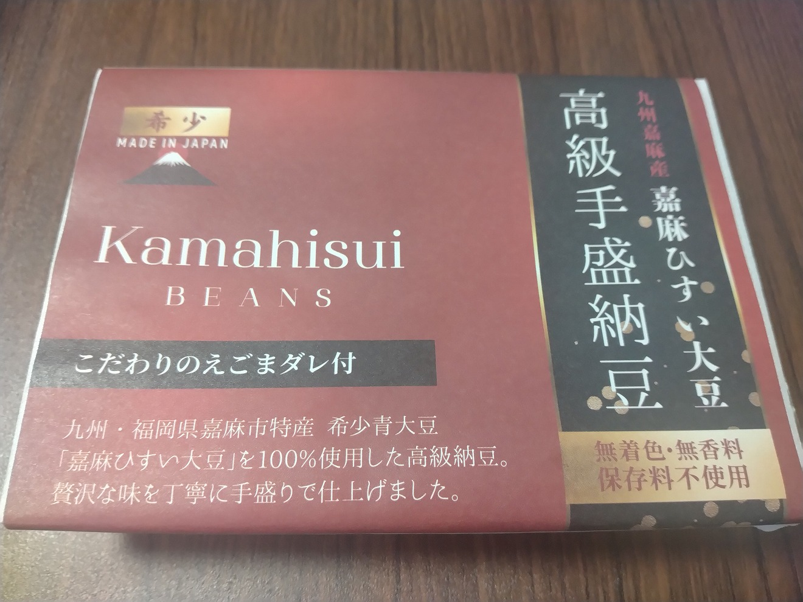
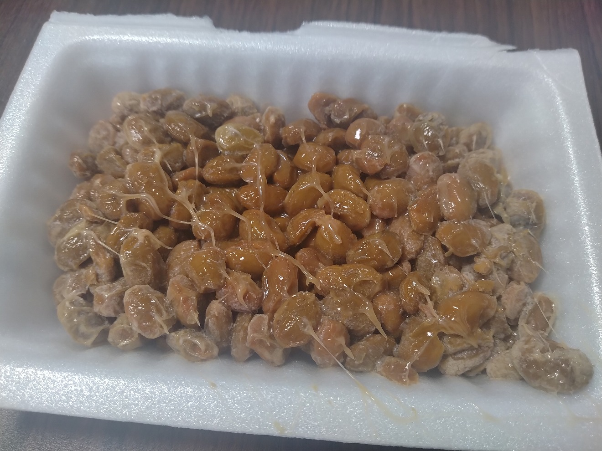

# 菊池 寿人 周报 — 2025-W35

- 周次：2025-W35
- 提交时间：2025-08-26 04:53:25
- 职位：Engineering　Manager

---

◆作業内容

①開発課題整理

＝＝＝筋の悪い案件＝＝＝＝＝＝＝＝＝＝＝＝

正しい情報を、正しく上に伝える事。

ここ忖度したり日和ると簡単にチームが全滅します。

攻めるも守るも、正しい情報の中で行いたい。

飛び越えて話進められると、フォローアップできません。

ご確認ください。

＝＝＝＝＝＝＝＝＝＝＝＝＝＝＝＝＝＝＝＝＝

■毎週色々ありますが、、

色々あるのに、情報は出てこないという不思議

プロジェクト最初期に必要な必須資料群を

ちょっと覗かせていただけませんかね

25年前に見た光景がデジャブる令和7年夏

■業務に特筆するべきものだけコメント多めにします

本当にマルチタスク過ぎですね

下流の調整なんて出来る事知れてるから上流で仕切って欲しい心

ほぼブレーンワーク次第なのでシレっと仕事出来ますけれども、

開発動き出すと最適化しまくってるので、ラフな割り込みは、

そこそこ脳みそ焼けます

・決済／ポイント

らららら～ら～ら～らっらら～ら～ら～ららら・・・×６

・電子マネー上限UP

９月初週でタイヨー殿向け

・新店／改装展開時の毎度のトラブル

確認したとか、判りましたとか、言葉が軽いんだよなぁ

なんも判ってないのに何故それで良いと思えるのか、、

責任感とかそういう問題を越えている気がする今日この頃

・インバウンド

やれる事からとっとと、もとい、せっせと対応いたす所存

諸々ご協力ください

・免税クーポン

ひっさびさに、ちゃんとした社会人と会話出来て嬉しいです

脳みそが汚れない感覚がとても心地よいです

で、どんな案件だろうと、結局は全部、手動で何処までイメージ出来るか

ってだけの簡単なお仕事です

システム知識とかどうでもよくて、システム探して当てはめるのは本来は最後

所詮システムなんてもんは、手作業や効率化の為の手段でしかないんだから

システムが偉そうにするのは論外だし、現場に合わせた最適解を出せない

システム屋なんて場数が足りんのですよ、という話は置いといて、

一旦、全部手作業のイメージ整えてくれたら、システム側の素案位は

ぴゃぴゃっと出す所存ですよ、それより大事なのは筋論

ちゃんとした業務スコープ、責任の所在、の後、権限の委譲が無い案件は、

25年前から1度も成功したの見た事ないですからねぇ、、

ほんと

・生鮮要望全般

各レイヤーには色々な視点や観点があります

業務という共通言語がないと、コミュニケーションすら厳しいのです

・レーンセルフ

今週から本気だしてます

初手調査の深度をサボらない事、判断間違わなければ勝てる

・セルフタッチ決済（花小金井）

STRに絡んだ出店必須要望としてお話を伺いました

相変わらず、言いたい事はごまんとありますが、それはそれとて

なので、まずは現実解の開陳と、判断を仰がねばなりませんね

普通の開発会社だったら受けないだろう程度の時間しか

毎度ありませんけれども、こんなのばっかでございます

・ローカルブレイクアウト

様子見

・西の友

上の方針がどうであれ、変わらないものってあるんだなぁ

それがとっとと欲しいんだなぁ、まじで

みつを

・POSの未来を考える

良く聞く単語の一つに、”現行踏襲”と言う言葉があるが、

システムにおいて、載せ替えや刷新の時に言い出すって時は、

大体が手に余して、”逃げ””停止””放棄”する奴が盾の様に

使う好きな言葉なのは、25年前のろくなITが形になってなかった時代に

仕事してたから良く判る、ブルータスお前もかー！って奴ですね

そんな事を言ってた奴が掃いて捨てる程いたなぁ、あいつ等何してんだろ

そうならない為にも、本当に必要なもの、業界標準、より良いものを

選定していかないといけないから、楽しいのは楽しいんだけど

、ねぇ（余韻）

・他一覧に乗っけるか検討中の案件複数

細々やりたい事が届いています

・各種要望

重たい課題が複数動いている為、そもそものロードマップの組み換え

を行いながらブレーンワークをしている状況です。

ブレーンワークなので真顔で仕事していますが、中々にカオスです。

それはそれで、いつもの事なので気にせず相談してください。

・その他、業務関連

割り込みマルチタスクが楽しい世界です。

③各種問合せ業務

・案件相談／概算見積もり

・店舗／コールセンター対応

④各種定例Ｍ

整理中

⑤割込作業

TEC協業取り組み

◆来週作業予定【9/1～9/5】

〇社内

今期要望整理

PoC各種

コール状況の棚卸

POSの未来を考える

〇課題・要望の推進

棚卸

〇展開フォロー

ミスが連発してる展開チームの、この状況下では

フォローではなく、監視

〇其の他

なし

■福岡に来て我思う、君ら地元以外、興味無さ過ぎ問題

私調べでは、全国的にみて、地元以外に興味のない人間が

あまりにも多過ぎる、それが福岡

全国図抜けた郷土愛が県単位ではなく、地元単位なのは多分、、

福岡固有の特殊感覚な気がしている、これ長年研究をしているが

結論めいたそれで確定していいのか、ずっとそこで研究が停滞している、、

で、私の感覚では、彼ら彼女らの意識は中学校区でいう所の２校区分

（といっても私の体験でいう１学年の数は300人程度の規模なのだが）

離れた学校に通っていたとしても、結局好きは近所の域を出ていない調べ

（多分に偏見含むが、未調査九州各区を除く、ほぼ全国居酒屋調べではそう）

宮若市を知らんのは判る、中間市を知らないのもまぁまぁ判る

とは言え、嘉麻市も知らんとか、どこのもぐりですか、って程、

割と本当にいい大人が知らないのだ

春吉で飲んでると筑豊の形や配置関係が頭に入ってない大人どれだけいるか、

雰囲気「ちくほう」ってだけで弄り倒しているが、イメージ先行が過ぎる

と言う事で、皆大好き、寒北斗、息子帰ってきて綺麗な酒作ってるよ黒田節

鹿美味しいよ、しかやさん、を抱える嘉麻市の高級納豆を買って、

嘉麻市のイメージ向上の為、春吉周辺の飲み屋亭主達に配ってみた高級納豆

1パック600円の高級納豆

唸れ嘉麻市の評判！

昔、１個８００円する卵を買って、生卵、目玉焼き、ゆで卵、茶わん蒸しで

激安、ヨウドラン光、それの値段違い３つの卵で試食した事がある

その時も飲み屋の常連さんにネタとして配り歩いた事があるが

今回もその時と全く同じ感想を得た

　　過ぎたるは及ばざるが如し

美味しい納豆、３パック買える値段でっせ？

私信への返信

>きよし

ぼかぁ～〇〇なんだなぁ、は、昔から”きよし”です

>👍

👍

全体的に

・フロントエンド内の業務応援やフォローなども突発的に発生し、

各自の業務が増加している傾向にあるが、全体で共有して

進めて行く。

・相談が増える中で、やりたい事が出来るかどうかだけ聞かれる、

段取りも無く突然依頼が来る、等、進め方がおかしい部分の改善図りたい。

以上
