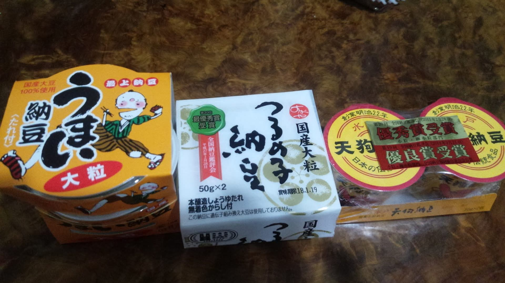
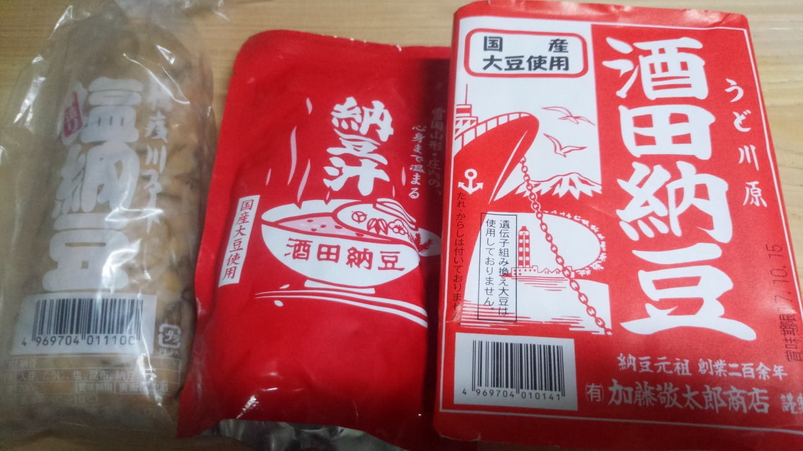

# 菊池 寿人 周报 — 2025-W36

- 周次：2025-W36
- 提交时间：2025-09-03 01:43:59
- 职位：Engineering　Manager

---

◆作業内容

①開発課題整理

＝＝＝筋の悪い案件＝＝＝＝＝＝＝＝＝＝＝＝

正しい情報を、正しく上に伝える事。

ここ忖度したり日和ると簡単にチームが全滅します。

攻めるも守るも、正しい情報の中で行いたい。

飛び越えて話進められると、フォローアップできません。

ご確認ください。

＝＝＝＝＝＝＝＝＝＝＝＝＝＝＝＝＝＝＝＝＝

■2025年ワーストミーティング大賞ノミネート兼優勝作品

タイトル：『恥』

まぁ色んな打ち合わせで超絶凄腕やらインテリヤクザやら

オラオラから糞無能まで、時に詰められ、時に脅され、

時に軟禁され、幾分自分でぶん回していると、やっちゃいけない

事の綺麗なリストが出来上がるもんなのですが、そのリストを

ほぼ総なめする様なミーティングに参加する機会を得ました最悪

久しぶりに吐き気を催す素敵なミーティングでしたが、

録画して何がどう駄目かの解説を入れて１本500円くらいで

販売したら爆売れする未来が見える程に、やっちゃいけない

事のオンパレードに心が疲れ果てました

段々とあきれ返り、口調がふらっとになる相手様の声に、

遠い昔のアホ課長が脳裏に浮かびました

満面笑顔でサムズアップしてましたが、今となってはアレの

お陰で成長出来たと思えているので、私も微笑み返しました

因みに、2024年ワーストミーティング大賞受賞作品は『こども』

■業務に特筆するべきものだけコメント多めにします

本当にマルチタスク過ぎですね

下流の調整なんて出来る事知れてるから上流で仕切って欲しい心

ほぼブレーンワーク次第なのでシレっと仕事出来ますけれども、

開発動き出すと最適化しまくってるので、ラフな割り込みは、

そこそこ脳みそ焼けます

・決済／ポイント

らららら～ら～ら～らっらら～ら～ら～ららら・・・×７

・電子マネー上限UP

絶賛タイヨウ様の対応中、今週で対応完了

・新店／改装展開時の毎度のトラブル

三つ子の魂100まで、とはよく言ったもので、入社3年目までの

習慣や気付き、ないし、発露に至らないまでの経験値の蓄積方法が

本当に重要なんです

まぁ、昔と違うので、今の基準だと５～７年なのかもしれませんが、

あんまりいいたくないですが、７年目で気が付いたとしたら、、

職責と能力の乖離がデカすぎて、マズい事になると思うんですが

時代なのかなぁ、と思います

ただ周りの大人、そこは私の昔基準で確認させていただきます

・インバウンド

必要ないと言われた時から現在、本当に現場の人は凄いなぁと

感心を超えて賞賛をしてしまう気持ちがあります

私が従業員だったら、店長に食って掛かって文句言いながら

楽する為に色々努力はしそうですが、文句は絶対言ってますもん

新規機能になりますが、改善を粛々進めていきたい気持ち

・免税クーポン

ひっさびさに、ちゃんとした社会人と会話出来て嬉しいです

って言うのはアレですよ、初めましてした人の中で、最近、

本当に出会ってなかったので、嬉しかったと言う意味ですよ

まぁ、これの関係者っていっても一人位しか見てないから、

誤解はされてないと思いますけれども、、これはこれで、

方向性を決めておかねばならないので、忙しいの言い訳が

使えない上の人達と、整理は進めていく必然があります

・生鮮要望全般

各レイヤーには色々な視点や観点があります

業務という共通言語がないと、コミュニケーションすら厳しいのです

・レーンセルフ

初手でPOSに聴きに来る時点でお察し、という言葉を広げたいですね

おかげさまを持ちまして、割り込み五月雨なので、本来の必達目標に

陰を落とさない様、しっかり進めていきたいと思います

えぇ、エース石室さんに多重分身をして貰えれば、余裕です

・セルフタッチ決済（花小金井）

あの～、お客様の中に、PMいらっしゃいませんか？

PMIとか糞程どうでもよくて、この案件を完遂する為に会社から

役割を割り当てられた責任者様で大丈夫です

・ローカルブレイクアウト

様子見

・西の友

上の方針がどうであれ、変わらないものってあるんだなぁ

それがとっとと欲しいんだなぁ、まじで、いや、まじで

みつを

・POSの未来を考える

9月中旬に第三回のWSがあるので、それまでに準備ものを作成中

・他一覧に乗っけるか検討中の案件複数

細々やりたい事が届いています

・各種要望

重たい課題が複数動いている為、そもそものロードマップの組み換え

を行いながらブレーンワークをしている状況です。

ブレーンワークなので真顔で仕事していますが、中々にカオスです。

それはそれで、いつもの事なので気にせず相談してください。

・その他、業務関連

割り込みマルチタスクが楽しい世界です。

③各種問合せ業務

・案件相談／概算見積もり

・店舗／コールセンター対応

④各種定例Ｍ

整理中

⑤割込作業

TEC協業取り組み

◆来週作業予定【9/8～9/12】

〇社内

今期要望整理

PoC各種

コール状況の棚卸

POSの未来を考える

〇課題・要望の推進

棚卸

〇展開フォロー

ミスが連発してる展開チームの、この状況下では

フォローではなく、監視

〇其の他

なし

■比べてなんぼ、振り返りと新しい擦り合わせが無いと・・

絶対的な感覚と、相対的な感覚、自分から完全に意識を抜き、

他人と同じく、忖度なく、冷静に比較分析する事は人生を豊かにする

とてもとても大事なきっかけを作ってくれます

その際に摩擦や抵抗となる糞の価値もないプライドや常識なんかは、

どっかでとっとと塵だと気が付かないと大変な事になります

その為にも、自分の中の宝物の様な体験や知識を、後生大事に

拝み続けるのではなく、広く世に知らしめて、本当の価値を見つける

勇気は必要だと思いますが、つまんない社会人は、その勇気がない

奴ばかりだったと振り返って断言できます

さて、自分の中の絶対的１位を常に持ちながらも、それを否定される

事を喜びと感じ、新しいものを得られる快感を知った時に大人の階段

が大きく伸びる、というか、突然、2Fの扉が現れ新しい階段が出現します

道のりはより厳しくなりますが、そこから先は面白味を感じられる事は

間違いないでしょう

の、納豆だったら版のお話

以下の感じで、美味しそうなもの、ランキング品、新規取り扱い商品を

定期的に購入し、食べ比べをしては、評価を洗い替えていきます

この手の奴は、水平判定しないと判断がぶれるからレギュレーションも

大事になります

こんなのやり過ぎて、No1が見つかってからは苦行の連続になりますが、

先だってマキイで、９年ぶりに心が躍る納豆に出会えた時には、

苦節が長かった分、どばどば脳汁出ました

とかやってると、製法や種類に興味が出たり、知識は一定値を超えると

等差級数的な伸びから、等比級数的な伸びに変化し、かつ、別の知識と

勝手にリンクし始めるので無限に楽しくなります

そうすると、その道の筋の方と自然と出会え、教えや物を貰ったり、

色々恩恵をいただく機会も勝手に増えていきます

経験は更なる経験でしか磨かれず、昔のしょうもない成功体験だけで

擦り続けると、どんどん曇っていくのは自明だと、経験から学べます

そう、仕事も一緒なんですよね、色んなものをみて、良いものから学び、

悪いものから更に学び、糞みたいな過去の成功体験に縋るのではなく、

新しい学びの中から、自分で成功体験を見つける循環を作らないと

社外に出た時に『恥』かいちゃいますからね

納豆食い比べる中にも、沢山の気付きがあるはずです（-人-）

気付きを得るために、例えば食材を買いあさり、食べ比べをして、

何等か得たものを仕事、料理、その他諸々、人生を豊かにするために

転用するのは、個人的お勧めです

私信への返信

>値段ほどの価値

残念な事に天然が工業製品に比べて必ずしも美味いという事が

なくなって久しい昨今ですが、無添加や手作りにその道のプロが

拘る姿勢は、個人的にリスペクト含め応援する気持ちが強いです

が、エンゲル神に魂（財布）を捧げている身としては、物の価値が

味の価値に影響する事はありません、アレはネタ枠で買いました

評価は、

「旨いが特別旨い訳でなく、この商品は買うに能わず」

「１丁600円程の青大豆豆腐を買った方が満足度は圧倒的」

と考えてしまいます

>食べ比べ／特別美味しいって・・

特別美味しい納豆、、というのは好みがありますが、納豆大国の

山形県産納豆は、レベルが非常に高いと思います

ただし、個人的にタレで食わす系の納豆は”毛嫌い”してる為、

大粒で豆そのものが美味しいものを好んで購入します

タレ？ぶん投げますよ、そんなもん

とてもお高い醤油や、とても製法にこだわった塩で食う方が、

圧倒的滋味深く、土鍋で炊いた粒だった白米の甘さと口腔内で

混然一体となった時には、現身のままニルヴァーナに到達します

面倒なので納豆は単独で食う昨今ですが、あれは本邦人たる

根源に届きうる合法ドラッグですよね

でも普段食う分にはメーカー品は非常に優秀で、コンビニで

買えるおかめ納豆ですら、そこらの拘りの納豆よりも圧倒的に

安定感のある素晴らしい製品だとおもいます

当然、タレはぶんなげますけれども

全体的に

・フロントエンド内の業務応援やフォローなども突発的に発生し、

各自の業務が増加している傾向にあるが、全体で共有して

進めて行く。

・相談が増える中で、やりたい事が出来るかどうかだけ聞かれる、

段取りも無く突然依頼が来る、等、進め方がおかしい部分の改善図りたい。

以上
