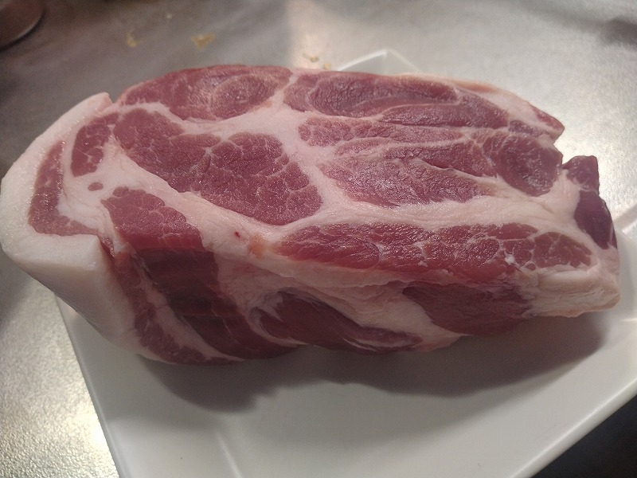
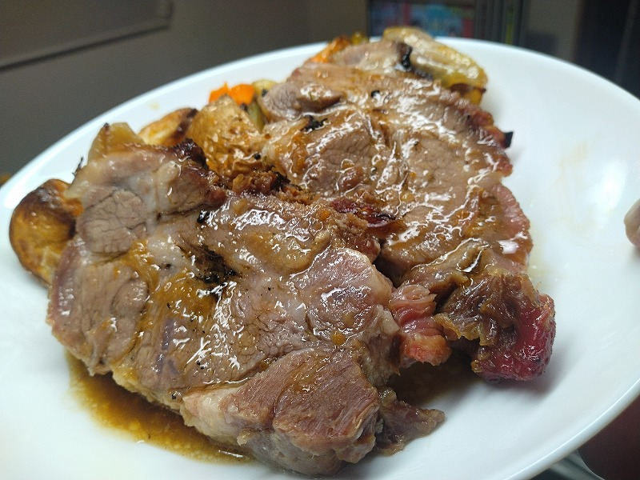

# 菊池 寿人 周报 — 2025-W37

- 周次：2025-W37
- 提交时间：2025-09-10 05:07:49
- 职位：Engineering　Manager

---

◆作業内容

①開発課題整理

＝＝＝筋の悪い案件＝＝＝＝＝＝＝＝＝＝＝＝

正しい情報を、正しく上に伝える事。

ここ忖度したり日和ると簡単にチームが全滅します。

攻めるも守るも、正しい情報の中で行いたい。

飛び越えて話進められると、フォローアップできません。

ご確認ください。

＝＝＝＝＝＝＝＝＝＝＝＝＝＝＝＝＝＝＝＝＝

■言われた事しか考えないから発想が貧困

何度も繰り返し言ってる言葉なんで通算で言うと万超えしてると思うが、

「簡単な事が息をする様に出来ない時点で、難しい事」

「自分で出来た事だけが能力で、言われて出来た事は出来ない事」

「言われた事しか出来無い奴は言われた事すら出来ない」

これを本当に理解出来ないのに仕事を続けている人を見ると

結局、この人の社会人としての何十年の中に、何が残るんだろう

と物の憐れを感じてしまう、とうか、怖くないですか？

よかった、新人時代にべっこべこになりながらも徹底的に仕込まれてて・・

何年たっても、自分の仕事が何してるのか判らない人って

出会った時から何一つ成長してないんだよな

まっすぐな目で同じ事をずっと繰り返すって、言葉は悪いと思うけど昔見た

大阪の天王寺動物園でうつ病になった白熊が、後ろ歩きで一周回って

プールに飛び込み這い上がる行動を、１日中ずーっとやってた時の

恐怖感と同じに見えるんですよね、いや、ほんと、まじ怖いです

自分が新人７月時点で言われて、翌年、教えの深さにはっとした言葉

「今何してん、何時までやんの、誰が使うん？それお前やないとあかんの？

　次何するん？やらんでええんちゃうん？仕事やからそれをやらんとあかんの？

　ほな、あかんなぁ、まぁがんばり」

まじ、日常が宝の山の様な言葉だらけでしたわ

まぁ、その横にいるメンターに向かって怖いトーンで

「富士原ぁ、菊池が道ハズレてんぞ、お前が悪いんちゃうか、よう見とけよ」

「お前が忙しいのんと、菊池の教育は関係ないぞ、念の為（言うとく）な～」

当時は良く判らずに震えてましたが、まぁ、教えすぎは絶対に良くないですが、

気付かせるベースを培うのは、初期教育時期だけに得られるボーナスタイム

ですからね、ほんとご迷惑沢山掛けましたわ

■業務に特筆するべきものだけコメント多めにします

本当にマルチタスク過ぎですね

下流の調整なんて出来る事知れてるから上流で仕切って欲しい心

ほぼブレーンワーク次第なのでシレっと仕事出来ますけれども、

開発動き出すと最適化しまくってるので、ラフな割り込みは、

そこそこ脳みそ焼けます

・GOタブレット

出会ってから何年でしょうね

いつも御変わりの無い姿に、こちらを差し上げます

 (´・ω・)っ残念

・決済

本当にうごくのかしらん

・ポイント

ミスや想定漏れの程度が低くて、日立お前もかって感じですね

あの程度？でも某大手広告代理店なら、査問員会が開かれて、

場合によっちゃ、企業賠償責任っていう物騒な単語が出てくる

流行りがありましたが、なんだかんだトライアルは優しいですね

・電子マネー上限UP

全店対応完了、次週から割愛

・新店／改装展開時の毎度のトラブル

簡単な事が出来ないのは、難しいからですよ

簡単な事が出来ない理由は、簡単な話です

簡単なんで、遠慮せず、誰かがやればいいですよ

・インバウンド

とりあえずPOSに相談だ！っていうのは、ある意味有難いのですが

そうすると知識だけが勝手に溜まっていくんですよね

POSなんて所詮インプット端末で、誰かから振る舞いを教えて貰わないと

なんも作れないって風潮を、どんどん広げていきましょう！

・免税クーポン

今までの雰囲気と全然違うのは、責任感と、伴う重圧なのでしょう

それはそれとて、もっと極端に考えちゃっていいと思うんです

やらなきゃ！の反対のやらなくていいんじゃね？を考えていくと、

本当にやらなきゃ！の輪郭が見えてくると思うんです、私

なんで、本当の目的の前にPOSって言葉を乗っけちゃうと、

本当の目的が手段になっちゃうと思うんです

（よかった、とりあえず、今回はPOS回避出来て）

・生鮮要望全般

各レイヤーには色々な視点や観点があります

業務という共通言語がないと、コミュニケーションすら厳しいのです

・レーンセルフ

脳内では行ける！完成も見えてる！あとは、やるだけ、お願いします

・セルフタッチ決済（花小金井）

役割を割り当てられた責任者様が不在では、墜落しますよー

・ローカルブレイクアウト

ちょいちょい店舗でネットワークが遅い様な事象が起きている

山口がインフラに相談して、色よい返事を貰ってるので、任せた

・西の友

上の方針がどうであれ、変わらないものってあるんだなぁ

それがとっとと欲しいんだなぁ、まじで、いや、まじで

流石のみつをも声のトーン荒げるで

・POSの未来を考える

9月中旬に第三回のWSがあるので、それまでに準備ものを作成中

・保守観点

形骸化とは言わんけど、自分で判るレベルに堕として、自分なりに

出来たと満足しちゃってるのを是正中

自分なんて大した事なくて、世の中はもっと凄いマインドと、

どうせやるなら、折角だから、とちょっと上を目指すマインドの

２つ持つだけでいいんだが、こればっかりは人生が出るからなぁ

でも楽したいなら努力するのが近道なんだが、なぁ

・他一覧に乗っけるか検討中の案件複数

細々やりたい事が届いています

・各種要望

重たい課題が複数動いている為、そもそものロードマップの組み換え

を行いながらブレーンワークをしている状況です。

ブレーンワークなので真顔で仕事していますが、中々にカオスです。

それはそれで、いつもの事なので気にせず相談してください。

・その他、業務関連

割り込みマルチタスクが楽しい世界です。

③各種問合せ業務

・案件相談／概算見積もり

・店舗／コールセンター対応

④各種定例Ｍ

整理中

⑤割込作業

TEC協業取り組み

◆来週作業予定【9/15～9/19】

〇社内

今期要望整理

PoC各種

コール状況の棚卸

POSの未来を考えるWS3回目

〇課題・要望の推進

棚卸

〇展開フォロー

ミスが連発してる展開チームの、この状況下では

フォローではなく、監視

〇其の他

なし

■ただ放り込んだだけ

ピザ窯でピザしか焼かないまま幾年月

習作としてローストポークにチャレンジ

何をしたって、野菜切って肉置いて放置、一回だけひっくり返す

鹿児島産豚肩ロース(486g)

1時間で完成、めっちゃ柔らかい

蛋白質凝固に対して、科学的な見地から非常に小さな１工程を挟んだけど、そんだけ

全体的に

・フロントエンド内の業務応援やフォローなども突発的に発生し、

各自の業務が増加している傾向にあるが、全体で共有して

進めて行く。

・相談が増える中で、やりたい事が出来るかどうかだけ聞かれる、

段取りも無く突然依頼が来る、等、進め方がおかしい部分の改善図りたい。

以上
