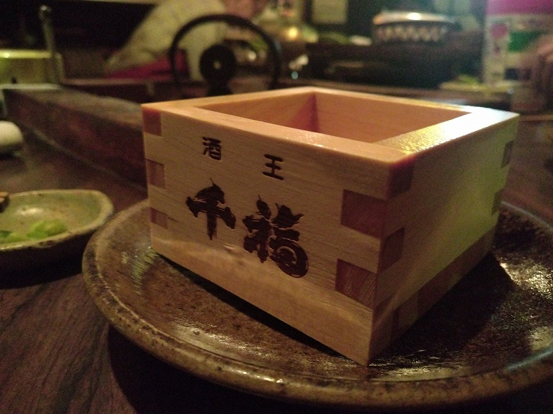
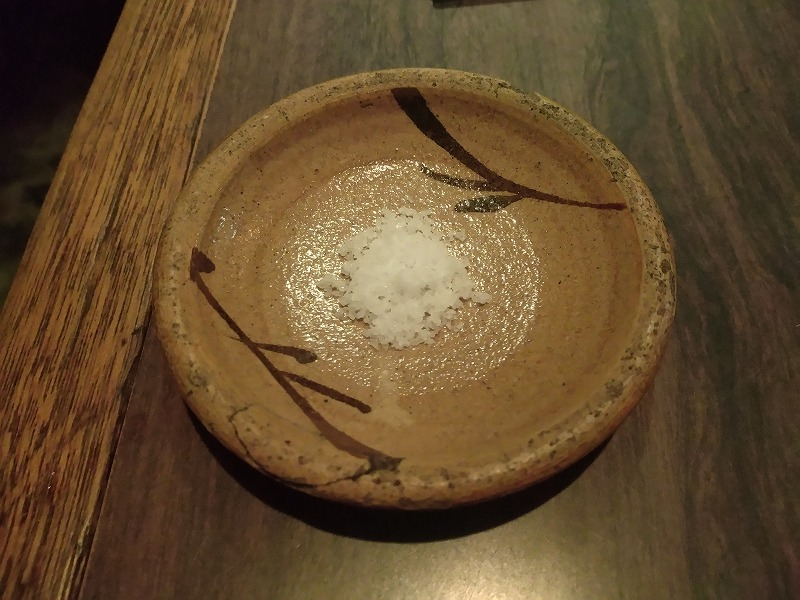

# 菊池 寿人 周报 — 2025-W39

- 周次：2025-W39
- 提交时间：2025-09-25 10:49:20
- 职位：Engineering　Manager

---

◆作業内容

①開発課題整理

＝＝＝筋の悪い案件＝＝＝＝＝＝＝＝＝＝＝＝

正しい情報を、正しく上に伝える事。

ここ忖度したり日和ると簡単にチームが全滅します。

攻めるも守るも、正しい情報の中で行いたい。

飛び越えて話進められると、フォローアップできません。

ご確認ください。

＝＝＝＝＝＝＝＝＝＝＝＝＝＝＝＝＝＝＝＝＝

■考えるのが下手過ぎ問題

もう過去に何度も似たような事を書いているのだが、

令和７年になってもまだそんな状況を目にするので仕方ない。

・人としての土台

いくら同じことを繰り返し伝えても、理解できるかどうか、

成長に繋げられるかどうかは、作業や言葉の難しさは関係がない。

結局のところ、受け手のこれまでの経験が十分蓄積されているか、

もしくは、自分のズレを客観的に見抜ける観察眼を得ているか、

そのどちらか、または両方も持っていないと成長は難しい。

だから高い金払って、講師の薄っぺらい「気付きが大事だ」と

口先の言葉を聞いても時間の無駄で意味はない。

慌てて本屋に駆け込んで、自身と状況が異なるにも関わらず、

著者の体験の集大成たる本を読んだだけではなんの力にもならない。

もう一度言うが“気付き”とは、すでに十分な経験が自身に蓄積され、

条件が整ったときにだけ自然に生まれ出てくるものであり、

その条件に、講師の言葉であれ他人の体験であれふとした一言や

経験がきっかけとなって視界が開け、成長につながる。

自分が今までサボってきただけなのに、頑張り方も判らず、無作為に

全力で頑張るなど、道化以下。

そもそも論で、

　ただの自業自得でしかない。

・思考力は筋肉に似ている

思考力は筋肉と同じ様な性質を持っている。

『ザ・桃太郎』のモンガーのように速筋も遅筋も自在に使える桃色筋肉を

持っていれば理想だが、凡人には地道に鍛えるしかない。

この話は2001年頃の2chのプログラマー板の片隅に書かれていて

凄く惹かれたのを覚えている。

使わなければ衰え、やせ細っていくのもとても筋肉的だ。

しかも筋肉と決定的に違うのは、思考力は周囲から見えにくい為、

手を抜いてもバレにくい点だ。

思考は、サボり易いだけでなく、取り返す苦労が筋肉の比ではないという

厄介さに、気付いていない人があまりに多すぎる。

私が新人研修をしていた時は、この手の話をよくしていたのだが、

新人から3年目に向かって、こんなおっさんになるなよ、との意味で、

大喜利っぽく研修していたら、実名で言ってないのに、ほうぼうのフロアの

役職の人がニヤニヤして見に来たり、大多数に睨まれたりしたなぁ（懐）。

　もし若手がこれを読んでいるなら、今の自分や周りの環境が、

　本当に正しいのか、改めて考えてみてもいいかもしれない。

　その時の、思考のコツもあるのだが、周りが馬鹿に見えた時に、

　そこに落とし穴があるので、その時は、注意した方がいい。

・引用の暴挙と憤り

先週の不届き者の話だが、著者の本を読んでもいないのに、

その来歴も背景も知らず、第三者の引用を平然と使っていた事実に絶望した。

あまりの浅はかさに、情けなさと憤りを覚えたのは、蛇足だが追記したい。

そこでふと思い出した言葉を2つ、挙げておく。別に思い出しただけで意図はない。

１）実際は意訳が歪んでいるので注意

原文：

Nur ein Idiot glaubt, aus den eigenen Erfahrungen zu lernen…

〇「自分の経験からだけ学ぶのは愚か者だ。

　私はむしろ他人の経験から学ぶことで、自らの過ちを避けるのを好む。」

✖「愚者は経験に学び、賢者は歴史に学ぶ」

　気持ち悪いこの文章のせいで、愚者の愚者たる所以が正当化されてる

　のが、本当に本当に大嫌いだ。出来ない子は、一生懸命出来ない自分に

　答えを見出して、一生懸命考えた時間だけを心の支えにして、

　同じような失敗をして、虚ろな目で悔しい振りをしてるのが恐ろしい。

２）これはまじでそう、流石、武田の信ちゃん※

　※言われてるだけで、エビデンスがないそうな

　一生懸命だと知恵が出る

　中途半端だと愚痴が出る

　いい加減だと言い訳が出る

・最後に

先週の不届き者に一言

　「ニーチェに謝れ。」

■業務に特筆するべきものだけコメント多めにします

本当にマルチタスク過ぎですね

下流の調整なんて出来る事知れてるから上流で仕切って欲しい心

ほぼブレーンワーク次第なのでシレっと仕事出来ますけれども、

開発動き出すと最適化しまくってるので、ラフな割り込みは、

そこそこ脳みそ焼けます

・GOタブレット

一旦、忘れます

・決済

本当にうごくのかしらん

・ポイント

昔の大手は職人軍団を多く抱えてたけれども、

こっちの打ち合わせは伝聞でしか知らないけれども、

たった四半世紀でこんなに質落ちるのかね

・新店／改装展開時の毎度のトラブル

気が利くって、どんな職種でも重宝されるし、気が利かなくても

気が利く人のまねをするだけで、仕事に支障をきたさないのに、

いまだ、気が利かないと言うのは、もう、本当、あれなんですよ

・インバウンド

やってる時の前のめり感の楽しさは十分に知っているが、

Managerや偉い人の目線が必要な立場になると、それはそれとて

冷静に振り返ったり、ゴールを凝視する時間って、本当に必要

になってきますよね、今がちょうど、第一振り返り限界点だと

勝手に思っている今日この頃、今を逃すと、第二振り返り点で

下手すると下手打つ事になり、その下手は手に負えなくてお漏らし

になると部下に恰好悪いので、安全点検と言う意味でも必要だろうな

って感じは、経験則に基づくただのKKD

・免税クーポン

あり得へん！ってのと、そうは言うても、のバランスが無いと

駄目なんだけれども、その辺の話が久しぶりに出来るのは

ちょっと楽しい

・生鮮要望全般

各レイヤーには色々な視点や観点があります

業務という共通言語がないと、コミュニケーションすら厳しいのです

・レーンセルフ

今週漸く最低限の機材が届く（製品としてはまだ未完成

・セルフタッチ決済（花小金井）

粛々と進めるが、悶々とする

・ローカルブレイクアウト

ネットワーク遅延に伴う自称がちらほら出てきている

LBOして速くなったんでは？Azure側？データ量？と、

本筋は動いているが、大事にならない為の、本腰調査予定

・西の友

上の方針がどうであれ、変わらないものってあるんだなぁ

それがとっとと欲しいんだなぁ、まじで、いや、まじで

みつを　が　あきれため　で　こっち　を　みています

・POSの未来を考える

第三回の会議を受け、誰もいないからやりますと言った部分、

さぁ、やるか。。

・保守観点

それでいいなんて、そんな感覚は、死ぬまで一回もねーんです

口にした途端に、それは墓場にいると思った方がよいのですよ

・タイヨウ様リベート

眩暈がするほどの衝撃を受けると、人ってとてもやさしい気持ちに

なれるって事を、思い出したくも無かった

仕切り直しに参加

・他一覧に乗っけるか検討中の案件複数

細々やりたい事が届いています

・各種要望

重たい課題が複数動いている為、そもそものロードマップの組み換え

を行いながらブレーンワークをしている状況です。

ブレーンワークなので真顔で仕事していますが、中々にカオスです。

それはそれで、いつもの事なので気にせず相談してください。

・その他、業務関連

割り込みマルチタスクが楽しい世界です。

③各種問合せ業務

・案件相談／概算見積もり

・店舗／コールセンター対応

④各種定例Ｍ

整理中

⑤割込作業

TEC協業取り組み

◆来週作業予定【9/29～10/3】

〇社内

今期要望整理

PoC各種

コール状況の棚卸

POSの未来を考えるFitGap

〇課題・要望の推進

棚卸

〇展開フォロー

ミスが連発してる展開チームの、この状況下では

フォローではなく、監視

〇其の他

なし

■馴染みの店にご挨拶

現代の文化サロンの様な、本邦では絶滅危惧種に認定されて久しい、

”大人”がなぜか集まるお店で、亭主、常連さんと歓談

猫成分が足りない春先ならちょっと遠出に散歩するのだけれども、

これが大人成分が足りないと、本当に困る

だって、居ないんだもの

その意味では、ここに巣篭っている各界見識の深い大人達の会話に

混ざる３０代は本当に楽しかったなぁ

久々の東京だったので、癒されてきました

好きなの判ってるからこの小皿が良くだされるけれども、欲しいなぁ

鉄釉の筆使いも艶やかで可愛くもあるし、先代から使っている民藝との話だけど、

古唐津、、もう１５年近くどこなんだろうと思いながら塩舐めて飲んだ酒は酒樽に届いたか。

全体的に

・フロントエンド内の業務応援やフォローなども突発的に発生し、

各自の業務が増加している傾向にあるが、全体で共有して

進めて行く。

・相談が増える中で、やりたい事が出来るかどうかだけ聞かれる、

段取りも無く突然依頼が来る、等、進め方がおかしい部分の改善図りたい。

以上
