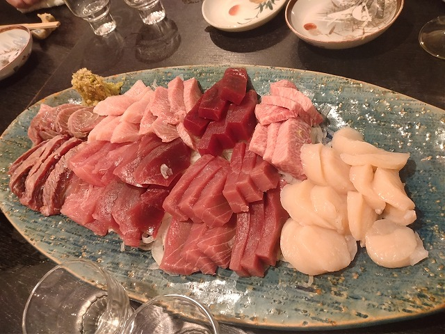
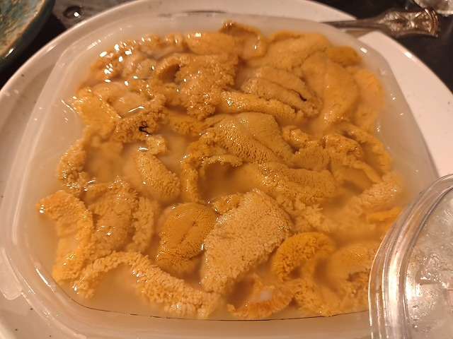
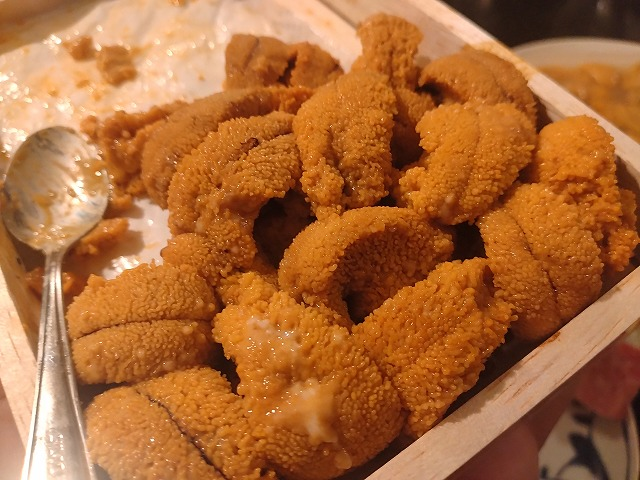
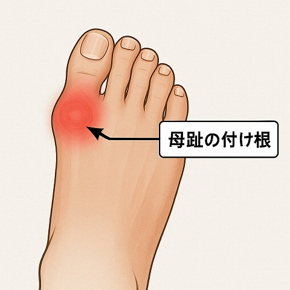

# 菊池 寿人 周报 — 2025-W40

- 周次：2025-W40
- 提交时间：2025-10-01 11:58:02
- 职位：Engineering　Manager

---

◆作業内容

①開発課題整理

＝＝＝筋の悪い案件＝＝＝＝＝＝＝＝＝＝＝＝

正しい情報を、正しく上に伝える事。

ここ忖度したり日和ると簡単にチームが全滅します。

攻めるも守るも、正しい情報の中で行いたい。

飛び越えて話進められると、フォローアップできません。

ご確認ください。

＝＝＝＝＝＝＝＝＝＝＝＝＝＝＝＝＝＝＝＝＝

■社会人１年目で出会った好きな言葉

2chのプログラマー板と、嫁の飯がマズい板を定期巡回するのが

会社で仕事している最中の、真夜中の楽しみだった時代。

自分の言葉の1/3は相手に理解される

自分の言葉の1/3は相手に誤解される

自分の言葉の1/3は相手に伝わらない

自分の言葉で話していないか、自分の頭の中を、

その思考過程も説明せず、乱暴に話し始めていないか、

相手が使っている言葉や意味は本当に自分と同じ内容なのか、

今も正しく会話が進んでいるのか、定期的に確認しなければ、

の何方かを100%、ないし、何方も丁寧に行えば、

そもそも打ち合わせでの認識齟齬や、スコープのズレが

発生する事はほとんどなくなるって話なんですよね。

この話がすっと出来るのは、ごく少人数しか私はしりませんが、

大体のいい加減な話を持ってくる人達は、これが簡単な事だと

勘違いして、やる気になったらすぐ出来ると思い込んでるんです。

だから、出来ないんですよね。

思考は、純然たるスキルであって、パッシブスキルにまで、

昇華しないと意味がないんですが、判ってらっしゃらない方が多いのは

凄いの見て来てないからでしょう。凄いのはマジ凄いですからね。

自分の顧みる勇気がなければ、忙しいを理由に一番サボっちゃいけない人が、

たかだか忙しいを理由に、他人の多くの時間や労力を最も浪費する無謀無策を、

自身の能力の無い事を良い事に、能力を発揮しない意思決定者が発生するんです。

こわいですね、これを回避するたった一つの薬は、

常に考え続ける事、そして、現状を良しとしないこと。

この糞難しい克己心極みの様な、意地をどれだけ張り通せるかが、

結局、その人の出来る出来ないを分けちゃうんですよね。

だから、出来ない奴は出来ないし、出来た経験のある奴だけが、

違う分野でもまた頑張れて、成長し、出来る様になるだけなんです。

まぁ、あれですよ、若い子に言っても伝わらないのは、

経験してないし、その程度の努力で、努力をしたと思っているからです。

やってて良かった、デスマーチ連弾。

何かはちゃんと失いますが、能動的だろうが受動的だろうが、関係なく

考える事を強いられる、結果、優しい世界はもう無いですからね。

克己心持ち、そんな奴、いる？少なくとも、私には無いですが、

昔取った杵柄という先輩の呪言に縛られているので、

無駄に考える事は大好きで、考えた結果、無駄になった多くの思考を

捨てる瞬間は、「無事で良かった」と、その刹那だけ、菩薩の気持ちに

触れられるのが、結構好きですね。

■業務に特筆するべきものだけコメント多めにします

本当にマルチタスク過ぎですね

下流の調整なんて出来る事知れてるから上流で仕切って欲しい心

ほぼブレーンワーク次第なのでシレっと仕事出来ますけれども、

開発動き出すと最適化しまくってるので、ラフな割り込みは、

そこそこ脳みそ焼けます

・決済

本当にうごくのかしらん

・ポイント

ついに正副切替の判断が行われた様です。

ささやき － いのり － えいしょう － ねんじろ！

・新店／改装展開時の毎度のトラブル

そろそろ一年経ちますが、一年という時間の重大さに

気が付いていないから変わらないのでしょう。

毎日、リンゴ１個、皮向いたら、どれだけ成長するか。

と、思うじゃないですか。出来る奴、拘る奴はバケモノ進化しますが、

どうでもいい、なんでもいいと思ってる奴は、変わらないのです。

つまり、時間も経験も、なんの判断基準にならず、やった行為と、

振り返りの繰り返しが無ければ、経験年数というのは意味がないという

事実を誰も教えて上げないのが良くないと思います。

新人研修中に伝えるのが優しさ派の私は、ずっとそう思っています。

・インバウンド

今度、改めて空港店に買い物に行ってみようと思うけれども、

買い物客目線で言いたい事が山ほどでてくるんだろう。

判っていても、そうは言っても、と言う話と、それは違うだろうと

いう話をしっかり整理して、脳内暇つぶしネタにしたいと思う。

思考実験モドキの空想思考は、深堀や沈降が容易なので、

楽しいですよね。

・免税クーポン

初手が大事だなぁと言う、いつものお話。

・生鮮要望全般

各レイヤーには色々な視点や観点があります

業務という共通言語がないと、コミュニケーションすら厳しいのです

・レーンセルフ

言ってる話と実際が違うじゃないの！という話はあるが、

それもまぁ織り込み済みだし、課題分け出来てるから今の所、順調。

のはず。頼むよ、開発メンバー。

・セルフタッチ決済（花小金井）

粛々と進めるが、悶々とする

・ローカルブレイクアウト

安定しない店舗がちらほらある理由はなんだろう。

・西の友

上の方針がどうであれ、変わらないものってあるんだなぁ

それがとっとと欲しいんだなぁ、まじで、いや、まじで

みつを　が　あきらめた　よう　です

・POSの未来を考える

名前が良くないと思います。名は体を表すのです。

こういう時に強い言葉を選ぶのが好きな私は、

推移を見守りたいと思います。

・保守観点

それでいいなんて、そんな感覚は、死ぬまで一回もねーんです

口にした途端に、それは墓場にいると思った方がよいのですよ

・タイヨウ様リベート

眩暈がするほどの衝撃を受けると、人ってとてもやさしい気持ちに

なれるって事を、思い出したくも無かった

仕切り直しに参加、が、いつになるの？

・他一覧に乗っけるか検討中の案件複数

細々やりたい事が届いています

・各種要望

重たい課題が複数動いている為、そもそものロードマップの組み換え

を行いながらブレーンワークをしている状況です。

ブレーンワークなので真顔で仕事していますが、中々にカオスです。

それはそれで、いつもの事なので気にせず相談してください。

・その他、業務関連

割り込みマルチタスクが楽しい世界です。

③各種問合せ業務

・案件相談／概算見積もり

・店舗／コールセンター対応

④各種定例Ｍ

整理中

⑤割込作業

TEC協業取り組み

◆来週作業予定【10/6～10/10】

〇社内

今期要望整理

PoC各種

コール状況の棚卸

POSの未来を考えるFitGap

〇課題・要望の推進

棚卸

〇展開フォロー

ミスが連発してる展開チームの、この状況下では

フォローではなく、監視

〇其の他

なし

■酒の会

懇意にさせていただいている飲食店の親爺さんから通常営業に

顔出せていない身ながら、「まいど～」と快諾いただいたので、

ちょっとエグイ酒の会に参加してきました。

前の晩にあった別の酒の会で久々に良いウニをいただく。

これは定番の刺身盛り合わせ６人前

六人前になると、定価7000超えの塩水ウニが机の上に。

はいって渡された定価12000円超えのウニ。

このクラスは久々に出会いました、鮨屋だと幾らになるんだろう・・

金では買えない機会をいただいた酒の会でしたが、今朝、足が痛いので、

有料版ChatGPTに聞いてみた。痛風で一番初めに症状出る所ってどこ？

画像化までしてくれた、まさに、そこに、違和感があるんですけれども、

尿酸値１２を記録していた30代、一度も症状出てないのに、7.5程度の雑魚数値の今？？

強い酒飲んで、消毒してきたいと思います

全体的に

・フロントエンド内の業務応援やフォローなども突発的に発生し、

各自の業務が増加している傾向にあるが、全体で共有して

進めて行く。

・相談が増える中で、やりたい事が出来るかどうかだけ聞かれる、

段取りも無く突然依頼が来る、等、進め方がおかしい部分の改善図りたい。

以上
