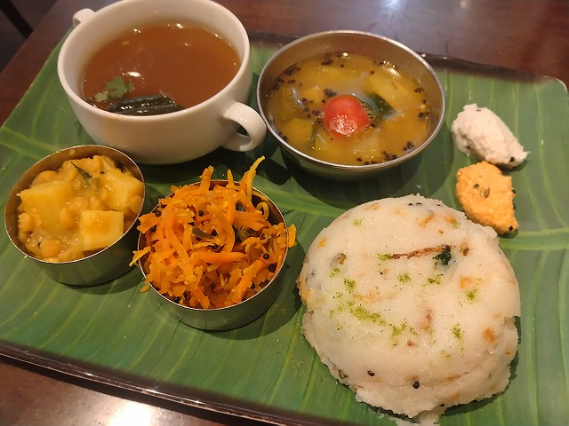
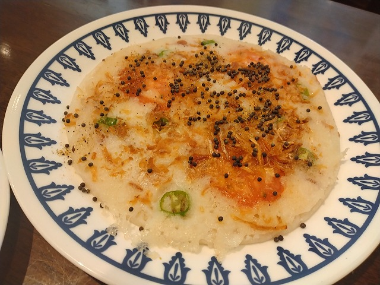
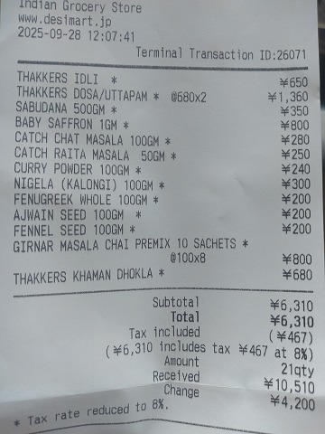

# 菊池 寿人 周报 — 2025-W41

- 周次：2025-W41
- 提交时间：2025-10-10 04:33:42
- 职位：Engineering　Manager

---

◆作業内容

①開発課題整理

＝＝＝筋の悪い案件＝＝＝＝＝＝＝＝＝＝＝＝

正しい情報を、正しく上に伝える事。

ここ忖度したり日和ると簡単にチームが全滅します。

攻めるも守るも、正しい情報の中で行いたい。

飛び越えて話進められると、フォローアップできません。

ご確認ください。

＝＝＝＝＝＝＝＝＝＝＝＝＝＝＝＝＝＝＝＝＝

■夢を・・見たの・・・

たまたまタイミングが重なったので誤解を生んで変な流れに

ならないか心配だった新しいPOSの世界観のお話。

仕方が無いのだが、それはPMIでとっとと終わらせて然るべき

内容なんかが、まぁ、判るんだが、この領域にも落ちてきている。

それも酷いレベルで。

放置されてるが、そろそろそれ腐ってないけ？

なにしてんねん、これだけ時間経ってるのに、最初手の作業を

せずにどうしようとしてたんや。それ無くてやれる方法なんて１ミリも

思いつかんがどういう腹つもりやねん。

ほとんど話した事がないが、出来る人だろうと感じられる人から

困惑にも悲鳴にも聞こえる『進まなくて』そんな発言させるなよ。

あれか？POS知らんからとか適当な言い訳で納得しようとしてへんか？

まったく関係ないぞ、POSの話なんてそもそも掠りもしない粒度の話やぞ。

そんな話で良い訳出来るなら、世の中の社長やら役員はどんなバケモノやねん。

どんな業務だろうが、まじめにコツコツ培ってきたものの純度を高めていく

作業から逃げてなければ、それなりの年次で勝手に抽象化さてれいくやろがい。

その抽象度が上がれば上がるほど、要するに何でも一緒と言う思考に

近づいていくんちゃうんかい。

ほならやれる事、やらんとあかん事くらい、やり方判らんでも判るやろ。

そんな、夢を、みました。

来週から膝詰の集中討議が始まるので緊張してるのかもしれませんね。

そういう事にしておきます。

言葉遊びが過ぎるピーターについて、不用意に触れてみようかしらん。

■業務に特筆するべきものだけコメント多めにします

本当にマルチタスク過ぎですね

下流の調整なんて出来る事知れてるから上流で仕切って欲しい心

ほぼブレーンワーク次第なのでシレっと仕事出来ますけれども、

開発動き出すと最適化しまくってるので、ラフな割り込みは、

そこそこ脳みそ焼けます

・決済

本当にうごくのかしらん。

・ポイント

>ささやき － いのり － えいしょう － ねんじろ！

ちょっと？？？なので続報を待ちましょう。

・新店／改装展開時の毎度のトラブル

本当に成長しないですよね。

フードパークでもあれだけ失敗してるのに、また手ぶらでやろうとしてる。

・インバウンド

WechatPay/AlipayのPOS連動が始まります。

・免税クーポン

現状確認をさせてもらおう。

・生鮮要望全般

各レイヤーには色々な視点や観点があります。

業務という共通言語がないと、コミュニケーションすら厳しいのです。

・レーンセルフ

ホワイトボードに書きなぐってると、セルフ壁打ちが出来て楽しいです。

・セルフタッチ決済（花小金井）

粛々と進めるが、悶々とする。

心の中の萬田銀次郎の横にいるチンピラが疼きだしてくる。

・ローカルブレイクアウト

安定しない店舗がちらほらある理由はなんだろう。

・西の友

上の方針がどうであれ、変わらないものってあるんだなぁ。

それがとっとと欲しいんだなぁ、まじで、いや、まじで。

みつを　が　どすぐろい　かんじょう　を　いだいた　よう　です。

・POSの未来を考える

STPOSと言うそうです。うーん。

いっそのこと、心の中で開発ネームを決めようと思います。

・保守観点

それでいいなんて、そんな感覚は、死ぬまで一回もねーんです。

口にした途端に、それは墓場にいると思った方がよいのですよ。

TECさんと雑談

AIを使った諸々のお話をしましたが、ユースケースを考えると

なかなかカオスになりそうでした。でも、人材不足が加速する中で

力量を担保する事が困難な時代、AIを切り出して使えば、

今時点でも主力級に活躍できそう。

・タイヨウ様リベート

仕切り直しに参加、が、いつになるの？

・他一覧に乗っけるか検討中の案件複数

細々やりたい事が届いています

・各種要望

重たい課題が複数動いている為、そもそものロードマップの組み換え

を行いながらブレーンワークをしている状況です。

ブレーンワークなので真顔で仕事していますが、中々にカオスです。

それはそれで、いつもの事なので気にせず相談してください。

・その他、業務関連

割り込みマルチタスクが楽しい世界です。

③各種問合せ業務

・案件相談／概算見積もり

・店舗／コールセンター対応

④各種定例Ｍ

整理中

⑤割込作業

TEC協業取り組み

◆来週作業予定【10/13～10/17】

〇社内

今期要望整理

PoC各種

コール状況の棚卸

POSの未来を考えるFitGap

STPOSの機能要件

〇課題・要望の推進

棚卸

〇展開フォロー

ミスが連発してる展開チームの、この状況下では

フォローではなく、監視

〇其の他

なし

■本気の本物は、ヘルシーが過ぎる

ウップマ：粗びきの小麦粉を野菜の練り物

発酵させた豆と米の焼き物

西葛西は安くて楽しい

私信への返信

先週

>めっちゃ美味しそうです🍶

食の判る若い子に食べさせてニコニコ見てたい年頃です。

>これって ばふんうに ってやつでしょ うまそー

本物は、馬鹿美味いです、本物っていいですね。

>痛風はやばそう。。。。

どうやら革靴で2日間歩き回った事が原因だった模様。

きっと大丈夫。なはず。

先々週

>GOタブレット忘れるの⁈

これ以上は出来る事ないので記憶から消しました。

>洒落てますね〜

安西先生、痩せてる格好いい大人になりたいです。

全体的に

・フロントエンド内の業務応援やフォローなども突発的に発生し、

各自の業務が増加している傾向にあるが、全体で共有して

進めて行く。

・相談が増える中で、やりたい事が出来るかどうかだけ聞かれる、

段取りも無く突然依頼が来る、等、進め方がおかしい部分の改善図りたい。

以上
