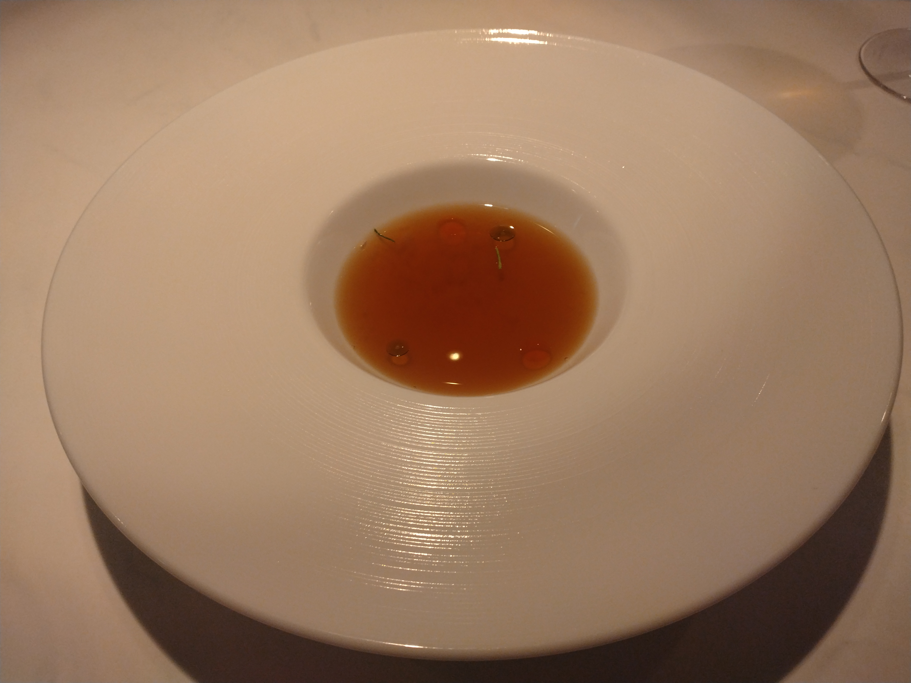

# 菊池 寿人 周报 — 2025-W42

- 周次：2025-W42
- 提交时间：2025-10-17 04:31:06
- 职位：Engineering　Manager

---

◆作業内容

①開発課題整理

＝＝＝筋の悪い案件＝＝＝＝＝＝＝＝＝＝＝＝

正しい情報を、正しく上に伝える事。

ここ忖度したり日和ると簡単にチームが全滅します。

攻めるも守るも、正しい情報の中で行いたい。

飛び越えて話進められると、フォローアップできません。

ご確認ください。

＝＝＝＝＝＝＝＝＝＝＝＝＝＝＝＝＝＝＝＝＝

■仕事が出来ない事を良い事に仕事をしない世界

新人が言ったりやったりしたら、一緒になって注意する側に

回る癖に、自分はその限りではないバリアを自前で展開している

人が沢山いる夢をよく見る最近、皆様、お元気ですか？

夢では、新人は初めてなのに注意され、何年何十年も経ってると

何故か、外野からフォローや応援？が入るのって理不尽ですよね

そんな、２５年前の怒りに満ちた自分を思い出す夢心地です

さて、出来る人の持つオーラはとてもいいですよね

1つの事に精通しているがゆえに、自信が滲みでるのか、

凄みだけでなく、柔和で、また、同種の経験者を鼻で搔き分ける

嗅覚もあの時代に生き抜いてきた必須スキルの片鱗を感じさせます

同業者で出来る人達の匂いを感じられると、改めて自分の

居住まい佇まいに気を配りたくなりますね

そういえば、最近見た夢の話をもう一つしておきましょう

とある飲食店に注文が入ったのですが、そこに突然、老人が

やってきて、俺にも食べさせろ、早くだせと、クレーマーと痴呆の

ハイブリッドの様な文句を付けていたんですよ

「おじいちゃん、お米まだ炊けてないの、それにあれは別の人のご飯よ」

と、優しく伝えても、あるなら食わせろ、いつなら食えるんだと大騒ぎ

施設の職員さんも飲食店の外で口開けて棒立ちしているだけ

この先の日本はどうなるんだろう、、と言う、そんな夢を見ました

昔、あまりにも変な夢を見てる時期があったので、夢分析して

チームメンバーと笑い合いながらちょっと勉強しましたが、

この夢、どんな夢なんでしょうね

関係ないけど、先日、30年ぶりにNetｆlixでＡＫＩＲＡを見たのですが、

流石のクオリティと記憶以上のグロさに驚きました

　「もう始まっているからね」

その言葉がタイムリーで耳に残りました、そんな、夢を、、見たの

■業務に特筆するべきものだけコメント多めにします

本当にマルチタスク過ぎですね

下流の調整なんて出来る事知れてるから上流で仕切って欲しい心

ほぼブレーンワーク次第なのでシレっと仕事出来ますけれども、

開発動き出すと最適化しまくってるので、ラフな割り込みは、

そこそこ脳みそ焼けます

・決済

本当にうごくのかしらん。

・ポイント

テスト不足なのが判りましたが、誰がテストしたのかも

判りました、なるほど、判ります

・新店／改装展開時の毎度のトラブル

花小金井を失敗する気満々なのが腹立ちますね

酷い有様です

・インバウンド

WechatPay/AlipayのPOS連動が始まりました

次、考えないとですね

・免税クーポン

次週、状況聞けるかな

・生鮮要望全般

各レイヤーには色々な視点や観点があります。

業務という共通言語がないと、コミュニケーションすら厳しいのです。

・レーンセルフ

やっと機材が届きました

これからですね

・セルフタッチ決済（花小金井）

ただいま浸水中です

・ローカルブレイクアウト

安定しない店舗がちらほらある理由はなんだろう。

・西の友

凄い事になってるじゃん

・POSの未来を考える

上流が混沌としてますね

・保守観点

それでいいなんて、そんな感覚は、死ぬまで一回もねーんです。

口にした途端に、それは墓場にいると思った方がよいのですよ。

TECさんと雑談

ワンストップがうれしいですけれども、仕事上の付き合いは、

馴れ合い重視というより、ドラスティックな部分って大事ですよね

そっちの方が刺激があってワクワクしますけどね

・タイヨウ様リベート

仕切り直しに参加、が、いつになるの？

・居酒屋のカウンター

どう考えても、うちの事を大声で話しているうちの集団と

遭遇しました、が、固有名詞を出すのは駄目なんですよ

個人情報保護法が施行された時に色々準備を手伝わされてた

私世代はちゃんとしてるんですけれど、私より一回り上世代と、

今の子？達は激ゆるですね

酒飲んで話すネタが仕事の愚痴なんていう暇があるのは、

若くして滅茶苦茶頑張ってる一瞬か、腐ってるかの２択なので、

早くその世界を抜けて欲しいものです

・他一覧に乗っけるか検討中の案件複数

細々やりたい事が届いています

・各種要望

重たい課題が複数動いている為、そもそものロードマップの組み換え

を行いながらブレーンワークをしている状況です。

ブレーンワークなので真顔で仕事していますが、中々にカオスです。

それはそれで、いつもの事なので気にせず相談してください。

・その他、業務関連

割り込みマルチタスクが楽しい世界です。

③各種問合せ業務

・案件相談／概算見積もり

・店舗／コールセンター対応

④各種定例Ｍ

整理中

⑤割込作業

TEC協業取り組み

◆来週作業予定【10/20～10/24】

〇社内

今期要望整理

PoC各種

コール状況の棚卸

POSの未来を考えるFitGap

STPOSの機能要件

〇課題・要望の推進

棚卸

〇展開フォロー

ミスが連発してる展開チームの、この状況下では

フォローではなく、監視

〇其の他

なし

■格好いい世界

その料理店には塩と酢以外の調味料が置いていない

勿論、客側の卓上にあるものではなく、料理人が使用する範囲で、だ

この画像の料理は、トムヤムクン

トムヤムクンを容造る構成要素の中から核となる味や風味を抽出し、

その要素を異なる料理手法で再構築すると言う、一見訳わからない

が、無駄に格好良く、かつ、恐ろしく洗練された皿を提供してくれる

これはクラリフェを用いて仕上げたものだけれども、本物の技術者、

クリエイティブなアウトプットに、感銘と言う名の強い衝撃を受けた

また合わせるお酒が旨いのですよ

この歳までに、食材に過剰な集中投資をした結果、手元に何もないが

結構いいものを食べ歩いている分、無駄に培っちゃったせいで、

その先に繋がる味の向こう側が見える料理やマリアージュに

出会わない、出会わない。。

この皿の様な、そういうものに出会えると、多幸感がヤバいです

仕事も同じで、芯がある人を見ると、嬉しくてにやけますもんね

そういう鈍らない、ダサくない大人に早くなりたいもんです

私信への返信

>上手くなさそう

現地感が高く、かつ、とてもベジタリアン（健康志向側）なので、

物足りなさはありましたが、知見と言う意味では大満足でした

全体的に

・フロントエンド内の業務応援やフォローなども突発的に発生し、

各自の業務が増加している傾向にあるが、全体で共有して

進めて行く。

・相談が増える中で、やりたい事が出来るかどうかだけ聞かれる、

段取りも無く突然依頼が来る、等、進め方がおかしい部分の改善図りたい。

以上
