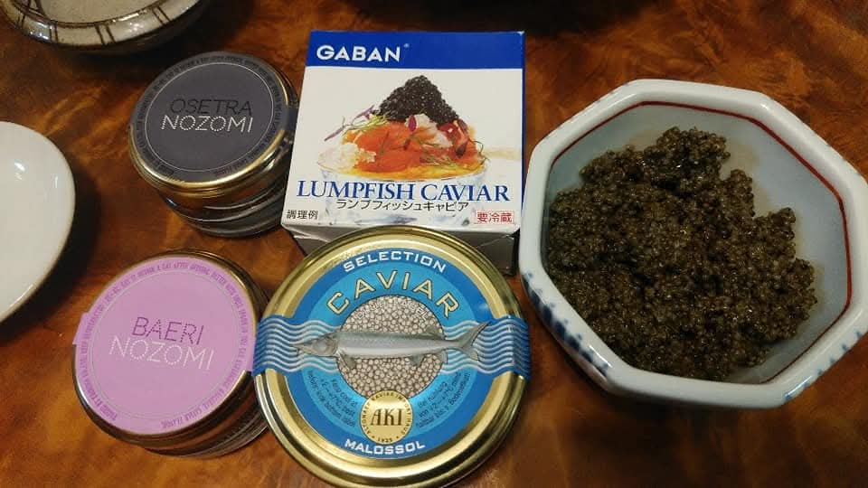
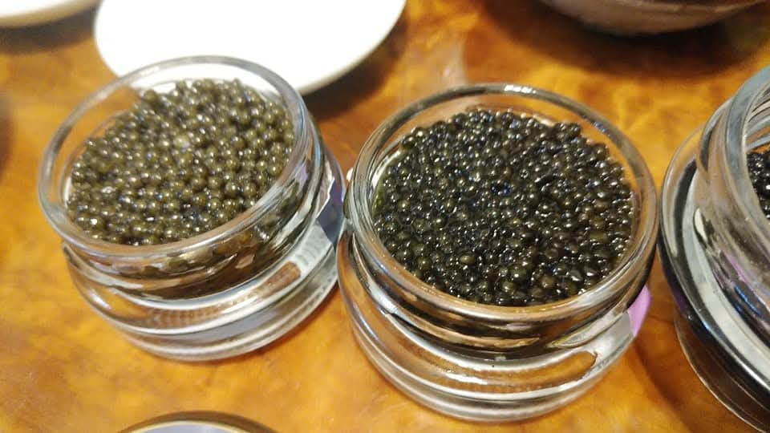
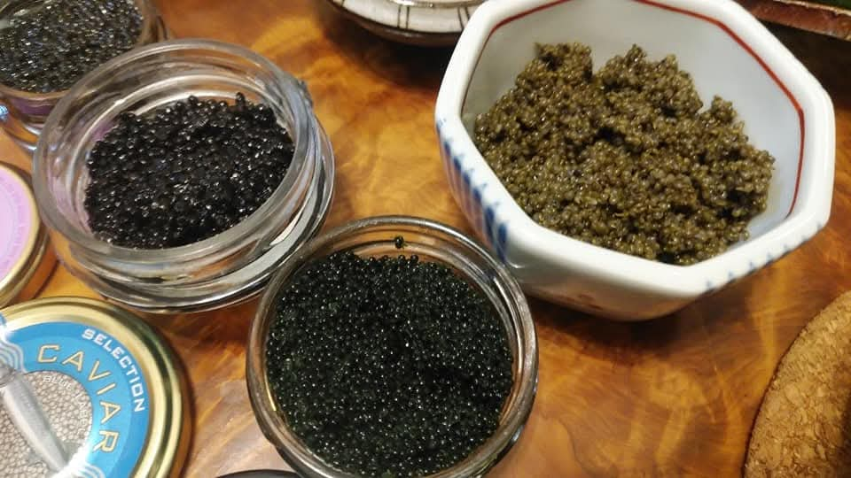

# 菊池 寿人 周报 — 2025-W44

- 周次：2025-W44
- 提交时间：2025-10-31 11:52:55
- 职位：Engineering　Manager

---

◆作業内容

①開発課題整理

＝＝＝筋の悪い案件＝＝＝＝＝＝＝＝＝＝＝＝

正しい情報を、正しく上に伝える事。

ここ忖度したり日和ると簡単にチームが全滅します。

攻めるも守るも、正しい情報の中で行いたい。

飛び越えて話進められると、フォローアップできません。

ご確認ください。

＝＝＝＝＝＝＝＝＝＝＝＝＝＝＝＝＝＝＝＝＝

■西友さん達とヒアリング

だろう、で仕事する人が居ないのがいいですよね

そんなのは淘汰された説や、腕に覚え在りのみ引き抜いた説やら

色々考えられますが、面子を見れば、酷かったと言う意味で、

あのアホみたいな時期のＩＴ業界を乗り切ってきた

５０前後達は、懐かしい安心感すら感じますね

それにくらべて、だろう、で仕事しやがって・・と、どうにもこうにも

20代前半で殺気垂れ流して仕事してた頃のあいつ等（当時３０～４０）

を彷彿とさせる立ち居振る舞いを見るにつけ、笑顔が消えそうになる

花小金井は笑顔を作って頑張りましょう

■業務に特筆するべきものだけコメント多めにします

本当にマルチタスク過ぎですね

下流の調整なんて出来る事知れてるから上流で仕切って欲しい心

ほぼブレーンワーク次第なのでシレっと仕事出来ますけれども、

開発動き出すと最適化しまくってるので、ラフな割り込みは、

そこそこ脳みそ焼けます

・決済

延期らしい

・ポイント

入替前のサーバがスパイクしたそうな、

間に合って良かった案件

・新店／改装展開時の毎度のトラブル

だろう、で仕事する奴は何なんだろう

それを確認するのが仕事だろうに

出来ない奴ほど、お気持ちで仕事するのはご存じ？

だろうエントリー／殿堂入り確定

・インバウンド

11月中に方向決めたい

・生鮮要望全般

各レイヤーには色々な視点や観点があります。

業務という共通言語がないと、コミュニケーションすら厳しいのです。

・レーンセルフ

習慣って大事ですよね、若い頃にしばき（論理）回されて良かったと

受け取りやら検品だけでも思います

それらを教えてるんですが、時間かかり（過ぎ）ますね

・セルフタッチ決済（花小金井）

だろうエントリー／総合優勝候補

・ローカルブレイクアウト

安定しない店舗がちらほらある理由はなんだろう。

・西の友

だろうエントリー／個人賞受賞予定

・タイヨウ殿外税対応

自社ＰＯＳのリリース計画をゴリゴリされるので、

安全の為、もう一手間いれるか思案中

・POSの未来を考える

もう11月です、急がねば

・保守観点

それでいいなんて、そんな感覚は、死ぬまで一回もねーんです。

口にした途端に、それは墓場にいると思った方がよいのですよ。

・タイヨウ様リベート

仕切り直しに参加、が、いつになるの？

・他一覧に乗っけるか検討中の案件複数

細々やりたい事が届いています

・各種要望

重たい課題が複数動いている為、そもそものロードマップの組み換え

を行いながらブレーンワークをしている状況です。

ブレーンワークなので真顔で仕事していますが、中々にカオスです。

それはそれで、いつもの事なので気にせず相談してください。

・その他、業務関連

割り込みマルチタスクが楽しい世界です。

③各種問合せ業務

・案件相談／概算見積もり

・店舗／コールセンター対応

④各種定例Ｍ

整理中

⑤割込作業

TEC協業取り組み

◆来週作業予定【11/03～11/7】

〇社内

今期要望整理

PoC各種

コール状況の棚卸

POSの未来を考えるFitGap

STPOSの機能要件

花小金井ＰＯＳ機材設置

〇課題・要望の推進

棚卸

〇展開フォロー

ミスが連発してる展開チームの、この状況下では

フォローではなく、監視

〇其の他

なし

■百聞は一見に如かず、なんでもいいから【１回】試しとけ遊び

１ｋｇで５００万にもなるキャビア王が君臨するキャビア界の中で、

ヒエラルキー的には、

　王

　ーー四天王

　Ｓ：世界最高峰レストラン界

　Ａ：ミシュラン三ツ星界

　Ｂ：高級・一流界

　Ｃ：高級食材界

　ーーモブ

　Ｄ：模造界／偽装界／家庭界（結婚式場とか創立パーティとか）

のヒエラルキーが存在します

Ａ上位：①OSETRA NOZOMI　25g/10,880- 国内流通最高峰

Ａ　　　：②BAERI NOZOMI 25g/6,810-　4000円の違いを探せ

Ｄ　　　：③GABAN LUNPFISH CAVIAR 50g/1,360-　日本人騙され商品

Ｂ　　　：④AKI SELECTION CAVIAR 50g/6,400-　未来キャビア

Ｄ～　 ；⑤とんぶり　70g/255-　畑のキャビア

①舌に広がる程良い塩味と豊かな旨味、円みの中にも芯があり、縦方向に深く響く味の余韻

②旨味の横の広がりは秀逸だけど、①と比べて初めて違いが判るので十二分に美味い

　粒立ちと旨味香りの4千円差も納得、買うなら①が良い

③プチプチ食感と塩味食材と考えれば素敵商品、キャビアと名乗らなければ・・被害者

④コロナ初期の話なので、例えばAKIのSELLECTIONクラスは値段が1.5倍になってたりする

　 ①②と比べたせいか、食感も香りもキャビアっぽいレベル、いっそ振り切ったランプフィッシュ

　の方が、可愛げがある

⑤歌って踊れる畑のアイドルっぷりは健在、味を入れれば何処に出してもいける

当時、福岡市内で6スーパー周り、売り場担当で知ってる人0人、マネージャ1人、

結局、百旬館で買えたとんぶり、国産が出回る季節は限られているので、

興味があれば裏見て買ってください

私信への返信

>なにこれ？

何かと言われれば、、豆腐料理

全体的に

・フロントエンド内の業務応援やフォローなども突発的に発生し、

各自の業務が増加している傾向にあるが、全体で共有して

進めて行く。

・相談が増える中で、やりたい事が出来るかどうかだけ聞かれる、

段取りも無く突然依頼が来る、等、進め方がおかしい部分の改善図りたい。

以上
