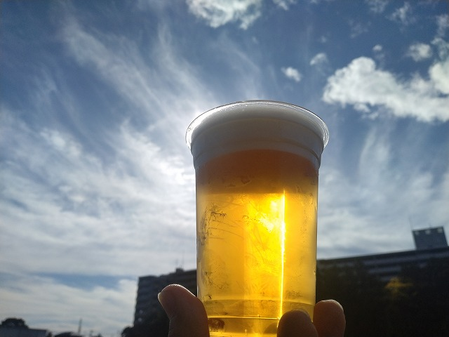
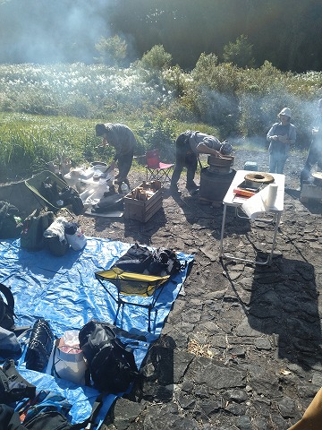
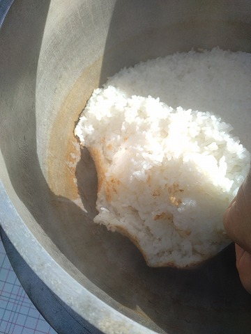

# 菊池 寿人 周报 — 2025-W45

- 周次：2025-W45
- 提交时间：2025-11-07 09:33:39
- 职位：Engineering　Manager

---

◆作業内容

①開発課題整理

＝＝＝筋の悪い案件＝＝＝＝＝＝＝＝＝＝＝＝

正しい情報を、正しく上に伝える事。

ここ忖度したり日和ると簡単にチームが全滅します。

攻めるも守るも、正しい情報の中で行いたい。

飛び越えて話進められると、フォローアップできません。

ご確認ください。

＝＝＝＝＝＝＝＝＝＝＝＝＝＝＝＝＝＝＝＝＝

■キンダーガーデン花小金井

支柱さえ立ててしまえば、そこに知識が定着しやすいんです。

例えば、業務では、自分の業務把握を疎かにして、新しい事や過去に

引きずりまわされ、結果、その時の経験が何にも残らないなんて、

よく見かけますよね。何度仕事しても初めての顔してる成長しない奴。

特に新人さん（しか言っても意味がない）には良く話すのですが、

自分の業務の中で、1つでも出来る状態を早く作りなさい。

その足場を作らないと、踏ん張る場所がなくてすぐ溺れてしまうから。

一度、足場を作れたらそれを広げる努力をしなさい、出来るだけ

丁寧に積み重ねないと、大きくなればなるほど、崩れやすくなるから。

それがある程度、強固になり横になって寛げる様になれば、

そこで初めて周りを見なさい。

ようやく落ち着いてゆっくり観察できるから、自分の近い島に向かって

広げていくもよし、自分の足場を一層固めつつ、気になる島を

観察してもよし、そっちに渡ってみても、帰る足場があると、

安心して挑戦できますよね、しかも、足場を作る経験があれば、

新しい島で作る自分の足場、前より簡単に早くつくれるから、と。

さてさて、

過去、ダブルスコアのデスマーチに参画させられ、世の中の大体の

ことは、単純な人災である事を身をもって経験し、デスマーチ発生装置

の研究には、人一倍の知見があると自負する私が断言しますが、

特に、おまえ、それと、おまえ

お気持ちで仕事すんな、しかも誰にも言わずにそっと胸の内に秘めんな、

その癖、問題起きたら鳩が豆鉄砲食らった顔して、初耳ですぅみたいな

なめた顔するんなよ。ダサいぞ。

ずーっと、業者さんに迷惑をかけて当然面してる奴のどの辺に

正義があるのか、聞いてみたいですね。

やってる事は、出会った時のままなのが、怖いです。

過去の様々な澱が、花小金井に流れ込んでるようです。

今まで仕事が出来なかったのに、今までと同じでやっていたら

偶々上手く行っただけだったり、慣れてる周りがなんとなくやってくれていた

だけという変わらない現実に、運悪く今回の違い気が付かなかった

だけだから仕方ないよね、今までも確認だけしていれば、問題が無い事の

確認だけ出来てたのに、それすら知らないから、出来てるだろうと、誰かが何を

してるかも判んないのに、そう思ってただけなんだよね、判るよ、判る、

初めて仕事に向き合って怖かったんだね。

って、判るか―。

無知蒙昧であれば、時間経過で厚顔無恥のスキルを取得せざるを得ない、

私、その事例を色んな所で、沢山見てますが、根本治癒が出来ないので

一生付き合う事になります、なので、若い子は、普通に仕事してください。

本当、普通で十分です。

■業務に特筆するべきものだけコメント多めにします

本当にマルチタスク過ぎですね

下流の調整なんて出来る事知れてるから上流で仕切って欲しい心

ほぼブレーンワーク次第なのでシレっと仕事出来ますけれども、

開発動き出すと最適化しまくってるので、ラフな割り込みは、

そこそこ脳みそ焼けます

・決済

延期らしい

・ポイント

正式切替らしい

・展開チーム

知識がない以前に、仕事としてのノウハウがない。

事に、適切な指導が行えていない。

から、そうなる、当たり前。

・インバウンド

11月中に方向決めたい

・生鮮要望全般

各レイヤーには色々な視点や観点があります。

業務という共通言語がないと、コミュニケーションすら厳しいのです。

・レーンセルフ

花小金井関連では本当に横やり沢山入れられました。

酷いもんです。早く巻き返さないとですね。

・セルフタッチ決済（花小金井）

次は教育担当と連携とって、納品に向けて作業していきます。

まだ納品物じゃないタイトスケジュールでやってんのに、

発注者が暴れてて怖いですわ。

・ローカルブレイクアウト

安定しない店舗がちらほらある理由はなんだろう。

・西の友

運用側、PMIの話になりますが、結構、上流を引っ張りきらんと

大変なのが良く判りました、予想通りに大変ですね。

・タイヨウ殿外税対応

自社ＰＯＳのリリース計画をゴリゴリされるので、

安全の為、もう一手間いれるか思案中

・POSの未来を考える

もう11月です、急がねば

・保守観点

それでいいなんて、そんな感覚は、死ぬまで一回もねーんです。

口にした途端に、それは墓場にいると思った方がよいのですよ。

・タイヨウ様リベート

仕切り直しに参加、が、いつになるの？

・他一覧に乗っけるか検討中の案件複数

細々やりたい事が届いています

・各種要望

重たい課題が複数動いている為、そもそものロードマップの組み換え

を行いながらブレーンワークをしている状況です。

ブレーンワークなので真顔で仕事していますが、中々にカオスです。

それはそれで、いつもの事なので気にせず相談してください。

・その他、業務関連

割り込みマルチタスクが楽しい世界です。

③各種問合せ業務

・案件相談／概算見積もり

・店舗／コールセンター対応

④各種定例Ｍ

整理中

⑤割込作業

TEC協業取り組み

◆来週作業予定【11/10～11/14】

〇社内

今期要望整理

PoC各種

コール状況の棚卸

POSの未来を考えるFitGap

STPOSの機能要件

〇課題・要望の推進

棚卸

〇展開フォロー

ミスが連発してる展開チームの、この状況下では

フォローではなく、監視

〇其の他

なし

■体験・経験から得る知識は人生において何よりの支柱

支柱さえ立ててしまえば、そこに知識が定着しやすいんです。

例えば、母方の婆ちゃんの家は、庭に柿やイチジク植えてたり、

３大田舎あるあるのぼっとん便所／五右衛門風呂／土間付き竈

が小学低学年くらいまでフルセット存在してたから記憶に残ってます。

お世話になっている飲み屋の親爺から連絡があり、芋煮会に参加（１回目の乾杯@am9:30）

ガチ米農家さんが羽釜や薪持ち込みで、羽釜で米を炊く(音を聞く)

自家製ササニシキのおこげ、この後、ミルキークイーンも炊き上げる

知識としてではなく、体験していれば、あの時の情景／空気感まで一気に

脳内に溢れ出す。その記憶を言語化すれば、相手は百戦錬磨の古強者。

こちらの力量なんて手を取る様に見透かされているのが判ります。

この辺り、過去に十分肉付けしてきてる知識と併せて色々話し込んで、

とても仲良くなりました。いい話聞けたなぁ。

これだけ生きてると、米を美味しく食べたい、と色んな米を取り寄せたり、

土鍋やフライパン、災害時用に空き缶で炊いてみた経験はあります。

電子レンジ炊飯専用鍋も買った事ありますね、若者との差は、

生きている時間が違う為に、色々余剰知識を付ける余地があるって事です。

勿論、米の品種も勉強しましたから、農家さんと話しても、一般的な

イメージは持ってるから話は早い訳です。

仕事も一緒なんですよね、自分の業務をちゃんとやっていれば、

自然と前段の仕組みや後続の仕組みに興味が沸くはずなんです。

先輩なんて、そういう水を向ける事をやるだけでいいのに、

やれ誰にとって何の価値もない自慢話ばかりして、肝心の仕事を

教えないから、あんなのが（諦められている可能性が高い）育つんです。

悪い事は言わないので、仕事に関係なくても、機会があれば、

体験したり、ちょっと調べたりする習慣をつけてみましょう。

めちゃくちゃ知識が溜まった時、突然、色んなものが一気に繋がり、

結局、一緒じゃん教の入会案内が脳内に届きます。

否定から入る人生は本当にツマラナイので、なんでもやってみて、

その上で要る要らないを繰り返してると、色んな人と出会っても、

体験一つ挟んでるだけで、楽しい会話も出来ますよ。

私信への返信

>しょっぱいイメージ

ランプフィッシュというこれはこれで使い勝手がよく、良い食材なのに、、

まったく食感も味も違うのに、キャビアと称して金取ってるそこそこの店が、

どうでもいい雑な客向けの食材として提供しているのがしょっぱい奴。

悔しくないですか、お前らどうせ、ものの価値も判らんのやろと、

店側の欺瞞・悪意が透けて見えるので、私は２０代後半から

「安西先生、一度でいいので本物が食べたいです原理主義派」

全然キャビアじゃねぇし。使い方次第で旨いけど。

全体的に

・フロントエンド内の業務応援やフォローなども突発的に発生し、

各自の業務が増加している傾向にあるが、全体で共有して

進めて行く。

・相談が増える中で、やりたい事が出来るかどうかだけ聞かれる、

段取りも無く突然依頼が来る、等、進め方がおかしい部分の改善図りたい。

以上
