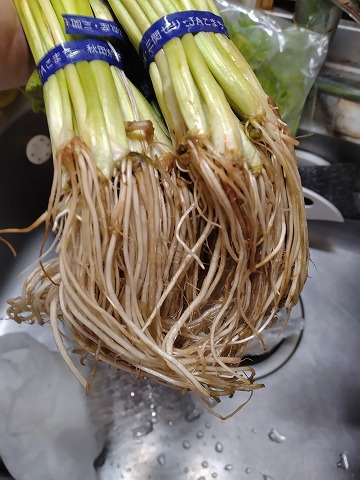

# 菊池 寿人 周报 — 2025-W46

- 周次：2025-W46
- 提交时间：2025-11-12 11:44:23
- 职位：Engineering　Manager

---

◆作業内容

①開発課題整理

＝＝＝筋の悪い案件＝＝＝＝＝＝＝＝＝＝＝＝

正しい情報を、正しく上に伝える事。

ここ忖度したり日和ると簡単にチームが全滅します。

攻めるも守るも、正しい情報の中で行いたい。

飛び越えて話進められると、フォローアップできません。

ご確認ください。

＝＝＝＝＝＝＝＝＝＝＝＝＝＝＝＝＝＝＝＝＝

■知的欲求や好奇心はパッシブスキルにすべき

ずーっと好きで調べていると、触りの知識だと物足りなくなって

深堀する事はあると思います。これはなんでもそうですが、

・好きだから　：

　どこまで深堀れるかで人としてのキャパが広がります

　やり過ぎは変態化しますが、1つ2つ位は持ってた方が

　良く判らないけれど、態度や発言に深みや厚みが微増します

・興味でたから：

　今すぐ調べられる奴は安心です

　次の機会で調べようとする奴は、次調べないなら、早晩詰みます

・興味ないから：

　調べないと言う判断も場合により大事ですが、どっかで結びつく事が

　あるので、機会あれば触っておくのは悪くないです

　仕事上、興味がなくても仕事であるなら、ここから逃げる奴は

　早晩詰みます

・嫌いだから　：

　こそ、調べられたら、見たくない情報／知りたくない情報にも

　正しく向き合えたら、恐ろしく成長します、ガチで

・気にならない：

　早晩あらゆる所で頭打ちしますが、その時間有意義に転用出来る？

　何時からでも間に合うけれど、入社初年度が一番心が揺らぐタイミング

　だから、その意識付けチャンス逃すと、手遅れになるのは経験則

とりあえず、知ったかぶりをしないとか、手前の理解で納得しないとか、

そういう部分は、調べる癖がついて中級程度になれば、脳みそが

その様な不誠実な事が出来なくなるので、若い子は癖付けて欲しい

『知らない事や言葉はとりあえず一回調べる』

癖付いたら安心です

たったそれだけを実践するだけで、何が判らないか判らないから

何したら良いかすら判らないおっさんには成り下がらなくなります

■業務に特筆するべきものだけコメント多めにします

本当にマルチタスク過ぎですね

下流の調整なんて出来る事知れてるから上流で仕切って欲しい心

ほぼブレーンワーク次第なのでシレっと仕事出来ますけれども、

開発動き出すと最適化しまくってるので、ラフな割り込みは、

そこそこ脳みそ焼けます

・決済

延期はよいのだが、年末に相手に寄りかかり過ぎたあれこれを

どうするのか、だけは方針教えて欲しい

善意に甘えるのは良くないという、どのシチュでも気を付ける

アレをソレしてきたからドウするんだろうと興味

・ポイント

問題聞こえないから次回から割愛でよいのかな

・展開チーム

（固定）

知識がない以前に、仕事としてのノウハウがない。

事に、適切な指導が行えていない。

から、そうなる、当たり前。

・インバウンド

11月中に方向決めたい

・生鮮要望全般

各レイヤーには色々な視点や観点があります。

業務という共通言語がないと、コミュニケーションすら厳しいのです。

・レーンセルフ

やり取り窓口を若手？我々の時代なら中堅一線級を張るべき

年次の子にまかせてますが、なかなかニヤケられるやり取りを

ちゃんとやり始めたので、直ぐに油断する癖を無くしてくれたら

もう少しちょっかいを控えられるのに、という所。

あとは、開発側とのやり取りを上手く進めて欲しい。

・セルフタッチ決済（花小金井）

教育は進んでおり、店舗サポート部からの応援もそろそろ合流。

現場の声を吸い上げていただき、可能な限り、スムーズなスタート

切れるようにしていきたい。

・ローカルブレイクアウト

特に田川が安定しない店舗がちらほらある理由はなんだろう。

・西の友

やっぱり発言にバックボーンが滲む人の話は、バックボーンに

乗っかってる分、私の妖怪レーダーがそこに反応しないのが

ちょっと楽しかったりします。毛根が千切れ飛ぶ位にゴン立ち

してる場合がありますが、勘弁して欲しいです。

・タイヨウ殿外税対応

安全の為、もう一手間いれるかな。

・POSの未来を考える

もう11月です、急がねば

・保守観点

それでいいなんて、そんな感覚は、死ぬまで一回もねーんです。

口にした途端に、それは墓場にいると思った方がよいのですよ。

・タイヨウ様リベート

話が出ても中途半端に終息する仕事のやり方は良くないよね。

・他一覧に乗っけるか検討中の案件複数

細々やりたい事が届いています

・各種要望

重たい課題が複数動いている為、そもそものロードマップの組み換え

を行いながらブレーンワークをしている状況です。

ブレーンワークなので真顔で仕事していますが、中々にカオスです。

それはそれで、いつもの事なので気にせず相談してください。

・その他、業務関連

割り込みマルチタスクが楽しい世界です。

③各種問合せ業務

・案件相談／概算見積もり

・店舗／コールセンター対応

④各種定例Ｍ

整理中

⑤割込作業

TEC協業取り組み

◆来週作業予定【11/17～11/21】

〇社内

今期要望整理

PoC各種

コール状況の棚卸

POSの未来を考えるFitGap

STPOSの機能要件

花小金井出張

〇課題・要望の推進

棚卸

〇展開フォロー

ミスが連発してる展開チームの、この状況下では

フォローではなく、監視

〇其の他

なし

■九州人の東北に対する理解の低さ（相互）が勿体ない

全ての美味しいは東京にあるのは残念な事実で、地方が美味しいのは

地場の中でも、地域と密接な関係を長年維持している素晴らしい個人店

がだす、東京に送る一級品か遜色ない個体を取り扱っているから、

に過ぎない事に、どうやら全国津々浦々を旅行しておらず、かつ、

東京で美味しい店を探し続けると言う苦行をやっていない人には、

理解されていない状況があるようです。

ここで言いたいのは、東京の美味しいは、全国で成り立っており、

東京の美味しいものの中に含まれる食材エントリー数が、果たして

何県が多いのだろうか、と言う点が重要になってくるのだが、

己を知り相手を知らない場合は、失笑を買いかねない場合が

あると言う点、勝ち負けではなく良さを理解する姿勢が問われている。

そういう比較をする場合では、私の長年のフィールドワークにより、

東京と言う文化異常密集地や京都と言うなんかフィルターエグい

小都市など幾つかを除いて、定住地域から最大500km離れた地域は

理解もなければ存在すら意識していない事実があるのだが。

例えば、東北６県と福岡県では、情報発信のレベルに格段の差があり

福岡から見た東北は未踏のまま死んでいく人が大半であろう事、

東北から見れば、フクオカッテオイシインデショと言う謎の呪文を

唱える程度にしか理解出来ていない事、誠にもって残念でならない。

お互いに不幸といえるが、呪文を知っているだけ、まだ東北の方が

旅行する機会を創出できる分、トータル有利なのかもしれない。

と前振りが長くなったが、あまりにも日本国の食の造詣が浅い福岡の民※に、

東区民６年目の私が、知らない東北の魅力を旬を通して伝えてみよう。

※私の福岡の友人知人達に言わすと、自分の所が十分美味しいから

他所のものを食べる必要がないとガンギマリの目で見てくるのだけど、

これは事実認定しても大丈夫ですか？

三関せり：ハンドキャリーで２日持ち歩いたからへたり気味

この季節、山形芋煮、北上芋煮、仙台芋煮、と南東北エリアでは、天気の良い

河川敷で老若男女がバーリィをしているが、仙台といえば、芹鍋最強伝説です。

この時期わざわざ牛タン食うとか意味不明な程度には、芹鍋最強です。

勿論、これは外食で食うより、自分で真っ白に輝く根芹を購入して、

自分で作るのが最強に美味いのですが、そもそも論で根芹で作る芹鍋の良さを

知らないのは可哀そうまであります。

東北Loveな方はお気づきの通り、三関せりは秋田県の三関で流通する芹です。

仙台では、名取や登米、仙台芹が主流ですが、今回はどっちも（写真外）

大量に購入して食べ比べしています。

一方、宮若というか、田川に来歴を持つ方達からは野芹を使った料理の話を

色々きけますが、フクオカ県自体の芹の流通量は全国屈指で少ない

印象を受けます。

かくいう私は芹が出回る時期には休日マキイに礼讃して、年に数度の

芹を確保して小躍りしていますが、仙台で食う根芹の鍋には

ポテンシャルで到底届かず、根芹をどこのスーパーでも気軽に買える、

そんな素晴らしい世界を熱望してやみません。

私信への返信

＞ほんもの

本物を知った上で偽物と上手く戯れるのが本当の大人。

そう思って散財しています。ネタで年末購入しますが、

一舐めしてみます？

全体的に

・フロントエンド内の業務応援やフォローなども突発的に発生し、

各自の業務が増加している傾向にあるが、全体で共有して

進めて行く。

・相談が増える中で、やりたい事が出来るかどうかだけ聞かれる、

段取りも無く突然依頼が来る、等、進め方がおかしい部分の改善図りたい。

以上
