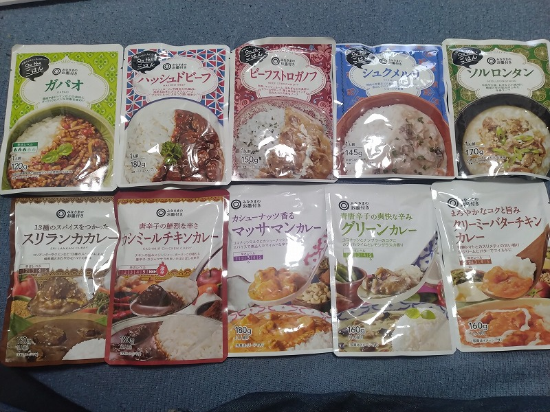
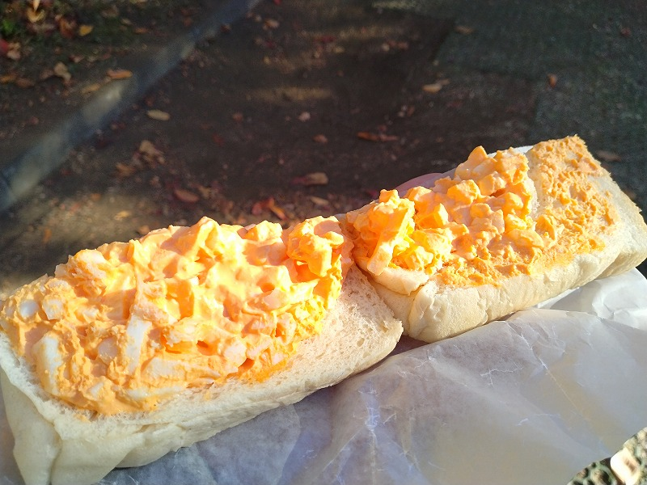

# 菊池 寿人 周报 — 2025-W49

- 周次：2025-W49
- 提交时间：2025-12-05 11:14:40
- 职位：Engineering　Manager

---

◆作業内容

①開発課題整理

＝＝＝筋の悪い案件＝＝＝＝＝＝＝＝＝＝＝＝

正しい情報を、正しく上に伝える事。

ここ忖度したり日和ると簡単にチームが全滅します。

攻めるも守るも、正しい情報の中で行いたい。

飛び越えて話進められると、フォローアップできません。

ご確認ください。

＝＝＝＝＝＝＝＝＝＝＝＝＝＝＝＝＝＝＝＝＝

■知らない事は判らないし、やった事がないと気が付かない

店舗に入り慣れてない人、人が危ないもの（刃物温冷皿）を

持った状態ですれ違った事がない、工事現場で重機や工具

の安全意識に振れた事がない、飲食でホールやったことない、

０/１の新規案件やった事ない、１０/１００の追加開発やった事ない

サーバの移行やった事ない、要件定義や概要設計で苦しんだことない

、プロジェクトマネージメントの勉強を藁に縋る気持ちで勉強する

シチュエーションを経験したことない、客先で軟禁されたり、

ガン詰された事が無い、大声出してる奴は大体大した事がないと

実体験で触れてきてない、笑って冷静な奴程、おっそろしいの

知らない、現場で出来る事なんてたかが知れていて、なんでも

準備が大事なのしらない、ないないないない、とか見て来てると、

本当に何も知らないおっさんだなぁって人が結構見かけます。

何だろう、昔から職人が言う背中を見て覚えろって、とても重要な

事が沢山あって、説明するととんでもなく語る事になるけれど、

教えすぎてもダメ、正解だけ与えてもダメ、言って伝わる事なんて

ほんの少しで、学ぶ姿勢や向上心って、個人だけで発揮するのは

本当に厳しい世界だなぁと、花小金井見て改めて思いました。

それぞれに先輩が居て、教えてくれた恩師が居て、それに恥じない

努力をした自分がある世界が、大事ですよね。

武蔵新庄は頑張ってくださいね。

ちなみに、頑張るって言葉を平素で使う奴大嫌いな私です。

頑張らなくて普通に普通の事が出来る様になるまでが苦労する所。

そこまで頑張るのであって、常に頑張ってる奴の無駄思考は

本当にあきれ果ててしまいます。じゃぁ、本当に頑張らないと

いけない時に、何もできないじゃん。

そういう世界で学んできたので、直ぐに現場入って、手ぶらで

大げさに忙しくしている姿は、軽蔑の対象なのは秘密です。

■業務に特筆するべきものだけコメント多めにします

本当にマルチタスク過ぎですね

下流の調整なんて出来る事知れてるから上流で仕切って欲しい心

ほぼブレーンワーク次第なのでシレっと仕事出来ますけれども、

開発動き出すと最適化しまくってるので、ラフな割り込みは、

そこそこ脳みそ焼けます

・花小金井店オープン

良い店になったのは間違いないですけど、8000人超えですか。

入場規制がかかった話も聞きますが、通路狭すぎるからでは？

決済エリアをぎゅっと詰めたのはどの様な意図が？

・決済

年末の決済サーバは増強依頼したのかしら

・ポイント

粛々進んでいると信じています。

・展開チーム

（固定）

知識がない以前に、仕事としてのノウハウがない。

事に、適切な指導が行えていない。

から、そうなる、当たり前。

・インバウンド

2026.11に向けた対応を事前に手を打つ予定です。

内部的にはStep3対応です。

・生鮮要望全般

各レイヤーには色々な視点や観点があります。

業務という共通言語がないと、コミュニケーションすら厳しいのです。

・レーンセルフ

経験値不足、これは誰のせいなのか、難しい所です。

・セルフタッチ決済（花小金井）

無茶に無理を好き勝手言われた今回（毎回）ですが、

今回は流石に呆れ果ててしまいました。

格付けで言うとBB～BBBですね。

次の案件受ける時は、初手からリスク管理しますよ。

・タイヨウ殿外税対応

安全の為、もう一手間いれます。

・POSの未来を考える

もう12月です。あかん。

・保守観点

それでいいなんて、そんな感覚は、死ぬまで一回もねーんです。

口にした途端に、それは墓場にいると思った方がよいのですよ。

・他一覧に乗っけるか検討中の案件複数

細々やりたい事が届いています

・各種要望

重たい課題が複数動いている為、そもそものロードマップの組み換え

を行いながらブレーンワークをしている状況です。

ブレーンワークなので真顔で仕事していますが、中々にカオスです。

それはそれで、いつもの事なので気にせず相談してください。

・その他、業務関連

割り込みマルチタスクが楽しい世界です。

③各種問合せ業務

・案件相談／概算見積もり

・店舗／コールセンター対応

④各種定例Ｍ

整理中

⑤割込作業

TEC協業取り組み

◆来週作業予定【12/7～12/11】

〇社内

今期要望整理

PoC各種

コール状況の棚卸

POSの未来を考えるFitGap

STPOSの機能要件

富士見台／新中野でクレジット運用

〇課題・要望の推進

棚卸

〇展開フォロー

成長しないのでもう無理です

〇其の他

なし

■TRIALGO笹塚店オープン

立ち合いに来ています。

笹塚は立地がいいですね。

ただ、エキナカに良品、高級食材系の生鮮／加工品の店舗が

まるっと整っているので、趣味が食の私はエキナカでご満悦

で帰ってしまいそうです。一方、まいばすけっと的な、

すっとぼけスーパーが近くにないので、駅でコンビニが終端たっだ

住宅街エリアの入口側にTRIALGOが出来た事は、マンションが

立ち並ぶ駅裏エリアの導線がどれだけ活かせるのか気になります。

今回は告知も少なく、平日9:00オープンの為、出勤需要が

まったく判りませんが、午後や明日以降の流れのなかで、

東京４店舗の中では良い立地だなぁと思いました。

西荻窪も悪くないですけどね、あそこは店内レイアウトが一番良いし、

新中野は、まいばすけっとが２枚ある中で、どう立ち回れるか

見ものだと思います。中野～新中野界隈も一種独特の活気がある

エリアなので、ちょっと隅っこ感ありますが、気になりますね。

富士見台、おめーはダメだ。と思いましたが、あっち側の生活導線

がどの位あるかですね。TRIALGOこそ都市部特化型だと思うので、

富士見台とか新中野は、ちょっと微妙な気もしますけど、

漸く本来のポテンシャルを発揮できる立地に展開し始めたのは

良い事ですね。

■花小金井で買った奴

この手の奴は碌なもんじゃない（無印で懲りた）ので

手を出さないのですが、記念に沢山買ってみました。

すべて花小金井で採れた奴ですね。

何故、嫌がってるかと言うと、マズい経験しかない（前述）し、

・料理自体は趣味で、手間暇は寧ろ楽しい

・どうせやるならちゃんと食材揃えて丁寧に作りたい

・作る前には、ガチと言われる専門店で食べてから作ってる

からで、時短料理とか、(*´Д｀)アァーン？って主義なのです。

コンセプト違い、もともと興味がない、だけなんですけど。

さて、買ったはいいが、いざ開封に尻ごみしてるので、

食事準備する一品で出して、一口だけ貰おう、それがいい。

１～2個でも妥協できるの見つけられると嬉しいですね。

では、何時もの方、お付き合いください。

笹塚店からちょっと歩いたサンドイッチ専門店の卵サンド

奥久慈たまごサンド（300円）

たまごはぎっしりだけど、量はトライアルの卵サンドの０．４個分。

比較すると、トラの贅沢サンドイッチが200円として、こちらは750円相当。

うん、自分で作ろう。

私信への返信

＞挙げてください

店舗でお見かけしたので軽く触れた内容記載止めときます。

根本の部分は、ずっと変わってない様に見えますが、

またどっかのタイミングあれば。

＞花小金井どう？

西友時代の花小金井と比べて見違えて良くなってます。。

明るいし品揃えも、ですね。ただ、相変わらず商品棚が迫ってきて、

通路狭いし、会計エリアは計算した台数を無理やり詰め込んだ感。

お客の事より、売り場最優先で作られたのが見え透いてしまう

レイアウトに、買い物大好き一般ユーザから見ると、違うだろうに、

とは思いました。ただイナゲヤと戦えるレベルになってるので、

これは客層別の住み分けじゃなくて、全面戦争狙ってんのかな、

とか、精肉や鮮魚系は私の目がうるさいので、まあ、ふーん、

でした。買うなら専門店に行くな、って感じのレベル感で、

中途半端過ぎて食指が動かないって感覚は判りますかね？

一手間かければ肉質なんてある程度どうとでもなるし、

なら筋の良い安い肉か、ちゃんとしたのを置いて欲しい心。

トライアル界の中ではちゃんと力はいってるなって好印象です。

宮田店のみすぼらしさとモノの悪さが本当に悔しいです。

あと、お墨付き商品が見つけにくくてイライラするのは、

西友と同じコンセプトだからですか？

普通に紛れてて探すのが鬱陶しいです。

全体的に

・フロントエンド内の業務応援やフォローなども突発的に発生し、

各自の業務が増加している傾向にあるが、全体で共有して

進めて行く。

・相談が増える中で、やりたい事が出来るかどうかだけ聞かれる、

段取りも無く突然依頼が来る、等、進め方がおかしい部分の改善図りたい。

以上
