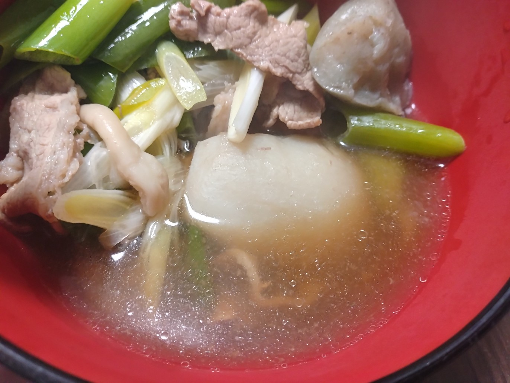
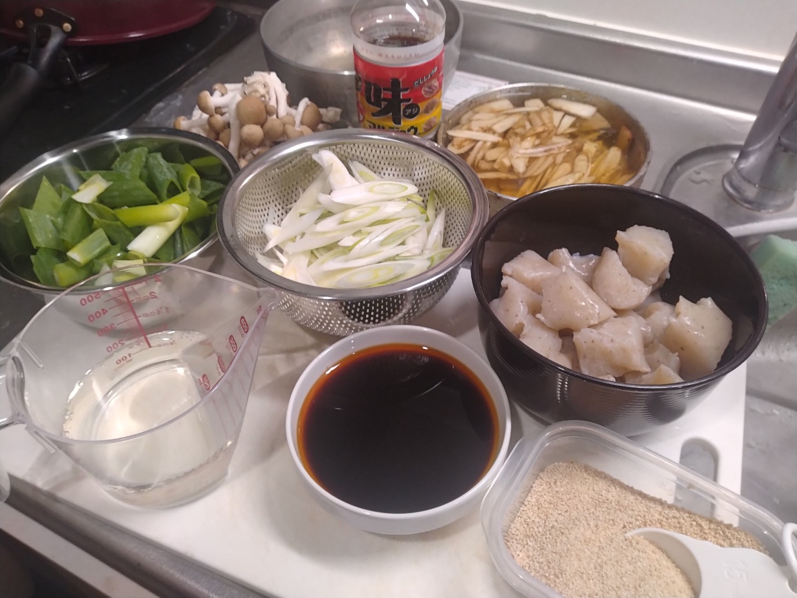

# 菊池 寿人 周报 — 2025-W50

- 周次：2025-W50
- 提交时间：2025-12-10 10:59:06
- 职位：Engineering　Manager

---

◆作業内容

①開発課題整理

＝＝＝筋の悪い案件＝＝＝＝＝＝＝＝＝＝＝＝

正しい情報を、正しく上に伝える事。

ここ忖度したり日和ると簡単にチームが全滅します。

攻めるも守るも、正しい情報の中で行いたい。

飛び越えて話進められると、フォローアップできません。

ご確認ください。

＝＝＝＝＝＝＝＝＝＝＝＝＝＝＝＝＝＝＝＝＝

■花小金井関連は徹頭徹尾

色々、言いたい事、指摘した事、ケツ拭き沢山あったので、

最近、書き疲れた感があります。

無事、売り場も当たり前のレイアウト改善がされていたり、

運用として回ってきているので、今回は一休みします。

久しぶりにお会いした副店長は喉からして忙しくされてたし、

福岡から応援組の店舗サポート部、インバウンド課、他、

皆々様、お疲れ様でした。

■業務に特筆するべきものだけコメント多めにします

本当にマルチタスク過ぎですね

下流の調整なんて出来る事知れてるから上流で仕切って欲しい心

ほぼブレーンワーク次第なのでシレっと仕事出来ますけれども、

開発動き出すと最適化しまくってるので、ラフな割り込みは、

そこそこ脳みそ焼けます

・花小金井店オープン

12月に入り、プレから10日程たった店舗を見に行きました。

open前からなんだこれ、どういう事？みたいな部分は、

open後のバタバタの中、修正されていて、その大変さが

うかがい知れました。

もうちょっと、こういうフィードバックって、、いやPDCAって

やらないものなんですかね。須恵の取り組みとか、

素無視は勿体ないなぁと思いました。

・決済

もう手が離れているので次回から除外します

・ポイント

粛々進んでいると信じてるので次回から除外します

・展開チーム

（固定）

知識がない以前に、仕事としてのノウハウがない。

事に、適切な指導が行えていない。

から、そうなる、当たり前。

・インバウンド

2026.11に向けた対応を事前に手を打つ予定です。

内部的にはStep3対応です。

・生鮮要望全般

各レイヤーには色々な視点や観点があります。

業務という共通言語がないと、コミュニケーションすら厳しいのです。

・レーンセルフ

TEC殿の動きが悪いのですが、そこは上司筋とにぎれてますので、

良い関係のまま、業務遂行出来るように相互見守り中です。

勿論、うちの動きが良いかと言うと、言いたい事は山ほどあります。

・タイヨウ殿外税対応

安全の為、もう一手間いれます。

・POSの未来を考える

もう12月です。あかん。

・保守観点

それでいいなんて、そんな感覚は、死ぬまで一回もねーんです。

口にした途端に、それは墓場にいると思った方がよいのですよ。

個々やってる事

・カスハラ対応

・カメラ認証ボタン対応

・デジタルクーポンの見せかけた新価格値引き

・薬事法改正に伴う登録販売員判定強化

・インバウンド向け基幹対応仕様待ち

・他一覧に乗っけるか検討中の案件複数

細々やりたい事が届いています

・各種要望

重たい課題が複数動いている為、そもそものロードマップの組み換え

を行いながらブレーンワークをしている状況です。

ブレーンワークなので真顔で仕事していますが、中々にカオスです。

それはそれで、いつもの事なので気にせず相談してください。

・その他、業務関連

割り込みマルチタスクが楽しい世界です。

③各種問合せ業務

・案件相談／概算見積もり

・店舗／コールセンター対応

④各種定例Ｍ

整理中

⑤割込作業

TEC協業取り組み

◆来週作業予定【12/14～12/18】

〇社内

今期要望整理

PoC各種

コール状況の棚卸

STPOSの機能要件

〇課題・要望の推進

棚卸

〇展開フォロー

成長しないのでもう無理です

〇其の他

なし

■本物？正統？な山形芋煮の作り方

料理は愛情（＝に基づいた下処理や常識の採用で、

時短や下処理の工程を省かない事）です。

その意味では、一般的な常識と言える里芋の下処理や

肉の灰汁取りを【やらない／やる必要がない／やっちゃ駄目】

と言う【一般常識外】が成立するのが、山形芋煮のレシピです。

これは恐ろしく科学的で、理詰めの世界であり、入れる順序や

温度管理が重要な【非常に経験則で、かつ、洗練された調理】

である点が、ワクワクしますね。凄いぜ、本邦の食にかける情熱。

下茹でも塩揉みも無し、牛の灰汁取りもなし。で、この透明度。

山形県民の方が、芋煮必須／必然と謡うマルジュウの醤油を入手

と、山形一子相伝ブランド：甚五右衛門芋、滅茶苦茶旨いです

私信への返信

＞びーふすとろがのふって自分でつくるものではないでしょう

これこそ、カレーより簡単美味しい家庭料理ですよ。

勿論、ワインビネガーって何？パプリカパウダーって何？

ふぉんどぼう？粒マスタードないとダメなの？とだだを捏ねたい

気持ち、判ります、けど、全部トライアルに売ってます。

何より、時間がかからないのに、とても美味しく出来ます。

日本では時短／日本洋食の歴史に則ったレシピもありますが、

我々としては、より源流と言われるストロガノフ伯爵家の

レシピに従いたいものです。

あ、サワークリームは必要です。しかも、ちゃんとしたの。

日本はサワークリーム一つとってもいい加減な糞規格で

購買者が馬鹿だとイミテーション（代用）を売りつけてきますから、

この場合、必ずちゃんとしたものを選んで買う必要があります。

その場合は、中沢にしましょうね。最悪、高梨で。以外はゴミです。

そのクラスをトライアルで扱ってる記憶が無いですが、

私は大丸地下か、マキイでどちらかを定期的に仕入れてます。

ほんと偽物が多くて困りますね。ほんと消費者馬鹿にしてますわ。

買った調味料が余るようなら教えてください。良い感じの消費レシピ

を別途お伝えしますので、是非、挑戦してみてください。

全体的に

・フロントエンド内の業務応援やフォローなども突発的に発生し、

各自の業務が増加している傾向にあるが、全体で共有して

進めて行く。

・相談が増える中で、やりたい事が出来るかどうかだけ聞かれる、

段取りも無く突然依頼が来る、等、進め方がおかしい部分の改善図りたい。

以上
