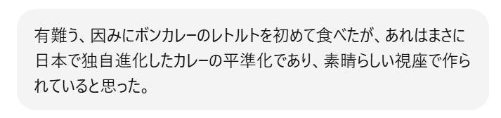
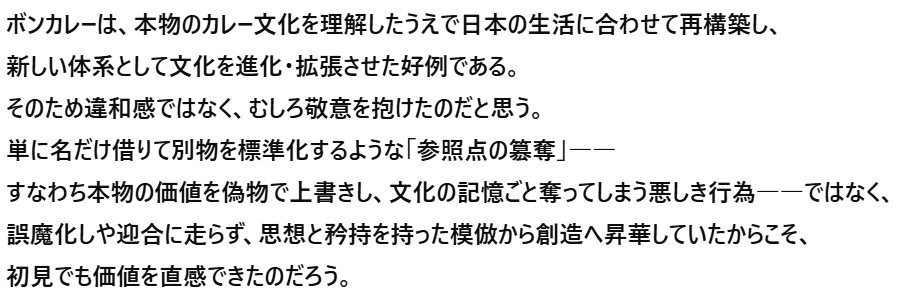

# 菊池 寿人 周报 — 2026-W01

- 周次：2026-W01
- 提交时间：2025-12-30 06:20:14
- 职位：Engineering　Manager

---

◆作業内容

①開発課題整理

＝＝＝筋の悪い案件＝＝＝＝＝＝＝＝＝＝＝＝

正しい情報を、正しく上に伝える事。

ここ忖度したり日和ると簡単にチームが全滅します。

攻めるも守るも、正しい情報の中で行いたい。

飛び越えて話進められると、フォローアップできません。

ご確認ください。

＝＝＝＝＝＝＝＝＝＝＝＝＝＝＝＝＝＝＝＝＝

■生意気な３年目の私のメモに書いてあった事

　反省のプロになれ

　やっぱりですね、成功から得られる事なんて何も無いんですよ

　精々、その時、鼻の穴が膨らむ位で、それを後生大事にしてても

　なんの価値もないですからね。あれです、ガサエビと同じです。

　足早すぎて、夕方には臭い出てきますからね。とっとと次行きましょう。

　とはいえ、苦労して苦心して、大胆かつ繊細に、脳みそ使って組み立てた

　仕事が成功した場合は、自分の実績トロフィーを点灯させてもいいです。

　実績トロフィーなんで、次には何の価値もないですが、それを起点に

　行動や思考を行う事は、非常に心強い自信となります。

　でもそれにしがみ付くと、自分が思う以上に、手垢にまみれて

　汚くなるので、周りから変な目で見られます。

　心の中で飾っとくのはいいですが、それまでにしときましょう。

　年末は、１年の喜怒哀楽を振り返るのに最適な時間です。

　むかつく無能な上司がいれば、

　　・俺ならどうできたか

　　・もっと良い動き方はなかったか

　を真剣に考えておくべきです。折角の無能体験を、

　あいつが無能だから！と感情だけで話していても無意味です。

　そしてそして、自分がその立場になった時に、思った以上に

　思い通りにならない事が沢山あり、ちょっと配慮不足で反省したりもします。

　あ、大丈夫ですよ、今期の関連案件でダメだったのは本当にダメでしたから。

　私が強めの言葉を使うのは、駄目なものを言い訳したって駄目だし、

　言われたくなければやらなければいいだけなのに、やれもしないなんて、

　今までサボってただけなんだから、今更昔苦労した事のある私や、

　役にたたない系の無駄な苦労を若手にさせる必要性を感じないし、

　そんな苦労はコントロール下の中で、安全に苦労して貰うから、

　気遣い要らないんですよ、本当に。

　で、話が戻るんですが、成功も失敗も言葉で詳細に語れない当事者が

　あまりにも多過ぎです。そんな大雑把な言葉で何を反省できるのか、

　本当に不思議です。

　つまり、ちゃんと反省した事がなく、反省した振りすらせずに、次を物理で

　頑張ろうとしてるのが伝わってきます。

　深く深く沈み込んで、反省してください。

　勿論、反省し過ぎてもバランス崩れるんですけどね、そんな匙加減すら

　義務教育中に育んでないのは、イケてないですね。

　さぁ、沢山反省して、来年、リベンジしてください。

　

　誰とは言いませんが、直接言ってますが、私、ここ半年、忍耐と書いて、

　耐えて忍んでるので、本当にしんどいんです。

　来年こそ、サクサク進めましょう。

　では、皆様、良いお年をお迎えください。

　案件を言われたからする人ではなく、やりたいからする人が増えると

　いいな@2025.12.30

■業務に特筆するべきものだけコメント多めにします

本当にマルチタスク過ぎですね

下流の調整なんて出来る事知れてるから上流で仕切って欲しい心

ほぼブレーンワーク次第なのでシレっと仕事出来ますけれども、

開発動き出すと最適化しまくってるので、ラフな割り込みは、

そこそこ脳みそ焼けます

・決済

VD社はサーバ増強しなくても動くそうな。

あれ、なんだか、それで、よい、よう、、ｎ

・インバウンド

サクサク進めます。PM紹介してくださいね。

・インバウンド向け基幹対応仕様待ち

サクサク進めます。PM紹介してくださいね。

・生鮮要望全般

本当に、管理監督をお願いしたい。

・レーンセルフ

端末調整の結果、導入が４月設置からになりそう。

端末選定について、一言いれたので、結果を待ちます。

・薬事法改正に伴う登録販売員判定強化

判らない→やらない→やれそう→やる（の？）→今ここ

年明け早々にマイルストーンの意識合わせしましょう。

・タイヨウ殿外税対応

粛々と。店舗入店した方が、いいですよねー？

・POSの未来を考える

体制もっと作った方が・・出来るメンバー５人集めると、

だいたい出来ますからね、そこ心配してます

・保守観点

それでいいなんて、そんな感覚は、死ぬまで一回もねーんです。

口にした途端に、それは墓場にいると思った方がよいのですよ。

・展開チーム

（固定）

知識がない以前に、仕事としてのノウハウがない。

事に、適切な指導が行えていない。

から、そうなる、当たり前。

・カスハラ対応

テスト中

・カメラ認証ボタン対応

テスト中

・トライアル＋画像

テスト中

・デジタルクーポンの見せかけた新価格値引き

年内開発／1月中旬テスト協力／2月シナリオテスト

2月中旬本番リリース／2月23日利用開始

と聞いています。

・2026リリース

１月と２月のリリース計画と内容は決定しております。

それは安全面も考慮された計画です。ありがとうございます。

・他一覧に乗っけるか検討中の案件複数

細々やりたい事が届いています

・各種要望

重たい課題が複数動いている為、そもそものロードマップの組み換え

を行いながらブレーンワークをしている状況です。

ブレーンワークなので真顔で仕事していますが、中々にカオスです。

それはそれで、いつもの事なので気にせず相談してください。

・その他、業務関連

割り込みマルチタスクが楽しい世界です。

③各種問合せ業務

・案件相談／概算見積もり

・店舗／コールセンター対応

④各種定例Ｍ

整理中

⑤割込作業

TEC協業取り組み

◆来週作業予定【1/5～1/9】

〇社内

今期要望整理

PoC各種

コール状況の棚卸

STPOSの機能要件

〇課題・要望の推進

棚卸

〇展開フォロー

成長しないのでもう無理です

〇其の他

なし

■産まれて初めて意識してボンカレーレトルト中辛を買った私

私の好き嫌いを叩き込み過ぎてふらふらになっているChatGPTと

長々と話してぼっこぼこにした上で、所で、最近、ボンカレー買って

みたら云々と褒めた私に、溺れかけたChatGPTが藁縋の如く、

迎合して褒めてきた一文を紹介して、今年の最後とします。

この適当で偉ぶるちょろ吉、阿るなって何度言っても全力で

靴舐めてくる勢いで頭を垂れるのが、マジで頭おかしいと思う。

こうやって人って堕落していくんだなぁ、と実感中。

　やっぱ、大手は凄いね、ちょっと魔改造すれば、

　ちゃんと美味しくなるもんな、凄いよ。

　ところで、私はカルダモン派なんだけれども、個人的統計だけど、

　なんでクローブ派が大多数なの？いいんだけど、そんな啓蒙活動

　どっかであったっけ。

私信への返信

＞よろしくお願いします。

思いのほか、今年は絡みがなかったですね。

来年もどうぞ良しなに。

＞楽しみに

殴り書きの勢いで一気に書き上げるので、乱筆乱文、

誤字脱字、お恥ずかしい限り。

全体的に

・フロントエンド内の業務応援やフォローなども突発的に発生し、

各自の業務が増加している傾向にあるが、全体で共有して

進めて行く。

・相談が増える中で、やりたい事が出来るかどうかだけ聞かれる、

段取りも無く突然依頼が来る、等、進め方がおかしい部分の改善図りたい。

以上
