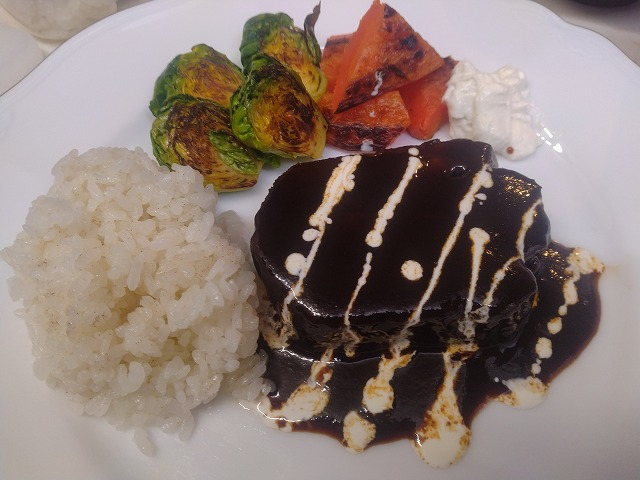
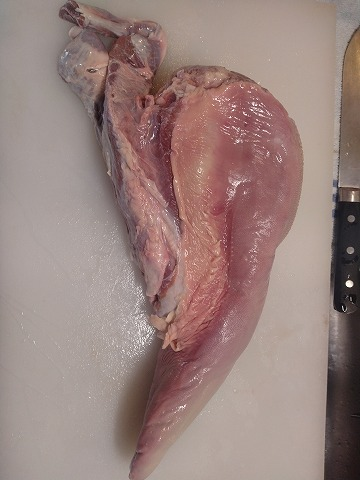

# 菊池 寿人 周报 — 2026-W02

- 周次：2026-W02
- 提交时间：2026-01-06 04:58:00
- 职位：Engineering　Manager

---

◆作業内容

①開発課題整理

＝＝＝筋の悪い案件＝＝＝＝＝＝＝＝＝＝＝＝

正しい情報を、正しく上に伝える事。

ここ忖度したり日和ると簡単にチームが全滅します。

攻めるも守るも、正しい情報の中で行いたい。

飛び越えて話進められると、フォローアップできません。

ご確認ください。

＝＝＝＝＝＝＝＝＝＝＝＝＝＝＝＝＝＝＝＝＝

■自分の仕事がどう評価されてるか確認しないって怖い

　と、頭に浮かんだので急いで( ..)φメモメモ

真面目な話、仕事してて違和感が出ないって異常です

ましてや、なんの経験値も無い若手が、何が良いのか

悪いのかも判らないまま、仕事の結果を確認せずに

無自覚に過ごすとどうなるか、考える事も、考えさせる

事もしない仕事場は、異常空間です

　違和感が出る＝それ自体は大抵正しい

では、どう正しいか、以下の３パターンしかないです

１）俺が間違っている

２）あいつが間違っている

３）みんな間違っていた

この想定回答であれば、４）みんな正解、があると

勘違いする輩が出てきますが、それは危険です

『所詮、俺らが考えた程度が、世界最強な訳が無い』

と、もっと良く出来た、もっと準備出来たはず、と謙虚に

考えるのが、当然としないと成長に繋がりません

つまり、

３＋）もっと良く出来たけどみんな気が付かなかった

３－）みんな間違っていた

しかない事を意識しながら仕事するだけで、全然世界の

見え方変わりますよ

あれ？変だな、って時に、ちゃんっと聞ける相手がいると

いいですね、そこに偉いも偉くないもおっさんも若いも無いです

あるのは、当たり前に必要な確認のみです

折角、明けたので、めでたくしたい所存です

■業務に特筆するべきものだけコメント多めにします

本当にマルチタスク過ぎですね

下流の調整なんて出来る事知れてるから上流で仕切って欲しい心

ほぼブレーンワーク次第なのでシレっと仕事出来ますけれども、

開発動き出すと最適化しまくってるので、ラフな割り込みは、

そこそこ脳みそ焼けます

・決済

ささやき・祈り・詠唱・念じろ！

・インバウンド

サクサク進めます。PM紹介してくださいね。

・インバウンド向け基幹対応仕様待ち

サクサク進めます。PM紹介してくださいね。

・生鮮要望全般

本当に、管理監督をお願いしたい。

・レーンセルフ

端末調整の結果、導入が４月設置からになりそう。

端末選定について、次週回答がくる運び

・薬事法改正に伴う登録販売員判定強化

次週、状況連絡をいただく

・タイヨウ殿外税対応

近々でタイムスケジュールを確認したい

・POSの未来を考える

AI開発って、鬼えぐい鬼門があると思ってるんだけれども、

そこに踏み込んだ工数算出って、既存案件よりシビアだよなぁ

と言うのは肌感理解と多少の言語化に成功している

・保守観点

それでいいなんて、そんな感覚は、死ぬまで一回もねーんです。

口にした途端に、それは墓場にいると思った方がよいのですよ。

・展開チーム

（固定）

知識がない以前に、仕事としてのノウハウがない。

事に、適切な指導が行えていない。

から、そうなる、当たり前。

・カスハラ対応

１月中リリースで調整

・カメラ認証ボタン対応

１月中リリースで調整

・トライアル＋画像

１月中リリースで調整

・デジタルクーポンの見せかけた新価格値引き

年内開発／1月中旬テスト協力／2月シナリオテスト

2月中旬本番リリース／2月23日利用開始

と聞いています。

・2026リリース

１月と２月のリリース計画と内容は決定しております。

それは安全面も考慮された計画です。ありがとうございます。

・他一覧に乗っけるか検討中の案件複数

細々やりたい事が届いています

・各種要望

重たい課題が複数動いている為、そもそものロードマップの組み換え

を行いながらブレーンワークをしている状況です。

ブレーンワークなので真顔で仕事していますが、中々にカオスです。

それはそれで、いつもの事なので気にせず相談してください。

・その他、業務関連

割り込みマルチタスクが楽しい世界です。

③各種問合せ業務

・案件相談／概算見積もり

・店舗／コールセンター対応

④各種定例Ｍ

整理中

⑤割込作業

TEC協業取り組み

◆来週作業予定【1/12～1/16】

〇社内

今期要望整理

PoC各種

コール状況の棚卸

STPOSの機能要件

〇課題・要望の推進

棚卸

〇展開フォロー

成長しないのでもう無理です

〇其の他

なし

■焼肉屋の店長から国産牛タンを流して貰いました

卸業者が取引先の大量キャンセルで破格放出するらしいですが、

年末に遊びますか？と。聞くと、マジで超破格。2本クレとお願いしたら、

でっかいのしか今ないけど、と貰った国産牛タン解凍済みが、

　2.03kg

　1.86kg

皮を削いでタン下外してちょっと掃除したら

　1.21kg

　1.07kg

都合、2.3kgのタンをバタバタ年末仕込んでました。

赤ワインと香味野菜で漬け込み、焼きつけて

フォンドボーやらトマトピューレやらで5時間煮込み、

パッセしてパッキングして、実家の台所でモンテして、

年末、厚切りタンシチューを置いてオール呑みへ。

素材と工程命なので、良い所のレストランの味です。

まぁ、都合1.00kg超えのタン元と、400ｇ程のタン中で

シチューを作り、残りのタン中とタン先を煮込みにしたので、

急性タン中毒による倦怠期を迎えたのは否めません。

今回の事で、理論を実践で補強できたので、なるほど、

タンとソースへの理解が大幅に増加しました。

今はアメリカ産の牛タンで遊んでみようと思い解凍中ですが、

処理済みの冷凍の固まりで8,600円、高い・・

・しっかり200ｇ超えポーションの国産牛のタン元シチュー

　バターライスと、焼き野菜を添えて

これで2.03kg／もう一本が1.86kg

知識は加速度的に広がります。コレだけで完結する事は絶対にありません。

コレ、がそうなら、アレは、との予測も経験則から引き出せます。

無論、料理こそ、工程管理や正しい知識に基づいた理論の世界なので、

プロマネやらシステム開発には、ベース部分での共通点がとても多いです。

そう、知識は絶対に損しないので、どんどん吸収したり、気になったら

チャレンジしていく事をお勧めします。

それでいいと思っていたら、何時まで経っても殻は破れませんからね。

私信への返信

＞おめでとうございます

目出度くしていきたい所存

全体的に

・フロントエンド内の業務応援やフォローなども突発的に発生し、

各自の業務が増加している傾向にあるが、全体で共有して

進めて行く。

・相談が増える中で、やりたい事が出来るかどうかだけ聞かれる、

段取りも無く突然依頼が来る、等、進め方がおかしい部分の改善図りたい。

以上
