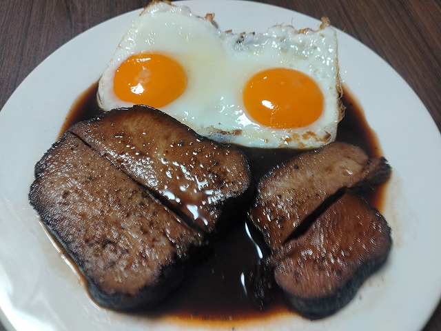
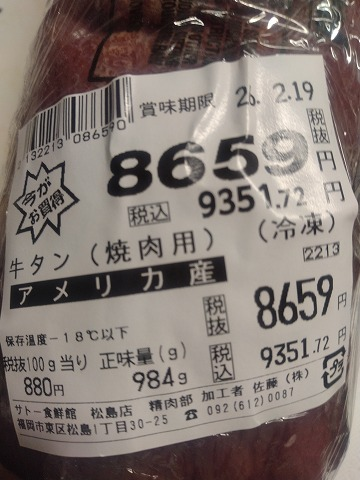

# 菊池 寿人 周报 — 2026-W03

- 周次：2026-W03
- 提交时间：2026-01-14 11:45:39
- 职位：Engineering　Manager

---

◆作業内容

①開発課題整理

＝＝＝筋の悪い案件＝＝＝＝＝＝＝＝＝＝＝＝

正しい情報を、正しく上に伝える事。

ここ忖度したり日和ると簡単にチームが全滅します。

攻めるも守るも、正しい情報の中で行いたい。

飛び越えて話進められると、フォローアップできません。

ご確認ください。

＝＝＝＝＝＝＝＝＝＝＝＝＝＝＝＝＝＝＝＝＝

■QCK：なんで教えられるチャンスを見逃すのか

なんで聞いてないの？と思う事が多いこんな世の中じゃ。。

今の内に、もっとアグレッシブに聞いて理解していかないと、

立場があがったら正面向けないの、辛いよ？

私の中で明確に日本の仕事が劣化した瞬間の定義があります。

2008年、これは私の職場が、という意味で、大企業はその前に

既にダメになっていたとは思いますが、私の狭い範囲の話なので

分母はでっかく捉えなくてもいいです。

日本を直接ぶっ壊したのは小泉何某と竹中何某ですが、

2008年の働き方改革で下処理が整ったと考えています。

今でいう40歳位の人が入社したあたりですかね。

その為、私の中では、今の40歳より下の人達を、どうしても

技術／考え方の氷河期世代だと思ってしまっています。

老害の様な物言いをあえてしますが、我々の時代はまだ良かった。

一線で活躍している上司先輩は全員がガチ勢で、役立たずな

新人に向かって猫の方がましや！と言いながらもやり方考え方

をしっかり教えてくれ、ちゃんと叱ってくれる切られる時代でした。

我々の先輩達の薫陶を受け、良い事と悪い事、今でいう、

ダサい仕事をしないさせない様に、先輩達の系譜流派を

汚さない様に歯を食いしばったものです。

この流れに明確に暗雲が立ち込めた2005年あたり、

また、前述の2008年には、ワークライフバランスと言う

ブラック企業に無縁ながら、ブラック企業を狙い撃ちした

留めの一撃をかまされ、３６協定でなぜか残業代を支払わない

会社にも辛うじて残っていた仕事出来るおっさん共も

遂には倒れ閑職にいかされ、現場が凍り付いた記憶が

あります。

大レッテルを張ると、

2000年以前：

　自分の仕事に矜持を持ったプロ集団が実際に居た

2000年～　 ：

　急成長と需要MAXのIT業界は厳しいがプロ集団に

　まみれた生存確率低い奴等のたまり場で本物見てた

　ただ多くは怒られるばかりで褒められない奴等の時代

2005年～　 ：

　出来ない子に寄りそうゆとり学習が職場に蔓延

　2000年以前は注意が荒々し過ぎ、2000年代は褒め方を知らず

　新人教育がいっきに劣化した崩壊序曲の時代

2008年　　：

　良いか悪いかも判断しきれない中途半端な先輩面した

　人達に、教育された「それで良いよ」と「何が良いか」を

　説明できない奴等が蔓延り始めた崩壊の時代

では、今の40歳という円熟したプロ社会人が、28～35あたりの

次世代にスキルとチャンスを与え、非効率でも耐え忍ぶ感覚が

どれだけあるのか、そもそも28～35あたりの人間は、どの程度の

意識を持って教育に携われているか、本物を見た事がないと、

当然、空想の世界になり、本物が沢山いないと贋作と見分けられず

必殺：自分はまだできないが、出来る人はこうしてた、が

使えないハンデキャップは相当なものだと思ってしまう。

教育者と言われる奴等が最も勘違いしている「見とり稽古」の

本質に触れる機会があったのか、教えてあげないと出来ないと

言う、感覚がある人は、残念ながら、思考に止めを刺されていると

言っても過言ではないだろうし、教えて貰ってないから判らない、

と発言する事に躊躇がない若い子がいたら、可哀そうな環境で

育った不憫な子として悲しい気持ちになってしまう。

そんな彼らが教えた部下に教えられた新人と言う立場は、

何も言われない事を安心して毎日過ごしているのが、

本当に恐ろしく感じる。

飲み屋で頭を抱える30前後の相談を聞く事が多いが、

本当に本当に、私なんかは思ってしまう。

　飲んでる時に仕事の話すんなよ

まぁ、おじさん、若い頃から飲み屋が荒れるの嫌いで、

判る判るよ君の気持ち～をやって相手の気持ち収めちゃうんだが、

心の中で2008が悪いとレッテル貼ってるのは、ちょっと秘密だ

■業務に特筆するべきものだけコメント多めにします

本当にマルチタスク過ぎですね

下流の調整なんて出来る事知れてるから上流で仕切って欲しい心

ほぼブレーンワーク次第なのでシレっと仕事出来ますけれども、

開発動き出すと最適化しまくってるので、ラフな割り込みは、

そこそこ脳みそ焼けます

●今週は大きな動きが無いですが、新しい案件相談が

舞い込んできています。相談の前捌きは何時でも協力

しますので、特定の数人以外は、どんどん相談してくださいね

●決済

開発者が考えた仕組みがどれだけ恐ろしくいい加減かは、

サービサー側の人間との隔絶した意識差があるから

如何ともしがたいのを承知した上で、どう考えるかが重要

そんな気がするーぅーうー、本当に怖いです

・インバウンド

サクサク進めます。PM紹介してくださいね。

・インバウンド向け基幹対応仕様待ち

サクサク進めます。PM紹介してくださいね。

・生鮮要望全般

本当に、管理監督をお願いしたい。

●レーンセルフ

4月以降で確定したので、調整しながら進めます

●薬事法改正に伴う登録販売員判定強化

スタートが遅れると我々が非常に厳しくなるのですよ

大抵のスタックポイントは、同じなのです

●タイヨウ殿外税対応

スケジュール合意

●POSの未来を考える

身の丈にあった思考は必要で、面白そうとか頑張りたい

とか、なんとかしますって、失礼千万な無責任発言だぜ、

と、言ってただろう？自己欺瞞系はダサいの極みだよ。

・保守観点

それでいいなんて、そんな感覚は、死ぬまで一回もねーんです。

口にした途端に、それは墓場にいると思った方がよいのですよ。

・展開チーム

（固定）

知識がない以前に、仕事としてのノウハウがない。

事に、適切な指導が行えていない。

から、そうなる、当たり前。

・カスハラ対応

１月中リリースで調整

・カメラ認証ボタン対応

１月中リリースで調整

・トライアル＋画像

１月中リリースで調整

・デジタルクーポンの見せかけた新価格値引き

年内開発／1月中旬テスト協力／2月シナリオテスト

2月中旬本番リリース／2月23日利用開始

と聞いています。

●外部IF相談

●支払併用の動き

・2026リリース

１月と２月のリリース計画と内容は決定しております。

それは安全面も考慮された計画です。ありがとうございます。

・他一覧に乗っけるか検討中の案件複数

細々やりたい事が届いています

・各種要望

重たい課題が複数動いている為、そもそものロードマップの組み換え

を行いながらブレーンワークをしている状況です。

ブレーンワークなので真顔で仕事していますが、中々にカオスです。

それはそれで、いつもの事なので気にせず相談してください。

・その他、業務関連

割り込みマルチタスクが楽しい世界です。

③各種問合せ業務

・案件相談／概算見積もり

・店舗／コールセンター対応

④各種定例Ｍ

整理中

⑤割込作業

◆来週作業予定【1/19～1/23】

〇社内

今期要望整理

PoC各種

コール状況の棚卸

〇課題・要望の推進

棚卸

〇展開フォロー

成長しないのでもう無理です

〇其の他

なし

■QNK（急にネタフリが来たので）

丁寧なネタの振り込みありがとうございます

仕方が無く、仕方がないなぁ、、反応させていただきます。

国産牛タンとアメリカ産冷凍牛タンの違いについて、私見を述べます。

私が思うに、国産牛タンとアメリカ産牛タンの違いを感覚的に伝えると、

天然鰻と養殖ウナギ程度には、別のものと認識している自分がいます。

味わいの差は焼肉(短時間高温処理)では特に顕著で、

　国産：立ち上がる香気、後味の膨らみ、脂の甘さ、サクリとした歯切れ

　米産：そこはかとない鉄/血/酸化臭、肉そのものの味、がちっと噛み応え

国産の高品質と抜群の安定さは、タンそのものに高付加価値を見出した

商圏商戦としての丁寧な加工にも支えられています。

一方、アメリカBBQ文化における牛タンの食材としての扱いが、

そもそもステーキの主役を張れない、食わない、内臓扱い、売れない、

処理も丸ごと、冷凍、以上！という時点で、２つを同列には語れるはずが

ありません。

前述の品質のばらつき上等、加工時点の鮮度維持すら知らねを

考慮せず、それでもなお比較したいのであれば、

　国産牛タンが美味しい　＞＞＞　米産牛タンは美味しくない

と言う二元的な判断になります、し、比較したいなら、仕方がありません。

勿論、好みの差はありますが、米産も個体差と使い方次第ではありますが

違う食材として分けた世界線で語った方がいいと思う食材の一つです。

日本人は、戦後食料難の時代に、牛タン焼きを発明した宮城のおっさんに

感謝しながらコスパか満足度に振り切ったタンライフを営むが幸せです。

私、本気で悩みました、考えました。

国産牛タンシチューではなく、米産牛タンの素材の味をまっすぐ表現する

米産牛タンの為の、全力タンシチューレシピ。

・冷蔵庫で３５時間かけてゆっくり解凍

・残血は手早く流水で流して即水気をふき取る

・冷蔵庫で表面乾燥してる間に赤ワインマリネ液準備

・１２時間漬け込み

・取り出してマリネ液を丁寧にふき取り冷蔵庫乾燥

・米国産牛タンを真空で低温調理６３℃で１８時間

・香味野菜を焼き、マリネ液を煮詰め、フォンドボーと併せる

　トマトピューレを少量、確り焼き付け投入、塩は軽めで調整

・低温調理後の米国牛タンを表面乾燥させ塩してざっくり焼付

・程よく煮詰めたソースと米国牛タンをソースをいれたZIPロック

　に沈めて、空気を抜いて、85℃を狙って１時間低温調理

　粗熱取れたら、米国牛タンを取り出し冷蔵庫で冷やす

・冷えたら米国牛タンを適度に切り分けソースで温めなおす

・ソースは塩味を立て過ぎず、脂分の無いクリアな状態

　バターモンテで粘度や生クリーム等の油分で厚みを足さず、

　根底に酸味の層が見え隠れする米国牛タンの素材の癖が

　綺麗に押し出された感じで留める

・米国牛タンが十分に温まったら、ソースをビシャかけし、

　ブラックペッパーを好きなだけガリる

・付け合わせは味を付けていない半熟気味の目玉焼き

　味変に黄味の濃厚さでソースと戯れる

・やっすい冷えたシャルドネ買ってたので、がぶ飲みワイン

半世紀近く生きて来て、初めて料理を作ったと思いました。

ともすれば否定される米産牛タンのマイナス要素を、

調理工程とソースのバランスで隠さず押し出す形で、

ちゃんと美味しく仕上げられたのは、子供の頃から今まで

ずっと何を作っても料理をした実感が湧かなかった自分的に

快挙、かつ、初体験です。素晴らしい。

私が思い描いていた料理とは、【素材からの料理設計】であり

【レシピに乗っかっただけの模倣】ではなかった事に気が付けた

2026年。

今年の目標は、今まで作った色んなものを【再設計】してみる事

にしました。まぁ、美味しくなるに決まってるんですけどね。

だって調理科学を学べば学ぶ程、巷の常識があまりに非常識な

事に愕然としますから、、楽しみです。そして、その後に、本物の

料理を口にして手放しで楽しむのが超楽しみです。

・米産牛タンの素材意識で調理したので、見た目より旨いですよ

プライスクラブに置いてないから、サトー食鮮館で５年ぶり位に買い物しました。

しかし、前回の国産牛タンシチューのソース設計で食ったとしたら、

面白くない米産牛タンシチューになった事でしょう。

この常識をもう一度振り返る行為は、仕事でも応用出来ますね。

入ってて良かった、「要はなんでも一緒教」

ただ、今年に入って食べたタンが年間摂取限界量に届きそうです。。

私信への返信

＞再現性

良い素材／調理工程の理解／温度帯・塩等による変性

が判っていれば、その辺の店レベルは再現ではなく、

到達できます。何故ならば、家賃・光熱費、人件費、手間、

利益を度外視して、全部食材に投入できるからです。

まじめな店と戦っても、３倍以上、体感９倍の優位性があるのです。

再現ではなく、見様見真似で到達可能な優しい世界。

＞一味ちがうんでしょうか

前述の認識ですm〇m

ネタふりありがとうございます。

そして、人生初めての料理をした感覚、感謝いたします。

国産牛タンさいこー！

全体的に

・フロントエンド内の業務応援やフォローなども突発的に発生し、

各自の業務が増加している傾向にあるが、全体で共有して

進めて行く。

・相談が増える中で、やりたい事が出来るかどうかだけ聞かれる、

段取りも無く突然依頼が来る、等、進め方がおかしい部分の改善図りたい。

以上
