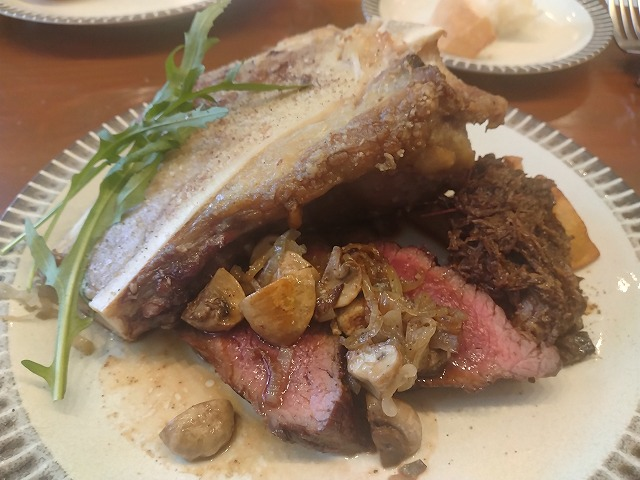

# 菊池 寿人 周报 — 2026-W04

- 周次：2026-W04
- 提交时间：2026-01-21 10:24:43
- 职位：Engineering　Manager

---

◆作業内容

①開発課題整理

＝＝＝筋の悪い案件＝＝＝＝＝＝＝＝＝＝＝＝

正しい情報を、正しく上に伝える事。

ここ忖度したり日和ると簡単にチームが全滅します。

攻めるも守るも、正しい情報の中で行いたい。

飛び越えて話進められると、フォローアップできません。

ご確認ください。

＝＝＝＝＝＝＝＝＝＝＝＝＝＝＝＝＝＝＝＝＝

■止められない止まらない

お気持ちで仕事するなっつってんのに、部下の前で

お気持ちで仕事すんなってんの。

だから、何時まで経っても部下がお気持ちで仕事

してんじゃねーの？勘弁して欲しい。

仕事を教える、とかそんな偉そうな事ないですから。

やるべき事、やった方がいい事、やらない方がいい事、

やってはいけない事、の理由を自分の言葉で話せない

奴は、先輩に居てもいいですが、メンターや上司に

居たらダメなんですよ。

だって、評価軸が無いじゃない、だから、言う事が

コロコロ変わるし、怒りポイントが日によって変わる

みたいなバケモノが自然発生的に産まれるんです。

仕事でトラブルを起こし続けている部下を持つ上司が

「頑張れ」「しっかりしろ」なんて、なんの意味もない

言葉を吐いていたら、そこを頂点にしたピラミッドの

下見てください。彼ら彼女らはそいつのせいで、

たった８０年あるかないかの人生を無駄に遠回り

、または、通せんぼされているのにも関わらず、

気が付かない憐れな民になってる、憐民です。

本当に今でも感謝しますよ、入社の配属先が

本社４階で、本社３階や開発センターじゃなかった事に。

開発センターだったら、どんなしょうもない人間に

成り下がっていたか、思い出すだけで身震いします。

そう思ったならその時点で確認しろ、それだけで、

現場のミスの大半が『お前のせい』で発生しなく

なる事にいい加減に気が付け。

と、言っても次に繋がらないから、言い損ですわ。

ダメなモノはダメだから言うけどね。

■業務に特筆するべきものだけコメント多めにします

本当にマルチタスク過ぎですね

下流の調整なんて出来る事知れてるから上流で仕切って欲しい心

ほぼブレーンワーク次第なのでシレっと仕事出来ますけれども、

開発動き出すと最適化しまくってるので、ラフな割り込みは、

そこそこ脳みそ焼けます

●決済切り替え

怖い

・インバウンド

PM紹介してくださいね。

・インバウンド向け基幹対応仕様待ち

PM紹介してくださいね。

●EC相談

話が通じる相手との会話ってこんなに楽なんだ

と、ほっこりしました、が、普通の事だった

・生鮮要望全般

本当に、管理監督をお願いしたい。

レーンセルフ

4月以降で確定したので、調整しながら進めます

●薬事法改正に伴う登録販売員判定強化

もう遅いと思って下さい、本当ですよ

タイヨウ殿外税対応

スケジュール合意

●POSの未来を考える

なんか違うと思うんだよね、J〇さん

・保守観点

それでいいなんて、そんな感覚は、死ぬまで一回もねーんです。

口にした途端に、それは墓場にいると思った方がよいのですよ。

●展開チーム

勘弁してくれよ。。

（固定）

知識がない以前に、仕事としてのノウハウがない。

事に、適切な指導が行えていない。

から、そうなる、当たり前。

・カスハラ対応

１月中リリースで調整

・カメラ認証ボタン対応

１月中リリースで調整

・トライアル＋画像

１月中リリースで調整

●デジタルクーポンの見せかけた新価格値引き

仕切りがいつも悪いのは判ってやってんのか、

一緒になってだらだらやんな、と注意させるな。

仕切りの話です。相手じゃなく、自身の仕切りです。

●支払併用の動き

上流と現場の2軸と会話中

・2026リリース

１月と２月のリリース計画と内容は決定しております。

それは安全面も考慮された計画です。ありがとうございます。

・他一覧に乗っけるか検討中の案件複数

細々やりたい事が届いています

・各種要望

重たい課題が複数動いている為、そもそものロードマップの組み換え

を行いながらブレーンワークをしている状況です。

ブレーンワークなので真顔で仕事していますが、中々にカオスです。

それはそれで、いつもの事なので気にせず相談してください。

・その他、業務関連

割り込みマルチタスクが楽しい世界です。

③各種問合せ業務

・案件相談／概算見積もり

・店舗／コールセンター対応

④各種定例Ｍ

整理中

⑤割込作業

◆来週作業予定【1/26～1/30】

〇社内

今期要望整理

PoC各種

コール状況の棚卸

〇課題・要望の推進

棚卸

〇展開フォロー

成長しないのでもう無理です

〇其の他

なし

■コント番組やユニットが嫌いな原因が判ったかも

センターマイク一本で、トークだけで笑いを生み出すお漫才は

幼少期から特撮モノ、刑事ドラマ、洋画の三大コンテンツに

匹敵するか、殿堂入りで好きな番組でしたね。

因みに、一番好きな漫才師は、いとしこいし師匠。

見事なまでの洒脱さ（の頃しかしらないけれど）は格好良です。

そんな私はダウンタウンと共にお笑いを見ていたリアル世代。

「4時ですよーだ」や幻の「ゆーとぴあ」、特に「ガキ使」は

第一回放送からずっと見てたもんです。

ちなみに、人生最高のコント番組は「夢で逢えたら」

次点で「ごっつええ感じ」となるんですが、「夢で逢えたら」に

匹敵する滅茶苦茶ローカルでマニアックな番組があるんです。

　戦国鍋TV

酔っぱらって冗談で検索した年末。

完全版Blu-rayBOXが出てきた時は考えるまでも無く、

ポチってしまったのは仕方が無い事です。

Blu-rayプレイヤー持ってなかったですけれども。

戦国時代・武将系の知識が豊富であればあるほど、

腹抱えて笑えますが、非常に高いクオリティに、

なるほど、「夢で逢えたら」前後の良質なコント番組で

育った気鋭の若手作家陣が大暴れしたのが伝わります。

思い出補正もあり１位の座は、「夢で逢えたら」ですが、

そろそろ半世紀生きて来て、戦国鍋TVを知っている人に

たった一人しか遭遇した事がないですが、ご存じです？

最近の週末は酔って帰って寝る前に、２週分の放送回を

バーボンストレートとちょっとしたチョコを齧りながら

見る戦国鍋TVが最高な時間ですね。

今年いっぱい、楽しめる計算です。

■飲み屋の常連さんから誘われたポップアップ

フランスで働いている若い料理人が帰国時に行う

第２回のランチ会に誘われたので、参加してきました。

メインはジャージー牛の腿肉を大腿骨の髄と併せて

焼き方がBlueで出てきたのは（にしては、ちょっと火入ってる？）

驚きました。そもそも言っても伝わらないBlueを、向こうから

狙って提供してくるなんて。

すっごいキラキラした目で、どうでしたか！！って言われたら、

そりゃ、ありがとうございましたしか言い辛いよね。

コースとして食うには、通して、塩が強すぎだよ。勿体ない。

即席スタッフが後乗せの塩の味を見てなかったんだろうね。

私信への返信

＞します！

本当に？本当ですか？発表は現実を見てから・・

全体的に

・フロントエンド内の業務応援やフォローなども突発的に発生し、

各自の業務が増加している傾向にあるが、全体で共有して

進めて行く。

・相談が増える中で、やりたい事が出来るかどうかだけ聞かれる、

段取りも無く突然依頼が来る、等、進め方がおかしい部分の改善図りたい。

以上
