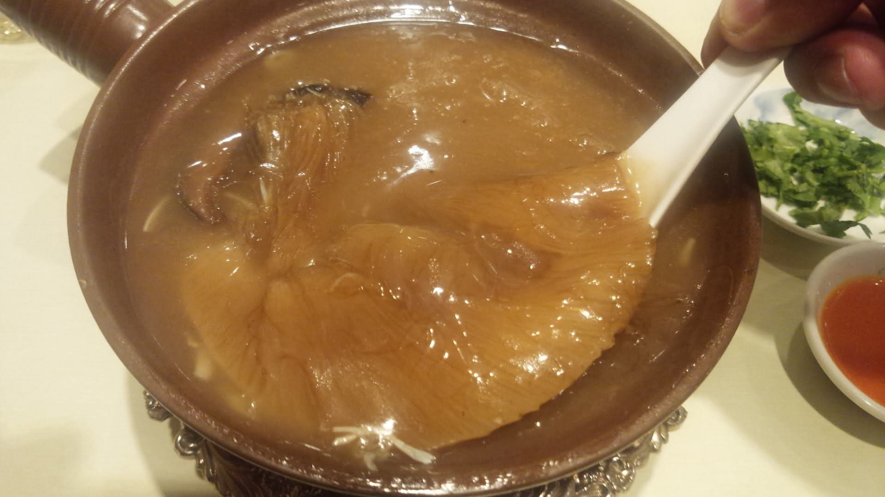
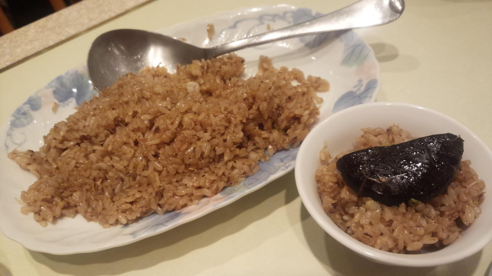

# 菊池 寿人 周报 — 2026-W05

- 周次：2026-W05
- 提交时间：2026-01-29 11:50:40
- 职位：Engineering　Manager

---

◆作業内容

①開発課題整理

＝＝＝筋の悪い案件＝＝＝＝＝＝＝＝＝＝＝＝

正しい情報を、正しく上に伝える事。

ここ忖度したり日和ると簡単にチームが全滅します。

攻めるも守るも、正しい情報の中で行いたい。

飛び越えて話進められると、フォローアップできません。

ご確認ください。

＝＝＝＝＝＝＝＝＝＝＝＝＝＝＝＝＝＝＝＝＝

■あれだけ失敗した花小金井の工事からの機器設置

（何もない事を評価出来ないと根本解決は難しいかもね）

悪意をもって全力でサボってもそこはつい対応するレベル

で手を打てなくてグダグダだった花小金井、私の中では

事件（＝通常運転の集大成と言う意味）だったけれども、

なんか俺関係ないし的な、判らないからしかたない的な

ゆるーい許され系みんな悪いよねな空気を纏わせてる

彼らは、未だ慣れなくて気持ち悪いです。

彼らを見るにつけ、『お前の上は誰や、名前言えや！』と

失敗したり怒られる度に、業務上の先輩達の名前を

言わされると言う結構な地獄の時間を味わってきた

新人～２年目の頃の私には、どの面下げてるのかなぁと、

彼らに対して不思議な気持ちになってしまうのは、

呪いですから、これはもう仕方ないと思って下さい。

ほんと、頑張る前に考えてから動けよ、ほんと。

武蔵新庄は不安ですが、うちから一人投入するので、

くれぐれも「それでいいや」「そんなもんか」等、勝手に

納得して、手を抜かないようにお願いしたいものです。

能力が低くて言葉尻つかまえて悦に入る系の人は

最近見かけませんが、昔は良く言われたもんです。

『サボり方見れば仕事が出来るか出来ないか判る』

といったら「菊池君、サボるって言うのは良くないよ」

とか言ってきてた無能課長さん達、仕事が出来る子はね、

お前らと違って絶対に手を抜いちゃいけない所は、

きっちり仕上げてるんです。サボると言うのは優先順位の

話で後回しにしたり、ちゃんと気を抜くタイミングを作ってるって

意味です。通常時から頑張ってる奴なんて、本当に大変な

時にそれ以上頑張れない役立たずに成り下がるんですよ？

ほんま仕事しないならグダグダ言わんといてくれませんか？

と言ったら、嫌われるので、若い子は気を付けてくださいね。

■業務に特筆するべきものだけコメント多めにします

本当にマルチタスク過ぎですね

下流の調整なんて出来る事知れてるから上流で仕切って欲しい心

ほぼブレーンワーク次第なのでシレっと仕事出来ますけれども、

開発動き出すと最適化しまくってるので、ラフな割り込みは、

そこそこ脳みそ焼けます

●決済切り替え

そりゃそうでしょう、という感想しかないのですよ。

私が見てきた人達とあまりに違い過ぎるからずっと困惑している。

●インバウンド

PM紹介してくれるそうです。

●インバウンド向け基幹対応仕様待ち

PM紹介してくれるそうです。

●EC相談

連絡お待ちしております。

・生鮮要望全般

本当に、管理監督をお願いしたい。

レーンセルフ

4月以降で確定したので、調整しながら進めます

●薬事法改正に伴う登録販売員判定強化

若い子が業務参画を表明したので、ガガっと資料化してみました。

作り始めるとちゃんと作りたくなってきますね。

業務範囲が違うので、教育資料程度で止めときますけれども。

タイヨウ殿外税対応

スケジュール合意

●POSの未来を考える

雑なミーティング招待を受けた。

・保守観点

それでいいなんて、そんな感覚は、死ぬまで一回もねーんです。

口にした途端に、それは墓場にいると思った方がよいのですよ。

展開チーム

（固定）

知識がない以前に、仕事としてのノウハウがない。

事に、適切な指導が行えていない。

から、そうなる、当たり前。

・カスハラ対応

１月中リリースで調整

・カメラ認証ボタン対応

１月中リリースで調整

・トライアル＋画像

１月中リリースで調整

●デジタルクーポンの見せかけた新価格値引き

普通に確認するべき事は普通にしたらいいのにね。

●支払併用の動き

やる前提で調査中

●レシート短縮

若手が頑張ります

・2026リリース

１月と２月のリリース計画と内容は決定しております。

それは安全面も考慮された計画です。ありがとうございます。

・他一覧に乗っけるか検討中の案件複数

細々やりたい事が届いています

・各種要望

重たい課題が複数動いている為、そもそものロードマップの組み換え

を行いながらブレーンワークをしている状況です。

ブレーンワークなので真顔で仕事していますが、中々にカオスです。

それはそれで、いつもの事なので気にせず相談してください。

・その他、業務関連

割り込みマルチタスクが楽しい世界です。

③各種問合せ業務

・案件相談／概算見積もり

・店舗／コールセンター対応

④各種定例Ｍ

整理中

⑤割込作業

◆来週作業予定【2/2～2/6】

〇社内

今期要望整理

PoC各種

コール状況の棚卸

〇課題・要望の推進

棚卸

〇展開フォロー

成長しないのでもう無理です

〇其の他

なし

■ちょうど９年前の台湾出張中のお話

奢るからフカヒレ食いに行こうぜって誘ったのに、

「高いだけで、あんなの食べる奴は白痴だよ、白痴」

と、ちゃんと口の悪い向こうのマネージャから断られた

　頂上魚翅燕窩専売店[Golden Top Shark's Fin Co] 

店の前にスーツで固めた案内人が仁王立ちしてても

気にせずそれはそれは酷い片言会話で入店した先は

中々の素敵空間でした。

とりあえず、見た目以上にぎっしり折り重なったフカヒレを

堪能した経験を積んだので、もう行かなくてもいいと

思っているけれども、ちゃんとしたものには一度触れておく

そんな気持ちは大事だと思いますね。仕事でも何でも一緒。

・当時の価格で、14,220円

・当時の価格で、3,240円

翌日、フカヒレ断られたマネージャと夜市の地元飯（滅茶旨小菜162円位）に囲まれながら

結局2万円払った話をしたら、色んな”馬鹿”の表現されたなぁ。

お陰で？ヒアリングもリスニングも出来なかったけど、結構文章は読めたんだよなぁ。

私信への返信

＞カスハラ対応

お客様が神様、ごね得ってのはそもそもの日本文化に

合わないし、店が客を思う分にはいいけれど、そもそも

客が自分を神様扱いを強要するなんて日本文化に

合わないけれども、そんな疫病神や貧乏神への対応

コストが見合わない問題は、正常な業務を妨げている

客だけでなく企業側の責任も改めて問われているので、

　お客様向けのレシートから従業員の前を消します

　電子情報のジャーナルには残ります

これすなわち、POSに求められたカスハラ対応です。

＞確定しだい

確定前に情報投げてくれたらおっさん’ｓがやいやいと

確認しますよ、お嫌でなければいつでもどうぞ。

全体的に

・フロントエンド内の業務応援やフォローなども突発的に発生し、

各自の業務が増加している傾向にあるが、全体で共有して

進めて行く。

・相談が増える中で、やりたい事が出来るかどうかだけ聞かれる、

段取りも無く突然依頼が来る、等、進め方がおかしい部分の改善図りたい。

以上
