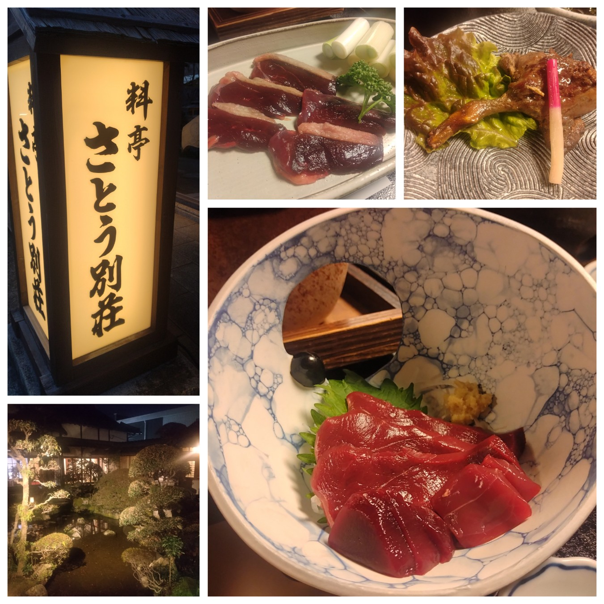

# 菊池 寿人 周报 — 2026-W06

- 周次：2026-W06
- 提交时间：2026-02-03 01:52:31
- 职位：Engineering　Manager

---

◆作業内容

①開発課題整理

＝＝＝筋の悪い案件＝＝＝＝＝＝＝＝＝＝＝＝

正しい情報を、正しく上に伝える事。

ここ忖度したり日和ると簡単にチームが全滅します。

攻めるも守るも、正しい情報の中で行いたい。

飛び越えて話進められると、フォローアップできません。

ご確認ください。

＝＝＝＝＝＝＝＝＝＝＝＝＝＝＝＝＝＝＝＝＝

■武蔵新庄でもやらかしてますわ

無理な子に、指摘できない子に、状況報告出来ない子に

体制整えられない子、果たしてどの子が存在しているのやら。

さて、『世の中の全ての事は何でも一緒教』に入信して久しい

私にとっては、展開チー〇のグダグダ振りは、グダグダの原因が

手に取る様に判る（過去同じような組織やチームを沢山見てるバグ有）

判るよぅ、なのだけれども、振り返って、私のゲーム遍歴を考えた場合、

なるほど、私は恵まれた環境に育ったと言う奇跡の軌跡が良く判る。

①～順に発売が古い順かな？

触れた順序は異なるが、今でも強く思想の根幹に存在している。

②Wizardry(MSX2～)

　→④ファイナルファンタジーII(FC)

　　→③Ultima IV(PC98)

　　　→①Dungeon Master(PC98)

ここで『世の中の全ての事は何でも一緒教』に入信すると、

見える世界がちょっと変わる話をしてみたい。

これらのゲーム世界観を個人的にまとめてみると、

①Dungeon Master

成長とは、使用した行動や行為そのものの反復で決まる。

武器／魔法／職能が使用実績で高まる熟練度概念の先駆的システム。

②Wizardry

成長とは、レベルではなく数値で表す能力値と職業特性の２軸。

ピーク年齢を過ぎると、能力値の数値が下がる事がままある。

③Ultima IV

成長とは、行動の倫理的積み重ねで決まる。

見かけの数値よりも行動選択や徳が重要になる。

④ファイナルファンタジーII

成長とは、プレイヤーの行動選択の履歴でのみ決まる。

レベルが無く戦い方が能力を決定する熟練度概念の大衆化成功例。

つまり、私は小学生～高校生の間に、職業的な専門性や能力は

業務経験数＝レベルではなく、繰り返された行為行動の反復による

熟練度によって決まる事を、DunMasやFFから痛い程に学び、

また、専門職で蓄積された経験則でも、加齢や転職等で、衰退や

一時的にでも下がる事があるをWizから咽び泣きながら学び、更に、

その行動姿勢（善い行動や向き合い方ひとつ）で、成長度合いが

大きく変わっていく事をUltimaから学んだ恵まれた経験を下地に持つ

現在では数少ない理不尽ゲーム世代の創成期に育っているのだった。

一方、現実ではどうだったか、米つきバッタの様に、上司に媚び諂い、

自分で考える事を放棄（価値が無いと放棄させられた）し、言われた事

をやった事のみを、唯一の成功にする気持ちの悪い上司達に囲まれ、

一方で、そいつらをガン無視して客と真正面から向き合っていると言う、

ある種、社会人のカテゴリでは悪の集団（Wiz的には悪はOK）の様な

愚連隊に、うちのチームからは祟り神は出さないぞ、しばき回されて

監視教育された事は、歪みも凄いが、結果、本当に幸いな事だった。

じゃないと、展開〇ームみたいになってたかもしれないからね。

いや、当時は『世の中の全ての事は何でも一緒教』に目覚めてなかったが、、

多分、大丈夫な気がしてきた。やってて良かった熟練度システム。

■業務に特筆するべきものだけコメント多めにします

本当にマルチタスク過ぎですね

下流の調整なんて出来る事知れてるから上流で仕切って欲しい心

ほぼブレーンワーク次第なのでシレっと仕事出来ますけれども、

開発動き出すと最適化しまくってるので、ラフな割り込みは、

そこそこ脳みそ焼けます

●決済切り替え

作って終わりの世界ではなく、作ったら終わり（＝がない）

の世界に、ヘルプ／サポート体制が整っていない時点で、

世の中に画期的な決済サービス。

ChatGPTに聞いたら、凄い事言われたが、これは流石に

記載出来ないと、私の自制心が全力で稼働した事は秘密。

●インバウンド

PM打ち合わせ、どの情報粒度を求めてるんだろう

●インバウンド向け基幹対応仕様待ち

PM打ち合わせ、どの情報粒度を求めてるんだろう

●EC相談

連絡お待ちしております。

・生鮮要望全般

本当に、管理監督をお願いしたい。

レーンセルフ

4月以降で確定したので、調整しながら進めます。

●薬事法改正に伴う登録販売員判定強化

POSへの依頼要件を店舗サポート部の打ち合わせで頭出し。

●タイヨウ殿外税対応

今月23日週に外税切り替えが行われます。

●POSの未来を考える

何をするのか、事前に説明がない会議は嫌い。

・保守観点

それでいいなんて、そんな感覚は、死ぬまで一回もねーんです。

口にした途端に、それは墓場にいると思った方がよいのですよ。

展開チーム

浅い

（固定）

知識がない以前に、仕事としてのノウハウがない。

事に、適切な指導が行えていない。

から、そうなる、当たり前。

●カスハラ対応

１月リリース済み

●カメラ認証ボタン対応

１月リリース済み

●トライアル＋画像

１月リリース済み

●デジタルクーポンの見せかけた新価格値引き

途中、私がちょっとだけグダグダっぷりにイラっとしただけで、

結果、上手く纏まったなら良かった良かった。

●支払併用の動き

やる前提で調査中

●レシート短縮

緩～い雰囲気仕事では許されない？許さない、

普通の事を普通にする難しさにそれなり壁を感じているのが

手に取れるが、それを無意識にこなせる様にならないと、

本当に頭打ちになるから、「それでいいや」という気持ちに

なってないか、今なら毎時振り返りながらの業務遂行に期待。

今週に情報アップデート貰える予定。

・2026リリース

１月と２月のリリース計画と内容は決定しております。

それは安全面も考慮された計画です。ありがとうございます。

・他一覧に乗っけるか検討中の案件複数

細々やりたい事が届いています

・各種要望

重たい課題が複数動いている為、そもそものロードマップの組み換え

を行いながらブレーンワークをしている状況です。

ブレーンワークなので真顔で仕事していますが、中々にカオスです。

それはそれで、いつもの事なので気にせず相談してください。

・その他、業務関連

割り込みマルチタスクが楽しい世界です。

③各種問合せ業務

・案件相談／概算見積もり

・店舗／コールセンター対応

④各種定例Ｍ

整理中

⑤割込作業

◆来週作業予定【2/9～2/13】

〇社内

今期要望整理

PoC各種

コール状況の棚卸

〇課題・要望の推進

棚卸

〇展開フォロー

成長しないのでもう無理です

〇其の他

なし

■季節を草木や花、雲や旬のモノで感じられる大人でありたい

良くしてもらっている飲食店からお誘いを受けたので、

この季節、まさに猟期が終わる一番良い時期の鴨を食べに

お客様何人かと一緒に行ってきました。

無双網猟で採れた鴨は、ジビエによくある血の匂いが全くなく、

刺身にしても焼きにしても、上品でありながら、鴨の旨味が乗った

美味でございました。

まぁ、煮付け類は、甘さが過ぎるけど、これも文化よね。

因みに、飲食店のお客様故に、料理人や食肉卸の人もいるので、

肉質やら味付けやら、この薬味が欲しいやら、わいわいと

濃ゆい話を持ち込みの良いお酒で流し込んで楽しい会でした。

猟期終了までもう２週間を切ってますので、まだチャンスありです。

全体的に

・フロントエンド内の業務応援やフォローなども突発的に発生し、

各自の業務が増加している傾向にあるが、全体で共有して

進めて行く。

・相談が増える中で、やりたい事が出来るかどうかだけ聞かれる、

段取りも無く突然依頼が来る、等、進め方がおかしい部分の改善図りたい。

以上
