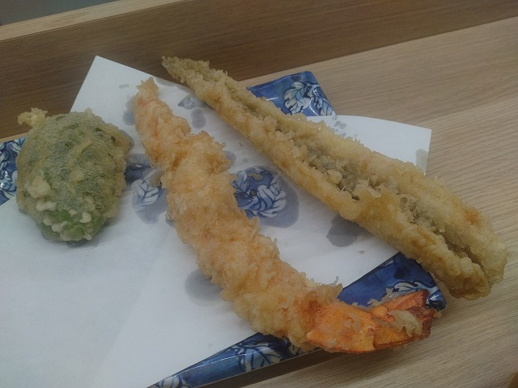

# 菊池 寿人 周报 — 2026-W10

- 周次：2026-W10
- 提交时间：2026-03-04 12:09:12
- 职位：Engineering　Manager

---

◆作業内容

①開発課題整理

＝＝＝筋の悪い案件＝＝＝＝＝＝＝＝＝＝＝＝

正しい情報を、正しく上に伝える事。

ここ忖度したり日和ると簡単にチームが全滅します。

攻めるも守るも、正しい情報の中で行いたい。

飛び越えて話進められると、フォローアップできません。

ご確認ください。

＝＝＝＝＝＝＝＝＝＝＝＝＝＝＝＝＝＝＝＝＝

■人の思考に乗っかってみるの大好きなのですが・・

マズローの欲求を５段階に分ける分析を用いて、自己実現を超える自己超越に、利己と他己の差を見出し、他己とする事こそ至上と言う精神論を流布しようとしていたメンバーがいた事で、今回の疑問が産まれ、確認のための会話に付き合って貰いたい。先に私のマズローの5段階への解釈を述べていく。

自身の差別的、金銭的困窮に向き合い、知的分野での成功を修めたマズローにとって、SEXと父性母性だけを源流とするフロイト達や、ワトソン達の様に、刺激と欲だけで生きる物体という考え方は、自身を振り返ってその苦節を馬鹿にされている様な、到底受け入れがたい屈辱だったと考える。また、生命に対してあまりにも無機質に浪費する共産主義とそれに従う人間もまた、唾棄すべき愚民、もとい、同族として見なされたくないと言う幻想の業火に焼き尽される気持であったとも考えられる。自分は違う、その様な矮小で無知蒙昧な存在ではない、はず、と言う肯定感を必死に探した結果、マズローの提唱する５＋１の世界観が産まれ、人間は必ず頂点に行きつける、はず、であり、その境地を思い描く事のみが、彼の魂（尊厳）を優しく包んで慰撫してくれる存在だったのではないか、と私は思う。故に、自己超越と言う、人間の個としての限界を超えた夢を、晩年に差し込まなくてはならない程に、実は絶望していたのではないか。ニーチェが神を殺した様に、マズローの世界を俯瞰して見ると、小さな人間の悲痛なまでの叫びに見える。必死に考えていた自己肯定と自己否定は相克の様で、実は共存している事に気が付いてしまったのではないか。どちらかが強い程、どちらかが深くなるが、どちらも根源的な自己否定（＝恐怖の根源）を出発点にしているが故に思考の広がりは乗算され、結果として闇が同じように深く広がり、その闇を隠そうとすればする程、絶望に苛まれたとも考えられないか。必死に縋る（＝救済）ものを探し続けたのではないか。が、それ故に、縋る事が出来た瞬間、それに端を発した自己否定に際限が無い事、絶対的な安寧は手に入らないと言う事実に気が付いたのではないか。満身創痍のマズローが、最後に吐き出した自己超越によって、彼の精神はこれ以上なく闇落ちした気がする。死の直前に自己超越を加えた事が、その証左ではないか、と感じる。

これらを、前述のメンバーが行った様に、安易に会社組織における成長や到達点として評価指標とする事に、強い違和感を感じる。人の持つ精神に、「品」「格」の様なもので区切るならば、大枠でマズローの言う精神世界は納得感を得やすい点には意見は無い。が、生命と安全が保障された「品」「格」を持つ人間が出発点とする社会人とその組織に隷属して発生する生産行為を、マズローの視点で振り分けるのは、彼が目指す超越の概念を変質させていると私は考えてしまう。強い言葉になるかもしれないが、崇高な概念を、欲と垢に塗れた世俗に落とし、その気高くありたい概念を使って、サラリーマンと言う集団維持の為の指標に当て嵌めるには、あまりにも乱暴で無礼極まりないとさえ、考えてしまう。

それでも尚、マズローの理論が、会社組織に受け入れやすいと言うのであれば、視点を変えれば、それだけ受け入れる側の組織が未熟である事の証左といえる。もとい、それをそう受け入れる事に強い違和感や思想的な反発が経営層や管理者層にあったとしても、それを受け入れる事が全体として＋に働くと言う未成熟な組織である事には違いない。

とか、カッとなって頭に浮かんだ言葉を只管書き綴って、どない？と

AIと会話するのは割と楽しい。この量でもちゃんと返すのは脅威。

これをインサートとして、じゃぁ、と、深堀すると、、

割とAIがこちらのオブラートを剥がしてくるが、

一部憚りがあったので割愛。

前述のメンバーは、ニーチェの「ツァラトゥストラはかく語り」

然り、人物像や時代背景、思想に至る経緯を度外視して、

アウトプットだけをなぞって、自身の思考に当てはめると言う

悪癖がある。時にイラっとして、AIに「違ぇーだろ！？」と

やり合うのは、中々にスッとするのだが、そのメンバーのせいで

哲学書に手を伸ばすものの、直ぐに寝てしまうのが難。

■業務に特筆するべきものだけコメント多めにします

本当にマルチタスク過ぎですね

下流の調整なんて出来る事知れてるから上流で仕切って欲しい心

ほぼブレーンワーク次第なのでシレっと仕事出来ますけれども、

開発動き出すと最適化しまくってるので、ラフな割り込みは、

そこそこ脳みそ焼けます

●武蔵新庄

A:出来ない子

B:何故、出来ない子なのか理解しきれない上司。

C：出来ない子に強く出る出来ない奴。

①Aは言われた内容を理解しない。

②Aは何故聞きに行くかの目的を理解しない。

③Aは聞いた内容が何の説明かを理解しない。

④Aは聞くが、伝えない、手伝わない、助けにならない。

⑤Aは聞く事しか出来ない為、何度も聞きにくる。

①②③によりAが証明される。（⑥）

④⑤により、（割愛）舐められている。（⑦）

④と⑤の経験がないBはAの問題が判らない。（⑧）

よって、⑥⑦⑧より、AはBによる適切な助言を

受けられないまま、問題を繰り返す。（⑧’）

Cはまぁ面倒くさいからいいや、そういう事をしている。（⑨）

つまり、CがAに対して行う依頼事項は、

⑧故に、AがBに相談しない、共有しない状況（➉）

⑨により、AはCの言った事をただ繰り返すしか行えない（⑪）

⑨と⑪の関係性、および、➉の個人プレーにより、

Aの発言は、意図不明／真意不明となり、Aの評価が

更に下がる繰り返しを生んでいる。（⑫）

アンサー：

①～⑫とかどうでもええわ。

Cがダメなんだよ、

徹頭徹尾、花小金井からCがダメ。

⑨の証明が不十分？、語るのも怠い。

●決済切り替え

失敗した時の事を考えて動けないのは

良くない事です、これは本当。

だから失敗した時の事を先に考えて

リスクヘッジをするのはとても大事な事、

これをしないのはどの世界線でもあり得ない。

お題：

数日復旧しなかった時、お客に言われたら

嫌な事はなぁに？

のアンサーに、続けて

お題：

数日復旧しなかった世界で大きく運用が

変ったけれど、どう変わった？

みたいな、大喜利をすれば、山ほど出てくるよね。

これはやってみなくても、何時でも何処でも

考えられる事、に対して、リスクを見据えた上で、

お題：

最悪の状況にならない為に行った、

（以下、無限条件）、何故（どうなる）？

を、やってなさそうで、マジ深淵。

●インバウンド向け基幹対応仕様待ち

サクサクやりましょう。

・EC相談

連絡お待ちしております。

・防犯エリア展開

1つ進んだと思って油断するのは止めて欲しい。

進んだ、ではなく、一時回避、です。

・飲食相談

久しぶりに世界観を想像して楽しかったです。

・生鮮要望全般

本当に、管理監督をお願いしたい。

レーンセルフ

4月以降で確定したので、調整しながら進めます。

●薬事法改正に伴う登録販売員判定強化

3月半ばの開発完了を目指してます。

・交通系IC

ご要望が出ております。

・タイヨウ殿外税対応

対応済み、次回から割愛

・POSの未来を考える

報告なし

・保守観点

それでいいなんて、そんな感覚は、死ぬまで一回もねーんです。

口にした途端に、それは墓場にいると思った方がよいのですよ。

展開チーム

浅い

（固定）

知識がない以前に、仕事としてのノウハウがない。

事に、適切な指導が行えていない。

から、そうなる、当たり前。

・支払併用の動き

続報なし

●レシート短縮

方針確定待ち

・2026リリース

3月の全店配信はありません

4月に注力します

・他一覧に乗っけるか検討中の案件複数

細々やりたい事が届いています

・各種要望

重たい課題が複数動いている為、そもそものロードマップの組み換え

を行いながらブレーンワークをしている状況です。

ブレーンワークなので真顔で仕事していますが、中々にカオスです。

それはそれで、いつもの事なので気にせず相談してください。

・その他、業務関連

割り込みマルチタスクが楽しい世界です。

③各種問合せ業務

・案件相談／概算見積もり

・店舗／コールセンター対応

④各種定例Ｍ

整理中

⑤割込作業

◆来週作業予定【3/9～3/13】

〇社内

今期要望整理

PoC各種

コール状況の棚卸

〇課題・要望の推進

棚卸

〇展開フォロー

成長しないのでもう無理です

〇其の他

なし

■久しぶりに吉塚のだるま

昔来た時は、極み定食が1100円だった。

今だと極み定食の中ご飯で1820円。

大海老とか穴子１本などインパクトはあるが、

まぁ、自分で天婦羅作った方が手軽で旨いな。

2倍とは言わないが、価格の優位性がこれだけ

下がると、飲食に行くメリットって結構少ないと

感じる≒作った方がまし派の私でも、いまだに

多の津の麻婆豆腐は食っている。

あれは、熟成豆板醤がその辺に売ってないから。

熟成豆板醤が手に入ったら、というか、とだ屋で

売ってたら、絶対、自宅で作るわ。

ごちそうさまでした（-人-）

私信へ返信

>共感

共感も良い力になりますが、違和感の追求も楽しい世界です。

考えれば考える程、思考時間と精度は上がると思います。

>免税

きちっと決めて、きちっと遂行すれば良いだけの、

普通のプロジェクトをやりましょう！

>わかりにくっ

アレ、とか、コレ、って世界はつまらないですよ。

みんな一緒です、気が付かないだけで、

目に見える、聞こえる全て気付きだらけです。

どう汲み取るも、どう解釈も、自分次第です。

み～んな、一緒なのです（-人-）

全体的に

・フロントエンド内の業務応援やフォローなども突発的に発生し、

各自の業務が増加している傾向にあるが、全体で共有して

進めて行く。

・相談が増える中で、やりたい事が出来るかどうかだけ聞かれる、

段取りも無く突然依頼が来る、等、進め方がおかしい部分の改善図りたい。

以上
