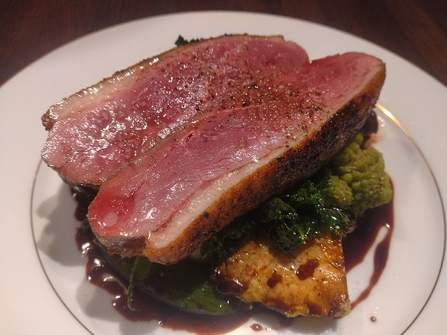

# 菊池 寿人 周报 — 2026-W11

- 周次：2026-W11
- 提交时间：2026-03-11 10:54:23
- 职位：Engineering　Manager

---

◆作業内容

①開発課題整理

＝＝＝筋の悪い案件＝＝＝＝＝＝＝＝＝＝＝＝

正しい情報を、正しく上に伝える事。

ここ忖度したり日和ると簡単にチームが全滅します。

攻めるも守るも、正しい情報の中で行いたい。

飛び越えて話進められると、フォローアップできません。

ご確認ください。

＝＝＝＝＝＝＝＝＝＝＝＝＝＝＝＝＝＝＝＝＝

■自分達の周辺会議体はIT業界TOPクラスの最下位

全部とは言わないですよ、極一部の普通の人が居る中で、

圧倒的大多数の会議慣れしてなさに眩暈がします。

毎回思うんですが、新人の時にどちゃくそ怒られた基本の基が

まったくなってない事があまりに多過ぎて、ちょっとでも

会議主催者が普通だと、もう嬉しくなってしまいます。

普通なのにニッコニコで会議参加してしまうこの異常状態は

社会人的に良くないです。私は良いんですが、若手が。本当に。

中途半端があんまりいなくて、雲泥、月すっぽん、レベル差が

何故か個人差で存在します。普通は、部署とかチームで

差が顕著なんですけどね。ひょっとすると個人事業主的に

作業をしていたのかもしれません。そうすると、その当時の

部下や、現部下は？可哀そうで居たたまれなくなります。

でも、そこ育ちの子は、無自覚に元気に会議予定を突っ込み、

アジェンダも、資料も提示せず、短い会議時間の中で、

一方的に言われたであろう内容をだらだらとくしゃべり、

最後に、出来ますか？だの、質問ありますか？だとと

宣っている人達なのかもしれませんね。

これは一体、何の時間ですかね？

何より恐ろしいのが、それを客先相手にも平気でやる点。

アライアンスが始まった辺りのPoC打ち合わせなんて、

震えがくるほど無自覚に失礼で横柄で頓珍漢な場面を

たっくさん見ました。個人名達は伏せますが、黙ってられない

程度にはカオスでしたね。テコ入れもしないし、指導もしてる

気配もないし、今でもそういうのは見聞きしてますが、

外に出すなら最低限のマナーは教えて上げましょう。

受発注の関係性度外視で本当に失礼極まりないですよ。

今まで努力もせず、自分とも向き合っていないおっさん達なんて、

教えがいもなければ、可愛くもない地獄そのものです。

それならちゃんと無知で未熟な若者を教育して、社内の会議で

場数を踏ませるようにコントロールしましょうよ。

見所あれば、他部署でも丁寧に何がどう駄目か、どうしたら

良いのかを、具体的に過去実例と現在の状況を比較整理して

面白おかしく伝えますよ。

見分けるのに２分(ほぼ会議前に判る)もあれば十分です。

回しが上手い下手は、５分もあれば十分です。

（ここから秘密の話）

それすると、彼ら彼女らの上司や先輩、または、古い上司が

文句言ったりしてくるんです。昔なら怒鳴り込んできました。

決め（捨て）セリフに企業規模や地方性が無いから笑えますよ。

でも、昨今は沈黙が多いかなぁ。多分、自分に経験値がないから

経験則も作れず、メタ反省もやってないから、アウトプットが

出来ない上司さんや先輩達なんでしょうね。

気を付けたいですね。

■業務に特筆するべきものだけコメント多めにします

本当にマルチタスク過ぎですね

下流の調整なんて出来る事知れてるから上流で仕切って欲しい心

ほぼブレーンワーク次第なのでシレっと仕事出来ますけれども、

開発動き出すと最適化しまくってるので、ラフな割り込みは、

そこそこ脳みそ焼けます

●決済切り替え

例えばサービス停止に伴う返金騒ぎ※になると？

・チャージ残高全額を負債（前受金）として計上する義務

・保全必要額 = 基準日の未使用残高合計 × 1/2(以上)

・保全必要額は、事業者の任意利用不可

・自己瑕疵(サービス停止)の場合、残り1/2も返金義務

・全額返金は民事上の確定債務

・支払不能は債務不履行／最終的には破産事由になり得る

　※私が知ってるレベルの一般例ですけどね

凄い事をしてるし、それが出来なかった過去の大企業の

事例を沢山見てるから凄く心配なのは純粋無垢な老婆心。

ちなみに、現金決済完全移行になると、どうなるか？

従業員さん的には、余剰金回収回数が如実に増えるであろう事。

金庫に流せる社員のシフトに影響する事でLSPにも跳ね、

警送業務の内容も大きく見直す事は目に見えてますよね。

電子マネー決済分の影響を店舗内現金残高が諸に受けますね。

店舗内現金残高が沢山必要だと、投資の機会損失や、

現金の管理セキュリティコストもあがり、キャッシュフローも

精度下がるわ、不正監査も必然厳しくする必要に迫られるわ、

何の為に電子マネー推進してるんだって話に戻ります。よね。

ずーっとずーっと、心配。にならないですか？なりますよね？

温度感を凄く感じて疎外感すらある。あれぇ、私だけ？

・インバウンド向け基幹対応仕様待ち

サクサクやります。

・EC相談

連絡お待ちしております。

●防犯エリア展開

社外の開発依頼が必要なものは、自社感覚で

ぬるっと仕事をしないで下さいね。ダメ絶対。

自社でもダメなんですけどね、仕事としてあり得ないから。

・生鮮要望全般

本当に、管理監督をお願いしたい。

●レーンセルフ

もうすぐ店舗に導入します。

●薬事法改正に伴う登録販売員判定強化

もうちょっと仕事を回そうよ（チーム内に向かっての話）

●QR印字

信じられない仕事の進め方。D通かよ（経験者談）

・保守観点

それでいいなんて、そんな感覚は、死ぬまで一回もねーんです。

口にした途端に、それは墓場にいると思った方がよいのですよ。

展開チーム

浅い

（固定）

知識がない以前に、仕事としてのノウハウがない。

事に、適切な指導が行えていない。

から、そうなる、当たり前。

・支払併用の動き

続報なし

●レシート短縮

推進中

●2026リリース

4月中旬に予定調整中

・他一覧に乗っけるか検討中の案件複数

細々やりたい事が届いています

・各種要望

重たい課題が複数動いている為、そもそものロードマップの組み換え

を行いながらブレーンワークをしている状況です。

ブレーンワークなので真顔で仕事していますが、中々にカオスです。

それはそれで、いつもの事なので気にせず相談してください。

・その他、業務関連

割り込みマルチタスクが楽しい世界です。

③各種問合せ業務

・案件相談／概算見積もり

・店舗／コールセンター対応

④各種定例Ｍ

整理中

⑤割込作業

◆来週作業予定【3/16～3/20】

〇社内

今期要望整理

PoC各種

コール状況の棚卸

〇課題・要望の推進

棚卸

〇展開フォロー

成長しないのでもう無理です

〇其の他

なし

■近江鴨のロースト

こちらはちゃんとしたプロの仕事。

プライベートでは最近、冷凍鴨を買って焼く練習をしてる。

１回1500～1800円で、調理時間を考えると、、

下処理で10分程。

火入れ工程で、40分程。

諸々１時間。

娯楽としては、まぁまぁ、楽しくて、お腹いっぱいにもなる。

ワインも下は580～1500円も出せば、良い感じの輸入ワインが

転がっているのがありがたい。

私信へ返信

>びっくり

ですよね、個人的には振り返って1100円で食べれて方が

びっくりです。ここはまだ烏賊の塩辛食べ放題ですよ。

>すみません

えっ、何かありました？

全体的に

・フロントエンド内の業務応援やフォローなども突発的に発生し、

各自の業務が増加している傾向にあるが、全体で共有して

進めて行く。

・相談が増える中で、やりたい事が出来るかどうかだけ聞かれる、

段取りも無く突然依頼が来る、等、進め方がおかしい部分の改善図りたい。

以上
