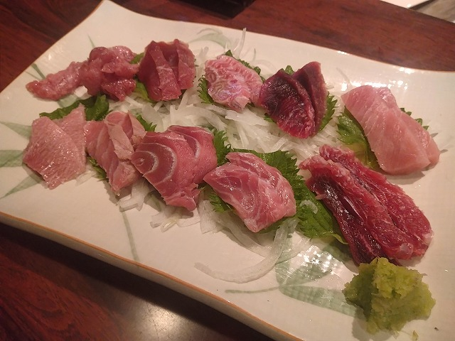
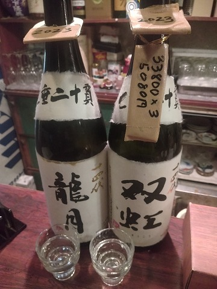

# 菊池 寿人 周报 — 2026-W12

- 周次：2026-W12
- 提交时间：2026-03-19 02:52:38
- 职位：Engineering　Manager

---

◆作業内容

①開発課題整理

＝＝＝筋の悪い案件＝＝＝＝＝＝＝＝＝＝＝＝

正しい情報を、正しく上に伝える事。

ここ忖度したり日和ると簡単にチームが全滅します。

攻めるも守るも、正しい情報の中で行いたい。

飛び越えて話進められると、フォローアップできません。

ご確認ください。

＝＝＝＝＝＝＝＝＝＝＝＝＝＝＝＝＝＝＝＝＝

■そんな話だっけ？相手の意図や言葉を雑に扱い過ぎ問題

時々見るだけにしてるけど、見始めると溜息ばかりなものが

ありましてですね、今回は「信用」だそうです。

個人的には、信用と言う言葉を使われたから、信用に対して

論ずると言う短絡的姿勢は好みに合わないので、Claudeに

人と人との関係性を表す意味あいでの、信の字が使われている

2字熟語、4字熟語、を熟語：簡易説明の形で列挙して。

2字熟語、4字熟語の中を、更に、良い意味群／悪い意味群／

類義語グループ／反語組合せに分けられる？無所属もあり。

とお願いしてみました。

日本語が象形文字を成り立ちにしながら象形文字を組合せ、

また、表意文字であったのに、ひらがなと言う表音文字を

組み合わせた世界的にも意味不明な変態文字形態なのが

素敵ですよね。そもそも、、、

－閑話休題－

言葉と言うのが文化の最先端だと思う程度には、また、

失われた言葉や表現が歴史の変遷の証拠だと思う程度には

漢字は言霊を閉じ込める為に作られた人工的な枠、、、

－閑話休題－

その中で彼の言う信用のニュアンスよりClaudeの表現が

気になったので、ここでお題は変ります。悪しからず。

信頼 ： 相手の誠実さ・能力を信じて頼ること

信用 ： 実績・言動に基づく評価としての信頼

信任 ： 役割を任せるに足ると認めること

判りやすい例だけど、頼ると用いるには、似ている様で異なる

依存関係が存在すると考えています。

お前のニュアンスと言われればそうですが、責任の所在、や、

心理的の依存度を内包すると思っているが故に昔から

注意して使い分けている言葉群の一つなので寄り道です。

今の人が聞いたら吃驚するような無能役立たず無責任の言いなり課長

の言葉の重さを定点計測し続けたあの頃の経験則によって

磨かれた勘が故に人の言葉に乗っかってるだけなのか、

自身を通った上での言葉なのかを察知しちゃいます。

なんとここで、初めの彼の対しての気持ちが湧いてきたので

話を戻します。。勢いで書くと仕方ありません。

簡単にまとめると、ごちゃごちゃ言う前に、やる事を丁寧に確りと

出来る様になる事が大事なのだと思います。

テクニック論や間違った意味での精神論で言葉遊びせず、

与えられた職務を丁寧に実行出来る状態を何度も繰り返す事が

、自分の基礎を作る意味で本当に大事な事です。

テクニックは後からついてきます。努力と研鑽によって培われた

根拠のある自信のみが、他者が読み取れる「信用に値する佇まい」

の信号として信用に繋がり、結果、信頼を勝ち得るのであって、

繰り返しますが効率だなんだと、大事な部分から目を逸らして

テクニックに逃げても、相手が見つめる中心にあるのは、ただの自分。

薄っぺらいのはバレるよね。バレたら嫌です、恰好悪いし。

自責思考と創意工夫、どうせやるならもっと良くしようとする、または

面白くしようとする気持ちを持たずに、言われた事を一生懸命

するだけの時間ってマジで人生の貴重な時間をドブに捨ててる

重篤な損失なので、勿体ないお化けじゃすまない恐怖。

楽する為の努力を惜しまず出来るのは、若いうちだけだよ。

若いうちに出来た奴だけ継続できるし、おっさんになってからだと

体よりも心がついて行かなくなるから気を付けよう教の私。

■業務に特筆するべきものだけコメント多めにします

本当にマルチタスク過ぎですね

下流の調整なんて出来る事知れてるから上流で仕切って欲しい心

ほぼブレーンワーク次第なのでシレっと仕事出来ますけれども、

開発動き出すと最適化しまくってるので、ラフな割り込みは、

そこそこ脳みそ焼けます

●決済切り替え

そろそろ電子マネーにも詳しくなった方がいらっしゃると

思うので、次週から消す。心がざわつくので消す。

・インバウンド向け基幹対応仕様待ち

サクサクやります。

・EC相談

連絡お待ちしております。

●防犯エリア展開

毎回、相手側のトラブルに巻き込まれるが、油断して自分達だったら

恰好悪いから、結局、自分達から見直しをちゃんとやる事が最速で安定。

●生鮮要望全般

ほら、ね

●レーンセルフ

浜北店に導入します

●薬事法改正に伴う登録販売員判定強化

テストで気付こうよ

●QR印字

巻で考えないと。

・保守観点

それでいいなんて、そんな感覚は、死ぬまで一回もねーんです。

口にした途端に、それは墓場にいると思った方がよいのですよ。

展開チーム

浅い

（固定）

知識がない以前に、仕事としてのノウハウがない。

事に、適切な指導が行えていない。

から、そうなる、当たり前。

・支払併用の動き

続報なし

●レシート短縮

推進中

●2026リリース

4月中旬に予定調整中

・他一覧に乗っけるか検討中の案件複数

細々やりたい事が届いています

・各種要望

重たい課題が複数動いている為、そもそものロードマップの組み換え

を行いながらブレーンワークをしている状況です。

ブレーンワークなので真顔で仕事していますが、中々にカオスです。

それはそれで、いつもの事なので気にせず相談してください。

・その他、業務関連

割り込みマルチタスクが楽しい世界です。

③各種問合せ業務

・案件相談／概算見積もり

・店舗／コールセンター対応

④各種定例Ｍ

整理中

⑤割込作業

◆来週作業予定【3/23～3/27】

〇社内

今期要望整理

PoC各種

コール状況の棚卸

〇課題・要望の推進

棚卸

〇展開フォロー

成長しないのでもう無理です

〇其の他

なし

■また一つ、大事なお店が閉店いたします。

本間／インドとちょっとバチ鮪の刺し身盛りを持ちまして、

今生で私が能動的に鮪を食べる為に注文する機会は

終了しました。ありがとうございました。

今更飲み飽きた感は拭えませんが、言うて５年振りくらいの呑み比べ。

30代半ばで大好きな居酒屋がどんどんとなくなり（老齢／ご病気／跡継ぎ）

絶望しかけていた頃、とてもお世話になったお店達の筆頭。

大将の40年の商売歴の中で、私が触れ得たのはたったの12年ですが、

本当にお世話になりました。

私信へ返信

>あったの

ずぶのド素人です。

全体的に

・フロントエンド内の業務応援やフォローなども突発的に発生し、

各自の業務が増加している傾向にあるが、全体で共有して

進めて行く。

・相談が増える中で、やりたい事が出来るかどうかだけ聞かれる、

段取りも無く突然依頼が来る、等、進め方がおかしい部分の改善図りたい。

以上
