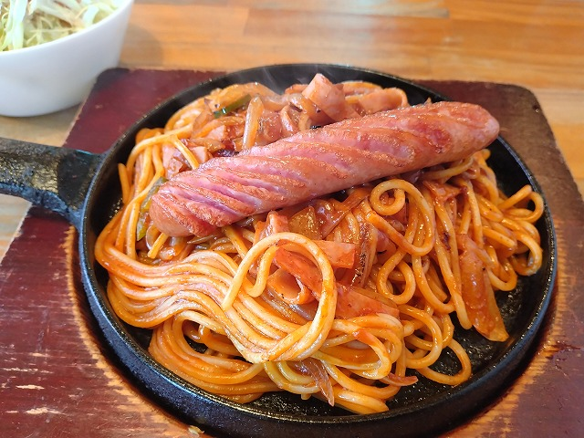
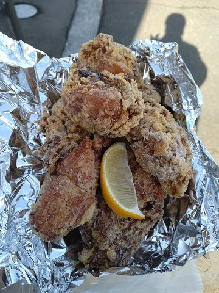

# 菊池 寿人 周报 — 2026-W13

- 周次：2026-W13
- 提交时间：2026-03-25 05:28:43
- 职位：Engineering　Manager

---

◆作業内容

①開発課題整理

＝＝＝筋の悪い案件＝＝＝＝＝＝＝＝＝＝＝＝

正しい情報を、正しく上に伝える事。

ここ忖度したり日和ると簡単にチームが全滅します。

攻めるも守るも、正しい情報の中で行いたい。

飛び越えて話進められると、フォローアップできません。

ご確認ください。

＝＝＝＝＝＝＝＝＝＝＝＝＝＝＝＝＝＝＝＝＝

■若手向けに書いている、おっさんが痛みで付いて来れない様に

本当に仕事の考え方を教えないんだなぁ、と思ってしまう。

最も、私が知っている範囲での話なので、日夜改善に努めている

素敵な人が居る可能性は、観測していないが故に否定できないが、

何年経っても打ち合わせも下手だったり、質問の仕方が下手だったり、

どういう日常を過ごせば、こんなに成長しないのか、逆に気になる。

原因は一つで、対処も簡単なのだけれども、

考える癖をつける事。

考える時間が惜しい、と言う意見、はい、判ります。

確かに、考えるより先に動いた方が圧倒的に成果が見えます。

何より、実感が伴います。これは私もそうでした。

未熟な時ほどね。作業に逃げたくなるよね。判る。

考えると言うのは純粋なスキルです。熟練度が伴う高度な

技術です。何より、考えている、と言う状態と、そのプロセスは

隠蔽化されるものであり、考えていない人から見ると、

何もしていない様にしか見えず、一方、熟慮を繰り返している

人から見ると、その思考の過程や痕跡からでも、その人の

思考の深さが伺いしれる恐ろしい世界です。

思慮深く生きていても、更に深い人に出会った時に、その片鱗に

気が付くとは限らず、ただ、抽象的な、なんか凄いぞ、に留まる

為、何時までも謙虚に生きないと、本物に出会うとあっと言う間に

駆逐される恐ろしさがあります。

なんでそんなに考えなしに動きたがるのだろう。

それを若い子が見てどう思うのか、違和感も感じさせない様に

あえて、教えない様にしているとしか納得出来ないのは、

前述に書いた通りです。だってね、

有る事象に対して、有効な手立てが打てるか、アプローチの手法、

代替え案の準備、計画性は、見れば判ります。

それが見えない事は、無い、以外に、無いんですけど、

無い場合が多い場合は、つまりそう仕組まれている罠です。

過去の地獄吹き溜まりを研究した時の話をしましょう。

教えないのは、自分より仕事が出来るようにさせたくないと言う

糞塵精神です、古いおっさん技術者に良く見られました。

か、単純な能力不足の、そもそも教えるって意味が理解出来ていない、

まるで新人と同じステージの人は集団の中で弄られ役として存在

していましたが、やっかいな集団でした。

または、ちゃんと理解出来ない奴の烙印を押され、お前と話ても

時間の無駄やから言われた事だけやれと、切り捨てられた人。

この人達は今でいう境界的な界隈の人が多いと感じましたが、

これについては、組織を維持するために、そうせざるを得ない点が

上記２つとは異なる雰囲気がありました。

最後、ただただ超面倒くさがり位のパターンですね。

スキルが高い分、そっちのスキルが無さ過ぎるパターンが多かった

ですけど、それはそいつに教育当てるなよ、という任命の問題かな。

もう少し経験を積んだり、正常な環境に振れていれば、その様な

人達からも学びは得られるのですが、初手、新人や若手には、

ちょっと難しいですし、何より、楽してる、楽な作業に逃げれると言う

快楽は、思考する産みの苦しみ世界から、堕ちる事と同義なので、

復帰出来なくなります。

脳を騙すのは、無知な状態が一番です。

簡単に出来る事を簡単に行う事は難しい事です。

一見面倒であっても、必要な思考パターンを伝えて上げる事で、

磨き上げる事が出来るってだけです。そんな小さな努力もせず、

放置しているとしか思えない状況は、根が真面目な私にとって、

「お前の上は、さん付けで呼ぶ価値あるんか？」

「お前が先輩面するなら年数で語んなよ」

何時も相手を見る時に、こいつが俺の新人研修の担当か、

部署の偉い奴だったら、俺はどうなっていたかな？と想像するのが

好きなのですが、もう何千回やったか判らない思考です。

ちゃんと読んでる酔狂な人もいるみたいですが、

居心地が悪いおっさんがいれば、今週もだらだら書き殴った

甲斐がありましたかね。先輩が偉いんじゃなくて、その人の

経験が尊いのですよ、若い子。

そんで、失敗したらどうしよう、ではなく、その時点で全力で

考えて失敗する事自体は、寧ろラッキーで、そこにフォローする

先輩達がいるなら、どんどん失敗しないと、損だと言う事に

気が付いて欲しいですね。気が付かせない先輩が居ても

気にしたらダメです。どうせすぐ貴方の方が優秀になるので。

■業務に特筆するべきものだけコメント多めにします

本当にマルチタスク過ぎですね

下流の調整なんて出来る事知れてるから上流で仕切って欲しい心

ほぼブレーンワーク次第なのでシレっと仕事出来ますけれども、

開発動き出すと最適化しまくってるので、ラフな割り込みは、

そこそこ脳みそ焼けます

・インバウンド向け基幹対応仕様待ち

サクサクやります。が、最近、定期MTがスキップ続き。

・EC相談

連絡お待ちしております。

●防犯エリア展開

仕事の仕方、考え方、至らない点はそこらに散らばっていて

手許にもしっかりある。直そうと考えないと詰みであり、

私から見ると罪です。重罪です。

●生鮮要望全般

自動値下げ、会話が可能な方と認識確認したいです。

普通の仕事がしたいです。

・レーンセルフ

浜北店に導入します

●薬事法改正に伴う登録販売員判定強化

ダメです、もう許容できません（チーム内向け発信）

●QR印字

仕事って何だろうと、言っても仕方のない気持ちが沸く。

若い時に達観したつもりだが、やっぱり何時の時代も

変らない事実に、沸く。

・保守観点

それでいいなんて、そんな感覚は、死ぬまで一回もねーんです。

口にした途端に、それは墓場にいると思った方がよいのですよ。

展開チーム

浅い

（固定）

知識がない以前に、仕事としてのノウハウがない。

事に、適切な指導が行えていない。

から、そうなる、当たり前。

・支払併用の動き

続報なし

●レシート短縮

最速手を懸案中

●2026リリース

4月中旬に予定調整中

リリース禁止期間前と2回実施予定

・他一覧に乗っけるか検討中の案件複数

細々やりたい事が届いています

・各種要望

重たい課題が複数動いている為、そもそものロードマップの組み換え

を行いながらブレーンワークをしている状況です。

ブレーンワークなので真顔で仕事していますが、中々にカオスです。

それはそれで、いつもの事なので気にせず相談してください。

・その他、業務関連

割り込みマルチタスクが楽しい世界です。

③各種問合せ業務

・案件相談／概算見積もり

・店舗／コールセンター対応

④各種定例Ｍ

整理中

⑤割込作業

◆来週作業予定【3/30～4/3】

〇社内

今期要望整理

PoC各種

コール状況の棚卸

〇課題・要望の推進

棚卸

〇展開フォロー

成長しないのでもう無理です

〇其の他

なし

■酒蔵開きを完全に忘れてた

多分、福岡に住む人間の中で、一般客の中ではトップ１％処の

世界じゃ利かない位に、福岡の日本酒を飲んでる一般ユーザの

私ではあるが、ついうっかり、完全に失念していた。

とりあえず、酒蔵開き限定酒、今年の新酒を飲み回って、

ある程度は記憶を回収出来たのだが、明らか去年の方が味乗り

しているし、ぼやけた感じが多くの蔵で見受けられた。

と言う、成功しても何の得も無く、失敗すれば弄られまくると言う

理不尽なお店で店主や常連さんと今年どう思う問答をしていると、

理屈にあってたのでほっとした。今年も残す筑豊酒蔵開きを

突破すれば、この部分での弄られは回避出来るはずだ。

なぜ、こんな緊張を迫られる店に通い続けているのか、

何時もの顔ぶれに聞いても、誰も正解が判らない。。

しかし、GWに蔵単独の酒開きをするの、ちょっとやめて欲しいかも。

最近の休日

知ってる人は知っている、筑豊のイタリアンスパゲッティ

隠し味が隠れていないけれど、確かにそれを入れると

コクが２段は上がるからね、昔は俺もやってたなぁ、なナポリタン。

味噌汁を付けて飲む地元民の真似をする。絶対、正解。

しかし、私の筑豊の友人達がおすすめする店は、皆、味がごゆい。

濃い、じゃなくてゴユイ。サンドイッチは、サラダサンド一択。これマジ。

地元民におすすめされた唐揚げ（持ち帰り）

食った瞬間にレシピが頭に浮かぶ、十分に再現可能な唐揚げ。

何故なら、こいつは、今治の郷土料理せんざんき、まさにそのもの。

北海道のザンギじゃないぞ、ひょっとすると炭鉱ラッシュの時に、

今治から筑豊まで出稼ぎにきたか、嫁いできた人がいるんじゃないか

と言うレベルで、今治のせんざんき。

一通り、食うか。公共交通機関と徒歩で、片道２時間３０分位かかるけど。

私信へ返信

>店名！

大変申し訳ございませんが、私が普段利用する飲食店においては、

少なくとも１度以上、私と刺し呑みし、また、飲み方、振る舞い、

声の大きさ、店舗様への配慮など、最低限度、安心できる方以外、

直接教える事を差し控えております。これはひとえに、飲食の場と

言う空間を、大事にしたいと言う他の常連さんへの配慮であり、

双方で不快な齟齬が発生しない為の、気遣いでもあります。決して

『菊池さんって人を誘わないですよね（友達居ないんですか？）』

と言う方々お店のご心配いただく内容とは違う旨、明記させていただき、

また、上記の内容に、ご容赦いただければと考えております。

さらに、3月27、28日で最終営業となる点も、併記しておきます。

全体的に

・フロントエンド内の業務応援やフォローなども突発的に発生し、

各自の業務が増加している傾向にあるが、全体で共有して

進めて行く。

・相談が増える中で、やりたい事が出来るかどうかだけ聞かれる、

段取りも無く突然依頼が来る、等、進め方がおかしい部分の改善図りたい。

以上
