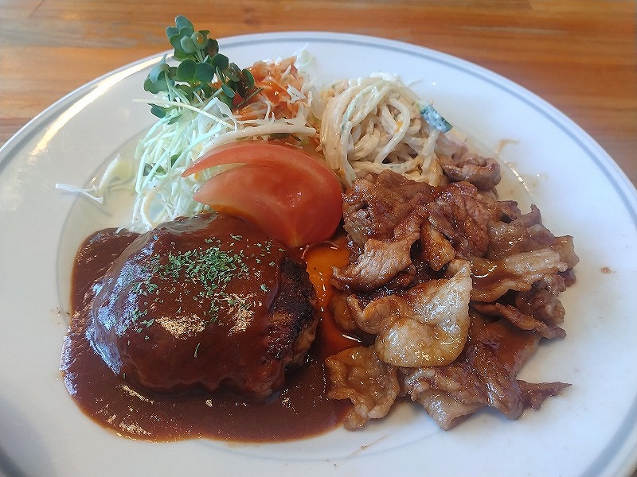

# 菊池 寿人 周报 — 2026-W14

- 周次：2026-W14
- 提交时间：2026-04-03 02:48:12
- 职位：Engineering　Manager

---

◆作業内容

①開発課題整理

＝＝＝筋の悪い案件＝＝＝＝＝＝＝＝＝＝＝＝

正しい情報を、正しく上に伝える事。

ここ忖度したり日和ると簡単にチームが全滅します。

攻めるも守るも、正しい情報の中で行いたい。

飛び越えて話進められると、フォローアップできません。

ご確認ください。

＝＝＝＝＝＝＝＝＝＝＝＝＝＝＝＝＝＝＝＝＝

■普段の延長の延長、現場のトラブルは日々の心構え一つ

何度も出てくる正味６歳しか離れてなかった先輩。

隣の島で別プロジェクトをぶん回していた先輩の一派が、

私の教育担当だったというそれだけの縁で、沢山の気付きを

貰いました。今ではパワハラとか言う言葉に該当したのか、、

いや、会社の中でヒエラルキーの高い無能に向かって、

実績示して止めを刺していたので、当時でもセーフかも。。

あ、そうそう、今週は誰に切れてるんですかね？と

言われたのですが、うちで発生している問題って、

割と新人研修レベルの意識付けがなく、自己研鑽が

間違った楽な方向（作業に逃げると言う意味）に努力した

つもりで、しかも、その危うさを指摘されてない人が

結構な勢いでいるから、毎週引っかかるんです。

そうだ、いまも良く思い出す言葉を書いておきます。

「先輩面したかったら先輩らしい事しろや」

「お前の劣化コピーにしかならんのやから、お前が努力しろや」

「お前が出来る事を何時までお前がやんねん、そんなん

　下に任せて出来へん事をやれや」

「あいつどう思う？仕事出来へんやろ？呼び捨てしてこいや」

最後はどうかとは思う気もするものの、決まって

「お前も呼ばれん様にせなな」

彼らの作業をメタで俯瞰してると、

「な、言うた通りやろ」

と、

「３年やねん、３年」

が口癖だった先輩の声が何処からともなく聞こえてくる呪い。

■業務に特筆するべきものだけコメント多めにします

本当にマルチタスク過ぎですね

下流の調整なんて出来る事知れてるから上流で仕切って欲しい心

ほぼブレーンワーク次第なのでシレっと仕事出来ますけれども、

開発動き出すと最適化しまくってるので、ラフな割り込みは、

そこそこ脳みそ焼けます

●WindowsXP問題

まだXPを使っていると言う、業界的には判るけど、

使い方が飛びぬけて新し過ぎて、使うだけで

リスク爆増中のトライアルにおいて、問題がでました。

まぁ、2025年9月に使うな問題はあったのですが、

いつMicrosoft含めて切ってもおかしくないのに、

スリリングな判断が続いています。

・インバウンド向け基幹対応仕様待ち

今週は私の方で停滞してすみません。巻きます。

・EC相談

連絡お待ちしております。

●防犯エリア展開

BtoBの打ち合わせってこんなにザルでいいの？

こんなに不誠実な打ち合わせ何時までやんの？

と良識と常識が鎌首もたげるのだけれども、

それが出来レースなら先に言っておいて欲しい。

じゃないと、信じられないから。

●生鮮要望全般

捌ききれない様なのでテコ入れに入ります。

脇田実験に向けて調整していますので、お待ちを。

●レーンセルフ

浜北店に導入の為、入店しています。

諸々、段取り含めてTEC殿と再調整を行う必要が出ました。

●薬事法改正に伴う登録販売員判定強化

捌ききれない様なのでテコ入れに入ります。

・QR印字

停滞中

・保守観点

それでいいなんて、そんな感覚は、死ぬまで一回もねーんです。

口にした途端に、それは墓場にいると思った方がよいのですよ。

展開チーム

浅い

（固定）

知識がない以前に、仕事としてのノウハウがない。

事に、適切な指導が行えていない。

から、そうなる、当たり前。

・支払併用の動き

続報なし

●レシート短縮

最速手を懸案中

●2026リリース

4月中旬に予定調整中

リリース禁止期間前と2回実施予定

・他一覧に乗っけるか検討中の案件複数

細々やりたい事が届いています

・各種要望

重たい課題が複数動いている為、そもそものロードマップの組み換え

を行いながらブレーンワークをしている状況です。

ブレーンワークなので真顔で仕事していますが、中々にカオスです。

それはそれで、いつもの事なので気にせず相談してください。

・その他、業務関連

割り込みマルチタスクが楽しい世界です。

③各種問合せ業務

・案件相談／概算見積もり

・店舗／コールセンター対応

④各種定例Ｍ

整理中

⑤割込作業

◆来週作業予定【4/6/30～4/10】

〇社内

今期要望整理

PoC各種

コール状況の棚卸

〇課題・要望の推進

棚卸

〇展開フォロー

成長しないのでもう無理です

〇其の他

なし

■九州考察

全国４７都道府県の内、行かなくてもいいやと、行ったらしいが

流石に記憶ないって３県以外、結構旅行している私。

旬の食材、名刹古刹、一宮、名城100選など事実上、

走り回っている中で、疑問に思っていた、ある意味謎めいた

九州地方に、漸く知見と解釈が揃ってきたので、物思いに

耽る事がある。

『九州って花の名勝が全然ないやんけ問題』

割と深い考察が出来たので、今週書いてみようと思った

（上が週報で、ここは文字埋め雑記エリア）ものの、

入店作業がちゃんとスリリングなので、もう時間がありません。

また今度にします。

こちら、正解の裏メニューになっております。

私信へ返信

>ご挨拶

こちらこそご尊顔を拝しまして。

>さそって

人見知りから誘えと？

それってソプハラになりませんか？

Social Pressure Harassment

>優秀

よく読んでください。あれではダメです。

>軽く行きたいと言えない

大人に聞かれたら相応の対応します。要相談です！

>１票！

正解でしたので裏メニューの頼み方を発表の前に

お伝えした次第です。

全体的に

・フロントエンド内の業務応援やフォローなども突発的に発生し、

各自の業務が増加している傾向にあるが、全体で共有して

進めて行く。

・相談が増える中で、やりたい事が出来るかどうかだけ聞かれる、

段取りも無く突然依頼が来る、等、進め方がおかしい部分の改善図りたい。

以上
