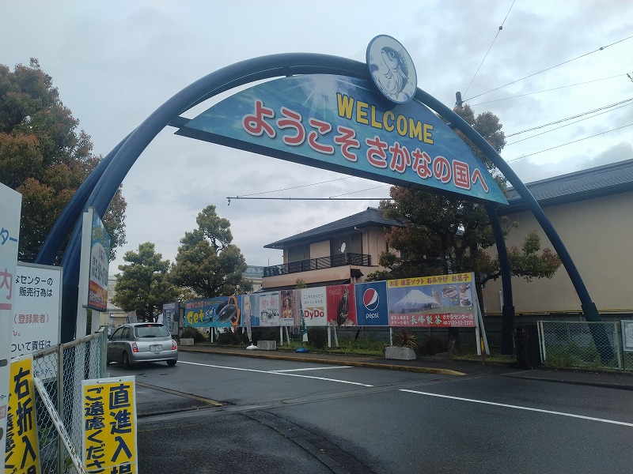
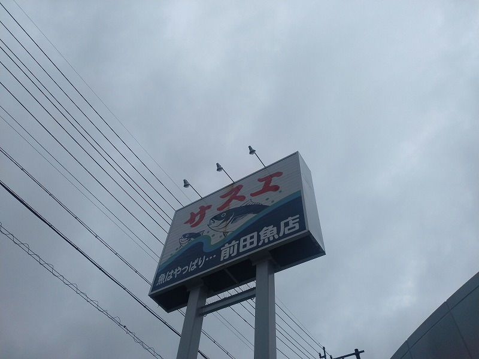

# 菊池 寿人 周报 — 2026-W15

- 周次：2026-W15
- 提交时间：2026-04-08 10:06:41
- 职位：Engineering　Manager

---

◆作業内容

①開発課題整理

＝＝＝筋の悪い案件＝＝＝＝＝＝＝＝＝＝＝＝

正しい情報を、正しく上に伝える事。

ここ忖度したり日和ると簡単にチームが全滅します。

攻めるも守るも、正しい情報の中で行いたい。

飛び越えて話進められると、フォローアップできません。

ご確認ください。

＝＝＝＝＝＝＝＝＝＝＝＝＝＝＝＝＝＝＝＝＝

■恐ろしい話をします

「いただきます」「ごちそうさま」が言えない大人。

この時点で親兄弟、親族、育ち、友人、ひいては

個人が疑われるのは違和感は無いでしょう。

言葉にしないだけで、食事の味が変わるわけでもなく、

現実なんら変わりませんが、そう思われても仕方無い事です。

勿論、そもそも天涯孤独、糞毒親、または、文化の違う外国で

あれば、それはそれ相応の酌量余地がありますけどね。

とはいえ、日本国で育つ上で、弱冠に至るまでに一度も

触れていない事はないでしょう。まさかな、而立、不惑を

越えた成熟した大人が聞いた事もない、となれば、どんな

コミュニティなのか、お里が知れてしまいます。

もとい、産まれ育ちがどうであれ、自分で気が付けるだけの

素養が溜まった時点で、違和感には気が付くものです。

もう一度言いますが、今まで一度も触れていなければ

知らなくても、悲しいですが、仕方が無い事です。

さて、では而立や不惑を越えた大人に、「いただきます」

「ごちそうさま」を言うように指導したとして、果たして

出来ると思う人はいるでしょうか？

私は出来ない、と思っています。

「いただきます」「ごちそうさま」には、幼少期から当たり前

に存在した場合は、所作、慣習という意味が判らなくても

癖がつけられる、成長途中でもそれが良いと自覚できたら

そこからでも気付き、や、儀礼、礼節的な重みをもって

受け入れられる事は可能でしょう。理屈の前後ではないのです。

型から入る方が、より儀礼的で、馴染むが故に理解が

早いという習得の問題です。

そこで而立や不惑になるまで、気にもしなかった奴らが、

一体どの面さげて食材となる命への感謝や、採取者としての

一次産業や加工する二次産業者、調理提供する三次産業者に

感謝と敬意を持つ事が可能だと思えますか？

奴等は、「いただきます」「ごちそうさま」なんて言うのは簡単だ、

でも今までも言ってこなかったし、金を払っているのは俺だ、

寧ろ、相手が感謝するべきだ、という浅ましさを恥ずかしげも無く

露呈する事でしょう。

仮に、必要だと悟っても、油断すると出来ないものです。

つい、うっかり、言わずに食事を終えるなんて事は目に浮かびます。

そして言うのです。たまたま忘れてただけ、何時も出来る。

簡単だ、って。

仕事で求められている、報連相も、念のために確認する作業も、

事故を起こさない為のちょっとした気遣いも、当たり前に教えて

貰っていたら出来るはずです。または、自分で精度を上げて

より良いものを求める気持ちがあったら、他人から、または、

自らの経験から悟る事が出来たでしょう。

新入社員と言うゴールデンタイムは、何度も言及していますが、

今までの常識と意識がガラッと変えられる、無防備な隙が産まれる

時間です。この希少な時期に、くだらない先輩の自慢話や、

自分の仕事に振り回されて、新人に目をかけられない能力の低い

先輩にあたったり、そもそもそういう経験をしていない先輩を、

適当な人事で割り当てたりして遊んでいると、、

「いただきます」「ごちそうさま」も言えない而立や不惑が

跳梁跋扈する伏魔殿になるんでしょうね。

境界界隈がすり抜けてくる場合を除き、もっというと、その辺の

あげないと、一部の奈落では、自分の脅威にならない使えない

後輩をよしよしヾ(・ω・｀)して、気持ちよくなってる奴等が、

しかたない、ひとがいない、と言う意味不明な供述をしながら、

放置して、何も手が打てない自分を、他責に逃げるのが

よくある話になってしまいます。そこの若手、どうやって

その地獄から抜け出せんねん。

私が新人に求めている内容はほぼ無いです。

あくまで２年目に備えての初歩の初歩に目を向けさせる

作業のみを繰り返しています。

２年目、３年目とその下積みの中で求めるもの、

見るべき視点は徐々に変えさせる様に仕向けますが、

いままで「いただきます」「ごちそうさま」が言えない大人に

教えるのは、無駄って事は証明され続けています。

彼らにとっては、過去を直視する事は非常に厳しいでしょう。

また、過去を直視出来るメタ視点があるなら、とっくに

成長しているのです。厳しいですね。

仕事で阿保みたいなミスを、つい、うっかり、やってしまうのは、

そういう育ちをしていなかっただけなんでしょう。

それでもミスが起きるから、丁寧な暮らしをしている人間は

丁寧に事を進めているのに、出来ない奴等ほど、簡単に大丈夫だと

思ってしまう、まったく理解も擁護も出来ない世界ですね。

■業務に特筆するべきものだけコメント多めにします

本当にマルチタスク過ぎですね

下流の調整なんて出来る事知れてるから上流で仕切って欲しい心

ほぼブレーンワーク次第なのでシレっと仕事出来ますけれども、

開発動き出すと最適化しまくってるので、ラフな割り込みは、

そこそこ脳みそ焼けます

●WindowsXP問題

一部決済方式の利用に影響するため、主体側で入れ替えや

展開の調整を実施した旨、連絡を受けています。

・インバウンド向け基幹対応仕様待ち

来週、相手先とパラメータのお話をします。

●EC相談

そろそろ動きそうという予想連絡をいただきました。

●防犯エリア展開

自分が何をやっているか判らない。

上が何を求めているか判らない。

自分の作業を改善する意思や自覚がない。

約束を破る。守らない。

自分の上司に対しても無礼だし、私の様な相手先には不信しか

芽生えず、そいつの後輩は、作業を押し付けらえている

としか思えない、それって、プロジェクトの重篤なリスク課題に

挙げられていないとおかしいですよ。

マネージメント発揮しないリスクは、極ヤバです。

●生鮮要望全般

テコ入れしたので、絶賛、準備中。

よろしくお願いします。

●レーンセルフ

浜北店に導入の為、入店しています。

いい加減な仕事をしやがって感、No.1。

●薬事法改正に伴う登録販売員判定強化

直近、実店舗で実施。全店リリースは、申請にそって粛々と。

・QR印字

停滞中

・保守観点

それでいいなんて、そんな感覚は、死ぬまで一回もねーんです。

口にした途端に、それは墓場にいると思った方がよいのですよ。

展開チーム

浅い

（固定）

知識がない以前に、仕事としてのノウハウがない。

事に、適切な指導が行えていない。

から、そうなる、当たり前。

・支払併用の動き

続報なし

●レシート短縮

リリース準備中

●2026リリース

4月中旬に予定調整中

リリース禁止期間前と2回実施予定

・他一覧に乗っけるか検討中の案件複数

細々やりたい事が届いています

・各種要望

重たい課題が複数動いている為、そもそものロードマップの組み換え

を行いながらブレーンワークをしている状況です。

ブレーンワークなので真顔で仕事していますが、中々にカオスです。

それはそれで、いつもの事なので気にせず相談してください。

・その他、業務関連

割り込みマルチタスクが楽しい世界です。

③各種問合せ業務

・案件相談／概算見積もり

・店舗／コールセンター対応

④各種定例Ｍ

整理中

⑤割込作業

◆来週作業予定【4/13～4/17】

〇社内

今期要望整理

PoC各種

コール状況の棚卸

〇課題・要望の推進

棚卸

〇展開フォロー

成長しないのでもう無理です

〇其の他

なし

■趣味：買い物

台湾人の友人のお陰で、台湾にいる間、色んな小売店や専門店の

店舗見学に付き合わされ、買い物ついでに色々と見て回る様になり、

今ではすっかり店舗見学が趣味になってしまった私。

出張帰りの空き時間を利用して、商業施設と、日本一有名といっても

過言ではない町の魚屋に、見学（兼、買い物）に行ってきました。

・商業施設

物販と飲食で30店舗程が入っている施設。大き目の食堂もあるけれど。

同じ、静岡で有名どころの「沼津みなと新鮮館」や「清水魚市場 河岸の市」

と比べると、こじんまりしてるし、華はない。

入っているお店もあまりぱっとしないものの、地元でちゃんとしているお店は

置いている商品も光ってました。近くに住んでいたら、月２回は来てるかな。

・ついに来たぜ、魚屋さん

綺麗、そして、安い。魚種も程よく、商品単体のクオリティが高かった為、

ちょっとした買い物でも5000円近く使ってしまいました。

近くにあったら、可能な限り行く。ただ、この有名店ですら、

鮪のレベルは私の求めるレベルと比べて圧倒的低品質。

・・お前でも、駄目なのか

このレベルの魚を食ってる奴等に、何故そんなに胸をはって

福岡の魚が美味しいと言えるのか・・普段、並んでる魚の質を

見て欲しい。本当にオラが村自慢をするのであれば、

何時、何処の、何と比べて、どう美味しいのか、説明出来て初めて、

胸を張って声をあげるべきだと、本当に本当に思う今日この頃。

私信へ返信

>XP

展開確認ありがとうございます。

>一か月以上

異常ですよね

>調整

よろしくお願いします。

>機会

Payment周りの案件あれば気軽にご相談ください

全体的に

・フロントエンド内の業務応援やフォローなども突発的に発生し、

各自の業務が増加している傾向にあるが、全体で共有して

進めて行く。

・相談が増える中で、やりたい事が出来るかどうかだけ聞かれる、

段取りも無く突然依頼が来る、等、進め方がおかしい部分の改善図りたい。

以上
