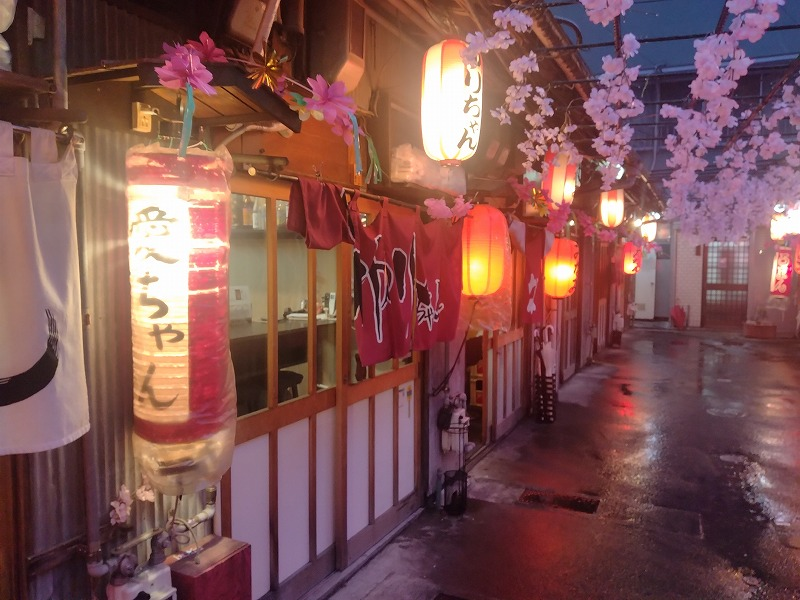
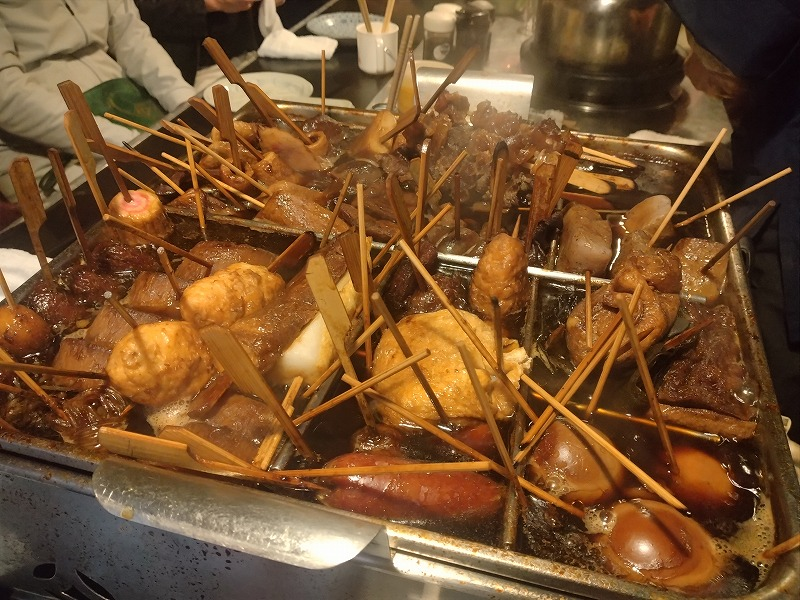

# 菊池 寿人 周报 — 2026-W18

- 周次：2026-W18
- 提交时间：2026-04-30 11:44:58
- 职位：Engineering　Manager

---

◆作業内容

①開発課題整理

＝＝＝筋の悪い案件＝＝＝＝＝＝＝＝＝＝＝＝

正しい情報を、正しく上に伝える事。

ここ忖度したり日和ると簡単にチームが全滅します。

攻めるも守るも、正しい情報の中で行いたい。

飛び越えて話進められると、フォローアップできません。

ご確認ください。

＝＝＝＝＝＝＝＝＝＝＝＝＝＝＝＝＝＝＝＝＝

■まじでお前らどうなってんねん

本当に残念です。明るい話題はないのかしら。

友達おらんの？と真剣に思ってしまう程度に、そのくらい判断出来るやろ、想像出来るやろと思ってしまう。恒久的にお世話になりっぱなしの一次産業である農林水産・畜産、鉱業界隈でもなく、インフラ基盤としての第二次産業である製造建設工業界隈でもなく、おれらのやってるのは、第三次産業であるサービス業やぞ。なめんなサービス業。いつまでもただの作業者目線で点の仕事を繰り返してんねん。考えろ、口開けて作業待つな、同じ事を繰り返すな、マインドセットが狂っている。と、友達なんておらんくても平気は私からしても、感覚バグってる子（40歳以下は子）が多い気がしている今日この頃。私もゆとり教育の最初期グループに属するけれど、ゆとり教育と友達おらんのは関係なかった気がするぞ。繰り返します、お気持ちで仕事すんな、確認するのが仕事の初手じゃ。

■業務に特筆するべきものだけコメント多めにします

本当にマルチタスク過ぎですね

下流の調整なんて出来る事知れてるから上流で仕切って欲しい心

ほぼブレーンワーク次第なのでシレっと仕事出来ますけれども、

開発動き出すと最適化しまくってるので、ラフな割り込みは、

そこそこ脳みそ焼けます

●ポイント支払

消費税法万歳！

・インバウンド向け基幹対応仕様待ち

景品表示法万歳！資金決済方万歳(今回なら届出制か)！

●EC相談

お話が来ましたので対応すすめましょう。

●防犯エリア展開

TEC殿との巻き取りを進めますが、この程度であれば、年齢や経験よりも考える力と上長へ進言する覚悟がちょっとでもあれば、誰でも出来ると思うのですよ。本当にそう思いますよ。

●生鮮要望全般

早くスケジュールを私に教えてください。なんなら残課題と課題解決のマイルストーンでもいいです。勝手に想像します。

●レーンセルフ

がっかりだよ、君たち。

●薬事法改正に伴う登録販売員判定強化

5月１日の施行に合わせた全店設定完了。

●新業態POS

やりたい事を整理しないままでシステム設計に逃げるのは、卑怯と罵られ、時に罵倒され、部下後輩であっても塵を見る様に見なさい、と教えられた環境に居た私には、先に手を付けるリスクが大き過ぎて萎縮してしまう。設計してると気分だけが上がるからついやってしまうのは判るけど、沢山、釘撃ち込まれたなぁとちょっとノスタルジックな気分に浸ってしまう。要件ヒアリングが甘いと事前調査のポイントも見失うから、そんな感じなのかなぁ。とかとか。当時の先輩、厳しすぎですぜ、とかとか。それだけ余裕なかったんだよなぁ、とかとか。

・QR印字

考えます。

・保守相談

相手の気持ちにたって考えると、案外スムーズにいくのだけれど、相互に信頼関係接続が出来ていない状況で、本音ぶっこむと拗れるのと、やった事も無い人が相手の気持ちを想像せず立場振りかざすと上手く行くはずが無いよね、割とそういうのが更にあるよね。

・保守観点

それでいいなんて、そんな感覚は、死ぬまで一回もねーんです。

口にした途端に、それは墓場にいると思った方がよいのですよ。

展開チーム

浅い

（固定）

知識がない以前に、仕事としてのノウハウがない。

事に、適切な指導が行えていない。

から、そうなる、当たり前。

・支払併用の動き

続報なし

●2026リリース

5月中旬以降をターゲットにしたリリース準備中。

生鮮チームの取り組みは早く教えてくれないと困る。

困るから、手を打っていくが、打たなくていい手を打つのは困る。

・他一覧に乗っけるか検討中の案件複数

細々やりたい事が届いています

・各種要望

重たい課題が複数動いている為、そもそものロードマップの組み換え

を行いながらブレーンワークをしている状況です。

ブレーンワークなので真顔で仕事していますが、中々にカオスです。

それはそれで、いつもの事なので気にせず相談してください。

・その他、業務関連

割り込みマルチタスクが楽しい世界です。

③各種問合せ業務

・案件相談／概算見積もり

・店舗／コールセンター対応

④各種定例Ｍ

整理中

⑤割込作業

◆来週作業予定【5/4～5/8】

〇社内

今期要望整理

PoC各種

コール状況の棚卸

〇課題・要望の推進

棚卸

〇展開フォロー

成長しないのでもう無理です

〇其の他

なし

■気が狂いそうになる民度の低さに辟易

コロナ前は終電間際でもふらっと行っていた王餃子。コロナの頃は常連さんが手土産にもってくる餃子をお裾分けいただく位しか食べてないし、なんかのテレビに出て連日ずっと大行列になってるのを蔑んだ目でヨタヨタ通り過ぎていたのだけれども、、先だって誰も並んでなく店覗いたらすぐ入れるというので大行列の理由でも再確認するかと入ってみましたよ、王餃子。本気で後悔した。まぁ、私が知っている海外は台湾の上から下、対東以外の海っぺりから山の中の九族（原住民）のエリアだけなのだけれども、王餃子の地獄の様な民度の低さに吐き気がした。まぁインバウンドで人気が爆発した町中華や居酒屋のレベルが格段に落ちている事象は枚挙に暇がないのだけれども、あまりの酷さに国粋主義者（これを悪い意味で捉えるのは戦後教育の失敗）に転向しようかと思う程度には最悪だった。二度と王餃子に行く事は無いだろう。そういう意味では、安兵衛のおでんも味だけでなく、客層(海外勢)の品が酷すぎて二度と足を向けていない。味が悪いのが先だけれどもね。そういえば、全国飲み歩きの冬の定番おでんだけれども、結構な勢いでおでんを食べに全国行脚していたが、福岡でおでんと言うとまったくピンとこない。件の安兵衛があり得ない位に好みに合わなかったせいでもあるが、果たして福岡の、ひいては九州のおでん文化の探索が出来ていない事に改めて実感した。まぁ、正直いうと九州沿岸地域、特に福岡にはまったく期待していない自分がいる。昔から稲作大国であり、良質な海を背負う福岡において、そもそもそんなもん（山間地域におけるご馳走である草どもや根菜）などを食う意味が無かった事があると考えている。如何に厳しい冬を乗り切るか、囲炉裏の煙を利用して大根を燻す、雪の下に野菜を保存したり、干したりと、勿論、無いわけではないが、命を繋ぐ糧としての重要度は、圧倒的に恵まれている福岡において、文化が成熟していなくても当然と考える私がいる訳だ。高菜漬けだぁ、ぬか炊きだぁと言う輩もいるが、それは後発文化圏の浸食であり、DNA的にそれをどうこうする技術レベルは、全国もとい北関東以北垂涎の羨ましい事実ではあるが、結果未成熟と言わざるを得ないのが、食の福岡において、高度に発達した流通網を活かしきれず、他県から目を背けたまま、福岡自慢をしてしまう根源的な病魔になり得ている気がしてならない。誰か全国区で戦えるレベルの美味しい福岡由来のおでん屋を紹介してくれまいか。自分で作るのではなく、カウンターでぬる燗でひっかけるおでんを日常で味わいたいと願わずにはいられない。ちなみに、某飲食店の女将から朝倉にいい店があると聞いたので、近々訪問予定ではあるが、京流れ割烹系なら嬉しくはないな。

おでんだけの横丁が市内に2箇所、朝おでんもうまいだら

しぞーかおでんは通年で神。ただし、美味しい店舗はというと・・。

私信へ返信

>いいアイデア

すべての頂点に法令があり、経理のミスや手間の軽減が続き、

その下にそれらへ伝達可能な情報の保有があり、更に下層に

そこへと情報を流す方法論が語られるだけです。ええ、POSと

言うものは最下層の、所詮は上位の振る舞い指示の通りに

セットするだけのインプット端末でしかなく、無い情報はセット

出来ないので、初めから渡せるルートを提示してくれれば、

なんの事もないのです。

今回の事例は、最上位側の問題なので、小手先で捻るなど

恐れ多い事なのです。良い悪いではなく、至上なのです。

（同意して欲しい）

>様子見

はい、でもすぐには動けないので、一般的な常識の範疇で

事前連絡いただけないと、調整すらままならないのです。

（覚えて欲しい）

全体的に

・フロントエンド内の業務応援やフォローなども突発的に発生し、

各自の業務が増加している傾向にあるが、全体で共有して

進めて行く。

・相談が増える中で、やりたい事が出来るかどうかだけ聞かれる、

段取りも無く突然依頼が来る、等、進め方がおかしい部分の改善図りたい。

以上
